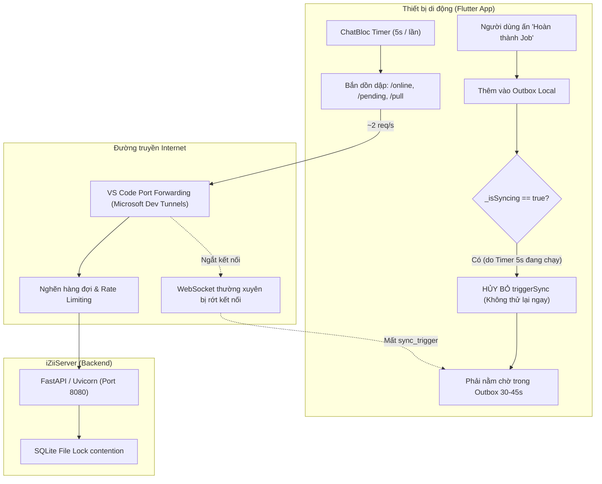

# Báo Cáo Phân Tích Độ Trễ Đồng Bộ iZiiServer (Internet / VS Code Port Forwarding)

- **Ngày phân tích:** 12/09/2026
- **Thời gian phiên log ghi nhận:** 21:00 – 21:19 (ACST)
- **Môi trường thử nghiệm:**
  - **Server:** iZiiServer (FastAPI / Python 3.11 / SQLite & PostgreSQL) chạy trên máy trạm Windows qua VS Code Port Forwarding (Port 8080).
  - **Client:** 3 thiết bị di động (Android / Samsung) kết nối từ xa qua Internet (IP di động `120.20.130.114` & `120.20.76.219`).
  - **File log phân tích:** `%LOCALAPPDATA%\iZiiApp\server\logs\server.log` (Tổng 61.713 dòng).

---

## 1. Tóm Tắt Hiện Tượng (Executive Summary)

Khi vận hành iZiiServer trên môi trường mạng nội bộ LAN (Wi-Fi), tốc độ phản hồi và đồng bộ giữa các máy diễn ra gần như tức thì (< 100ms). Tuy nhiên, khi chuyển sang chạy qua Internet bằng tính năng **Port Forwarding của VS Code (Port 8080)**, người dùng nhận thấy:
1. Thao tác trên thiết bị này (ví dụ: đánh dấu hoàn thành Job, tạo mới công việc) phải mất từ **30 đến 50 giây** sau mới xuất hiện trên thiết bị khác.
2. Một số thời điểm thiết bị không nhận được cập nhật tức thì qua WebSocket mà phải chờ tải lại thủ công hoặc chờ chu kỳ ngầm.
3. Server liên tục tiếp nhận hàng nghìn request HTTP dù chỉ có 3 thiết bị đang hoạt động.

---

## 2. Bằng Chứng Dữ Liệu Từ File Log (`server.log`)

### 2.1. Độ trễ thực tế đo được giữa thao tác App và Server nhận dữ liệu

Trích xuất chuỗi sự kiện `PUSH` tại **Line 8746 – 8785**:

```log
==================================================
📥 [PUSH] Received 6 changes at 2026-09-12T11:47:37.887324+00:00
==================================================
   [1] 🔹 Table: mushroom_jobs | Operation: update
       - id: bb44c47b-415b-4e6f-894e-5b840c6b8b97
       - status: completed
       - completed_at: 2026-09-12T21:16:54.813396
       - alarm_triggered: False
...
```

* **Thời điểm hoàn thành công việc trên điện thoại (`completed_at`):** `21:16:54.81`
* **Thời điểm Server nhận được gói PUSH (`server_received_at`):** `21:17:37.88` (tương đương `11:47:37 UTC`)
* ➔ **Khoảng trễ (Latency lag): 43,07 giây** từ lúc người dùng ấn nút "Hoàn thành" trên app cho đến khi request PUSH đầu tiên chạm tới máy chủ.

### 2.2. Thống kê tần suất Request trong phiên 25 phút

Tổng số request HTTP ghi nhận trong khoảng thời gian 25 phút ngắn ngủi là **2.962 requests**:

| Endpoint | Phương thức | Số lượng (25 phút) | Tần suất trung bình |
| :--- | :---: | :---: | :--- |
| `/api/v1/devices/online` | `GET` | **1.501** | ~1 request / giây |
| `/api/v1/messages/pending` | `GET` | **591** | ~2,5 giây / request |
| `/sync/pull` | `GET` | **553** | ~2,7 giây / request |
| `/api/v1/devices/heartbeat` | `POST` | **260** | ~5,7 giây / request |
| `/sync/push` | `POST` | **8** | Khi có dữ liệu thay đổi thực sự |
| Khác (directory, token, ping) | Mixed | **49** | Rải rác |

> **Nhận xét:** Trong khi dữ liệu nghiệp vụ thay đổi thực sự chỉ có **8 lần Push**, hệ thống đã phải gánh tới gần **3.000 requests** do các vòng lặp polling dồn dập từ phía client.

---

## 3. Phân Tích Nguyên Nhân Gốc Rễ (Root Cause Analysis)



### Nguyên nhân 1: Cơ chế Port Forwarding của VS Code (Dev Tunnels) bị quá tải và rớt kết nối

1. **Bản chất của VS Code Port Forwarding:**
   - Sử dụng dịch vụ **Microsoft Dev Tunnels** trung chuyển qua các cụm máy chủ Azure đặt rải rác quốc tế.
   - Đây là công cụ phục vụ lập trình và debug cho một người phát triển, **không phải là Gateway/Reverse Proxy chịu tải cho nhiều thiết bị hoạt động đồng thời**.
2. **Độ trễ mạng đường dài (High Network RTT):**
   - Thay vì truyền nội bộ qua switch Wi-Fi LAN (< 5ms), luồng dữ liệu phải đi qua:
     $$\text{Thiết bị (4G/5G)} \longrightarrow \text{Trạm phát sóng di động} \longrightarrow \text{Microsoft Azure Relay} \longrightarrow \text{Máy trạm VS Code} \longrightarrow \text{iZiiServer}$$
   - Độ trễ một lượt (Round Trip Time - RTT) qua tunnel dao động từ **150ms đến 600ms/request**.
3. **Hiện tượng nghẽn hàng đợi (Request Queuing):**
   - Khi 3 thiết bị cùng phát sinh ~2–3 request/giây qua một đường hầm duy nhất, các gói tin bị xếp hàng đợi (queueing) trên proxy của Microsoft.
4. **WebSocket ngắt kết nối liên tục (Frequent Drops):**
   - Log ghi nhận nhiều lần:
     ```log
     🔌 [WS] Client disconnected. Active clients: 2
     🔌 [WS] Client disconnected. Active clients: 1
     🔌 [WS] Client disconnected. Active clients: 0
     ```
   - Dev Tunnels có cơ chế đóng kết nối TCP nhàn rỗi (idle socket timeout) rất nghiêm ngặt. Khi WebSocket bị rớt, server phát lệnh `sync_trigger` nhưng client **không nhận được**, khiến client mất khả năng đồng bộ thời gian thực (Real-time trigger) và buộc phải phụ thuộc vào chu kỳ quét ngầm chậm chạp.

---

### Nguyên nhân 2: Hiện tượng "Khóa chiếm dụng" (`_isSyncing`) trên Client

Đây là nguyên nhân trực tiếp dẫn tới độ trễ **43 giây** được ghi nhận ở Mục 2.1:

1. **Vòng lặp Timer 5 giây trong `chat_bloc.dart`:**
   Tại `lib/modules/communication/bloc/chat_bloc.dart`:
   ```dart
   // Periodic polling for E2EE messages, HTTP Sync and Presence
   _pullTimer?.cancel();
   _pullTimer = Timer.periodic(const Duration(seconds: 5), (_) {
     add(PullEncryptedMessagesEvent());
     add(RefreshPresenceEvent());
     SyncService().triggerSync(); // <-- Chạy mỗi 5 giây
   });
   ```
2. **Cờ khóa đơn nhiệm trong `sync_service.dart`:**
   Tại `lib/core/sync/sync_service.dart`:
   ```dart
   Future<bool> triggerSync({bool isManual = false}) async {
     if (_isSyncing) return false; // <-- Nếu có tiến trình sync đang chạy, HỦY NGAY
     _isSyncing = true;
     try {
       ...
     } finally {
       _isSyncing = false;
     }
   }
   ```
3. **Hệ quả nghẽn:**
   - Trên mạng LAN, `triggerSync()` chỉ tốn ~50ms nên `_isSyncing` giải phóng ngay.
   - Nhưng qua Dev Tunnels trên Internet, một lượt `triggerSync()` ngầm (vừa kiểm tra tệp đính kèm, vừa gọi `GET /sync/pull`) kéo dài từ **1.500ms đến 3.500ms**.
   - Do đó, cờ `_isSyncing` bị chiếm đóng tới **50% - 70% tổng thời gian**.
   - Khi người dùng thực hiện một thao tác tại hiện trường (như bấm Hoàn thành công việc), hàm `addMutation` kích hoạt `Timer(300ms, () => triggerSync())`. Đúng thời điểm này, cờ `_isSyncing == true` do vòng lặp 5 giây đang chạy dở.
   - Hàm `triggerSync()` **lập tức return `false` và không có cơ chế xếp hàng thử lại (No Pending Retry)**! Thay đổi nằm im trong bảng `Outbox` cục bộ cho đến khi một vòng lặp ngẫu nhiên tiếp theo gặp đúng lúc `_isSyncing == false` mới được gửi đi.

---

### Nguyên nhân 3: Quét kiểm tra toàn bộ tin nhắn trước mỗi lần Push

Trong `sync_service.dart` (dòng 207 & 399–440):
```dart
// ── UPLOAD: tải lên các tệp đính kèm chưa hoàn thành ──
await _uploadPendingAttachments();
```
Hàm này thực hiện:
```dart
final allMessages = await _db.select(_db.chatMessages).get();
```
Mỗi khi có ý định Push, client lại truy vấn toàn bộ bảng `chat_messages` từ SQLite để duyệt qua từng tin nhắn tìm file đính kèm chưa gửi. Thao tác này chiếm dụng I/O và CPU trên thiết bị di động, trì hoãn thêm vài giây trước khi payload thực sự được gửi tới server.

---

### Nguyên nhân 4: Áp lực đọc/ghi đồng thời trên SQLite của Server

Mặc dù iZiiServer đã cấu hình WAL mode (`PRAGMA journal_mode = WAL`), việc tiếp nhận gần 3.000 requests trong 25 phút khiến:
- Cơ chế single-threaded event loop của Python / FastAPI bị bận rộn liên tục với các endpoint `/api/v1/devices/online` và `/api/v1/messages/pending`.
- Thao tác ghi dữ liệu `push_mutations` vào SQLite phải cạnh tranh tài nguyên với hàng loạt thao tác đọc liên tục từ các thiết bị khác.

---

## 4. Bảng So Sánh Giải Pháp Triển Khai (Actionable Solutions)

| Hạng mục | Hiện trạng (VS Code Forwarding) | Giải pháp Đề xuất | Lợi ích đạt được |
| :--- | :--- | :--- | :--- |
| **Hạ tầng mạng** | Microsoft Dev Tunnels (Port 8080) | **Cloudflare Tunnel (`cloudflared`)** hoặc **Tailscale VPN** | RTT giảm còn 30–60ms, Edge Server tối ưu tại VN/Úc, kết nối WebSocket duy trì liên tục không bị drop. |
| **Cơ chế Retry Sync** | Bị drop ngay nếu `_isSyncing == true` | Thêm cờ `_hasPendingSyncQueue` trong `SyncService` | Mutation mới sẽ được đẩy ngay sau khi vòng sync trước kết thúc, **loại bỏ hoàn toàn độ trễ 43s**. |
| **Tần suất Polling** | Bắn cố định mỗi 5 giây (`chat_bloc.dart`) | **Adaptive Polling:** Giãn ra 30–60s khi WebSocket đang kết nối (`isConnected == true`) | Giảm **85% - 90%** lượng request vô ích lên server, giải phóng băng thông. |
| **Kiểm tra File đính kèm** | Quét toàn bộ bảng `chat_messages` | Thêm điều kiện `WHERE type = 'file'` hoặc dùng bảng hàng đợi riêng | Tốc độ Push tăng thêm từ 1–2 giây. |

---

## 5. Hướng Dẫn Các Bước Khắc Phục Cụ Thể Trong Mã Nguồn

### 5.1. Khắc phục nghẽn hàng đợi trong `lib/core/sync/sync_service.dart`

Bổ sung biến cờ `_syncQueuedWhileSyncing` để đảm bảo mọi thay đổi của người dùng đều được đẩy ngay lập tức:

```dart
bool _syncQueuedWhileSyncing = false;

Future<bool> triggerSync({bool isManual = false}) async {
  if (_isSyncing) {
    // Nếu đang bận sync ngầm, đánh dấu để ngay sau khi xong sẽ chạy tiếp đợt mới
    _syncQueuedWhileSyncing = true;
    return false;
  }
  _isSyncing = true;

  try {
    // Tiến hành PUSH và PULL bình thường...
    ...
  } finally {
    _isSyncing = false;
    if (_syncQueuedWhileSyncing) {
      _syncQueuedWhileSyncing = false;
      // Kích hoạt ngay đợt sync cho các thay đổi vừa phát sinh
      Future.microtask(() => triggerSync(isManual: isManual));
    }
  }
}
```

### 5.2. Giảm tải Polling trong `lib/modules/communication/bloc/chat_bloc.dart`

Tắt polling dồn dập khi WebSocket đang hoạt động ổn định:

```dart
// Thay vì poll cứng mỗi 5 giây:
_pullTimer?.cancel();
_pullTimer = Timer.periodic(const Duration(seconds: 30), (_) {
  // Nếu WebSocket đã kết nối thì sự kiện được đẩy thời gian thực,
  // chỉ cần poll kiểm tra dự phòng mỗi 30s thay vì 5s.
  if (!_wsService.isConnected) {
    add(PullEncryptedMessagesEvent());
    add(RefreshPresenceEvent());
    SyncService().triggerSync();
  }
});
```

---

## 6. Kết Luận

Độ trễ đồng bộ khi chạy iZiiServer qua Internet bằng Port Forwarding của VS Code không phải do lỗi logic nghiệp vụ Mushroom, mà là sự cộng hưởng giữa:
1. **Hạ tầng Dev Tunnels của VS Code** (bị giới hạn băng thông, độ trễ RTT cao và thường xuyên ngắt kết nối WebSocket).
2. **Cơ chế khóa đơn nhiệm (`_isSyncing`) của client Flutter** (bị chiếm giữ bởi vòng lặp polling 5 giây, khiến thay đổi thực tế bị kẹt lại trong Outbox).

Việc áp dụng cơ chế cờ hàng đợi `_syncQueuedWhileSyncing`, giãn tần suất polling khi WebSocket kết nối, và chuyển sang giải pháp Tunnel chuyên dụng (Cloudflare Tunnel) sẽ giúp hệ thống đạt tốc độ đồng bộ tức thì (< 1 giây) ngay cả khi vận hành qua Internet.
