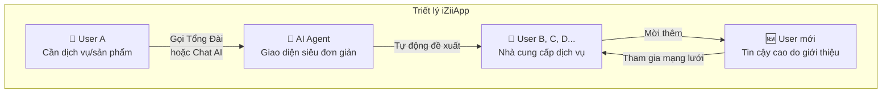
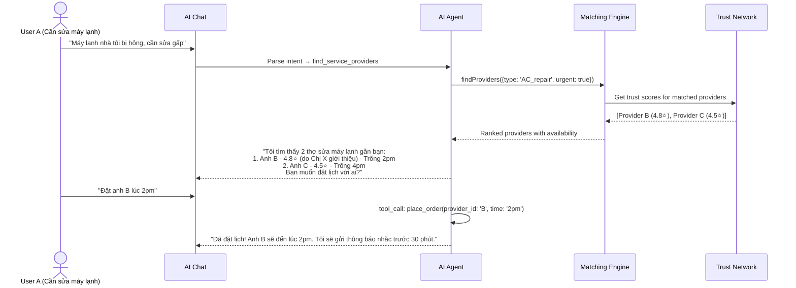
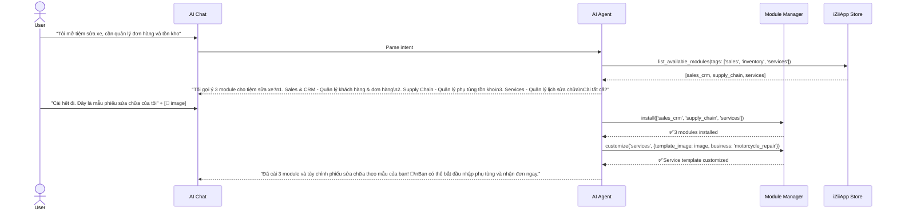

# iZiiApp — Nền tảng kết nối cộng đồng & Quản lý kinh doanh thông minh

## Tổng quan tầm nhìn

**iZiiApp** là nền tảng **kết nối cộng đồng + quản lý kinh doanh modular** chạy trên **Windows, iOS, Android** từ một codebase duy nhất. Khác với ERP truyền thống, iZiiApp đặt **con người và kết nối** làm trung tâm:



**Luồng hoạt động cốt lõi:**
1. User A cần đặt hàng/sửa chữa/lắp đặt → **Gọi Tổng Đài iZiiApp** hoặc **Chat AI Agent**
2. AI Agent hiểu nhu cầu → **Tự động đề xuất** các User khác cung cấp dịch vụ trên hệ thống
3. User kết nối, đặt dịch vụ, đánh giá → **Mạng lưới tin cậy** phát triển
4. User **mời nhà cung cấp mới** vào hệ thống → Tin cậy cao do người cũ giới thiệu
5. Mỗi User tùy chỉnh module kinh doanh riêng qua AI Agent

---

## Quyết định đã xác nhận

| Hạng mục | Quyết định |
|----------|-----------|
| **Tên dự án** | **iZiiApp** |
| **Ngôn ngữ lập trình** | **Flutter/Dart** |
| **AI Provider** | User tự chọn (OpenAI / Gemini / Claude / **LLM on-device**) |
| **Server Backend** | Cả hai: default self-hosted + user custom URL |
| **Module Marketplace** | Có — iZiiApp Store |
| **Ngôn ngữ giao diện** | Tiếng Anh trước, mở rộng theo yêu cầu User |
| **Module ưu tiên** | Sales & CRM + Supply Chain + Services |

---

## Quyết định bổ sung (đã xác nhận)

| Hạng mục | Quyết định |
|----------|------------|
| **Tổng Đài** | **(D) Cả 3**: VoIP + số thật + Voice-to-AI. Hỗ trợ offline qua Bluetooth/WiFi |
| **Mô hình kinh doanh** | Chưa xác định, quyết định sau |
| **KYC** | ✅ Cần xác minh danh tính — hệ thống cần độ tin cậy cao |

---

## Kiến trúc hệ thống iZiiApp

### Tổng quan kiến trúc

```mermaid
graph TB
    subgraph "iZiiApp (Flutter)"
        direction TB
        
        subgraph "🎯 Primary UX — Siêu đơn giản"
            ChatUI["💬 AI Chat<br/>Giao diện chính"]
            Hotline["📞 Tổng Đài<br/>Voice → AI"]
            QuickActions["⚡ Quick Actions<br/>Đặt hàng / Tìm dịch vụ"]
        end
        
        subgraph "🤖 AI Agent Core"
            Agent["AI Agent Engine"]
            ToolRouter["Tool Router + MCP"]
            LLMManager["LLM Manager<br/>Cloud / On-device"]
        end
        
        subgraph "👥 Community Layer"
            Network["Trust Network<br/>Referral Graph"]
            Matching["Service Matching<br/>Recommendation Engine"]
            Profile["User Profiles<br/>Provider / Consumer"]
            Invite["Invite System"]
        end
        
        subgraph "📦 Business Modules — Tùy chọn"
            M1["📊 Sales & CRM"]
            M2["📦 Supply Chain"]
            M3["🔧 Services"]
            M4["💬 Communication"]
            M5["📈 Reports"]
        end
        
        subgraph "⚙️ Core Engine"
            ModMgr["Module Manager"]
            DB["Database (Drift/SQLite)"]
            Sync["Sync Engine"]
            Auth["Auth + Trust Score"]
        end
    end
    
    subgraph "External"
        LLM["☁️ LLM APIs"]
        OnDevice["📱 On-device LLM"]
        Server["🖥️ Sync Server"]
        Store["🏪 iZiiApp Store"]
    end
    
    ChatUI & Hotline & QuickActions --> Agent
    Agent --> ToolRouter
    ToolRouter --> Community Layer & Business Modules
    LLMManager --> LLM & OnDevice
    Agent --> LLMManager
    ModMgr --> Store
    Sync --> Server
    Core Engine --> DB
```

### Phân tầng kiến trúc

```
┌─────────────────────────────────────────────────────────┐
│  PRESENTATION — Giao diện siêu đơn giản                │
│  ┌──────────┐  ┌──────────┐  ┌──────────────────────┐  │
│  │ AI Chat  │  │ Hotline  │  │ Quick Actions / Home │  │
│  └──────────┘  └──────────┘  └──────────────────────┘  │
├─────────────────────────────────────────────────────────┤
│  AI AGENT LAYER — Bộ não trung tâm                     │
│  ┌──────────────────────────────────────────────────┐   │
│  │ Agent Engine → Tool Router → Function Calling   │   │
│  │ LLM Manager (Cloud/On-device) + MCP Protocol    │   │
│  └──────────────────────────────────────────────────┘   │
├─────────────────────────────────────────────────────────┤
│  COMMUNITY LAYER — Kết nối cộng đồng (Core)           │
│  ┌────────────┐ ┌──────────┐ ┌──────────┐ ┌────────┐  │
│  │Trust Network│ │ Matching │ │ Profiles │ │ Invite │  │
│  └────────────┘ └──────────┘ └──────────┘ └────────┘  │
├─────────────────────────────────────────────────────────┤
│  BUSINESS MODULES — Cài theo nhu cầu                   │
│  ┌──────┐ ┌───────────┐ ┌──────────┐ ┌──────────────┐ │
│  │ CRM  │ │Supply Chain│ │ Services │ │Communication│ │
│  └──────┘ └───────────┘ └──────────┘ └──────────────┘ │
├─────────────────────────────────────────────────────────┤
│  CORE ENGINE — Nền tảng                                │
│  ┌──────┐ ┌──────┐ ┌──────┐ ┌──────┐ ┌─────────────┐ │
│  │ Auth │ │  DB  │ │ Sync │ │ i18n │ │Module Mgr   │ │
│  └──────┘ └──────┘ └──────┘ └──────┘ └─────────────┘ │
└─────────────────────────────────────────────────────────┘
```

---

## Công nghệ Stack

### Framework & Ngôn ngữ

| Layer | Công nghệ | Lý do |
|-------|-----------|-------|
| **UI Framework** | **Flutter** (Dart) | Cross-platform Win/iOS/Android, Impeller engine |
| **State Management** | **BLoC/Cubit** | Event-driven, predictable, phù hợp ERP workflows |
| **Local Database** | **Drift (SQLite)** + **sqlcipher** | Relational, type-safe, AES-256 encryption |
| **Cache** | **Hive** | Key-value nhẹ cho preferences |
| **Sync Engine** | **Custom Outbox Pattern** | Operation-based, intent-preserving |
| **AI Agent** | **MCP + Function Calling + Tool Router** | Chuẩn tool discovery, giảm hallucination |
| **LLM Cloud** | **OpenAI / Gemini / Claude** (user chọn) | Multi-provider support |
| **LLM On-device** | **Google AI Edge SDK / LiteRT-LM** | Privacy, offline AI |
| **Monorepo** | **Melos** | Multi-package management |
| **DI Container** | **get_it + injectable** | Service discovery |
| **Serialization** | **freezed + json_serializable** | Immutable models |
| **Navigation** | **go_router** | Declarative routing |

> [!CAUTION]
> **Isar** đã bị **abandoned** (2025). KHÔNG sử dụng. Drift (SQLite) là lựa chọn ổn định nhất.

### Database Design cho Offline Sync
- **UUID primary keys** — tránh xung đột ID giữa thiết bị
- **Soft deletes** (`deleted_at`) — xác nhận trước khi purge
- **Outbox pattern** — ghi local + pending_operations → sync background
- **WAL mode** — concurrent read/write performance

---

## Proposed Changes

### Phase 1: Core + AI Agent + Community Layer (5-7 tuần)

> Mục tiêu: App chạy được trên 3 nền tảng với **AI Chat**, **Trust Network**, **Service Matching**, **Module Manager**

---

#### 1. App Shell & UX (Giao diện siêu đơn giản)

##### [NEW] `lib/main.dart`
Entry point, DI setup, theme initialization

##### [NEW] `lib/app.dart`
MaterialApp wrapper, GoRouter, global providers

##### [NEW] `lib/core/theme/`
- `izii_theme.dart` — Dark/Light theme (premium, modern)
- `izii_colors.dart` — Brand color palette
- `izii_typography.dart` — Google Fonts (Inter/Outfit)
- `izii_spacing.dart` — Spacing tokens

##### [NEW] `lib/core/navigation/`
- `app_router.dart` — GoRouter config
- `app_routes.dart` — Route definitions
- Bottom navigation: **Home | Chat AI | Discover | Profile**

##### [NEW] `lib/features/home/`
- `home_screen.dart` — Màn hình chính tối giản:
  - Search bar ("Bạn cần gì?")
  - Quick actions (Đặt hàng / Tìm dịch vụ / Mời bạn bè)
  - Feed hoạt động gần đây
  - Recommended providers

---

#### 2. AI Agent Engine

##### [NEW] `lib/core/ai_agent/`
- `ai_agent_service.dart` — Main AI Agent logic
- `ai_chat_controller.dart` — Chat state management (BLoC)
- `ai_tool_registry.dart` — Registry các tools (MCP-compatible)
- `ai_tool_router.dart` — Pre-filter 3-5 tools phù hợp từ registry
- `ai_tool_executor.dart` — Thực thi tool calls + human-in-the-loop
- `ai_context_builder.dart` — Xây dựng context cho LLM

##### [NEW] `lib/core/ai_agent/llm_providers/`
- `llm_provider.dart` — Abstract interface
- `openai_provider.dart` — OpenAI GPT-4/4o
- `gemini_provider.dart` — Google Gemini
- `claude_provider.dart` — Anthropic Claude
- `ondevice_provider.dart` — On-device LLM (AI Edge SDK / LiteRT-LM / Ollama)
- `custom_provider.dart` — User custom endpoint (bất kỳ LLM nào)

```dart
/// LLM Provider Interface — hỗ trợ mọi provider
abstract class LLMProvider {
  String get name;
  bool get isOnDevice;
  
  /// Chat completion với function calling
  Stream<ChatChunk> chatStream({
    required List<ChatMessage> messages,
    required List<AgentTool> tools,
    double temperature = 0.7,
  });
  
  /// Kiểm tra provider có sẵn sàng không
  Future<bool> isAvailable();
  
  /// Ước tính cost (cho cloud providers)
  CostEstimate? estimateCost(int inputTokens, int outputTokens);
}

/// On-device provider wrapper
class OnDeviceProvider extends LLMProvider {
  @override bool get isOnDevice => true;
  
  /// Tải model xuống thiết bị
  Future<void> downloadModel(String modelId);
  
  /// Danh sách models đã tải
  List<LocalModel> get downloadedModels;
}
```

##### [NEW] `lib/core/ai_agent/ui/`
- `ai_chat_screen.dart` — Màn hình chat chính (full-screen, đẹp)
- `ai_message_bubble.dart` — Bubbles: text, image, action card
- `ai_tool_result_card.dart` — Kết quả tool execution (inline UI)
- `ai_suggestion_chips.dart` — Quick reply chips
- `ai_file_picker.dart` — Upload hình ảnh / file mẫu cho AI
- `ai_voice_input.dart` — Voice-to-text input
- `ai_generative_form.dart` — Dynamic forms AI tạo ra

**Core Agent Tools (luôn có):**

```dart
final coreAgentTools = [
  // === Module Management ===
  AgentTool(
    name: 'install_module',
    description: 'Cài đặt module kinh doanh lên thiết bị.',
    parameters: {'module_id': 'string'},
    requiresConfirmation: true, // Human-in-the-loop
    execute: (p) => moduleManager.install(p['module_id']),
  ),
  AgentTool(
    name: 'list_available_modules',
    description: 'Liệt kê modules có sẵn trong iZiiApp Store.',
    execute: (_) => moduleManager.getAvailableModules(),
  ),
  AgentTool(
    name: 'customize_module',
    description: 'Tùy chỉnh module dựa trên file mẫu/hình ảnh User cung cấp.',
    parameters: {'module_id': 'string', 'customization': 'string', 'files': 'list'},
    execute: (p) => moduleManager.customize(p),
  ),
  
  // === Community & Service Matching ===
  AgentTool(
    name: 'find_service_providers',
    description: 'Tìm nhà cung cấp dịch vụ phù hợp trên iZiiApp.',
    parameters: {
      'service_type': 'string',  // 'repair', 'installation', 'delivery', etc.
      'location': 'string?',
      'budget_range': 'string?',
    },
    execute: (p) => matchingEngine.findProviders(p),
  ),
  AgentTool(
    name: 'place_order',
    description: 'Đặt hàng/dịch vụ với nhà cung cấp.',
    parameters: {'provider_id': 'string', 'service_details': 'object'},
    requiresConfirmation: true,
    execute: (p) => orderService.placeOrder(p),
  ),
  AgentTool(
    name: 'invite_provider',
    description: 'Mời nhà cung cấp dịch vụ tham gia iZiiApp.',
    parameters: {'name': 'string', 'phone': 'string?', 'email': 'string?'},
    execute: (p) => inviteService.sendInvite(p),
  ),
  AgentTool(
    name: 'check_trust_score',
    description: 'Kiểm tra độ tin cậy của một User/nhà cung cấp.',
    parameters: {'user_id': 'string'},
    execute: (p) => trustNetwork.getScore(p['user_id']),
  ),
  
  // === Data & Reports ===
  AgentTool(
    name: 'query_data',
    description: 'Truy vấn dữ liệu kinh doanh.',
    parameters: {'module_id': 'string', 'query': 'string'},
    execute: (p) => dataQueryService.query(p),
  ),
  AgentTool(
    name: 'generate_report',
    description: 'Tạo báo cáo chi tiết.',
    parameters: {'type': 'string', 'date_range': 'string', 'format': 'string'},
    execute: (p) => reportService.generate(p),
  ),
];
```

---

#### 3. Community Layer (Core — luôn có)

##### [NEW] `lib/core/community/`

###### Trust Network
- `trust_network_service.dart` — Quản lý đồ thị tin cậy (trust graph)
- `trust_score_calculator.dart` — Tính điểm tin cậy dựa trên:
  - Referral chain depth (ai giới thiệu, giới thiệu bởi ai)
  - Rating trung bình sau dịch vụ
  - Lịch sử giao dịch thành công
  - Thời gian hoạt động trên hệ thống
- `referral_graph.dart` — Đồ thị giới thiệu (DAG)

```dart
/// Trust Score Model
class TrustScore {
  final String userId;
  final double overallScore;      // 0.0 - 5.0
  final int referralCount;        // Số người đã giới thiệu
  final String? referredBy;       // Ai giới thiệu user này
  final int completedOrders;      // Số đơn hoàn thành
  final double avgRating;         // Rating trung bình
  final DateTime memberSince;
  final TrustLevel level;         // newcomer → trusted → verified → elite
}

enum TrustLevel { newcomer, trusted, verified, elite }
```

###### Service Matching Engine
- `matching_engine.dart` — Thuật toán matching dựa trên:
  - Loại dịch vụ cần vs. dịch vụ cung cấp
  - Vị trí địa lý (proximity)
  - Trust score & rating
  - Availability (lịch trống)
  - Giá cả phù hợp budget
- `recommendation_service.dart` — Gợi ý providers cho user
- `search_service.dart` — Full-text search dịch vụ

###### User Profiles
- `user_profile.dart` — Model profile (consumer / provider / both)
- `provider_profile.dart` — Profile nhà cung cấp (dịch vụ, portfolio, pricing)
- `profile_screen.dart` — UI xem/sửa profile

###### Invite System
- `invite_service.dart` — Gửi lời mời qua SMS/Email/Link
- `invite_tracker.dart` — Track referral chain
- `onboarding_flow.dart` — Flow onboarding cho user được mời

##### [NEW] `lib/core/community/database/`
- `community_tables.dart` — Tables:

```dart
@DriftDatabase(tables: [
  Users,            // id (UUID), name, phone, email, type (consumer/provider/both)
  TrustScores,      // user_id, score, level, referral_count
  Referrals,        // inviter_id, invitee_id, created_at, status
  ServiceListings,  // provider_id, service_type, description, price_range, location
  Orders,           // consumer_id, provider_id, service_id, status, created_at
  Reviews,          // order_id, rating, comment, created_at
  Conversations,    // participants[], last_message, created_at
])
```

---

#### 4. Module Manager System (Odoo-inspired DAG)

##### [NEW] `lib/core/modules/`
- `module_registry.dart` — Registry & discovery
- `module_interface.dart` — Abstract iZiiModule interface
- `module_manifest.dart` — Manifest metadata
- `dependency_graph.dart` — DAG dependency resolution (topological sort)
- `module_loader.dart` — Deferred loading
- `module_installer.dart` — Install/uninstall + DB migration
- `module_customizer.dart` — AI-driven customization từ file mẫu

```dart
/// Interface cho mọi module
abstract class IZiiModule {
  ModuleManifest get manifest;
  List<TableInfo> get tables;        // DB tables riêng
  List<RouteBase> get routes;        // Screens
  Widget? get dashboardWidget;       // Widget trên Home
  List<AgentTool> get agentTools;    // Tools cho AI Agent
  
  Future<void> initialize(ModuleContext context);
  Future<void> dispose();
  Future<void> onCustomize(CustomizationRequest request); // AI customize
}

/// Manifest (Odoo-inspired)
class ModuleManifest {
  final String id;               // 'sales_crm'
  final String name;             // 'Sales & CRM'
  final String description;
  final String version;
  final String icon;
  final List<String> dependencies;  // ['community_core']
  final List<String> tags;          // ['sales', 'crm', 'pos']
  final int estimatedSizeMB;
  final bool autoInstall;           // Auto-install khi dependencies met
  final String category;            // 'Sales', 'Supply Chain', 'Services'
}
```

---

#### 5. Database Engine

##### [NEW] `lib/core/database/`
- `app_database.dart` — Main Drift database
- `tables/` — Core tables (settings, modules, sync_log, ai_conversations)
- `daos/` — Data Access Objects
- `migrations/` — Schema version migrations

```dart
@DriftDatabase(tables: [
  // Core
  AppSettings,
  ModuleRegistry,
  SyncLog,
  PendingOperations,  // Outbox for sync
  
  // AI Agent
  AiConversations,
  AiMessages,
  
  // Community
  Users,
  TrustScores,
  Referrals,
  ServiceListings,
  Orders,
  Reviews,
])
class AppDatabase extends _$AppDatabase { ... }
```

---

#### 6. Sync Engine (Operation-Based Outbox)

> [!WARNING]
> **KHÔNG sử dụng Last-Write-Wins** cho dữ liệu kinh doanh — có thể gây mất dữ liệu. Sử dụng **Operation-Based Sync**.

##### [NEW] `lib/core/sync/`
- `sync_service.dart` — Orchestrator
- `sync_config.dart` — Server URL config (default hoặc custom)
- `outbox_queue.dart` — Outbox table pending operations
- `operation_builder.dart` — Intent-based operations
- `conflict_resolver.dart` — Field-level merge + user prompt
- `idempotency_guard.dart` — UUID keys chống duplicate
- `background_sync.dart` — WorkManager background sync

```dart
/// Sync flow
/// Device: UI → Local DB → Outbox → Background Sync → Server
/// Server: Validate → Process → Event Log → Broadcast to other devices
///
/// Intent-based: "increment quantity by 5" NOT "set quantity to 15"
/// Field-level merge: Non-conflicting changes auto-merge
/// Conflicts → User prompt to resolve
```

---

#### 7. Auth & Security

##### [NEW] `lib/core/auth/`
- `auth_service.dart` — Registration, login
- `biometric_service.dart` — Face ID / Fingerprint
- `secure_storage.dart` — API keys, tokens (flutter_secure_storage)

---

#### 8. Settings

##### [NEW] `lib/core/settings/`
- `settings_screen.dart` — Main settings
- `ai_config_screen.dart` — Chọn LLM provider, API key, on-device model
- `sync_config_screen.dart` — Server URL (default / custom)
- `module_manager_screen.dart` — Quản lý modules đã cài
- `language_screen.dart` — Chọn ngôn ngữ (English default)
- `profile_settings_screen.dart` — Consumer / Provider profile

---

### Phase 2: Business Modules (4-6 tuần)

#### [NEW] `lib/modules/sales_crm/` — 📊 Sales & CRM

```
sales_crm/
├── sales_crm_module.dart       # IZiiModule implementation
├── manifest.dart               # Dependencies: ['community_core']
├── database/
│   ├── tables.dart             # leads, contacts, deals, products, pos_orders (UUID PKs)
│   └── daos.dart
├── models/                     # @freezed immutable models
│   ├── lead.dart
│   ├── contact.dart
│   ├── deal.dart
│   ├── product.dart
│   ├── pos_order.dart
│   └── loyalty_program.dart
├── bloc/
│   ├── leads_bloc.dart
│   ├── deals_bloc.dart
│   ├── pos_bloc.dart
│   └── loyalty_bloc.dart
├── screens/
│   ├── crm_dashboard.dart      # Overview
│   ├── leads_pipeline.dart     # Kanban view
│   ├── contacts_list.dart
│   ├── deals_board.dart
│   ├── pos_screen.dart         # Point of Sale
│   ├── product_catalog.dart
│   └── loyalty_screen.dart     # Loyalty / Coupons
├── widgets/
│   ├── pipeline_board.dart
│   ├── deal_card.dart
│   └── pos_cart.dart
└── agent_tools/
    └── crm_tools.dart          # AI tools: create_lead, search_contacts, etc.
```

**AI Agent tools cho Sales & CRM:**
- `create_lead`, `update_lead_stage`, `search_contacts`
- `create_deal`, `forecast_revenue`
- `pos_checkout`, `apply_loyalty_discount`
- `import_contacts` — Import từ file user cung cấp
- `customize_pipeline` — Tùy chỉnh pipeline stages theo mô hình user

---

#### [NEW] `lib/modules/supply_chain/` — 📦 Chuỗi cung ứng

```
supply_chain/
├── supply_chain_module.dart
├── manifest.dart               # Dependencies: ['sales_crm']
├── database/tables.dart        # stock, warehouses, purchase_orders, deliveries, bom
├── models/
│   ├── stock_item.dart
│   ├── warehouse.dart
│   ├── purchase_order.dart
│   ├── delivery.dart
│   └── bill_of_materials.dart
├── bloc/
├── screens/
│   ├── inventory_dashboard.dart
│   ├── stock_list.dart
│   ├── warehouse_map.dart
│   ├── purchase_orders.dart
│   ├── delivery_tracking.dart
│   └── mrp_screen.dart          # Manufacturing / BOM
├── widgets/
└── agent_tools/
    └── supply_chain_tools.dart
```

**AI Agent tools cho Supply Chain:**
- `check_stock`, `create_purchase_order`, `track_delivery`
- `forecast_demand` — Dự báo nhu cầu
- `optimize_inventory` — Gợi ý tối ưu tồn kho
- `auto_reorder` — Tự động đặt hàng khi hết hàng

---

#### [NEW] `lib/modules/services/` — 🔧 Dịch vụ (Customizable)

```
services/
├── services_module.dart
├── manifest.dart
├── database/tables.dart         # service_requests, appointments, work_orders
├── models/
│   ├── service_request.dart
│   ├── appointment.dart
│   ├── work_order.dart
│   └── service_template.dart    # Template dịch vụ tùy chỉnh
├── bloc/
├── screens/
│   ├── services_dashboard.dart
│   ├── request_list.dart
│   ├── appointment_calendar.dart
│   ├── work_order_detail.dart
│   └── template_designer.dart   # AI-assisted template design
├── widgets/
└── agent_tools/
    └── services_tools.dart
```

**AI Agent tools cho Services (khả năng tùy biến CAO):**
- `create_service_template` — Tạo template dịch vụ từ mô tả / hình ảnh user
- `customize_workflow` — Tùy chỉnh workflow dựa trên mô hình quản lý user mô tả
- `schedule_appointment` — Đặt lịch hẹn
- `create_work_order` — Tạo lệnh công việc
- `match_to_provider` — Kết nối với provider phù hợp (tích hợp Community Layer)

---

### Phase 3: Communication + Reports + Marketplace (4-5 tuần)

#### [NEW] `lib/modules/communication/`
- In-app messaging (1-1, groups)
- Notification center
- Email integration

#### [NEW] `lib/modules/reports/`
- Spreadsheet view
- Chart builder (fl_chart)
- PDF export
- AI-generated insights

#### [NEW] `lib/core/marketplace/`
- **iZiiApp Store** — Browse & install community modules
- Module rating & reviews
- Developer SDK for 3rd-party modules
- Module versioning & updates

---

### Phase 4: Advanced Features (4-6 tuần)

- VoIP / Voice AI integration (Tổng Đài)
- Advanced KYC verification
- Payment integration
- Multi-language expansion
- Offline AI với on-device models
- Analytics dashboard

---

## Cấu trúc thư mục dự án

```
izii_app/
├── android/
├── ios/
├── windows/
├── lib/
│   ├── main.dart
│   ├── app.dart
│   │
│   ├── core/                        # ====== CORE (luôn có) ======
│   │   ├── di/                      # Dependency injection
│   │   ├── theme/                   # iZii theme system
│   │   ├── navigation/              # GoRouter
│   │   ├── widgets/                 # Reusable UI components
│   │   ├── database/                # Drift database engine
│   │   ├── modules/                 # Module manager (DAG)
│   │   ├── ai_agent/                # AI Agent engine
│   │   │   ├── llm_providers/       # OpenAI, Gemini, Claude, On-device, Custom
│   │   │   ├── ui/                  # Chat UI, voice input
│   │   │   └── tools/              # Core agent tools
│   │   ├── community/              # Trust Network, Matching, Invite
│   │   ├── sync/                    # Operation-Based Outbox Sync
│   │   ├── auth/                    # Auth + biometric
│   │   ├── settings/                # App settings
│   │   └── l10n/                    # Internationalization (English first)
│   │
│   ├── features/                    # ====== CORE SCREENS ======
│   │   ├── home/                    # Home screen (siêu đơn giản)
│   │   ├── discover/                # Discover services & providers
│   │   ├── onboarding/              # First-time setup + invite flow
│   │   └── profile/                 # User profile
│   │
│   └── modules/                     # ====== BUSINESS MODULES ======
│       ├── sales_crm/               # 📊 Sale, CRM, POS, Loyalty
│       ├── supply_chain/            # 📦 Stock, Purchase, MRP, Delivery
│       ├── services/                # 🔧 Services (highly customizable)
│       ├── communication/           # 💬 Chat, Notifications, Email
│       └── reports/                 # 📈 Spreadsheet, Charts, PDF
│
├── packages/
│   └── izii_design_system/          # Extracted design system
│
├── server/                          # ====== SYNC SERVER (optional) ======
│   ├── main.dart                    # Dart Shelf/Serverpod server
│   ├── routes/
│   ├── middleware/
│   └── database/
│
├── assets/
│   ├── icons/
│   ├── images/
│   ├── fonts/                       # Inter, Outfit
│   └── lottie/
│
├── melos.yaml                       # Monorepo management
├── pubspec.yaml
├── analysis_options.yaml
└── README.md
```

---

## Luồng hoạt động AI Agent (iZiiApp)

### Kịch bản 1: User tìm dịch vụ sửa chữa



### Kịch bản 2: User cài module kinh doanh



---

## Dependencies (pubspec.yaml)

```yaml
name: izii_app
description: iZiiApp - Community Marketplace & Smart Business Platform
version: 1.0.0

environment:
  sdk: ^3.5.0
  flutter: ^3.27.0

dependencies:
  flutter:
    sdk: flutter
  flutter_localizations:
    sdk: flutter
  
  # State Management & DI
  flutter_bloc: ^9.0.0
  get_it: ^8.0.0
  injectable: ^3.0.0
  
  # Navigation
  go_router: ^15.0.0
  
  # Database
  drift: ^2.22.0
  sqlite3_flutter_libs: ^0.5.0
  sqlcipher_flutter_libs: ^0.7.0    # AES-256 encryption
  
  # Cache
  hive_flutter: ^2.0.0
  
  # Networking
  dio: ^5.7.0
  web_socket_channel: ^3.0.0
  
  # AI / LLM
  dart_openai: ^5.0.0
  google_generative_ai: ^0.5.0
  
  # UI
  flutter_animate: ^4.5.0
  iconsax_flutter: ^1.0.0
  cached_network_image: ^3.4.0
  shimmer: ^3.0.0
  fl_chart: ^0.70.0
  google_fonts: ^6.2.0
  
  # File & Media
  image_picker: ^1.1.0
  file_picker: ^8.0.0
  path_provider: ^2.1.0
  
  # Auth & Security
  local_auth: ^2.3.0
  flutter_secure_storage: ^9.2.0
  
  # Location
  geolocator: ^13.0.0
  geocoding: ^3.0.0
  
  # Communication
  url_launcher: ^6.3.0
  share_plus: ^10.0.0
  
  # Utils
  intl: ^0.19.0
  uuid: ^4.5.0
  json_annotation: ^4.9.0
  freezed_annotation: ^2.4.0
  connectivity_plus: ^6.1.0
  workmanager: ^0.5.0              # Background sync
  speech_to_text: ^7.0.0           # Voice input
  
dev_dependencies:
  build_runner: ^2.4.0
  drift_dev: ^2.22.0
  json_serializable: ^6.8.0
  freezed: ^2.5.0
  injectable_generator: ^3.0.0
  flutter_test:
    sdk: flutter
  bloc_test: ^9.0.0
  mocktail: ^1.0.0
```

## Tình trạng hiện tại (Đã hoàn thành)

Chúng ta đã hoàn thành xuất sắc các hạng mục sau:
1. **Giao diện Core (Shell & Theme)**: Thiết lập cấu trúc cơ bản, màu sắc, navigation.
2. **AI Agent Engine**: Tích hợp Google Gemini (BYOK - Bring Your Own Key) với Voice Input và Tool Calling.
3. **Module Quản lý kho (Supply Chain)**: Thêm/Sửa sản phẩm, nhận diện sản phẩm qua hình ảnh (Gemini Vision).
4. **Module Quản lý Khách hàng (Sales CRM)**: Thêm/Sửa Leads thủ công và qua AI Chat.

*(Tất cả hiện đang lưu dữ liệu trên bộ nhớ tạm Memory/Mock, cần chuyển sang Local Database).*

---

## Proposed Changes (Next Steps)

### Phase 3: Tích hợp Local Database (Drift) & Offline-First

> Mục tiêu: Thay thế các dữ liệu ảo (Mock) bằng cơ sở dữ liệu SQLite thực sự chạy cục bộ trên thiết bị, giúp lưu trữ dữ liệu vĩnh viễn và cho phép ứng dụng hoạt động Offline.

#### 1. Sinh code tự động cho Database
- Chạy `build_runner` để sinh ra file `app_database.g.dart`.
- Bổ sung các DAOs (Data Access Objects) cho bảng `Users`, `Leads`, `Products`, v.v.

#### 2. Cập nhật Repository
- **[MODIFY]** `CrmRepository`: Chuyển logic từ mảng `mockLeads` sang đọc/ghi từ `AppDatabase`.
- **[MODIFY]** `InventoryRepository`: Chuyển logic từ mảng `mockProducts` sang đọc/ghi từ `AppDatabase`.

### Phase 4: Lớp Cộng Đồng (Community Layer)

> Mục tiêu: Triển khai các tính năng cốt lõi của mạng lưới iZiiApp (Trust Score, Kết nối dịch vụ).

#### 1. Trust Network & Invite
- **[NEW]** `trust_network_service.dart`: Logic tính điểm uy tín dựa trên mạng lưới giới thiệu (Referral).
- **[NEW]** `invite_service.dart`: Xử lý luồng giới thiệu người dùng mới (Invite).

#### 2. Service Matching
- **[NEW]** `matching_engine.dart`: Thuật toán tìm kiếm và đề xuất nhà cung cấp dịch vụ dựa trên vị trí, điểm uy tín và giá cả.

### Phase 5: Giao diện tính năng còn thiếu (Core Screens)

> Mục tiêu: Hoàn thiện luồng trải nghiệm người dùng ngoài AI Chat.

- **[NEW]** `discover_screen.dart`: Màn hình Khám phá - tìm kiếm thợ/nhà cung cấp.
- **[NEW]** `profile_screen.dart`: Màn hình Hồ sơ cá nhân - hiển thị Trust Score, lịch sử đơn hàng.
- **[NEW]** `onboarding_screen.dart`: Màn hình giới thiệu khi tải app lần đầu.

## Open Questions

> [!IMPORTANT]  
> Xin ý kiến xác nhận từ bạn để bắt đầu **Phase 3 (Tích hợp Local Database Drift)**:
> 1. Đây sẽ là một thay đổi lớn về mặt dữ liệu. Ứng dụng sẽ có thể lưu trữ dữ liệu kể cả khi tắt và bật lại. Bạn đã sẵn sàng để tôi chạy `build_runner` và tích hợp SQLite chưa?
> 2. Có tính năng cụ thể nào ở Phase 4 hoặc Phase 5 mà bạn muốn ưu tiên làm trước Phase 3 không?

## Verification Plan
1. **Automated Verification**: Build thành công `app_database.g.dart` mà không có lỗi.
2. **Manual Verification**: Sau khi tích hợp, tôi sẽ tắt App, khởi động lại và kiểm tra xem danh sách Lead/Product có còn giữ nguyên hay không.

### Phase 6: Thiết lập Sync Engine (Tính năng đồng bộ dữ liệu Offline-Online), tinh chỉnh thêm ở giao diện?