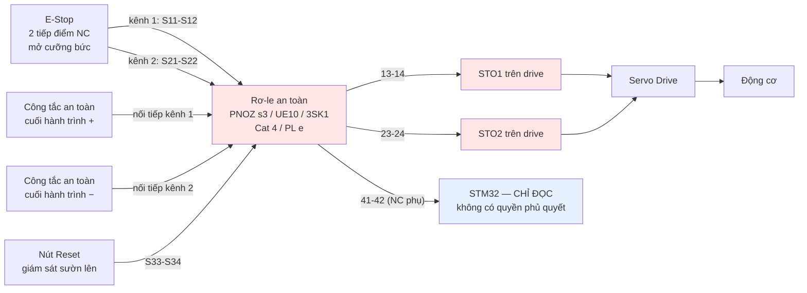

# Giai đoạn 1 — Mạch an toàn Category 3 (một trục, trên bàn)

> Tiếp nối `integrate/iZiiApp_Thiet_Ke_He_Dieu_Khien_RealTime.md` mục 1 và 2.
> Phạm vi: **một trục servo nằm ngang, gắn cứng trên bàn thí nghiệm**.
>
> Mục 6 giải thích vì sao thiết kế này **không dùng được nguyên si cho trục nâng**
> ở giai đoạn 2 — đọc mục đó trước khi nhân bản mạch.

---

## 1. Category 3 thực sự đòi hỏi gì

ISO 13849-1:2023 quy định ba điều cho Category 3:

| Yêu cầu | Nghĩa cụ thể trong mạch |
|---|---|
| Một lỗi đơn **không** được làm mất chức năng an toàn | Hai kênh độc lập, đứt một kênh thì kênh kia vẫn dừng máy |
| Lỗi đơn phải **được phát hiện** tại hoặc trước lần yêu cầu kế tiếp | Giám sát chéo giữa hai kênh + giám sát thời gian lệch |
| Tích luỹ nhiều lỗi *có thể* làm mất chức năng | Đây là ranh giới với Category 4 — chấp nhận được ở PL d |

Kiến trúc chỉ định (designated architecture) của Cat 3:

```
        ┌──── I1 ────── L1 ────── O1 ────┐
input ──┤       ╎        ╎        ╎      ├── output
        └──── I2 ────── L2 ────── O2 ────┘
                ╎        ╎        ╎
             giám sát chéo (cross monitoring)
```

**Điểm dễ hiểu sai:** hai kênh thôi *chưa đủ* là Category 3. Không có giám sát
chéo thì đó chỉ là Category B nhân đôi — một kênh chết âm thầm, bạn không biết,
và khi kênh thứ hai chết thì mất luôn chức năng an toàn. Chính phần **giám sát**
mới là thứ nâng lên Cat 3, và đó cũng là lý do phải mua rơ-le an toàn thay vì đấu
hai rơ-le thường song song.

### 1.1 Cat 3 đạt được PL nào

| Cat | DC trung bình | MTTFd mỗi kênh | PL đạt được |
|---|---|---|---|
| 3 | Thấp (60–90%) | Trung bình (10–30 năm) | PL c |
| 3 | Thấp | **Cao (30–100 năm)** | **PL d** |
| 3 | **Trung bình (90–99%)** | Trung bình | **PL d** |
| 3 | Trung bình | Cao | PL d (sát e) |
| 4 | Cao (≥99%) | Cao | PL e |

Dải PFHd tương ứng (số lỗi nguy hiểm mỗi giờ):

| PL | PFHd |
|---|---|
| c | 10⁻⁶ … 3×10⁻⁶ |
| **d** | **10⁻⁷ … 10⁻⁶** |
| e | 10⁻⁸ … 10⁻⁷ |

Tin tốt: dùng linh kiện an toàn thương mại có chứng nhận, bạn đạt PL d khá dễ —
mục 5 tính cụ thể.

---

## 2. Stop Category — quyết định trước khi vẽ mạch

Đây là chỗ nhiều thiết kế tự chế sai, và sai theo hướng nguy hiểm.

**IEC 60204-1** định nghĩa ba loại dừng:

| Loại | Cách dừng | Dùng khi |
|---|---|---|
| **Category 0** | Cắt năng lượng ngay lập tức → trôi tự do | Trục ngang, quán tính nhỏ, không có tải trọng lực |
| **Category 1** | Giảm tốc có kiểm soát, **rồi** cắt năng lượng | Trục có quán tính lớn hoặc tải trọng lực |
| **Category 2** | Giảm tốc có kiểm soát, **giữ** năng lượng | Dừng vận hành, không phải dừng an toàn |

Ánh xạ sang chức năng an toàn của biến tần/servo theo **IEC 61800-5-2**:

| Chức năng | Viết tắt | Hành vi |
|---|---|---|
| Safe Torque Off | **STO** | Cắt mô-men ngay = Stop Cat 0 |
| Safe Stop 1 | **SS1** | Giảm tốc có giám sát → sau đó STO = Stop Cat 1 |
| Safe Brake Control | **SBC** | Điều khiển phanh cơ khí một cách an toàn |
| Safely Limited Speed | **SLS** | Giám sát tốc độ không vượt ngưỡng |

### 2.1 Cảnh báo quan trọng nhất của tài liệu này

> **STO đơn thuần trên trục nâng thẳng đứng làm tải RƠI.**

STO cắt mô-men động cơ. Trục ngang thì xe trôi rồi dừng vì ma sát — chấp nhận
được. Trục nâng thì **trọng lực thắng**, và khung nâng cùng pallet rơi tự do cho
đến khi phanh cơ khí ăn (nếu có) hoặc chạm đất (nếu không).

Trục nâng bắt buộc:

$$\textbf{SS1} \ (\text{giảm tốc có giám sát}) \ + \ \textbf{SBC} \ (\text{phanh cơ khí}) \ \rightarrow \ \text{STO}$$

Và phanh cơ khí phải là loại **fail-safe**: lò xo ép, điện nhả (spring-applied,
electrically-released). Mất điện = phanh ăn. Không bao giờ dùng phanh cần điện
để ăn.

Giai đoạn 1 là trục ngang trên bàn nên STO là đủ. **Đừng mang thiết kế này
nguyên si sang trục Y ở giai đoạn 2** — đó chính là loại lỗi sao chép gây tai nạn.

---

## 3. Mạch cụ thể cho giai đoạn 1

### 3.1 Sơ đồ khối



### 3.2 Đấu dây chi tiết (kiểu chân PNOZ)

```
 +24V ──┬─────────────────────────── A1
        │
        │   ┌── E-Stop NC #1 ──┬── LS+ NC ──┐
        ├───┤                  │            ├──────── S12
        │   S11 ───────────────┘            │
        │                                   │
        │   ┌── E-Stop NC #2 ──┬── LS− NC ──┐
        ├───┤                  │            ├──────── S22
        │   S21 ───────────────┘            │
        │
        │   ┌── Nút Reset (NO) ──┐
        └───┤                    ├────────────────── S34
            S33 ─────────────────┘

  0V ─────────────────────────────────────────────── A2

  Đầu ra an toàn (tiếp điểm NO, đóng khi hệ ở trạng thái an toàn để chạy):
        13 ──── +24V
        14 ──────────────────────────► STO1+ trên drive
        23 ──── +24V
        24 ──────────────────────────► STO2+ trên drive

  Đầu ra phụ (NC, chỉ để báo trạng thái):
        41/42 ───────────────────────► GPIO STM32 (đọc, có cách ly quang)
```

**Ba chi tiết dễ làm sai:**

1. **Hai kênh phải đi hai đường dây riêng biệt về mặt vật lý.** Chung một sợi cáp
   nhiều lõi thì một lần kẹp cáp làm đứt cả hai — đó là lỗi nguyên nhân chung
   (CCF) và làm hỏng luôn tính Category 3.
2. **Đầu ra 41/42 chỉ đi vào STM32 theo chiều đọc.** Không có đường ngược lại.
   Nếu STM32 có thể tác động vào chuỗi an toàn, toàn bộ phân tích PL sụp đổ vì
   giờ phần mềm của bạn nằm trong chuỗi và phải được đánh giá theo ISO 13849 mục
   phần mềm.
3. **Reset phải là sườn lên có giám sát**, không phải mức. Nút reset bị kẹt/dính
   thì hệ không được tự khởi động lại. Rơ-le an toàn loại tốt phát hiện được nút
   dính và từ chối reset.

### 3.3 Vì sao dùng công tắc hành trình an toàn riêng

Encoder nói vị trí — nhưng encoder là một kênh, không tự chẩn đoán, và trượt
khớp nối là chế độ hỏng thật. Công tắc hành trình an toàn ở hai đầu ray là **lớp
bảo vệ độc lập** dựa trên nguyên lý vật lý khác hẳn.

Chọn loại **mở cưỡng bức** (positive opening, ký hiệu mũi tên trong vòng tròn,
theo IEC 60947-5-1 Annex K). Loại này đảm bảo tiếp điểm bị **đẩy cơ học** rời
nhau, kể cả khi đã hàn dính. Công tắc hành trình thường không có tính chất này.

---

## 4. Danh mục linh kiện

| Vị trí | Yêu cầu bắt buộc | Họ sản phẩm tham khảo |
|---|---|---|
| Nút E-Stop | 2 NC, mở cưỡng bức, nấm đỏ nền vàng, giữ khi nhấn | Schneider XB5AS, Pilz PIT es, Eaton M22-PV |
| Công tắc hành trình an toàn | Mở cưỡng bức, kim loại | Schmersal, Pizzato FR, Omron D4N |
| **Rơ-le an toàn** | Có chứng nhận, Cat 4/PL e, 2 đầu ra NO + 1 NC phụ, giám sát reset | Pilz PNOZ s3/X3, Sick UE10-3OS, Siemens 3SK1, Phoenix PSR |
| **Servo drive** | **Có STO 2 kênh đạt SIL 2/PL d trở lên** | Delta ASDA-A3, Yaskawa Σ-7 (HWBB), Panasonic A6, Estun |
| Nút Reset | NO, xanh, có đèn | Bất kỳ loại công nghiệp |
| Nguồn 24 V | PELV, cách ly, theo IEC 60204-1 | Mean Well, Phoenix |

> **Kiểm tra khi mua drive:** phải có **hai đầu vào STO độc lập** (STO1/STO2 hoặc
> STOA/STOB) kèm **chứng chỉ ghi rõ PFHd và PL/SIL**. Nhiều drive giá rẻ ghi "có
> STO" nhưng thực chất là một đầu vào enable thường — cái đó **không phải** chức
> năng an toàn và không dùng được. Yêu cầu nhà cung cấp gửi bản chứng nhận TÜV
> trước khi đặt hàng.

Chi phí phần an toàn cho một trục thí nghiệm rơi vào khoảng vài triệu đến hơn
chục triệu đồng tuỳ hãng. Đây là khoản không cắt được — nếu ngân sách không chịu
nổi ở quy mô một trục, thì ở quy mô cả kho lại càng không.

---

## 5. Tính PL — ví dụ có số

Chuỗi an toàn gồm ba khối con nối tiếp. PFHd tổng là **tổng** PFHd các khối:

$$PFH_{d,\text{tổng}} = PFH_{d,\text{input}} + PFH_{d,\text{logic}} + PFH_{d,\text{output}}$$

### 5.1 Khối đầu vào — nút E-Stop + công tắc hành trình

Linh kiện cơ khí dùng $B_{10d}$ (số lần tác động đến khi 10% mẫu hỏng nguy hiểm):

$$MTTF_d = \frac{B_{10d}}{0{,}1 \times n_{op}}, \qquad n_{op} = \frac{d_{op} \times h_{op} \times 3600}{t_{cycle}}$$

Ví dụ E-Stop: $B_{10d} = 100\,000$, dùng 10 lần/ngày, 365 ngày/năm:

$$n_{op} = 3\,650 \ \text{lần/năm} \Rightarrow MTTF_d = \frac{100\,000}{0{,}1 \times 3\,650} = 274 \ \text{năm}$$

ISO 13849-1 **giới hạn trần ở 100 năm** mỗi kênh → xếp loại **High**.

Với Cat 3 + DC trung bình + MTTFd cao, tra bảng K của tiêu chuẩn cho
$PFH_d \approx 1{,}5 \times 10^{-8}$.

### 5.2 Khối logic — rơ-le an toàn

Đây là khối con **đã được chứng nhận**, dùng thẳng số của nhà sản xuất:

$$PFH_d \approx 2{,}3 \times 10^{-9} \ \text{(giá trị điển hình cho PNOZ s3)}$$

### 5.3 Khối đầu ra — STO trên drive

Cũng là khối đã chứng nhận, số điển hình:

$$PFH_d \approx 1{,}0 \times 10^{-8}$$

### 5.4 Tổng

$$PFH_d = 1{,}5\times10^{-8} + 2{,}3\times10^{-9} + 1{,}0\times10^{-8} = 2{,}73 \times 10^{-8} \ /\text{h}$$

Nằm trong dải **10⁻⁸ … 10⁻⁷** → **PL e**, vượt yêu cầu PL d.

> **Ba lưu ý về con số này.** (a) Chúng là giá trị **minh hoạ** — bạn phải thay
> bằng số trong datasheet linh kiện thực mua. (b) Đạt PL e trên giấy không có
> nghĩa hệ thống an toàn: đấu sai dây, đi chung cáp, hoặc bỏ qua kiểm chứng đều
> phá vỡ kết quả. (c) Bạn vẫn phải đạt **CCF ≥ 65 điểm**, xem 5.5.

### 5.5 CCF — lỗi nguyên nhân chung (bắt buộc ≥ 65/100)

Bảng chấm theo Phụ lục F của ISO 13849-1:

| Biện pháp | Điểm | Cách đạt trong mạch này |
|---|---|---|
| Tách biệt vật lý hai kênh | 15 | **Đi hai đường cáp riêng**, không chung ống |
| Đa dạng công nghệ | 20 | Kênh 1 dùng tiếp điểm cơ, kênh 2 qua bán dẫn (nếu rơ-le hỗ trợ) |
| Thiết kế / kinh nghiệm ứng dụng | 20 | Dùng linh kiện đã chứng nhận, đúng khuyến cáo nhà sản xuất |
| Đánh giá / phân tích | 5 | Có FMEA cho chuỗi an toàn |
| Năng lực / đào tạo | 5 | Người thiết kế hiểu CCF |
| Chống nhiễu EMC | 25 | Nối đất đúng, cáp có vỏ chắn, tách khỏi cáp động lực |
| Môi trường khác (nhiệt, rung, bụi) | 10 | Tủ điện đạt IP phù hợp |

Trong thực tế, **25 điểm EMC là dễ mất nhất**: chạy cáp an toàn song song và sát
cáp động lực của servo (vốn băm xung hàng chục kHz) là lỗi kinh điển. Tách vật lý
tối thiểu 20 cm hoặc đi máng riêng.

---

## 6. Vì sao thiết kế này chưa dùng được cho giai đoạn 2

| Khác biệt | Giai đoạn 1 (trục ngang) | Giai đoạn 2 (crane 3 trục) |
|---|---|---|
| Trục nâng Y | Không có | **Bắt buộc SS1 + SBC + phanh fail-safe** |
| Số trục | 1 | 3, cần dừng **phối hợp** — không được trục này dừng trước trục kia gây xoắn kết cấu |
| Vùng làm việc | Bàn thí nghiệm, không ai vào | Cần rào chắn + khoá liên động cửa (interlock) |
| Chế độ bảo trì | Chưa cần | Bắt buộc SLS + thiết bị cho phép 3 vị trí |
| Cách ly năng lượng | Chưa cần | **STO không cách ly điện** — cần thêm khoá cắt nguồn để LOTO |

**Điểm cuối quan trọng và hay bị bỏ sót:** STO ngăn sinh mô-men, nhưng bus DC
trong drive **vẫn còn điện áp nguy hiểm**. Người thò tay vào sửa cơ khí phải có
cách ly thật (cầu dao có khoá móc, quy trình LOTO), không phải chỉ nhấn E-Stop.

---

## 7. Kiểm chứng — tiêm lỗi, bắt buộc theo ISO 13849-2

Không có bước này thì mạch chưa được coi là Category 3, dù đấu đúng.

| # | Phép thử | Kết quả phải đạt |
|---|---|---|
| 1 | Ngắt **riêng** kênh 1 (rút dây S12) | Đầu ra an toàn nhả; rơ-le **không cho reset** |
| 2 | Ngắt **riêng** kênh 2 (rút dây S22) | Như trên |
| 3 | Chập kênh 1 lên +24 V | Phát hiện lỗi, không cho chạy |
| 4 | Chập chéo kênh 1 ↔ kênh 2 | Phát hiện lỗi |
| 5 | Nhấn E-Stop **trong lúc trục đang chạy tốc độ cao** | Đo thời gian và quãng đường dừng thực tế |
| 6 | Giữ nút reset ở trạng thái nhấn rồi cấp nguồn | **Không được tự chạy** |
| 7 | Nhả E-Stop | **Không được tự chạy** — phải nhấn reset mới chạy |
| 8 | Mất nguồn 24 V rồi có lại | Về trạng thái an toàn, chờ reset |
| 9 | Rút cáp nguồn STM32 khi đang chạy | Trục vẫn dừng an toàn qua chuỗi phần cứng |
| 10 | Nạp firmware lỗi cố ý (vòng lặp vô hạn) vào STM32 | E-Stop vẫn dừng được máy |

**Phép thử 9 và 10 là bài kiểm tra thật của toàn bộ triết lý thiết kế.** Nếu một
trong hai thất bại, nghĩa là phần mềm của bạn vẫn nằm trong chuỗi an toàn và
kiến trúc cần sửa lại, không phải sửa code.

Ghi lại kết quả mọi phép thử kèm ngày, người thực hiện, số sê-ri linh kiện. Đây
là hồ sơ kiểm chứng, và đơn vị kiểm định sẽ hỏi đến.

---

## 8. Danh mục kiểm tra trước khi cấp điện lần đầu

- [ ] Hai kênh an toàn đi **hai đường cáp riêng biệt về vật lý**
- [ ] Cáp an toàn tách khỏi cáp động lực servo ≥ 20 cm hoặc máng riêng
- [ ] E-Stop và công tắc hành trình đều là loại **mở cưỡng bức**
- [ ] Drive có **hai đầu vào STO độc lập**, có chứng chỉ PFHd
- [ ] Không có đường nào từ STM32 tác động vào chuỗi an toàn
- [ ] Nguồn 24 V là PELV, có cách ly
- [ ] Nối đất tủ và vỏ chắn cáp đúng một điểm
- [ ] Có sơ đồ mạch in ra, dán trong tủ
- [ ] Đã tính PFHd bằng số datasheet thật, không phải số ví dụ trong tài liệu này
- [ ] Đã chấm CCF ≥ 65 điểm và lưu bảng chấm
- [ ] Có người thứ hai rà soát lại đấu dây trước khi cấp điện
