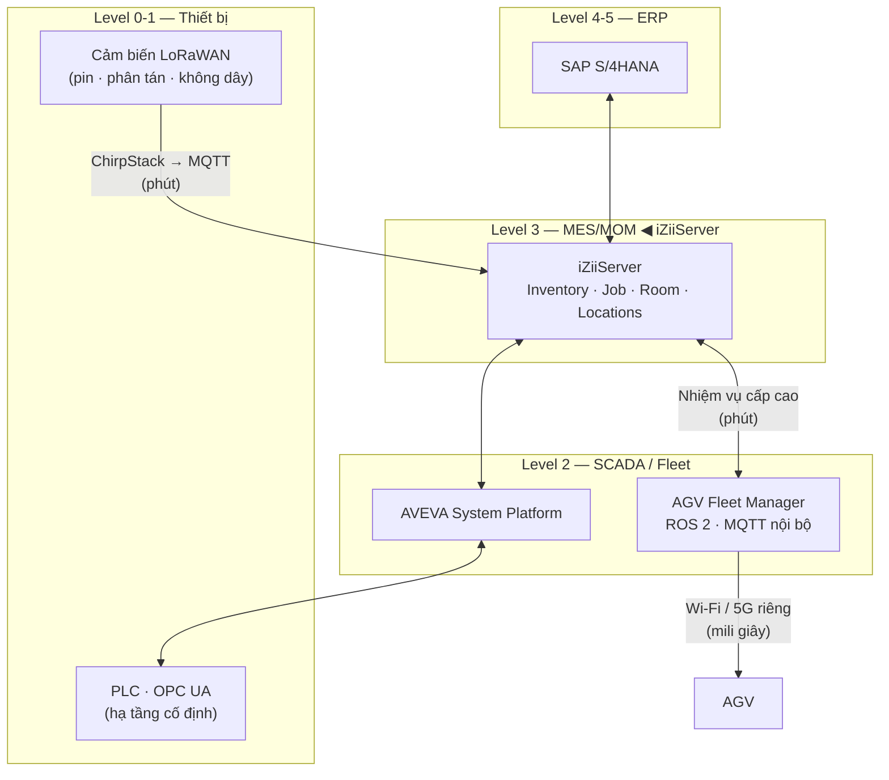
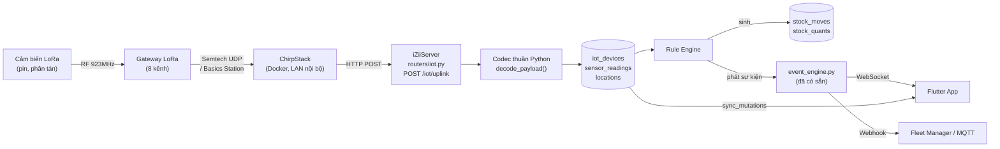

# iZiiApp — Kế hoạch tích hợp LoRaWAN cho Warehouse Automation

> Tài liệu tư vấn kiến trúc. Mọi khuyến nghị đều neo vào mã nguồn hiện tại của
> `izii_app/server/` và `izii_app/lib/`.
>
> **Liên quan:** `integrate/iZiiServer_Chien_Luoc_Tich_Hop_SAP_Wonderware.md`
> (tài liệu này nối tiếp khung ISA-95 đã dựng ở đó).
>
> **Trạng thái:** Đề xuất — chưa chốt. Mục 11 liệt kê các quyết định cần bạn duyệt.

---

## 1. Kết luận trước, lý lẽ sau

**Tích hợp được, và khớp tự nhiên với kiến trúc hiện tại** — nhưng chỉ khi phân
vai đúng. Ba câu tóm tắt:

1. **LoRaWAN là lớp cảm biến, không phải lớp điều khiển.** Nó nuôi dữ liệu cho
   Inventory. Nó không lái AGV.
2. **Phần khó không nằm ở LoRaWAN.** Nó nằm ở chỗ `StockQuants.locationId` hiện
   là một chuỗi text tự do. Không có mô hình vị trí phân cấp thì mọi dữ liệu
   cảm biến đổ về đều không gắn được vào đâu.
3. **Bỏ ý tưởng dùng LLM để decode payload** trong file `Research Lora.txt`.
   Mục 7 giải thích vì sao, kèm số liệu.

Ước lượng công sức: **Phase 1 khoảng 3–4 tuần** cho một người, trong đó phần
LoRaWAN thực sự chỉ chiếm chừng 1/3. Phần còn lại là refactor mô hình vị trí —
việc lẽ ra sớm muộn cũng phải làm.

---

## 2. Định vị LoRaWAN trong khung ISA-95 đã dựng

Tài liệu SAP/Wonderware đã xác định iZiiServer nằm ở **Level 3 (MES/MOM)**.
LoRaWAN không tạo ra một tầng mới — nó là một đường dẫn dữ liệu **Level 0–1 → Level 3**
đi tắt qua SCADA.



**Điểm mấu chốt:** LoRaWAN đi thẳng lên Level 3 vì nó *không* mang dữ liệu điều
khiển. Đường AGV (đỏ đậm trong thực tế) là một mạng hoàn toàn khác, không đi qua
LoRaWAN. Đừng để hai đường này lẫn vào nhau — đó là sai lầm kiến trúc tốn kém
nhất trong loại dự án này.

---

## 3. iZiiApp đã có sẵn gì để bắt vào

Đây là lý do tôi nói "khớp tự nhiên". Bốn thứ quan trọng nhất **đã tồn tại**:

| Thành phần sẵn có | File | Vì sao quan trọng |
|---|---|---|
| **Module system** | `lib/core/modules/module_interface.dart` | `IZiiModule` đã có `tableNames`, `agentTools`, `routes`, `dashboardWidget`. Thêm module mới không cần đụng core. |
| **Sync table-agnostic** | `server/routers/sync.py`, bảng `sync_mutations` | Server relay mutation theo tên bảng, **không hardcode schema**. Bảng mới sync được ngay, không cần đổi server. |
| **Event & Webhook engine** | `server/event_engine.py` (330 dòng) | Đã có sẵn cơ chế biến mutation → domain event → WebSocket + HTTP webhook. Cảnh báo cảm biến dùng lại nguyên si. |
| **Webhook router** | `server/routers/webhooks.py` | ChirpStack đẩy uplink vào đây. Hạ tầng nhận webhook đã chạy. |

Và hai thứ nữa đáng chú ý:

- **`OutboxQueue`** (`lib/core/sync/outbox_queue.dart`) đã xử lý cả trạng thái
  `rejected` — bài học từ sự cố 409 ngày 15/08. Dữ liệu IoT một chiều (server →
  client) nên sẽ không đụng vào vấn đề này, nhưng cấu hình rule thì có.
- **Hạ tầng BLE** (`ble_sync_manager.dart`, bảng `LocalBlePeers` với `rssi`).
  Mục 9.2 giải thích vì sao đây là chìa khoá cho tracking trong nhà.

**Tiền lệ tốt trong chính codebase:** module `mushrooms` đã lưu `coLevel`,
`co2Level` trên `MushroomJobs`. Nghĩa là bạn đã có nhu cầu dữ liệu cảm biến thật,
chỉ là đang nhập tay. LoRaWAN chính là thứ tự động hoá phần nhập tay đó.

---

## 4. Ranh giới: LoRaWAN làm gì, không làm gì

Bảng này nên in ra dán tường. Phần lớn dự án hỏng vì vượt ranh giới cột phải.

| Nhiệm vụ | Công nghệ đúng | LoRaWAN? |
|---|---|---|
| Tránh va chạm, dừng khẩn cấp AGV | LiDAR onboard, mạch an toàn cứng | ❌ Tuyệt đối không |
| Điều hướng, bám line, hiệu chỉnh quỹ đạo | ROS 2 Nav2, SLAM onboard | ❌ Không |
| Điều phối đội AGV, giao nhiệm vụ | MQTT nội bộ / Fleet manager, Wi-Fi | ❌ Không |
| Định vị AGV thời gian thực | UWB hoặc Wi-Fi RTT | ❌ Không |
| Nhiệt độ / độ ẩm / CO₂ kho | LoRaWAN | ✅ Rất hợp |
| Mức tồn bồn, cân pallet, đếm thùng | LoRaWAN | ✅ Rất hợp |
| Cảm biến cửa, cảm biến đầy/rỗng vị trí | LoRaWAN | ✅ Rất hợp |
| Nút gọi hàng (bin đầy → gọi AGV) | LoRaWAN uplink → iZii → fleet manager | ✅ Hợp (xem lưu ý dưới) |
| Telemetry pin/giờ chạy AGV | LoRaWAN | ✅ Hợp |
| Tracking pallet ngoài trời / bãi container | LoRaWAN + GPS | ✅ Hợp |
| Tracking pallet **trong nhà** | BLE tag + LoRaWAN backhaul | ⚠️ Xem mục 9.2 |

> **Lưu ý về nút gọi hàng:** độ trễ từ lúc bấm nút đến lúc iZii nhận được là
> **vài giây đến vài chục giây**, phụ thuộc SF và tải mạng. Chấp nhận được cho
> "gọi AGV tới lấy hàng". Không chấp nhận được cho bất cứ thứ gì có chữ "khẩn cấp".

### 4.1 Giới hạn kỹ thuật cần biết trước

| Thông số | Thực tế | Hệ quả thiết kế |
|---|---|---|
| Payload tối đa | 51 byte (SF12) → 222 byte (SF7) | Phải thiết kế payload nhị phân chặt. Không có chỗ cho JSON. |
| Độ trễ uplink | Giây đến hàng chục giây | Không dùng cho vòng điều khiển kín. |
| Downlink | Class A chỉ mở 2 cửa sổ nhận **sau** uplink | Không "gửi lệnh xuống bất cứ lúc nào". Class C làm được nhưng tốn pin, phải cắm điện. |
| Duty cycle | Bị giới hạn theo vùng tần số | Mỗi thiết bị chỉ phát được vài chục bản tin/giờ. Thiết kế theo ngân sách bản tin. |
| Tuổi thọ pin | 3–10 năm nếu uplink thưa | Uplink dày = pin hết trong vài tháng. Đây là đánh đổi trung tâm. |
| Vùng tần số VN | Dải 920–925 MHz (AS923) | ⚠️ **Phải xác nhận với Cục Tần số Vô tuyến điện trước khi mua thiết bị.** Mua nhầm band EU868/US915 là mất trắng. |

---

## 5. Kiến trúc tích hợp đề xuất



### 5.1 Vì sao chọn Webhook thay vì MQTT trực tiếp

ChirpStack hỗ trợ cả hai. Tôi đề xuất **HTTP webhook** cho Phase 1 vì:

- `server/routers/webhooks.py` và `event_engine.py` **đã chạy sẵn**. Thêm MQTT
  broker nghĩa là thêm một dịch vụ phải cài, giám sát, và khởi động lại cùng
  Windows Service — trong khi chưa cần.
- Kiến trúc hiện tại là **IIS → Uvicorn trên Windows**. Thêm Mosquitto vào là
  thêm một điểm hỏng, một cổng phải mở, một bộ log phải đọc.
- Khi nào cần MQTT: lúc nối AGV fleet manager (Phase 3). Lúc đó MQTT là đúng,
  vì phía AGV/ROS 2 vốn nói MQTT. Nhưng đó là một đường dây riêng, không phải
  đường LoRaWAN.

**Nguyên tắc:** đừng thêm hạ tầng cho tương lai giả định. Thêm khi nó trả tiền ngay.

### 5.2 Bảo mật đường uplink

ChirpStack webhook phải được xác thực. Dùng lại pattern `secret_token` đã có
trong `webhook_subscriptions` (`server/db_init.py` dòng 205):

- ChirpStack gửi kèm header bí mật → `routers/iot.py` kiểm tra hằng thời gian.
- ChirpStack **chỉ lắng nghe trên LAN**, không phơi ra Internet.
- Endpoint `/iot/uplink` bind loopback hoặc chặn ở IIS theo IP nguồn.
- Khoá AppKey của thiết bị nằm trong ChirpStack, **không** đồng bộ xuống client.

---

## 6. Luồng nghiệp vụ: từ cảm biến đến tồn kho

Đây là phần trả lời trực tiếp câu hỏi "kết hợp Inventory" của bạn.

### 6.1 Ba mô hình sinh dữ liệu tồn kho

| Mô hình | Cảm biến | Kết quả trong iZii | Độ tin cậy |
|---|---|---|---|
| **A. Đo trực tiếp** | Loadcell dưới rack, cảm biến mức bồn | Ghi đè `stock_quants.quantity` | Cao — đo thật |
| **B. Suy ra từ sự kiện** | Cảm biến vị trí đầy/rỗng, cửa | Sinh `stock_moves` trạng thái `draft` | Trung bình — cần người duyệt |
| **C. Chỉ giám sát** | Nhiệt độ, ẩm, CO₂ | Không đụng tồn kho, chỉ cảnh báo | — |

**Khuyến nghị mạnh:** Phase 1 chỉ làm **C**, Phase 2 làm **A**, và **B chỉ sinh
`draft` — không bao giờ tự `done`.**

Lý do: `StockMoves.status` hiện đã có sẵn ba trạng thái `draft / done / cancelled`.
Cảm biến sinh `draft`, người xác nhận thành `done`. Một cảm biến lỗi sẽ tạo ra
rác trong hàng chờ duyệt — khó chịu nhưng vô hại. Một cảm biến lỗi được phép ghi
thẳng `done` sẽ làm sai sổ sách tồn kho, và bạn sẽ mất nhiều ngày để lần ra.

Đây không phải thận trọng thừa: dữ liệu tồn kho sai còn tệ hơn không có dữ liệu,
vì người ta tin nó.

### 6.2 Ví dụ cụ thể

```
Cảm biến loadcell tại vị trí A-03-B-12 báo: 480 kg  (trước đó 500 kg)
        ↓
sensor_readings ghi 1 dòng (giữ nguyên, không bao giờ sửa)
        ↓
Rule "chênh lệch > 5% VÀ ổn định trong 2 lần đo liên tiếp"
        ↓
Sinh stock_moves: -20kg, từ A-03-B-12 → 'PENDING_REVIEW', status='draft'
        ↓
event_engine phát sự kiện → App hiện trong "Lệnh cần xử lý"
        ↓
Người duyệt → status='done' → stock_quants cập nhật
```

Chú ý điều kiện "ổn định trong 2 lần đo liên tiếp". Loadcell nhiễu khi có người
tựa vào rack. Mọi rule sinh chuyển động kho **phải** có điều kiện chống rung
(debounce), nếu không hàng chờ duyệt sẽ ngập rác trong tuần đầu.

---

## 7. Vì sao bỏ phần LLM decode payload trong `Research Lora.txt`

File research dành phần lớn dung lượng xây một pipeline QLoRA fine-tune
Qwen2.5-1.5B để dịch payload hex → JSON. **Tôi khuyến nghị bỏ hoàn toàn.**

Đây không phải vấn đề khẩu vị kỹ thuật. Decode payload LoRaWAN là một **hàm
thuần tuý, xác định, do chính bạn định nghĩa**:

```python
def decode(raw: bytes) -> dict:
    if raw[0] == 0x01:
        return {"sensor": "temperature", "value": int.from_bytes(raw[1:3], "big") / 10}
    ...
```

So sánh trực tiếp:

| Tiêu chí | Hàm Python | QLoRA 1.5B trên RTX 4050 |
|---|---|---|
| Độ trễ / bản tin | ~5 micro giây | ~1–2 giây |
| Độ chính xác | 100% theo định nghĩa | Không đảm bảo — **có thể bịa số** |
| Thông lượng tối đa | Hàng triệu/giây | **~0,5–1 bản tin/giây** |
| Tài nguyên | 0 | 4 GB VRAM, GPU chuyên dụng |
| Gỡ lỗi khi sai | Đọc 5 dòng code | Không gỡ được |
| Thêm loại cảm biến mới | Thêm 3 dòng | Thu thập dữ liệu, train lại, kiểm định lại |

**Con số quyết định là dòng "thông lượng".** Với 1.000 thiết bị gửi 6 bản tin/giờ,
hệ thống cần xử lý ~1,7 bản tin/giây. Một GPU xử lý tuần tự ~0,5–1 bản tin/giây.
**Nó không theo kịp tải, và hàng đợi sẽ phình vô hạn** — kể cả khi ta bỏ qua vấn
đề chính xác.

Còn vấn đề chính xác thì không bỏ qua được: một mô hình sinh văn bản gặp payload
`0x04...` chưa từng thấy trong tập huấn luyện sẽ **không báo lỗi** — nó sẽ sinh
ra một con số trông hợp lý. Với dữ liệu tồn kho, một con số sai trông hợp lý là
kịch bản tệ nhất có thể.

> Đây là một trường hợp kinh điển: công cụ ấn tượng, bài toán không cần đến nó.
> Việc file research xây được toàn bộ pipeline đó là đáng ghi nhận về mặt kỹ
> năng — nhưng đúng chỗ để dùng kỹ năng đó là mục 8.

---

## 8. Chỗ LLM thực sự có giá trị

Bạn **đã có** `lib/core/ai_agent/` với `AgentTool` và module `supply_chain` đã
khai báo 3 tool (`check_stock`, `search_products`, `list_all_products`). Đây mới
là nơi mô hình ngôn ngữ tạo ra giá trị thật:

| Việc | Vì sao LLM hợp |
|---|---|
| "Kho nào sắp hết hàng?" | Câu hỏi mở, nhiều cách diễn đạt — đúng thế mạnh |
| Tóm tắt tình trạng kho đầu ca | Tổng hợp nhiều nguồn thành văn xuôi |
| Giải thích cảnh báo cho người vận hành | Diễn đạt lại dữ liệu kỹ thuật thành tiếng Việt dễ hiểu |
| Soạn nội dung phiếu bảo trì | Sinh văn bản — đúng nghề |

Với **phát hiện bất thường**, cân nhắc kỹ: một quy tắc thống kê đơn giản
(z-score, ngưỡng trượt) thường tốt hơn và giải thích được. Chỉ dùng mô hình khi
đã chứng minh quy tắc đơn giản không đủ.

**Về việc fine-tune:** cho các tác vụ trên, prompt engineering với mô hình có sẵn
gần như chắc chắn đã đủ. Chỉ fine-tune khi đo được rằng prompt không đạt.
Chiếc RTX 4050 6GB của bạn hoàn toàn làm được QLoRA khi đến lúc — nhưng "khi đến
lúc" thường là không bao giờ.

---

## 9. Khoảng trống phải lấp trước

### 9.1 Mô hình vị trí — việc bắt buộc, làm trước tiên

Hiện tại (`lib/modules/supply_chain/database/tables.dart`):

```dart
class StockQuants extends Table {
  TextColumn get locationId => text()(); // Kho hàng  ← chuỗi tự do
}
```

`locationId` là text không ràng buộc, không có bảng `Locations`, không phân cấp,
không toạ độ. Hệ quả:

- Không gắn được cảm biến vào vị trí cụ thể.
- Không truy vấn được "tồn kho toàn bộ zone B".
- Không có toạ độ để gửi cho AGV.
- Gõ sai chính tả tạo ra một kho ma, im lặng.

**Đây là nút thắt thật sự của toàn bộ dự án**, và nó không liên quan gì đến
LoRaWAN — nó là món nợ kỹ thuật sẵn có mà warehouse automation làm lộ ra. Bước A
(tài liệu schema đi kèm) xử lý việc này.

### 9.2 Tracking trong nhà — đừng kỳ vọng vào LoRaWAN

Định vị bằng chính sóng LoRaWAN (TDoA) có sai số **hàng chục đến hàng trăm mét**.
Trong nhà kho thì con số đó vô nghĩa.

Kiến trúc đúng, và **bạn đã có sẵn một nửa**:

```
BLE tag gắn pallet  →  Gateway BLE-to-LoRa  →  LoRaWAN  →  iZii
   (rẻ, pin 1-2 năm)      (đọc RSSI, chọn         (backhaul,
                           beacon gần nhất)        không cần đi dây)
```

`lib/core/sync/ble_sync_manager.dart` và bảng `LocalBlePeers` (đã có cột `rssi`)
là nền tảng sẵn có cho phần BLE. Độ chính xác đạt được ở mức **"đúng khu vực /
đúng dãy"** — thường là đủ cho quản lý kho. Nếu cần độ chính xác dưới mét (ví dụ
để AGV tự lấy đúng pallet), phải dùng UWB, và đó là một dự án riêng.

### 9.3 Dữ liệu chuỗi thời gian trên SQLite

Ước lượng tải ghi thật:

```
1.000 thiết bị × 6 uplink/giờ = 6.000 dòng/giờ ≈ 1,7 dòng/giây
```

SQLite WAL trên SSD xử lý thoải mái. **Vấn đề không phải tốc độ ghi mà là tích luỹ:**

```
6.000 dòng/giờ × 24 × 365 ≈ 52,5 triệu dòng/năm
```

Với ~80 byte/dòng → khoảng **4 GB/năm** chỉ riêng dữ liệu cảm biến thô. File DB
này còn đang chứa toàn bộ nghiệp vụ khác. Ba biện pháp, làm ngay từ Phase 1:

1. **Chỉ ghi khi giá trị đổi** hoặc quá hạn tối đa (phần lớn cảm biến báo lại
   cùng một giá trị) — thường giảm 60–80% số dòng.
2. **Rollup:** gộp thành trung bình/phút sau 7 ngày, trung bình/giờ sau 90 ngày.
3. **Không sync dữ liệu thô xuống client.** Client chỉ nhận giá trị mới nhất và
   dữ liệu đã rollup. Điện thoại không cần 52 triệu dòng.

Điểm 3 quan trọng nhất và dễ quên nhất. Cấu hình qua `UserSyncConfigs` với
`syncGranularity = 'selective'` — cơ chế đã có sẵn.

### 9.4 Khảo sát sóng — làm trước khi mua thiết bị

Nhà kho là môi trường RF khắc nghiệt: kệ thép, pallet kim loại, tường bê tông,
xe nâng di chuyển liên tục. Con số "10–15 km" trong tài liệu quảng cáo là đo ở
ngoài trời tầm nhìn thẳng và **không liên quan gì** đến trong nhà.

Trước khi đặt hàng số lượng lớn:

1. Mua **1 gateway + 3–5 node** để thử.
2. Đặt node ở các vị trí xấu nhất: góc khuất, sau kệ thép, tủ đông nếu có.
3. Đo tỉ lệ mất gói và SF thực tế trong **ít nhất một tuần**, có cả ca đêm và
   lúc kho đầy hàng.
4. Từ kết quả đó mới quyết định số gateway.

Bỏ qua bước này là rủi ro tốn kém nhất trong toàn kế hoạch — và cũng là bước dễ
bị bỏ qua nhất vì nó không tạo ra thứ gì để demo.

---

## 10. Lộ trình

### Phase 1 — Nền tảng (3–4 tuần)

| # | Việc | Kết quả kiểm chứng được |
|---|---|---|
| 1 | Khảo sát sóng với thiết bị mẫu | Báo cáo tỉ lệ mất gói theo vị trí |
| 2 | **Refactor mô hình vị trí** (bước A) | Bảng `Locations` phân cấp, migrate `locationId` cũ |
| 3 | Cài ChirpStack (Docker, LAN nội bộ) | Gateway lên mạng, node join OTAA thành công |
| 4 | `server/routers/iot.py` + codec Python | Uplink vào DB, có kiểm thử đơn vị cho codec |
| 5 | Module `izii.warehouse_automation` | Dashboard hiện nhiệt/ẩm thời gian thực |
| 6 | Cảnh báo ngưỡng qua `event_engine` | Vượt ngưỡng → thông báo tới app |

Phạm vi Phase 1 cố ý **chỉ dừng ở mô hình C (giám sát)**. Chưa đụng vào tồn kho.
Mục tiêu là chứng minh đường ống dữ liệu chạy ổn định 24/7 trước khi cho nó
quyền ghi vào sổ sách.

### Phase 2 — Nối vào Inventory (3–4 tuần)

- Loadcell / cảm biến mức → mô hình A (đo trực tiếp).
- Rule engine sinh `stock_moves` trạng thái `draft`, có debounce.
- Màn hình duyệt trong app.
- Rollup và chính sách lưu trữ dữ liệu.
- Agent tool mới: hỏi tồn kho bằng ngôn ngữ tự nhiên theo zone.

### Phase 3 — Nối AGV (phụ thuộc việc mua AGV)

- MQTT broker nội bộ, tách khỏi đường LoRaWAN.
- iZii phát nhiệm vụ cấp cao; fleet manager tự lo điều hướng.
- Toạ độ lấy từ bảng `Locations` đã dựng ở Phase 1.
- Telemetry AGV (pin, giờ chạy) đi qua LoRaWAN.

**Ranh giới trách nhiệm ở Phase 3:** iZii nói *"lấy pallet ở A-03-B-12"*. Fleet
manager quyết định *đi đường nào*. iZii không bao giờ biết AGV đang ở toạ độ nào
theo thời gian thực, và **không cần biết**. Giữ ranh giới này sạch thì sau có
đổi nhà cung cấp AGV cũng không phải viết lại iZii.

---

## 11. Quyết định cần chốt

| # | Câu hỏi | Vì sao cần chốt sớm |
|---|---|---|
| 1 | **Vùng tần số VN — xác nhận với Cục Tần số** | Mua nhầm band là mất trắng toàn bộ lô thiết bị |
| 2 | Kho thật có bao nhiêu vị trí, phân cấp mấy tầng? | Quyết định thiết kế bảng `Locations` ở bước A |
| 3 | Đã có AGV chưa, hay còn đang cân nhắc? | Nếu chưa, Phase 3 chỉ là giữ chỗ; đừng thiết kế cho nó |
| 4 | ChirpStack chạy trên máy nào? | Cùng máy Uvicorn hay máy riêng — ảnh hưởng RAM và vận hành |
| 5 | Ai là người duyệt `draft` → `done`? | Quyết định luồng phân quyền, gắn với `mushroom_employees` |
| 6 | Có yêu cầu tuân thủ nào về lưu vết dữ liệu nhiệt độ? | Nếu có (thực phẩm, dược), chính sách rollup phải đổi |

---

## 12. Ước tính chi phí phần cứng (định hướng)

Con số tham khảo cho một kho cỡ trung, **cần báo giá thực tế từ nhà cung cấp VN**:

| Hạng mục | Số lượng | Ghi chú |
|---|---|---|
| Gateway LoRa 8 kênh trong nhà | 2–4 | Số lượng chốt sau khảo sát sóng |
| Node nhiệt/ẩm | 20–50 | Loại rẻ, pin nhiều năm |
| Loadcell / cảm biến mức | Theo nhu cầu | Đắt hơn đáng kể, mua sau Phase 1 |
| Thiết bị thử nghiệm ban đầu | 1 GW + 5 node | **Mua trước tiên, trước mọi thứ khác** |
| ChirpStack | — | Nguồn mở, miễn phí |

Phần mềm (ChirpStack) không tốn tiền bản quyền. Chi phí thật nằm ở phần cứng và
công lắp đặt.

---

## 13. Rủi ro

| Rủi ro | Mức độ | Giảm thiểu |
|---|---|---|
| Sóng không phủ được kho do kệ thép | **Cao** | Khảo sát trước — mục 9.4 |
| Mua nhầm vùng tần số | Cao | Xác nhận pháp lý — mục 11.1 |
| Cảm biến lỗi làm sai tồn kho | **Cao** | `draft` bắt buộc, không tự `done` — mục 6.1 |
| Refactor `locationId` phá dữ liệu cũ | Trung bình | Migration có bước map thủ công + sao lưu trước |
| DB phình vì dữ liệu cảm biến | Trung bình | Rollup từ Phase 1 — mục 9.3 |
| Phạm vi dự án phình sang điều khiển AGV | Trung bình | Giữ bảng mục 4 làm ranh giới |
| Pin cạn sớm do uplink quá dày | Thấp | Ngân sách bản tin từ đầu |

---

## 14. Bước tiếp theo

Tài liệu này là **bước B**. Tiếp theo là **bước A**: thiết kế schema Drift chi tiết
cho `Locations`, `IotDevices`, `SensorReadings`, `AutomationRules` — bám đúng
style hiện có (`TextColumn get id => text()()` với UUID, migration theo pattern
`if (from < N)` trong `app_database.dart`, schema version hiện tại **26** → **27**).

Sau đó là bước C: dựng skeleton module `izii.warehouse_automation` theo
`IZiiModule`.
