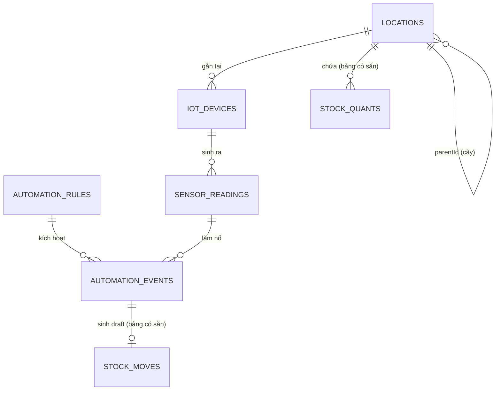

# iZiiApp — Thiết kế schema Warehouse Automation

> Đi kèm `integrate/iZiiApp_Ke_Hoach_Tich_Hop_LoRaWAN.md` (bước B).
> Mã nguồn: `lib/modules/warehouse_automation/database/tables.dart`.
>
> **Schema version hiện tại: 26 → đề xuất nâng lên 27.**

---

## 1. Tổng quan năm bảng



| Bảng | Vai trò | Tải ghi ước tính |
|---|---|---|
| `Locations` | Cây vị trí kho | Rất thấp — gần như tĩnh |
| `IotDevices` | Sổ đăng ký thiết bị | Thấp — 1 UPDATE/uplink |
| `SensorReadings` | Số đo | **Cao — nút thắt** |
| `AutomationRules` | Cấu hình luật | Rất thấp |
| `AutomationEvents` | Nhật ký kích hoạt | Thấp nếu debounce đúng |

---

## 2. Ba quyết định thiết kế đáng bàn

### 2.1 `Locations` dùng cả `parentId` lẫn `path`

Ba cách biểu diễn cây trong SQL, và lý do chọn cách thứ ba:

| Cách | Truy vấn cả nhánh | Đổi cha | Kết luận |
|---|---|---|---|
| Chỉ `parentId` | Cần recursive CTE — Drift không có API kiểu, phải `customStatement` | Rẻ | Truy vấn khó |
| Nested set (left/right) | Rất nhanh | Phải ghi lại gần như cả bảng | Quá đắt |
| **`parentId` + `path`** | Một câu `LIKE '/WH1/A/%'` có index | Cập nhật nhánh con | **Chọn cái này** |

Đổi cha trong nhà kho là việc hiếm (tái bố trí kệ). Truy vấn "tồn kho toàn zone"
là việc xảy ra mỗi lần mở màn hình. Tối ưu cho việc thường xuyên.

**Ràng buộc bắt buộc khi ghi:** `path` phải luôn nhất quán với `parentId`.
Toàn bộ thao tác tạo/đổi cha phải đi qua `LocationRepository`, không được
`INSERT` thẳng. Hàm `reparent()` chạy trong một transaction:

```dart
Future<void> reparent(String nodeId, String? newParentId) async {
  await transaction(() async {
    final node = await getById(nodeId);
    final newParent = newParentId == null ? null : await getById(newParentId);

    // Chặn vòng lặp: không cho đặt cha là chính con cháu của mình.
    if (newParent != null && newParent.path.startsWith('${node.path}/')) {
      throw StateError('Không thể đặt vị trí con làm cha của chính nó');
    }

    final oldPath = node.path;
    final newPath = newParent == null ? '/${node.code}' : '${newParent.path}/${node.code}';
    final depthDelta = '/'.allMatches(newPath).length - '/'.allMatches(oldPath).length;

    // Cập nhật chính nút, rồi toàn bộ nhánh con bằng một câu.
    await customStatement(
      "UPDATE locations SET path = ? || SUBSTR(path, ?), depth = depth + ? "
      "WHERE path = ? OR path LIKE ?",
      [newPath, oldPath.length + 1, depthDelta, oldPath, '$oldPath/%'],
    );
  });
}
```

Kiểm tra vòng lặp ở dòng thứ tư không phải thừa: giao diện kéo-thả rất dễ tạo ra
tình huống này, và một cây có vòng sẽ làm treo mọi hàm duyệt đệ quy sau đó.

### 2.2 `SensorReadings` dạng dài, không dạng rộng

Một cảm biến gửi nhiệt + ẩm + pin sinh **3 dòng**, không phải 1 dòng 3 cột.

| | Dạng dài (đã chọn) | Dạng rộng / JSON |
|---|---|---|
| Thêm loại cảm biến mới | Không đổi schema | Phải thêm cột hoặc parse JSON |
| Rollup | `GROUP BY metric` — một câu | Phải viết riêng từng chỉ số |
| Số dòng | Gấp ~3 | Ít hơn |
| Truy vấn một chỉ số | Có index, nhanh | Phải đọc cả dòng / parse JSON |

Số dòng nhiều hơn là cái giá thật, nhưng được bù bởi quy tắc **chỉ ghi khi giá
trị đổi** (mục 4.2). Và dữ liệu chuỗi thời gian dạng dài là chuẩn công nghiệp —
mọi công cụ phân tích sau này đều mong đợi định dạng này.

### 2.3 `locationId` được sao chép vào `SensorReadings`

Đây là dư thừa **có chủ đích**, và là điểm dễ bị phản đối nhất trong thiết kế.

Lý do: thiết bị có thể tháo ra lắp chỗ khác. Nếu truy vấn lịch sử nhiệt độ zone A
bằng cách join sang `IotDevices.locationId` (giá trị *hiện tại*), thì sau khi
chuyển một cảm biến từ zone A sang zone B, **toàn bộ số đo cũ của nó đột nhiên
thuộc về zone B**. Biểu đồ lịch sử sai, và không có gì báo lỗi.

Chuẩn hoá đúng về lý thuyết nhưng sai về ngữ nghĩa: `IotDevices.locationId` trả
lời "thiết bị *đang* ở đâu", còn dữ liệu lịch sử cần "phép đo *đã* thực hiện ở đâu".
Đó là hai câu hỏi khác nhau, nên là hai cột khác nhau.

---

## 3. Migration — các bước cụ thể

### 3.1 Đăng ký bảng trong `lib/core/database/app_database.dart`

```dart
// Thêm vào phần import (sau dòng 16)
import '../../modules/warehouse_automation/database/tables.dart';

@DriftDatabase(tables: [
  // ... 60 bảng hiện có, giữ nguyên ...
  NotificationSettingsTable,
  // ── Warehouse Automation (schema v27) ──
  Locations,
  IotDevices,
  SensorReadings,
  AutomationRules,
  AutomationEvents,
])
class AppDatabase extends _$AppDatabase {
  @override
  int get schemaVersion => 27;   // ← từ 26
```

### 3.2 Nhánh migration

Bám đúng pattern `try { } catch (_) { }` đang dùng trong file:

```dart
if (from < 27) {
  try { await m.createTable(locations); } catch (_) {}
  try { await m.createTable(iotDevices); } catch (_) {}
  try { await m.createTable(sensorReadings); } catch (_) {}
  try { await m.createTable(automationRules); } catch (_) {}
  try { await m.createTable(automationEvents); } catch (_) {}

  // Index: tạo tường minh, không dựa vào việc m.createTable có tạo kèm
  // @TableIndex hay không. IF NOT EXISTS nên chạy lại hoàn toàn vô hại.
  for (final stmt in const [
    "CREATE INDEX IF NOT EXISTS idx_locations_path ON locations(path)",
    "CREATE INDEX IF NOT EXISTS idx_locations_parent ON locations(parent_id)",
    "CREATE INDEX IF NOT EXISTS idx_iot_devices_location ON iot_devices(location_id)",
    "CREATE INDEX IF NOT EXISTS idx_readings_device_time ON sensor_readings(device_id, measured_at)",
    "CREATE INDEX IF NOT EXISTS idx_readings_location_metric ON sensor_readings(location_id, metric)",
    "CREATE INDEX IF NOT EXISTS idx_readings_rollup ON sensor_readings(rollup_level, measured_at)",
    "CREATE INDEX IF NOT EXISTS idx_auto_events_rule_time ON automation_events(rule_id, triggered_at)",
  ]) {
    try { await customStatement(stmt); } catch (_) {}
  }

  // Ghép dữ liệu cũ: xem 3.3
  try { await _seedLocationsFromExistingQuants(); } catch (_) {}
}
```

> **Lưu ý về `catch (_) {}`:** pattern này đang được dùng nhất quán trong file và
> tôi giữ theo. Nhưng nó nuốt lỗi im lặng — nếu `createTable` hỏng, app vẫn chạy
> rồi sập ở chỗ khác với thông báo khó hiểu. Cân nhắc ít nhất `debugPrint` trong
> khối catch. Đây là góp ý cho toàn bộ file, không riêng nhánh này.

### 3.3 Ghép dữ liệu `StockQuants.locationId` cũ

Đây là bước rủi ro nhất. `locationId` hiện là text tự do, có thể chứa bất cứ thứ
gì nhân viên từng gõ.

**Nguyên tắc: không đoán. Không tự động suy ra cây.**

```dart
Future<void> _seedLocationsFromExistingQuants() async {
  // 1. Lấy toàn bộ giá trị locationId đang tồn tại
  final rows = await customSelect(
    'SELECT DISTINCT location_id FROM stock_quants WHERE location_id IS NOT NULL',
  ).get();

  // 2. Tạo một nút gốc "chưa phân loại"
  const rootId = 'loc-legacy-root';
  await customStatement(
    "INSERT OR IGNORE INTO locations "
    "(id, code, name, parent_id, type, path, depth, status, is_storable, "
    " custom_fields, created_at) "
    "VALUES (?, 'LEGACY', 'Chưa phân loại', NULL, 'warehouse', '/LEGACY', 0, "
    "        'active', 0, '{}', ?)",
    [rootId, DateTime.now().millisecondsSinceEpoch ~/ 1000],
  );

  // 3. Mỗi giá trị cũ thành một nút LÁ phẳng dưới gốc đó.
  //    KHÔNG cố tách 'A-03-B-12' thành cây — quy ước đặt tên chưa được xác
  //    nhận, đoán sai sẽ tạo ra một cây sai trông rất giống cây đúng.
  for (final r in rows) {
    final legacy = r.read<String>('location_id');
    if (legacy.trim().isEmpty) continue;
    final id = const Uuid().v4();
    await customStatement(
      "INSERT OR IGNORE INTO locations "
      "(id, code, name, parent_id, type, path, depth, status, is_storable, "
      " custom_fields, created_at) "
      "VALUES (?, ?, ?, ?, 'bin', ?, 1, 'active', 1, '{}', ?)",
      [id, legacy, legacy, rootId, '/LEGACY/$legacy',
       DateTime.now().millisecondsSinceEpoch ~/ 1000],
    );
  }
}
```

Sau migration, `StockQuants.locationId` vẫn giữ nguyên giá trị chuỗi cũ — **không
đổi kiểu, không đổi dữ liệu**. Nó khớp với `Locations.code`. Việc sắp xếp lại
cây thật là thao tác thủ công của người quản kho, làm qua giao diện, sau khi đã
xác nhận quy ước đặt tên.

Cách này chậm hơn nhưng không phá dữ liệu. Migration tự động một cây kho là loại
việc chỉ sai một lần là mất nhiều ngày để gỡ.

**Trước khi chạy migration trên máy thật:** sao lưu bằng
`lib/core/database/database_backup_service.dart` đã có sẵn.

### 3.4 Phía server

`server/routers/sync.py` relay mutation theo tên bảng, **không hardcode schema** —
nên năm bảng mới đồng bộ được ngay, không cần đổi server.

Chỉ cần thêm bảng tương ứng trong `server/db_init.py` để server có chỗ lưu, theo
đúng pattern `CREATE TABLE IF NOT EXISTS` đang dùng.

---

## 4. Truy vấn mẫu

### 4.1 Tồn kho toàn bộ một nhánh

```sql
SELECT p.name, SUM(sq.quantity) AS total
FROM stock_quants sq
JOIN locations l ON l.code = sq.location_id
JOIN products  p ON p.id   = sq.product_id
WHERE l.path LIKE '/WH1/A/%'      -- dùng idx_locations_path
GROUP BY p.id
ORDER BY total DESC;
```

### 4.2 Chỉ ghi khi giá trị đổi

Áp dụng ở `server/routers/iot.py` **trước khi** INSERT. Đây là biện pháp giảm
dung lượng hiệu quả nhất, thường cắt 60–80% số dòng:

```python
DEADBAND = {
    "temperature": 0.2,   # °C — dưới mức này coi như nhiễu
    "humidity":    1.0,   # %
    "weight":      0.5,   # kg
    "co2":         20.0,  # ppm
}
MAX_GAP_SEC = 3600        # dù không đổi, mỗi giờ vẫn ghi 1 dòng làm mốc

def should_store(device_id, metric, value, measured_at, last):
    if last is None:
        return True
    if (measured_at - last.measured_at).total_seconds() >= MAX_GAP_SEC:
        return True
    return abs(value - last.value) >= DEADBAND.get(metric, 0.0)
```

`MAX_GAP_SEC` quan trọng: không có nó, một cảm biến ổn định tuyệt đối sẽ không
ghi dòng nào và ta không phân biệt được "ổn định" với "chết".

### 4.3 Phát hiện thiết bị mất tín hiệu

```sql
SELECT d.name, d.dev_eui, d.last_seen_at, d.battery_level, l.code AS location
FROM iot_devices d
LEFT JOIN locations l ON l.id = d.location_id
WHERE d.status = 'active'
  AND d.expected_interval_sec IS NOT NULL
  AND (strftime('%s','now') - strftime('%s', d.last_seen_at))
        > d.expected_interval_sec * 3
ORDER BY d.last_seen_at ASC;
```

Hệ số 3 là mức khởi đầu hợp lý: đủ rộng để bỏ qua một hai gói rớt, đủ chặt để
phát hiện thiết bị chết trong vòng vài chu kỳ. Tinh chỉnh sau khi có số liệu
mất gói thực tế từ khảo sát sóng.

---

## 5. Rollup và lưu trữ

| Tuổi dữ liệu | Mức | Ước tính dòng còn lại |
|---|---|---|
| 0–7 ngày | `raw` | 100% |
| 7–90 ngày | `minute` | ~10% |
| 90 ngày–2 năm | `hour` | ~0,5% |
| > 2 năm | `day` hoặc xoá | ~0,02% |

```sql
-- Gộp raw → hour cho dữ liệu cũ hơn 90 ngày
INSERT INTO sensor_readings
  (id, device_id, location_id, metric, value, unit,
   measured_at, received_at, quality, rollup_level,
   sample_count, min_value, max_value)
SELECT
  lower(hex(randomblob(16))),
  device_id, location_id, metric,
  AVG(value), unit,
  datetime(strftime('%Y-%m-%d %H:00:00', measured_at)),
  CURRENT_TIMESTAMP, 'ok', 'hour',
  COUNT(*), MIN(value), MAX(value)
FROM sensor_readings
WHERE rollup_level = 'raw'
  AND measured_at < datetime('now', '-90 days')
GROUP BY device_id, metric, strftime('%Y-%m-%d %H', measured_at);
```

Giữ `min_value` / `max_value` là bắt buộc, không phải tuỳ chọn. Trung bình giờ
sẽ che mất một lần vọt nhiệt 40 °C kéo dài 5 phút — đúng thứ mà cả hệ giám sát
sinh ra để bắt.

Chạy rollup vào giờ thấp điểm, theo lô, và **xoá dòng `raw` trong cùng
transaction** với lệnh INSERT ở trên.

---

## 6. Cấu hình đồng bộ xuống client

`SensorReadings` **không** được sync toàn bộ. Dùng `UserSyncConfigs` đã có sẵn:

| Bảng | Chiều | Granularity |
|---|---|---|
| `Locations` | Hai chiều | `full` — nhỏ, cần offline |
| `IotDevices` | Server → client | `full` — vài trăm dòng |
| `SensorReadings` | Server → client | **`selective`** — chỉ giá trị mới nhất mỗi thiết bị + rollup 7 ngày |
| `AutomationRules` | Hai chiều | `full` |
| `AutomationEvents` | Server → client | `selective` — 30 ngày gần nhất |

```dart
await syncConfigRepo.upsert(UserSyncConfigsCompanion.insert(
  id: const Uuid().v4(),
  userId: currentUserId,
  moduleKey: 'warehouse_automation',
  syncGranularity: const Value('selective'),
  selectiveEntities: Value(jsonEncode([
    'locations', 'iot_devices', 'automation_rules',
    'sensor_readings:latest', 'automation_events:30d',
  ])),
));
```

Quên bước này thì lần sync đầu tiên sẽ cố kéo hàng chục triệu dòng về điện thoại.

---

## 7. Việc còn lại trước khi chạy `build_runner`

- [ ] Chốt quy ước đặt tên vị trí với người quản kho (mục 11.2 tài liệu bước B)
- [ ] Thêm import + 5 bảng vào `@DriftDatabase`, nâng `schemaVersion` → 27
- [ ] Thêm nhánh `if (from < 27)` vào `MigrationStrategy`
- [ ] Sao lưu DB bằng `database_backup_service.dart`
- [ ] `dart run build_runner build --delete-conflicting-outputs`
- [ ] Kiểm thử migration trên **bản sao** DB thật, không phải DB gốc
- [ ] Thêm bảng tương ứng vào `server/db_init.py`
- [ ] Viết `LocationRepository` với `reparent()` có kiểm tra vòng lặp

Sau đó mới tới bước C: dựng module `izii.warehouse_automation` theo `IZiiModule`.

---

## Phụ lục — Những gì đã được kiểm chứng

| Hạng mục | Cách kiểm | Kết quả |
|---|---|---|
| `@TableIndex` có trên drift 2.22.1 không | Changelog drift chính thức | ✅ Thêm từ **2.12.0**. Dự án đang dùng 2.22.1 |
| Trùng tên class bảng | `grep` toàn bộ `lib/` | ✅ Không trùng với 60 bảng hiện có |
| Trùng tên data class Drift sinh ra (`Location`, `IotDevice`, `SensorReading`, `AutomationRule`, `AutomationEvent`) | `grep` class/enum/mixin toàn `lib/` | ✅ Không trùng — quan trọng vì `app_database.g.dart` gom mọi thứ vào một namespace |
| Từ khoá Dart trong tên cột | Rà thủ công 74 cột | ✅ Đã tránh `operator` (đổi thành `comparator`) |
| Schema version hiện tại | `app_database.dart:103` | ✅ `26` → đề xuất `27` |
| Server có cần đổi schema không | `server/routers/sync.py` | ✅ Không — sync relay theo tên bảng, không hardcode |
| Kiểu lưu `DateTime` | Mặc định Drift = INTEGER unix giây | ✅ SQL migration ở 3.3 dùng `millisecondsSinceEpoch ~/ 1000` cho đúng |

**Chưa kiểm chứng được, cần bạn xác nhận khi chạy thật:**

- `m.createTable()` có tự tạo index khai báo bằng `@TableIndex` hay không — nên
  đoạn migration ở 3.2 tạo index tường minh, không phụ thuộc vào hành vi này.
- Đoạn `_seedLocationsFromExistingQuants()` cần `import 'package:uuid/uuid.dart';`
  (uuid ^4.5.1 đã có trong `pubspec.yaml` dòng 65).
- Toàn bộ mã trong tài liệu này **chưa chạy `build_runner`**, vì việc đó cần
  Flutter SDK trên máy bạn.
