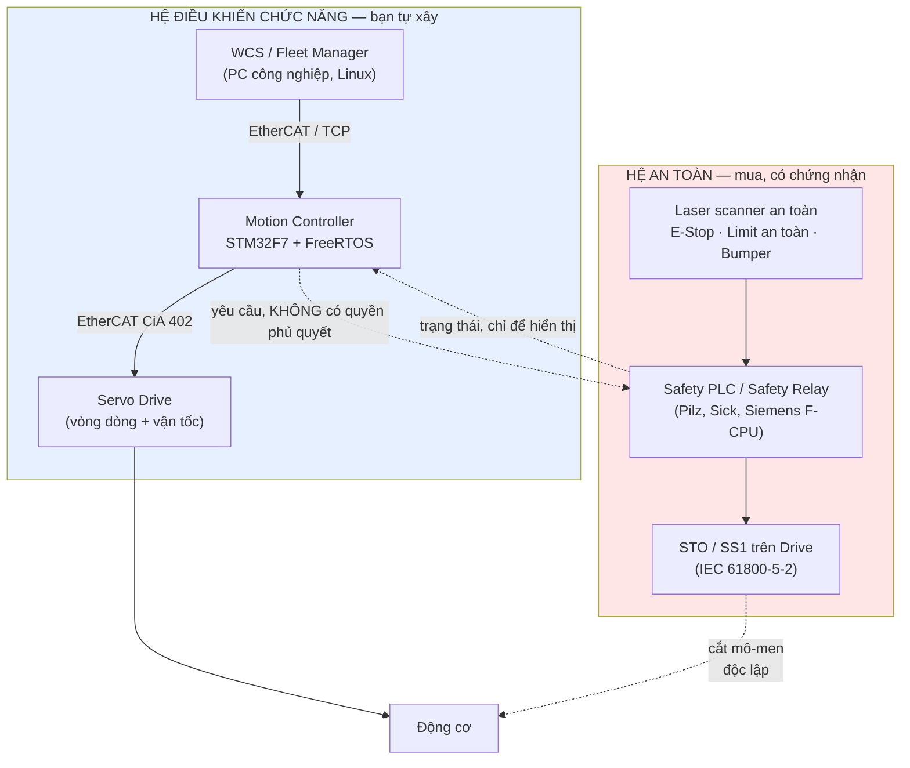
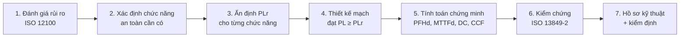
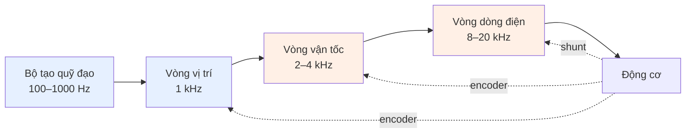
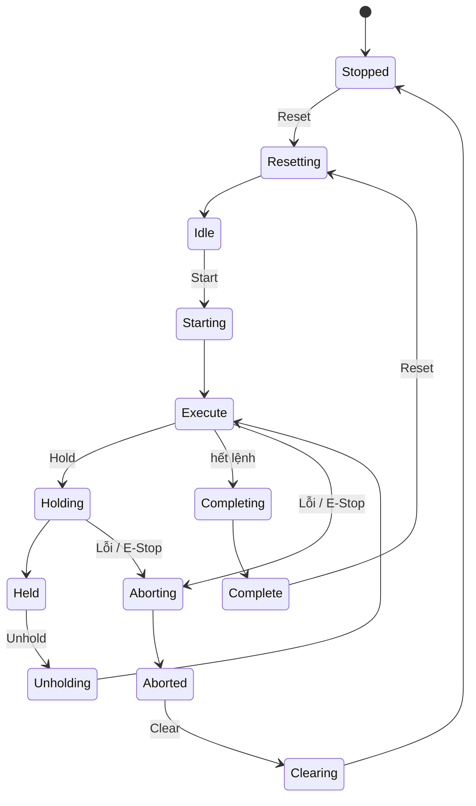

# Thiết kế hệ điều khiển thời gian thực — Kho tự động (AS/RS Crane + AGV)

> Tài liệu tư vấn kỹ thuật. Bối cảnh: **triển khai thật, có người làm việc quanh
> máy**, hướng **tự thiết kế bộ điều khiển trên STM32 + FreeRTOS**.
>
> **Liên quan:**
> - `integrate/iZiiApp_Ke_Hoach_Tich_Hop_LoRaWAN.md` — tầng cảm biến
> - `integrate/iZiiServer_Chien_Luoc_Tich_Hop_SAP_Wonderware.md` — khung ISA-95
>
> **Trạng thái:** Đề xuất kiến trúc. Mục 11 là các quyết định cần chốt trước khi
> mua bất cứ thứ gì.

---

## 0. Điều phải nói trước tiên

Bạn chọn tự thiết kế toàn bộ, và hệ thống sẽ chạy trong kho có người. Tôi sẽ
hướng dẫn bạn làm việc đó — nhưng có một ranh giới không được vượt, và nó quyết
định cấu trúc của toàn bộ phần còn lại:

> **Bạn có thể tự xây hệ điều khiển chức năng.**
> **Bạn không được tự xây hệ an toàn.**

Đây không phải lời khuyên thận trọng thừa, và cũng không phải "đừng làm". Đó là
cách ngành công nghiệp phân chia bài toán, và có lý do vật lý lẫn pháp lý rõ ràng:

**Về mặt kỹ thuật.** Một task FreeRTOS ưu tiên cao không phải là chức năng an
toàn. Nó chạy trên cùng con chip, cùng nguồn điện, cùng trình biên dịch với phần
code có thể gây ra sự cố. Một lỗi con trỏ, một stack overflow, một hỏng bit trong
RAM do nhiễu điện từ — tất cả đều làm chết cả hai. Chức năng an toàn đòi hỏi
**tính độc lập vật lý**: kênh riêng, nguồn riêng, khả năng cắt mô-men xoắn mà bộ
điều khiển chính không thể can thiệp.

**Về mặt pháp lý.** Máy nâng hạ trong kho có người là thiết bị có yêu cầu nghiêm
ngặt về an toàn lao động. Nếu xảy ra tai nạn với một hệ thống tự chế không có
đánh giá rủi ro, không có hồ sơ kiểm định, không có linh kiện được chứng nhận —
trách nhiệm thuộc về người thiết kế và người vận hành, và bảo hiểm gần như chắc
chắn từ chối chi trả.

**Điểm sai nguy hiểm nhất trong tài liệu bạn đính kèm** là câu này:

> *"Tín hiệu từ cảm biến an toàn được nối vào chân Ngắt ngoài của STM32. Khi kích
> hoạt, lập tức ngắt chân cấp xung Driver, dừng xe trong vòng dưới 2ms."*

Hai vấn đề:

1. **Dừng tín hiệu ≠ dừng xe.** Một AGV 500 kg chạy 1,5 m/s cần khoảng **1 mét**
   để dừng (tính ở mục 4.4). Con số 2 ms là độ trễ phần mềm, không phải quãng
   đường dừng. Người bị kẹp không quan tâm đến độ trễ ngắt.
2. **Ngắt GPIO không phải là mạch an toàn.** Nó là kênh đơn, không tự chẩn đoán,
   không phát hiện được đứt dây hay dính tiếp điểm. Chức năng dừng bảo vệ phải đi
   qua phần cứng an toàn có chứng nhận, đạt mức PL yêu cầu.

Phần còn lại của tài liệu chỉ cho bạn cách tách hai hệ này ra và làm tốt cả hai.

---

## 1. Kiến trúc nền tảng: hai hệ song song



Ba quy tắc bất di bất dịch của sơ đồ này:

| Quy tắc | Ý nghĩa thực tế |
|---|---|
| **Hệ an toàn không cần hệ chức năng để hoạt động** | Rút dây STM32 ra, E-Stop vẫn phải dừng được máy |
| **Hệ chức năng không thể vô hiệu hoá hệ an toàn** | Không có dòng code nào bỏ qua được STO |
| **Luồng thông tin một chiều ở chỗ quan trọng** | STM32 *đọc* trạng thái an toàn để hiển thị; nó không *cấp phép* an toàn |

### 1.1 Bạn tự làm gì, mua gì

| Thành phần | Tự làm? | Ghi chú |
|---|---|---|
| Bộ tạo quỹ đạo, S-curve, chống lắc | ✅ Tự làm | Đây là phần thú vị và tạo giá trị riêng |
| Vòng điều khiển vị trí | ✅ Tự làm | STM32F7 thừa sức |
| Vòng dòng / vận tốc | ⚠️ Nên dùng drive | Servo drive công nghiệp làm tốt hơn, rẻ hơn tự làm |
| WCS / điều phối đội / A* / CBS | ✅ Tự làm | Phần mềm thuần, không ràng buộc an toàn |
| Tích hợp với iZiiApp | ✅ Tự làm | Mục 7 |
| **Safety PLC / safety relay** | ❌ **Mua** | Phải có chứng nhận TÜV, kèm hồ sơ PL/SIL |
| **Laser scanner an toàn** | ❌ **Mua** | Loại "safety-rated", không phải LiDAR thường |
| **STO trên drive** | ❌ **Mua** | Chọn drive có sẵn STO đạt SIL 2/PL d |
| **Nút E-Stop, công tắc an toàn** | ❌ **Mua** | Loại có tiếp điểm cưỡng bức mở |

> **Lưu ý về LiDAR:** LiDAR dùng cho SLAM (như RPLIDAR, Velodyne) **không phải**
> thiết bị an toàn. AGV cần thêm một **safety laser scanner** riêng (SICK S300/
> microScan3, Omron OS32C, Datalogic...) — loại được chứng nhận, có vùng bảo vệ
> cấu hình được, đầu ra OSSD kép. Hai thiết bị, hai mục đích, không thay thế nhau.
> Đây là khoản chi phí mà các thiết kế tự chế hay bỏ sót rồi phải làm lại.

---

## 2. Khung tiêu chuẩn

### 2.1 Tiêu chuẩn áp dụng

| Tiêu chuẩn | Phiên bản hiện hành | Áp dụng cho |
|---|---|---|
| **ISO 12100** | 2010 | Đánh giá rủi ro — **làm đầu tiên, trước mọi thiết kế** |
| **ISO 3691-4** | **2023** | AGV / AMR / xe tự hành trong kho |
| **EN 528** | **2021+A1:2022** | Máy xếp/lấy hàng chạy ray (S/R machine = crane AS/RS của bạn) |
| **ISO 13849-1** | **2023** | Thiết kế phần điều khiển liên quan an toàn, thang PL a→e |
| **ISO 13849-2** | 2012 | Kiểm chứng (validation) — bắt buộc, không phải tuỳ chọn |
| **IEC 62061** | **2021 (+A1:2024)** | Con đường thay thế ISO 13849, thang SIL 1→3 |
| **IEC 61800-5-2** | — | Định nghĩa STO, SS1, SS2, SLS, SOS trên biến tần/servo |
| **ISO 13855** | 2010 | Tính khoảng cách đặt thiết bị bảo vệ theo tốc độ tiếp cận |
| **IEC 61784-3** | — | An toàn qua fieldbus: FSoE, PROFIsafe, CIP Safety |

> **Bối cảnh Việt Nam:** hệ thống TCVN phần lớn chấp nhận tương đương ISO/IEC.
> Thiết bị nâng thuộc danh mục có yêu cầu nghiêm ngặt về an toàn lao động, phải
> kiểm định trước khi đưa vào sử dụng. **Xác nhận với đơn vị kiểm định được chỉ
> định trước khi thiết kế**, không phải sau khi lắp xong — vì kết quả có thể buộc
> bạn đổi cả kiến trúc.

### 2.2 Quy trình bắt buộc, đúng thứ tự



Bước 1 quyết định tất cả. Nếu bỏ qua nó và bắt đầu bằng việc mua STM32, bạn sẽ
phải làm lại — đây là sai lầm phổ biến nhất và tốn kém nhất.

### 2.3 Xác định PLr — ví dụ thực tế

Theo ISO 13849-1, PLr suy ra từ ba yếu tố: **S** (mức độ thương tổn), **F** (tần
suất/thời gian phơi nhiễm), **P** (khả năng tránh được).

| Chức năng an toàn | S | F | P | PLr điển hình |
|---|---|---|---|---|
| Dừng khẩn cấp AGV | S2 | F2 | P2 | **PL d** |
| Dừng bảo vệ AGV khi có người trong vùng | S2 | F2 | P2 | **PL d** |
| Giới hạn tốc độ an toàn (SLS) khi vào khu có người | S2 | F2 | P1 | PL c–d |
| Chống rơi tải crane | S2 | F1 | P2 | **PL d** |
| Chống vượt hành trình crane (trục X, Y) | S2 | F1 | P2 | **PL d** |
| Ngăn khởi động bất ngờ khi bảo trì | S2 | F1 | P2 | **PL d** |
| Chống quá tải nĩa gắp | S1 | F2 | P2 | PL b–c |

> Bảng này là **minh hoạ để bạn hình dung mức độ**, không thay thế đánh giá rủi
> ro thật. S/F/P phụ thuộc vào bố trí kho, tốc độ, khối lượng tải và cách con
> người thực sự đi lại — những thứ chỉ khảo sát tại chỗ mới biết. PL d nghĩa là
> kiến trúc **Category 3** trở lên: hai kênh, có chẩn đoán, một lỗi đơn không được
> làm mất chức năng an toàn.

---

## 3. Phân tầng hệ thống và ranh giới với iZiiApp

Tài liệu SAP/Wonderware đã định vị iZiiServer ở **Level 3 (MES)**. Hệ điều khiển
này nằm ở Level 0–2. Ranh giới giữa chúng phải rõ ràng đến mức tàn nhẫn.

| Tầng | Thành phần | Chu kỳ | Hỏng thì sao? |
|---|---|---|---|
| **L3** | iZiiApp (FastAPI + SQLite/PG) | phút | Sàn vẫn chạy hết lệnh đang có rồi dừng sạch |
| **L2** | WCS / Fleet Manager | 100 ms – 1 s | Máy hoàn tất chuyển động hiện tại, về vị trí an toàn |
| **L1** | Motion Controller (STM32) | 1 ms | Drive kích SS1, dừng có kiểm soát |
| **L0** | Servo Drive + mạch an toàn | µs – 250 µs | STO cắt mô-men, phanh cơ khí giữ |
| **An toàn** | Safety PLC | 2–10 ms | Độc lập hoàn toàn, không phụ thuộc tầng nào ở trên |

### 3.1 Nguyên tắc vàng

> **iZiiApp không bao giờ nằm trong một vòng điều khiển.**

iZiiApp là **nguồn phát đơn hàng**, không phải bộ điều khiển. Nó nói *"chuyển
pallet P-4471 từ A-03-B-12 sang trạm xuất 2"*. Nó không bao giờ nói *"quay động
cơ trục X thêm 300 mm"*.

Ba hệ quả cụ thể:

1. **Mất mạng tới iZiiApp không được làm dừng sàn.** WCS phải có hàng đợi lệnh
   cục bộ, chạy tiếp ít nhất vài chục phút.
2. **Không có lệnh điều khiển nào đi qua HTTP/WebSocket của iZiiApp.** Kiến trúc
   hiện tại có `SyncService` với timeout 20–30 giây (`sync_service.dart`) — con số
   đó nói lên tất cả về việc đường truyền này không dành cho điều khiển.
3. **Đơn hàng phải idempotent.** Bạn đã có tiền lệ tốt: `OutboxMutations` với
   trạng thái `rejected` (bài học sự cố 409 ngày 15/08). Áp dụng đúng tư duy đó —
   mỗi transport order có ID duy nhất, gửi lại nhiều lần không tạo ra hai chuyến.

### 3.2 Bảng phân chia trách nhiệm

| Câu hỏi | Ai trả lời |
|---|---|
| Pallet nào cần chuyển, ưu tiên gì? | **iZiiApp (L3)** |
| Giao cho crane nào / AGV nào? | **WCS (L2)** |
| Đi đường nào, tránh nhau ra sao? | **WCS (L2)** |
| Quỹ đạo tăng/giảm tốc cụ thể? | **Motion Controller (L1)** |
| Dòng điện cấp cho cuộn dây bao nhiêu? | **Servo Drive (L0)** |
| Có được phép chuyển động không? | **Hệ an toàn (độc lập)** |

Giữ được bảng này sạch thì sau này đổi nhà cung cấp AGV, hoặc thay STM32 bằng
PLC, cũng không phải viết lại iZiiApp.

---

## 4. Tính tất định và phân tích lịch biểu

Đây là phần cốt lõi của "real-time" mà tài liệu đính kèm chưa chạm tới. **Thời
gian thực không có nghĩa là nhanh — nó có nghĩa là chứng minh được deadline.**

### 4.1 Ba loại ràng buộc thời gian

| Loại | Trễ deadline thì sao | Ví dụ trong hệ của bạn |
|---|---|---|
| **Hard** | Hỏng hệ thống / nguy hiểm | Vòng điều khiển vị trí, chu kỳ EtherCAT |
| **Firm** | Kết quả vô giá trị nhưng không nguy hiểm | Cập nhật quỹ đạo |
| **Soft** | Giảm chất lượng | Gửi trạng thái lên WCS, ghi log |

Sai lầm thường gặp: coi mọi thứ là hard real-time. Kết quả là hệ thống quá tải và
*không có gì* đạt deadline. Phân loại đúng cho phép hy sinh có chủ đích.

### 4.2 Tập task đề xuất cho một trục crane

STM32F767 @ 216 MHz, FreeRTOS, gán ưu tiên theo Rate Monotonic (chu kỳ ngắn hơn
→ ưu tiên cao hơn):

| # | Task | Chu kỳ T | WCET C | Deadline D | U = C/T |
|---|---|---|---|---|---|
| τ1 | ISR encoder + đồng bộ vòng dòng | 250 µs | 40 µs | 250 µs | 0,160 |
| τ2 | Xử lý PDO EtherCAT | 1 ms | 120 µs | 1 ms | 0,120 |
| τ3 | Vòng điều khiển vị trí | 1 ms | 180 µs | 1 ms | 0,180 |
| τ4 | Giám sát an toàn (bản sao mềm) | 5 ms | 300 µs | 5 ms | 0,060 |
| τ5 | Sinh quỹ đạo + input shaping | 10 ms | 800 µs | 10 ms | 0,080 |
| τ6 | Truyền thông với WCS | 50 ms | 2 000 µs | 50 ms | 0,040 |
| τ7 | Chẩn đoán, ghi log | 100 ms | 3 000 µs | 100 ms | 0,030 |
| | | | | **Tổng U** | **0,670** |

### 4.3 Kiểm tra khả năng lập lịch

**Bước 1 — Cận Liu & Layland (đủ, không cần thiết):**

Với n task, hệ khả lịch theo Rate Monotonic nếu:

$$U \le n\left(2^{1/n} - 1\right)$$

Với n = 7: $7(2^{1/7} - 1) = 7 \times 0{,}10409 = 0{,}7286$

$U = 0{,}670 < 0{,}7286$ → **khả lịch** ✓

Nhưng biên rất mỏng. Thêm một task 1 ms tốn 100 µs nữa là U = 0,770 > 0,7286 và
phép thử này thất bại. Lúc đó phải dùng phép thử chính xác.

**Bước 2 — Phân tích thời gian đáp ứng (chính xác):**

$$R_i = C_i + \sum_{j \in hp(i)} \left\lceil \frac{R_i}{T_j} \right\rceil C_j$$

Lặp đến khi hội tụ. Ví dụ với τ3 (vòng vị trí), các task ưu tiên cao hơn là τ1, τ2:

```
R⁰ = 180
R¹ = 180 + ⌈180/250⌉·40 + ⌈180/1000⌉·120 = 180 + 40 + 120 = 340
R² = 180 + ⌈340/250⌉·40 + ⌈340/1000⌉·120 = 180 + 80 + 120 = 380
R³ = 180 + ⌈380/250⌉·40 + ⌈380/1000⌉·120 = 180 + 80 + 120 = 380  ← hội tụ
```

**R₃ = 380 µs < D₃ = 1 000 µs** ✓ — dư 620 µs.

Với τ5 (sinh quỹ đạo, hp = τ1..τ4):

```
R⁰ = 800
R¹ = 800 + 4·40 + 1·120 + 1·180 + 1·300 = 1 560
R² = 800 + 7·40 + 2·120 + 2·180 + 1·300 = 1 980
R³ = 800 + 8·40 + 2·120 + 2·180 + 1·300 = 2 020
R⁴ = 800 + 9·40 + 3·120 + 3·180 + 1·300 = 2 360
R⁵ = 800 + 10·40 + 3·120 + 3·180 + 1·300 = 2 400
R⁶ = 800 + 10·40 + 3·120 + 3·180 + 1·300 = 2 400  ← hội tụ
```

**R₅ = 2 400 µs < D₅ = 10 000 µs** ✓

Chú ý kết quả này: WCET chỉ 800 µs nhưng thời gian đáp ứng là **2 400 µs — gấp 3
lần**, do bị các task ưu tiên cao chen ngang. Đây chính là lý do không thể chỉ nhìn
WCET mà kết luận. Trực giác "task này chạy 0,8 ms nên 10 ms là thừa" đúng ở đây,
nhưng sẽ sai trong hệ tải nặng hơn — và sai một cách âm thầm.

### 4.4 Quãng đường dừng — con số an toàn thật sự

$$d_{\text{stop}} = \underbrace{v \cdot t_{\text{phản ứng}}}_{\text{chưa phanh}} + \underbrace{\frac{v^2}{2a}}_{\text{đang phanh}}$$

Với AGV: v = 1,5 m/s, a = 1,5 m/s², t_phản ứng = 0,15 s (cảm biến + xử lý + nhả phanh):

$$d = 1{,}5 \times 0{,}15 + \frac{1{,}5^2}{2 \times 1{,}5} = 0{,}225 + 0{,}75 = \mathbf{0{,}975\ m}$$

**Đây mới là con số quyết định an toàn, không phải "2 ms".** Vùng bảo vệ của laser
scanner phải ≥ quãng đường này cộng các dung sai theo **ISO 13855** (sai số đo,
độ phân giải cảm biến, hao mòn phanh). Thực tế thường đặt vùng dừng ở 1,3–1,5 m
cho cấu hình trên.

Hệ quả thiết kế quan trọng: **muốn AGV chạy nhanh hơn thì vùng bảo vệ phải lớn
hơn theo bình phương vận tốc.** Chạy 3 m/s cần quãng đường dừng ~3,45 m — trong
lối đi kho hẹp là bất khả thi. Đây là lý do AGV công nghiệp trong khu có người
thường bị giới hạn 1–2 m/s, và dùng SLS để giảm tốc khi vào vùng đông người.

### 4.5 Nguồn gây jitter trên STM32F7 và cách trị

| Nguồn | Ảnh hưởng | Xử lý |
|---|---|---|
| Cache L1 (F7 có, F4 không) | Hit/miss chênh hàng chục chu kỳ | Đặt code và dữ liệu vòng điều khiển vào **TCM RAM** (không qua cache) |
| Flash wait state | Đọc lệnh chậm bất định | Bật ART Accelerator; hoặc chạy code nóng từ ITCM |
| Tranh chấp DMA | Chiếm bus, làm CPU chờ | Tách ma trận bus; DMA vào SRAM khác vùng CPU đang dùng |
| Trễ ngắt | Cortex-M7 ~12 chu kỳ, tail-chaining ~6 | Giữ ISR cực ngắn, đẩy việc sang task |
| `printf`, `malloc` | Không xác định, có thể hàng ms | **Cấm tuyệt đối trong đường real-time** |
| Đảo ngược ưu tiên | Task cao bị task thấp chặn vô hạn | Dùng **mutex** FreeRTOS (có kế thừa ưu tiên), **không dùng** binary semaphore để bảo vệ tài nguyên |

> **Về đảo ngược ưu tiên:** đây là lỗi đã suýt làm hỏng nhiệm vụ Mars Pathfinder
> năm 1997. Trong FreeRTOS, `xSemaphoreCreateMutex()` có kế thừa ưu tiên;
> `xSemaphoreCreateBinary()` thì **không**. Dùng nhầm loại thứ hai để bảo vệ tài
> nguyên dùng chung là một lỗi im lặng, chỉ lộ ra khi hệ tải nặng — nghĩa là lộ
> ra trong lúc vận hành thật, không phải lúc test.

### 4.6 Cấm trong đường real-time

```c
// ❌ TUYỆT ĐỐI KHÔNG trong task điều khiển
malloc() / free()          // thời gian không xác định, phân mảnh heap
printf() / sprintf()       // có thể tốn hàng ms, dùng buffer lớn
vTaskDelay() giữa vòng     // dùng vTaskDelayUntil() để giữ chu kỳ ổn định
double (F7 có FPU đơn)     // ép về float, hoặc dùng số nguyên/fixed-point
vòng lặp có số bước phụ thuộc dữ liệu   // WCET không chặn được

// ✅ Thay bằng
static buffer cấp phát sẵn tại khởi tạo
ghi log qua ring buffer + DMA, xử lý ở task ưu tiên thấp
vTaskDelayUntil(&xLastWake, pdMS_TO_TICKS(1))
arm_math.h (CMSIS-DSP) cho float32
```

### 4.7 Đo đạc — không tin lý thuyết suông

WCET tính toán trên giấy luôn lạc quan. Bắt buộc đo thật:

| Phương pháp | Dùng để | Ghi chú |
|---|---|---|
| Toggle GPIO + oscilloscope | Đo thời gian thực thi và jitter | Cách trung thực nhất, tốn 2 chu kỳ |
| DWT cycle counter | Đếm chu kỳ chính xác trong code | `DWT->CYCCNT`, không xâm lấn |
| `uxTaskGetStackHighWaterMark()` | Phát hiện sắp tràn stack | Chạy định kỳ ở task chẩn đoán |
| FreeRTOS run-time stats | Phân bổ CPU giữa các task | Bật `configGENERATE_RUN_TIME_STATS` |
| Trace (SEGGER SystemView / Tracealyzer) | Nhìn thấy toàn bộ lịch biểu | Đáng tiền, thấy được đảo ngược ưu tiên |

**Quy tắc ngân sách:** đo WCET thực tế, rồi **nhân 1,5–2** làm giá trị thiết kế.
Phần dư đó dành cho các trường hợp hiếm mà bạn chưa nghĩ ra — và luôn có.

---

## 5. Thuật toán điều khiển

### 5.1 Cấu trúc vòng lặp lồng nhau (cascade)



**Quy tắc chia tần số:** mỗi vòng ngoài phải chậm hơn vòng trong **ít nhất 5 lần**
về băng thông. Vi phạm quy tắc này là nguyên nhân số một của hiện tượng dao động
mà người mới hay đổ cho "PID chưa chỉnh đúng".

**Phân chia thực tế:**

| Vòng | Chạy ở đâu | Vì sao |
|---|---|---|
| Dòng điện | **Trong servo drive** | Cần 10–20 kHz, cần đo dòng chính xác, cần bảo vệ ngắn mạch. Tự làm không đáng |
| Vận tốc | **Trong servo drive** | Drive đã có, đã được nhà sản xuất chỉnh sẵn |
| Vị trí | **STM32 của bạn** | Đây là nơi bạn thêm giá trị |
| Quỹ đạo + chống lắc | **STM32 của bạn** | Phần hay nhất |

Nói cách khác: mua servo drive công nghiệp (Delta ASDA, Yaskawa Σ-7, Panasonic
A6) chạy chế độ **position mode** hoặc **velocity mode** qua EtherCAT/CANopen, và
STM32 gửi lệnh vị trí xuống mỗi 1 ms. Đừng tự viết vòng dòng — không có lợi ích
nào, chỉ có rủi ro cháy MOSFET và không đạt chứng nhận EMC.

### 5.2 Bộ tạo quỹ đạo S-curve 7 đoạn

Profile hình thang (trapezoid) có gia tốc nhảy bậc → **jerk vô hạn** → rung. S-curve
giới hạn jerk bằng cách chia chuyển động thành 7 đoạn:

```
        vận tốc
          │        ┌─────────────┐
          │       ╱               ╲
          │      ╱                 ╲
          │     ╱                   ╲
          └────┴──┴───────────┴──┴───┴──→ t
   đoạn:   1  2  3      4      5  6  7
           │  │  │      │      │  │  └─ jerk +J, giảm tốc về 0
           │  │  │      │      │  └──── gia tốc âm không đổi
           │  │  │      │      └─────── jerk −J, bắt đầu giảm tốc
           │  │  │      └────────────── vận tốc không đổi
           │  │  └───────────────────── jerk −J, gia tốc về 0
           │  └──────────────────────── gia tốc dương không đổi
           └─────────────────────────── jerk +J từ đứng yên
```

Ba tham số cần chỉnh, theo thứ tự ưu tiên:

| Tham số | Ý nghĩa | Giới hạn bởi |
|---|---|---|
| `v_max` | Vận tốc tối đa | Tốc độ định mức động cơ, an toàn |
| `a_max` | Gia tốc tối đa | Mô-men động cơ, ma sát bánh–ray, nguy cơ trượt |
| `j_max` | Jerk tối đa | **Độ cứng kết cấu — đây là tham số chống rung** |

Giảm `j_max` làm chuyển động mượt hơn nhưng chậm hơn. Đây là đánh đổi trực tiếp
giữa năng suất và rung lắc, và nó nên được đo bằng gia tốc kế gắn trên khung nâng,
không phải bằng cảm nhận.

### 5.3 Chống lắc tải — điểm mà tài liệu đính kèm bỏ sót

Đây là khác biệt lớn giữa "chạy được" và "chạy được ở tốc độ có ích".

**Phân biệt hai bài toán khác nhau:**

| Loại máy | Dao động chủ đạo | Tần số riêng |
|---|---|---|
| Cầu trục có cáp treo | Con lắc đơn | $\omega_n = \sqrt{g/L}$ — chỉ phụ thuộc chiều dài cáp |
| **Crane AS/RS (S/R machine)** | **Uốn cột (mast)** | **Thay đổi theo chiều cao khung nâng** |

Máy của bạn là loại thứ hai. Cột cao 10–20 m với khung nâng chạy dọc theo nó là
một dầm có khối lượng tập trung **di động**. Khi khung nâng lên cao, độ cứng hiệu
dụng tại vị trí khối lượng giảm mạnh, nên tần số riêng **giảm theo**.

Với mô hình công-xôn lý tưởng (cột chỉ ngàm ở chân), độ cứng tại điểm cách chân
một đoạn $x$ là $k_{eff} = 3EI/x^3$, nên $f_n \propto x^{-3/2}$ — nghĩa là tần số
có thể đổi **2–3 lần** trên toàn dải chiều cao. Cột thật thường có thêm ray dẫn
hướng ở đỉnh nên biến thiên nhẹ hơn, nhưng vẫn đủ lớn để một bộ tạo dạng chỉnh cho
một chiều cao trở nên vô dụng ở chiều cao khác.

**Kết luận thực hành: phải đo, không được suy đoán.** Công thức trên chỉ để bạn
hiểu vì sao tần số thay đổi và thay đổi theo hướng nào.

**Giải pháp: Input Shaping.** Thay vì lọc tín hiệu (làm chậm hệ), ta tách lệnh
thành nhiều xung đặt đúng thời điểm để dao động do xung sau **triệt tiêu** dao
động do xung trước.

Bộ ZV (Zero Vibration) — 2 xung:

$$K = e^{-\zeta\pi/\sqrt{1-\zeta^2}}, \quad T_d = \frac{2\pi}{\omega_n\sqrt{1-\zeta^2}}$$

$$A_1 = \frac{1}{1+K} \ \text{tại}\ t=0, \qquad A_2 = \frac{K}{1+K} \ \text{tại}\ t=\frac{T_d}{2}$$

Bộ ZVD (Zero Vibration and Derivative) — 3 xung, bền hơn với sai số tần số:

$$A_1 = \frac{1}{(1+K)^2},\quad A_2 = \frac{2K}{(1+K)^2},\quad A_3 = \frac{K^2}{(1+K)^2}$$

tại các thời điểm $0,\ T_d/2,\ T_d$.

**Ví dụ số.** Cột có $f_n = 1{,}2$ Hz ở vị trí khung nâng cao, $\zeta = 0{,}02$:

- $T_d \approx 1/1{,}2 = 0{,}833$ s
- ZV cộng thêm $T_d/2 = 0{,}42$ s vào mỗi chuyển động
- ZVD cộng thêm $T_d = 0{,}83$ s

Với 200 chuyển động có tạo dạng mỗi giờ, ZV cộng thêm **~1,4 phút mỗi giờ**, tức
**~11 phút mỗi ca 8 giờ**. Nếu mỗi chu kỳ lấy/cất có hai chuyển động cần tạo dạng
(trục X và trục Y), nhân đôi con số đó. Đây là chi phí thật, phải cân với lợi ích
hết rung — và cân bằng số liệu đo được, không bằng cảm tính.

**Chọn bộ nào:**

| Bộ | Dung sai sai số tần số | Trễ thêm | Khi nào dùng |
|---|---|---|---|
| ZV | ~±5% | $T_d/2$ | Khi biết chính xác $\omega_n$ |
| **ZVD** | **~±20%** | $T_d$ | **Khuyến nghị cho AS/RS** |
| EI | Rộng hơn nữa | $\approx T_d$ | Khi $\omega_n$ rất khó xác định |

**Khuyến nghị cụ thể cho crane của bạn:** dùng ZVD **kết hợp lập lịch theo chiều
cao** (gain scheduling). Bạn *biết* chiều cao khung nâng tại thời điểm phát lệnh
trục X, nên tra bảng $\omega_n(h)$ đã đo trước và tính lại hệ số shaper cho từng
chuyển động. Bảng này lập bằng thực nghiệm: gắn gia tốc kế lên khung nâng, kích
xung ở 5–7 mức chiều cao, đo phổ FFT.

> Lưu ý: input shaping là kỹ thuật **feedforward** — nó không sửa được nhiễu bên
> ngoài. Nó chỉ đảm bảo lệnh của *bạn* không kích thích dao động. Vẫn cần vòng
> phản hồi vị trí cho phần còn lại.

### 5.4 PID rời rạc — dạng vi phân (velocity form)

Dùng dạng vi phân thay vì dạng vị trí, vì nó tự chống bão hoà tích phân
(anti-windup) và cho phép chuyển chế độ không giật (bumpless):

$$\Delta u(k) = K_p\big[e(k)-e(k-1)\big] + K_i T_s\, e(k) + \frac{K_d}{T_s}\big[e(k)-2e(k-1)+e(k-2)\big]$$

$$u(k) = \text{sat}\big(u(k-1) + \Delta u(k)\big)$$

```c
// Vòng vị trí, chạy mỗi 1 ms. Tất cả float32 — F7 có FPU đơn.
typedef struct {
    float kp, ki, kd, ts;
    float e1, e2;          // e(k-1), e(k-2)
    float u;               // đầu ra tích luỹ
    float u_min, u_max;
} pid_t;

static inline float pid_step(pid_t *p, float sp, float pv) {
    const float e  = sp - pv;
    const float du = p->kp * (e - p->e1)
                   + p->ki * p->ts * e
                   + p->kd / p->ts * (e - 2.0f * p->e1 + p->e2);
    p->u += du;
    // Bão hoà TRƯỚC khi lưu trạng thái — đây chính là chống windup
    if (p->u > p->u_max) p->u = p->u_max;
    if (p->u < p->u_min) p->u = p->u_min;
    p->e2 = p->e1;
    p->e1 = e;
    return p->u;
}
```

**Vì sao dạng này chống windup:** vì `p->u` bị kẹp *trước khi* được dùng làm cơ sở
cho bước sau, thành phần tích phân không thể tích luỹ vô hạn trong lúc cơ cấu chấp
hành đã bão hoà. Ở dạng vị trí thông thường, bạn phải viết logic anti-windup riêng
và rất dễ viết sai.

### 5.5 Feedforward — thứ tạo khác biệt lớn nhất

Với vòng vị trí chỉ có P, sai số bám ở trạng thái xác lập là:

$$e_{ss} = \frac{v}{K_v}$$

Chạy 1 m/s với $K_v = 20\ \text{s}^{-1}$ → sai số **50 mm**. Không chấp nhận được
khi cần đưa nĩa vào ô kho.

Thêm feedforward vận tốc và gia tốc:

$$u = \underbrace{K_p e + K_i\!\int\! e + K_d \dot{e}}_{\text{phản hồi}} + \underbrace{K_{vff}\, v_{ref} + K_{aff}\, a_{ref}}_{\text{tiến}}$$

Vì bộ tạo quỹ đạo **biết trước** $v_{ref}$ và $a_{ref}$ (nó vừa tính ra chúng),
feedforward gần như miễn phí về mặt tính toán và có thể giảm sai số bám xuống
**một bậc độ lớn**. Đây là cải tiến đáng giá nhất cho công sức bỏ ra trong toàn bộ
phần điều khiển — và tài liệu đính kèm không nhắc đến.

### 5.6 AGV — động học và bám đường

**Động học vi sai (differential drive):**

$$v_L = v - \frac{\omega b}{2}, \qquad v_R = v + \frac{\omega b}{2}$$

với $b$ = khoảng cách hai bánh chủ động. Nghịch đảo:

$$v = \frac{v_R + v_L}{2}, \qquad \omega = \frac{v_R - v_L}{b}$$

**Bám đường bằng Pure Pursuit:** chọn điểm đích cách xe khoảng $L_d$ (lookahead)
trên đường dẫn, tính độ cong cần thiết:

$$\kappa = \frac{2 y}{L_d^2}, \qquad \omega = v\kappa$$

với $y$ = độ lệch ngang của điểm đích trong hệ toạ độ xe.

$L_d$ là tham số chỉnh chính: nhỏ quá → xe lắc lư; lớn quá → cắt cua. Thực tế cho
$L_d$ tỉ lệ với vận tốc: $L_d = \max(L_{min},\ k v)$.

**Vấn đề trôi odometry.** Odometry từ encoder trôi khoảng **1–3% quãng đường**.
Sau 100 m là sai 1–3 m — vô dụng. Bắt buộc có nguồn hiệu chỉnh tuyệt đối:

| Phương pháp | Độ chính xác | Chi phí | Nhận xét |
|---|---|---|---|
| Băng từ dọc đường | ±5 mm ngang | Thấp | Ổn định, nhưng đường đi cố định |
| Mã QR/DataMatrix dán sàn | ±5–10 mm | Thấp | Rất phổ biến trong kho; cần camera hướng xuống |
| Phản quang + laser định vị | ±5 mm | Trung bình | Chuẩn công nghiệp; cần gắn phản quang quanh kho |
| SLAM bằng LiDAR | ±20–50 mm | Trung bình | Linh hoạt nhất; kém ổn định trong kho trống trải, nhiều hàng giống nhau |

> **Cảnh báo về SLAM trong kho:** kho hàng là môi trường **khó** cho SLAM vì các
> dãy kệ trông giống hệt nhau và bố cục thay đổi khi hàng vào/ra. Nhiều dự án chọn
> SLAM vì nghe hiện đại rồi phải bổ sung mã QR sàn sau đó. Nếu tuyến đường cố định,
> băng từ hoặc QR sàn là lựa chọn kỹ thuật đúng, không phải lựa chọn "rẻ tiền".

---

## 6. Truyền thông

### 6.1 Chọn giao thức theo tầng

| Tuyến | Giao thức đề xuất | Chu kỳ | Tất định? |
|---|---|---|---|
| Drive ↔ Motion Controller | **EtherCAT (CiA 402)** | 250 µs – 1 ms | ✅ Có, jitter < 1 µs với DC |
| Drive ↔ Motion Controller (rẻ hơn) | CANopen (CiA 402) | 1–10 ms | ✅ Có, nhưng giới hạn ~10 trục |
| Cảm biến an toàn ↔ Safety PLC | Dây cứng hoặc **FSoE / PROFIsafe** | 2–10 ms | ✅ Có, đạt SIL |
| Motion Controller ↔ WCS | Modbus TCP / OPC UA | 50–100 ms | ❌ Không — chỉ giám sát |
| AGV ↔ WCS | Wi-Fi + MQTT | 100–500 ms | ❌ **Không bao giờ tất định** |
| WCS ↔ iZiiApp | REST / MQTT | giây | ❌ Không cần |

### 6.2 Vì sao Wi-Fi không bao giờ nằm trong vòng an toàn

Wi-Fi có thể mất gói, trễ hàng trăm ms khi nhiễu, và roaming giữa các AP có thể
gây gián đoạn cả giây. Hệ quả bắt buộc:

> **Mọi chức năng an toàn của AGV phải chạy hoàn toàn trên xe.**

Wi-Fi chỉ dùng để: nhận nhiệm vụ, báo trạng thái, phối hợp giao thông (mức tư
vấn). Nếu mất kết nối, AGV phải tự xử lý theo ISO 3691-4: hoàn tất chuyển động
hiện tại rồi dừng an toàn trong khoảng thời gian đã định trước — chứ không phải
chạy tiếp chờ lệnh.

Điều này cũng có nghĩa: **tránh va chạm giữa các AGV không được phụ thuộc vào
server.** Server làm điều phối *tối ưu* (chia làn, đặt chỗ giao lộ); còn việc
không đâm vào nhau là trách nhiệm của laser scanner trên từng xe, hoạt động độc lập.

### 6.3 An toàn qua fieldbus — nguyên lý "kênh đen"

FSoE (Safety over EtherCAT), PROFIsafe, CIP Safety đều dùng chung ý tưởng: dữ liệu
an toàn được đóng gói với CRC, số thứ tự và nhãn thời gian, rồi gửi qua mạng
**thường** (không cần mạng an toàn riêng). Mạng chỉ là "kênh đen" — nó có thể làm
hỏng, mất, hoặc đảo thứ tự gói, và giao thức an toàn ở hai đầu vẫn phát hiện được.

Lợi ích thực tế: bạn chạy một sợi cáp EtherCAT duy nhất cho cả điều khiển lẫn an
toàn, thay vì kéo song song hai hệ thống dây.

### 6.4 Đồng bộ thời gian

Với nhiều trục phối hợp (crane 3 trục phải chuyển động đồng thời), lệch pha giữa
các trục gây sai lệch quỹ đạo. Cần:

- **EtherCAT Distributed Clocks**: đồng bộ < 1 µs giữa các slave. Đây là lý do
  chính để chọn EtherCAT thay vì CANopen khi cần nội suy nhiều trục.
- **IEEE 1588 PTP**: đồng bộ giữa các PC/controller, độ chính xác µs.
- **NTP**: chỉ đủ cho ghi log và iZiiApp, sai số ms — không dùng cho điều khiển.

### 6.5 Nối vào iZiiApp

Kiến trúc iZiiApp hiện có (`server/event_engine.py`, `server/routers/webhooks.py`)
đã sẵn cho việc này. Đề xuất giao diện:

```
iZiiApp  ──POST /wcs/transport-orders──▶  WCS
         ◀──webhook /iot/order-status──   WCS
```

**Lược đồ transport order:**

```json
{
  "order_id": "uuid-v4",
  "idempotency_key": "uuid-v4",
  "priority": 5,
  "source_location_code": "WH1-A-03-B-12",
  "dest_location_code": "WH1-OUT-02",
  "product_id": "uuid",
  "quantity": 1,
  "deadline": "2026-08-18T14:30:00+07:00",
  "created_by": "izii.supply_chain"
}
```

**Bốn quy tắc giao diện:**

1. **Idempotent.** Gửi lại cùng `idempotency_key` trả về đúng đơn cũ, không tạo
   chuyến thứ hai. Đây là bài học đã có trong `OutboxMutations` của bạn.
2. **WCS sở hữu trạng thái thực thi.** iZiiApp không được ghi đè trạng thái đơn
   đang chạy — nó chỉ được **yêu cầu huỷ**, và WCS quyết định có huỷ được không
   (đang giữa hành trình nâng thì không).
3. **Đối soát định kỳ.** Mỗi 30 giây, WCS gửi bản tóm tắt trạng thái toàn bộ đơn
   đang mở. iZiiApp so với bản ghi của mình và sửa lệch. Không tin vào việc mọi
   webhook đều tới nơi.
4. **`stock_moves` chỉ chuyển `done` khi WCS xác nhận hoàn tất vật lý.** Trùng với
   nguyên tắc đã thống nhất ở tài liệu LoRaWAN: cảm biến và máy móc sinh `draft`,
   sự kiện hoàn tất thật mới cho `done`.

---

## 7. Máy trạng thái vận hành (theo PackML / ISA-88)

Đừng tự nghĩ ra tập trạng thái. PackML đã chuẩn hoá và mọi kỹ sư tự động hoá đều
đọc hiểu ngay:



Ba chế độ vận hành, tách biệt rõ:

| Chế độ | Ai dùng | Ràng buộc an toàn |
|---|---|---|
| **Production** | Tự động, không người trong vùng | Tốc độ đầy đủ |
| **Maintenance** | Kỹ thuật viên, có người trong vùng | Bắt buộc SLS + công tắc cho phép (enabling device) |
| **Manual** | Chỉnh máy | Chuyển động nhấp (jog), phải giữ nút |

> **Chế độ Maintenance là nơi tai nạn thường xảy ra**, vì đó là lúc người vào
> trong vùng máy với hàng rào đã mở. ISO 3691-4 và EN 528 đều có yêu cầu riêng cho
> chế độ này: tốc độ giới hạn an toàn, thiết bị cho phép ba vị trí, và không được
> có cách nào chạy tốc độ đầy đủ khi cửa đang mở.

---

## 8. Lộ trình triển khai

### Giai đoạn 0 — Trước khi mua bất cứ thứ gì (2–4 tuần)

| # | Việc | Đầu ra |
|---|---|---|
| 1 | Đánh giá rủi ro theo ISO 12100 | Danh mục mối nguy, có người thứ hai phản biện |
| 2 | Xác định chức năng an toàn + PLr | Bảng như mục 2.3, nhưng của kho thật |
| 3 | Liên hệ đơn vị kiểm định | Biết trước hồ sơ họ sẽ đòi |
| 4 | Chốt kiến trúc an toàn | Sơ đồ mạch an toàn, danh mục thiết bị có chứng nhận |

**Không viết dòng code nào ở giai đoạn này.** Cám dỗ sẽ rất lớn — bạn biết lập
trình, và mua một con STM32 về nhấp nháy LED thì vui hơn nhiều so với đọc ISO
12100. Nhưng thứ tự này tồn tại vì kết quả bước 1–2 có thể buộc đổi cả kiến trúc,
và code viết trước đó sẽ phải bỏ.

### Giai đoạn 1 — Một trục, trên bàn (4–6 tuần)

- Một servo drive + động cơ nhỏ, gắn cứng lên bàn thí nghiệm.
- FreeRTOS trên STM32F7, tập task như mục 4.2 nhưng rút gọn.
- **Đo WCET thực tế bằng GPIO + oscilloscope**, đối chiếu với tính toán mục 4.3.
- Vòng vị trí + S-curve + feedforward.
- Mạch an toàn thật: E-Stop → safety relay → STO trên drive. Thử rút dây STM32
  giữa lúc đang chạy, xác nhận STO vẫn cắt.

Tiêu chí hoàn thành: **rút nguồn STM32 bất kỳ lúc nào, trục vẫn dừng an toàn.**

### Giai đoạn 2 — Crane thu nhỏ, 3 trục (8–12 tuần)

- Phối hợp 3 trục qua EtherCAT với Distributed Clocks.
- Đo tần số riêng của cột theo chiều cao (gia tốc kế + FFT).
- Lập bảng $\omega_n(h)$, triển khai ZVD có lập lịch theo chiều cao.
- Máy trạng thái PackML đầy đủ.
- Giao diện WCS, chưa nối iZiiApp.

### Giai đoạn 3 — AGV đơn chiếc (8–12 tuần)

- Động học vi sai + pure pursuit trên tuyến cố định.
- **Safety laser scanner thật**, cấu hình vùng bảo vệ theo tính toán mục 4.4.
- Đo quãng đường dừng thực tế ở các mức tải và vận tốc — **so với tính toán**.
- Hiệu chỉnh vị trí bằng QR sàn hoặc băng từ.

### Giai đoạn 4 — Đội xe + tích hợp iZiiApp (12+ tuần)

- Fleet manager, A*/CBS, đặt chỗ giao lộ.
- Giao diện transport order với iZiiApp.
- Đối soát trạng thái định kỳ.

### Giai đoạn 5 — Nghiệm thu

- Kiểm chứng an toàn theo **ISO 13849-2**: tiêm lỗi từng kênh, xác nhận chức năng
  an toàn vẫn giữ.
- FAT (nghiệm thu tại xưởng) → SAT (nghiệm thu tại hiện trường).
- Hồ sơ kỹ thuật, hướng dẫn vận hành, đào tạo người dùng.
- Kiểm định của cơ quan có thẩm quyền.

---

## 9. Kiểm thử

| Mức | Cách làm | Bắt gặp lỗi gì |
|---|---|---|
| Đơn vị (host) | Biên dịch thuật toán điều khiển trên PC, test bằng dữ liệu tổng hợp | Sai công thức, sai dấu, tràn số |
| Mô phỏng | Mô hình cơ khí bằng Python/Simulink, chạy cùng code điều khiển thật | Chỉnh sai tham số, bất ổn định |
| HIL | STM32 thật nối vào mô hình cơ khí chạy real-time | Lỗi timing, lỗi fieldbus |
| Tải nặng | Chạy đủ task + tiêm nhiễu, đo jitter | Đảo ngược ưu tiên, tràn stack, trượt deadline |
| Tiêm lỗi | Rút dây, ngắt nguồn, kẹt cảm biến, gửi gói hỏng | Xử lý lỗi thiếu, trạng thái không an toàn |
| An toàn | Theo ISO 13849-2, có nhân chứng | Thiếu sót trong mạch an toàn |

**Bài kiểm tra tôi khuyên làm sớm và làm thường xuyên:** đang chạy tốc độ cao, đột
ngột rút cáp EtherCAT. Hệ phải phát hiện mất gói trong vài chu kỳ và kích SS1.
Nếu nó chạy tiếp bằng giá trị lệnh cuối cùng, bạn có một lỗi nghiêm trọng — và đó
là chế độ hỏng phổ biến của các hệ tự viết.

---

## 10. Sai lầm thường gặp

| Sai lầm | Hậu quả | Phòng tránh |
|---|---|---|
| Coi task FreeRTOS ưu tiên cao là chức năng an toàn | Không đạt chứng nhận; nguy hiểm thật | Mục 1 |
| Dùng LiDAR SLAM làm cảm biến an toàn | Không phát hiện được người tin cậy | Mua safety scanner riêng |
| Nhầm "độ trễ ngắt" với "quãng đường dừng" | Vùng bảo vệ quá ngắn | Mục 4.4 |
| Đặt vòng dòng trên STM32 tự viết | Tốn công, rủi ro, không lợi ích | Mua servo drive |
| Bỏ qua feedforward | Sai số bám hàng chục mm | Mục 5.5 |
| Chỉnh input shaping cho một chiều cao | Rung ở các chiều cao khác | ZVD + lập lịch theo chiều cao |
| `printf` trong task điều khiển | Jitter hàng ms, trượt deadline | Ring buffer + DMA |
| `xSemaphoreCreateBinary` bảo vệ tài nguyên | Đảo ngược ưu tiên, treo ngẫu nhiên | Dùng mutex |
| Để iZiiApp trong vòng điều khiển | Mất mạng là dừng sàn | Mục 3.1 |
| Tin odometry không hiệu chỉnh | Trôi 1–3% quãng đường | Mã QR sàn / băng từ |
| Viết code trước khi đánh giá rủi ro | Phải làm lại kiến trúc | Giai đoạn 0 |

---

## 11. Quyết định cần chốt

| # | Câu hỏi | Vì sao quan trọng |
|---|---|---|
| 1 | Kho có người đi lại chung khu với máy, hay tách hàng rào hoàn toàn? | Quyết định toàn bộ mức PLr và chi phí an toàn |
| 2 | Tốc độ và tải mục tiêu của AGV? | Quyết định quãng đường dừng → bề rộng lối đi |
| 3 | Chiều cao và số trục của crane? | Quyết định độ phức tạp chống lắc |
| 4 | Đơn vị kiểm định nào, yêu cầu hồ sơ gì? | Biết trước tránh làm lại |
| 5 | Ai bảo trì hệ thống sau 3 năm? | Nếu không có người đọc được code của bạn, tự chế là rủi ro dài hạn |
| 6 | Ngân sách cho phần an toàn (thường 15–25% tổng)? | Nếu cắt khoản này, dự án không nên bắt đầu |
| 7 | Tuyến AGV cố định hay tự do? | Quyết định băng từ/QR vs SLAM |

**Câu số 5 đáng suy nghĩ kỹ.** Một hệ tự thiết kế chỉ có bạn hiểu là một rủi ro
vận hành thật, tách rời khỏi chất lượng kỹ thuật. Nếu kho phải dừng vì bạn đi
vắng, giá trị của hệ thống giảm mạnh. Cách giảm thiểu: tài liệu hoá nghiêm túc,
dùng linh kiện phổ thông có thể mua thay thế, và giữ phần an toàn hoàn toàn bằng
thiết bị thương mại tiêu chuẩn để bất kỳ kỹ sư tự động hoá nào cũng bảo trì được.

---

## 12. Tài liệu nên đọc theo thứ tự

1. **ISO 12100** — đánh giá rủi ro. Đọc trước tiên, không có ngoại lệ.
2. **ISO 3691-4:2023** — nếu làm AGV.
3. **EN 528:2021+A1:2022** — nếu làm crane AS/RS.
4. **ISO 13849-1:2023** — thiết kế phần điều khiển an toàn.
5. *Hard Real-Time Computing Systems* — Buttazzo. Sách chuẩn về lập lịch real-time,
   phần RMA/EDF/RTA ở mục 4 lấy từ đây.
6. Tài liệu **CiA 402** — hồ sơ drive, cần khi ghép EtherCAT/CANopen.
7. Tài liệu ứng dụng của hãng safety PLC bạn chọn (Pilz và SICK có tài liệu
   hướng dẫn thiết kế rất tốt và miễn phí).

---

## Phụ lục A — Những gì đã được kiểm chứng

Mọi con số trong tài liệu này được chia làm ba loại. Bạn nên đối xử với chúng khác nhau.

### A.1 Đã kiểm chứng bằng tính toán

Chạy lại bằng script Python độc lập, không dựa vào tính nhẩm:

| Mục | Kết quả | Trạng thái |
|---|---|---|
| 4.3 Tổng utilization $U$ | 0,6700 | ✅ Đúng |
| 4.3 Cận Liu & Layland, n=7 | 0,72863 | ✅ Đúng — $U$ đạt, biên dư 0,0586 |
| 4.3 RTA của τ3 (vòng vị trí) | $R = 380$ µs | ✅ Hội tụ sau 3 vòng lặp |
| 4.3 RTA của τ5 (sinh quỹ đạo) | $R = 2400$ µs | ✅ Hội tụ sau 6 vòng lặp, gấp **đúng 3,00 lần** WCET |
| 4.4 Quãng đường dừng @1,5 m/s | 0,975 m | ✅ (phản ứng 0,225 + phanh 0,750) |
| 4.4 Quãng đường dừng @3,0 m/s | 3,450 m | ✅ Xác nhận quan hệ bình phương vận tốc |
| 5.3 Hệ số ZV ($f_n$=1,2 Hz, $\zeta$=0,02) | $A_1$=0,5157, $A_2$=0,4843 | ✅ Tổng = 1,0000 |
| 5.3 Hệ số ZVD | 0,2660 / 0,4995 / 0,2345 | ✅ Tổng = 1,0000 |
| 5.3 $T_d$ | 0,8335 s | ✅ |
| 5.5 Sai số bám $e_{ss} = v/K_v$ | 50 mm @ 1 m/s, $K_v$=20 | ✅ |

> **Một lỗi đã phát hiện và sửa trong quá trình kiểm chứng:** bản nháp đầu ghi
> ZV làm mất *"~23 phút mỗi ca"*. Con số đúng là **~11 phút mỗi ca** (200 chuyển
> động/giờ × 0,417 s × 8 giờ ÷ 60). Tôi ghi lại đây vì nó minh hoạ đúng thông
> điệp của mục 4.7: **đừng tin tính nhẩm, kể cả của người tư vấn.**

### A.2 Đã kiểm chứng bằng nguồn chính thức

| Tiêu chuẩn | Phiên bản xác nhận | Nguồn |
|---|---|---|
| ISO 3691-4 | **2023** (thay thế 2020; đang có dự thảo mới) | iso.org |
| EN 528 | **2021+A1:2022** | CEN / BSI |
| ISO 13849-1 | **2023** (bổ sung hướng dẫn Category 2) | iso.org |
| IEC 62061 | **2021 + A1:2024** (Ed. 2, thay bản 2005) | IEC |
| SIL cho máy móc | SIL 1–3; **SIL 4 không áp dụng** | IEC 62061 |

### A.3 Ước lượng — phải đo lại tại hiện trường

Những con số dưới đây tôi đưa ra để bạn có điểm khởi đầu. **Không con số nào
trong nhóm này được dùng làm cơ sở thiết kế cuối cùng:**

| Con số | Vì sao chỉ là ước lượng |
|---|---|
| Toàn bộ cột WCET ở mục 4.2 | Phụ thuộc code thật, trình biên dịch, mức tối ưu. **Bắt buộc đo bằng GPIO + oscilloscope** |
| $t_{\text{phản ứng}}$ = 0,15 s | Phụ thuộc cảm biến, thời gian nhả phanh, độ hao mòn |
| $a$ = 1,5 m/s² | Phụ thuộc ma sát bánh–sàn, tải, tình trạng sàn |
| $f_n$ = 1,2 Hz của cột | **Phải đo bằng gia tốc kế + FFT ở nhiều chiều cao** |
| $\zeta$ = 0,02 | Hệ số tắt dần kết cấu, chỉ đo mới biết |
| Dung sai ZV ±5%, ZVD ±20% | Giá trị thường trích dẫn cho ngưỡng rung 5%; phụ thuộc định nghĩa ngưỡng |
| Trôi odometry 1–3% | Phụ thuộc bánh xe, sàn, tải |
| Bảng PLr ở mục 2.3 | **Minh hoạ mức độ, không thay thế đánh giá rủi ro thật** |
| Thời lượng các giai đoạn ở mục 8 | Phụ thuộc kinh nghiệm và mức độ toàn thời gian |

### A.4 Điều tôi không thể xác minh giúp bạn

- **Yêu cầu pháp lý cụ thể tại Việt Nam** cho thiết bị nâng trong kho: danh mục
  kiểm định, hồ sơ, đơn vị được chỉ định. Phải hỏi trực tiếp cơ quan quản lý an
  toàn lao động — và hỏi **trước** giai đoạn 1, không phải sau.
- **Liệu tự thiết kế có được chấp nhận kiểm định hay không** trong trường hợp cụ
  thể của bạn. Đây là câu hỏi số 4 ở mục 11 và nó có thể thay đổi toàn bộ kế hoạch.
- Tôi không phải luật sư và không phải kỹ sư an toàn được chứng nhận. Tài liệu này
  là tư vấn kỹ thuật, **không phải hồ sơ tuân thủ**.

