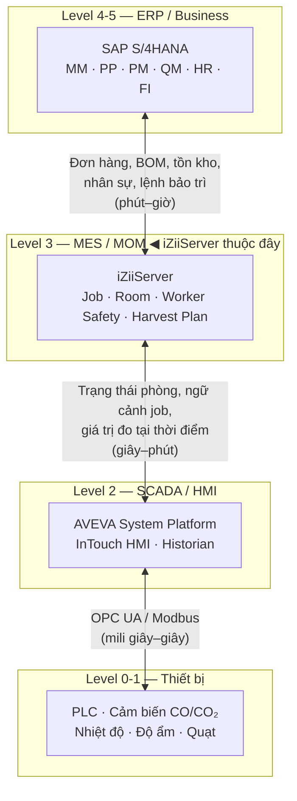
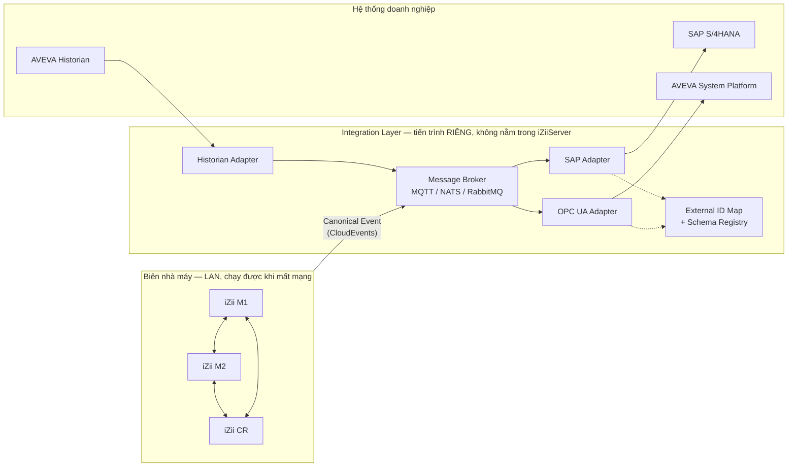
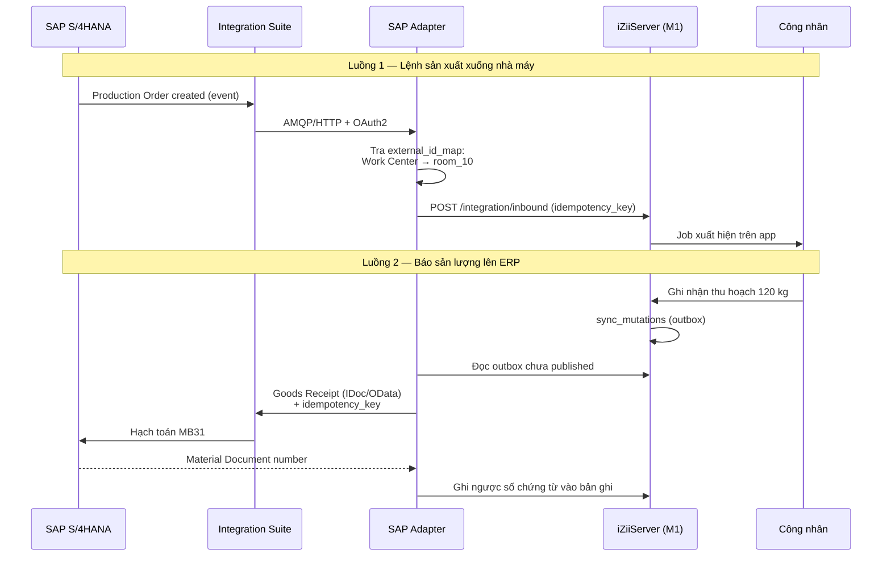

# iZiiServer — Chiến lược mở rộng & tích hợp SAP / AVEVA Wonderware

> Tài liệu tư vấn kiến trúc. Mọi khuyến nghị đều neo vào mã nguồn hiện tại của
> `izii_app/server/` và `izii_app/lib/`.

---

## 1. Định vị: iZiiServer đã là một MES, chỉ là chưa gọi tên

Đây là quyết định quan trọng nhất, và tin tốt là bạn không phải xây lại từ đầu.

Theo chuẩn **ISA-95**, một nhà máy có 5 tầng. Nhìn vào chức năng iZiiApp đang làm
— điều phối Job theo Room, quản lý ca kíp và an toàn lao động (Alone Worker),
kế hoạch thu hoạch, theo dõi tiến độ phòng trồng — thì nó **đang nằm đúng
Level 3 (MES/MOM)**. Không phải SCADA, cũng không phải ERP.



**Vì sao điều này quan trọng:** khi bạn nói chuyện với đội SAP và đội Automation
của công ty lớn, họ sẽ hỏi ngay "hệ thống của anh nằm ở tầng nào". Trả lời được
"Level 3 MES, tuân theo ISA-95, trao đổi với L4 bằng B2MML/OData và với L2 bằng
OPC UA" sẽ rút ngắn hàng tháng thảo luận. Nói "app quản lý công việc của tôi
muốn đọc dữ liệu SAP" thì gần như chắc chắn bị từ chối.

**Điểm mạnh sẵn có mà bạn nên giữ:** kiến trúc mesh nhiều server theo zone với
đồng bộ ngoại tuyến (`app.py:_peer_sync_loop`) là **đúng chất edge-first** — đây
chính là thứ các MES thương mại phải vật lộn mới có. Nhà máy nấm mất mạng thì
M1/M2/CR vẫn chạy độc lập. Giữ nguyên triết lý này.

---

## 2. Ma trận System-of-Record — làm trước khi viết dòng code tích hợp nào

Nguyên nhân số một khiến dự án tích hợp MES–ERP thất bại: **hai hệ thống cùng
tưởng mình sở hữu một thực thể**. Phải chốt bảng này với đội SAP trên giấy trước.

| Thực thể | Chủ sở hữu | iZii được làm gì | Ghi chú kỹ thuật |
|---|---|---|---|
| Nhân viên, phòng ban, chức danh | **SAP HR** | Chỉ đọc (replica) | `mushroom_employees` chuyển thành cache, thêm cột `sap_pernr` |
| Vật tư, giá thể, hoá chất | **SAP MM** | Chỉ đọc + báo cáo tiêu hao | Prochloraz, phân bón → `MATNR` |
| Phòng trồng (Grow Room) | **Cả hai** | iZii sở hữu trạng thái vận hành; SAP sở hữu định danh tài sản | Map `room_10` ↔ Functional Location / Work Center |
| Chu kỳ trồng (Batch/Cycle) | **SAP PP** | iZii thực thi, báo tiến độ | Production Order → iZii Cycle |
| Job/Task hằng ngày | **iZii** | Sở hữu hoàn toàn | SAP không cần biết chi tiết watering từng phòng |
| Alone Worker / an toàn LĐ | **iZii** | Sở hữu hoàn toàn | Có thể đẩy sự cố sang SAP EHS nếu công ty dùng |
| Sản lượng thu hoạch | **iZii tạo → SAP chốt** | Ghi nhận, SAP hạch toán | Goods Receipt qua IDoc/OData |
| Phiếu bảo trì | **SAP PM** | Tạo notification, không tự đóng | `mushroom_maintenance_tickets` → PM Notification |
| Giá trị cảm biến | **AVEVA Historian** | Chỉ đọc, **không sao chép** | Xem mục 5 |

**Quy tắc vàng:** thực thể nào SAP sở hữu thì iZii **không được sinh ID**. Luôn
lưu khoá ngoại của hệ thống nguồn. Thêm ngay một bảng ánh xạ:

```sql
CREATE TABLE external_id_map (
    local_type      TEXT NOT NULL,   -- 'room' | 'employee' | 'material'
    local_id        TEXT NOT NULL,   -- 'room_10'
    system          TEXT NOT NULL,   -- 'SAP' | 'AVEVA'
    external_type   TEXT NOT NULL,   -- 'FUNC_LOC' | 'PERNR' | 'TAG_PATH'
    external_id     TEXT NOT NULL,   -- 'M1-GROW-010' | 'Plant.M1.Room10'
    synced_at       TEXT,
    PRIMARY KEY (local_type, local_id, system, external_type)
);
```

---

## 3. Kiến trúc mục tiêu — Anti-Corruption Layer

**Đừng nhét logic SAP hay OPC vào `event_engine.py`.** Mô hình dữ liệu của SAP
sẽ rò rỉ vào toàn bộ codebase và bạn sẽ không bao giờ gỡ ra được.



Ba nguyên tắc:

**a) Canonical Event Schema.** Bạn đã có mầm mống rất tốt ở
`event_engine.py:62` (`map_mutation_to_domain_event`) — `mushroom.job_added`,
`purchase.order_created`… Hãy chính thức hoá nó theo chuẩn **CloudEvents 1.0**
và thêm `schema_version`. Hiện `event_payload` (dòng ~206) chưa có trường này,
nghĩa là ngày bạn đổi cấu trúc `data`, mọi consumer bên ngoài sẽ vỡ âm thầm.

**b) Outbox Pattern — bạn đã có sẵn.** Bảng `sync_mutations` **chính là** một
transactional outbox. Đây là tài sản kiến trúc lớn: đảm bảo không mất event kể
cả khi adapter chết. Chỉ cần thêm cột `published_at` và `publish_attempts` để
adapter đánh dấu đã phát ra ngoài.

**c) Broker thay cho webhook HTTP trực tiếp.** Cơ chế webhook hiện tại
(`_send_webhook_http_post`, retry 3 lần + `webhook_dead_letters`) đủ tốt cho
CRM nhỏ, nhưng với ERP thì cần broker thật: đảm bảo thứ tự, replay, nhiều
consumer, backpressure. **MQTT** là lựa chọn hợp lý nhất vì AVEVA hỗ trợ sẵn và
đội automation quen thuộc.

---

## 4. Tích hợp SAP

### 4.1 Chọn bề mặt tích hợp

| Bề mặt | Dùng khi | Đánh giá cho iZii |
|---|---|---|
| **OData v4** (SAP Gateway / RAP) | Đọc master data, ghi giao dịch đồng bộ | ⭐ **Mặc định nên chọn.** REST/JSON, khớp với `httpx` sẵn có |
| **IDoc** | Giao dịch khối lượng lớn, bất đồng bộ | ⭐ Tốt cho Goods Receipt / báo sản lượng cuối ca |
| **Event Mesh trong Integration Suite** | SAP chủ động đẩy sự kiện sang iZii | ⭐ Dùng cho inbound: đơn hàng mới, lệnh bảo trì |
| **BAPI / RFC** (PyRFC) | Legacy ECC | ⚠️ Tránh nếu được — cần SAP NW RFC SDK, khó đóng gói PyInstaller |
| **Truy cập DB trực tiếp** | — | ❌ Không bao giờ. Đội Basis sẽ từ chối thẳng |

Xu hướng "Clean Core" của SAP hiện khuyến nghị thay RFC/IDoc bằng OData/REST,
nhưng IDoc vẫn được coi là an toàn và nay đã chuyển đổi được sang JSON qua
Event Add-on của Integration Suite.

### 4.2 Bốn luồng nghiệp vụ đầu tiên nên làm



Bốn luồng theo thứ tự ưu tiên:

1. **Master data đi xuống** (SAP → iZii): nhân viên, vật tư, work center. Chỉ
   đọc, chạy hằng đêm. Rủi ro thấp nhất, làm trước để xây niềm tin với đội SAP.
2. **Sản lượng thu hoạch đi lên** (iZii → SAP): Goods Receipt. Đây là giá trị
   kinh doanh rõ ràng nhất — bỏ được khâu nhập liệu tay.
3. **Lệnh bảo trì hai chiều**: `mushroom_maintenance_tickets` ↔ PM Notification.
4. **Lệnh sản xuất đi xuống**: Production Order → Grow Cycle.

### 4.3 Ba yêu cầu bắt buộc khi ghi vào SAP

- **Idempotency key** trên mọi giao dịch. Mạng nhà máy chập chờn, adapter sẽ
  retry. Ghi trùng Goods Receipt = sai sổ sách kế toán. Đây là lỗi đắt nhất có
  thể mắc phải.
- **Không dùng Last-Write-Wins.** Cơ chế `INSERT OR REPLACE` trong
  `sqlite_repo.py:47` chấp nhận được cho trạng thái phòng, **tuyệt đối không
  chấp nhận được** cho dữ liệu tồn kho/tài chính. Dữ liệu ERP phải theo mô hình
  append-only + bút toán đảo.
- **Đối soát định kỳ (reconciliation).** Job hằng đêm so tổng sản lượng iZii với
  SAP, chênh lệch thì cảnh báo. Không có bước này thì sai lệch âm thầm tích tụ
  hàng tháng mới phát hiện.

---

## 5. Tích hợp AVEVA Wonderware

### 5.1 Nguyên tắc số một: đừng sao chép dữ liệu Historian

Đây là cái bẫy chí mạng. Historian ghi **hàng nghìn tag ở tần suất giây hoặc
dưới giây**. Nếu bạn đưa chúng vào `sync_mutations`:

- Mỗi bản ghi là một dòng JSON trong SQLite → 1.000 tag × 1 Hz = **86 triệu
  dòng/ngày**
- Mesh peer-sync sẽ nhân số đó lên theo số server
- `prune_old_mutations(days=30)` không cứu nổi
- SQLite chỉ có **một writer** — sẽ khoá chết toàn bộ luồng nghiệp vụ

**Thay vào đó: chỉ lấy dữ liệu theo ngữ cảnh (contextualisation).** iZii không
cần biết nhiệt độ Room 10 mỗi giây. Nó cần:

- **Ảnh chụp tại thời điểm sự kiện**: CO/CO₂ lúc công nhân check-in Alone Worker
  — đúng thứ `mushroom_jobs.co_level` / `co2_level` đang có
- **Giá trị tổng hợp theo job**: nhiệt độ trung bình/min/max trong ca watering
- **Cảnh báo vượt ngưỡng**: chỉ khi vượt, không phải liên tục

Khi cần xem biểu đồ chi tiết, app **truy vấn thẳng Historian theo yêu cầu** rồi
hiển thị, không lưu lại.

### 5.2 Chọn giao thức

| Giao thức | Dùng cho | Khuyến nghị |
|---|---|---|
| **OPC UA** | Đọc giá trị hiện tại, ghi setpoint | ⭐ Tiêu chuẩn. System Platform có sẵn OPC UA server |
| **MQTT / Sparkplug B** | Kiến trúc Unified Namespace | ⭐ Hướng hiện đại, AVEVA đã hỗ trợ |
| **Historian REST API / OData** | Truy vấn lịch sử theo yêu cầu | ⭐ Dùng cho biểu đồ, báo cáo |
| SQL trực tiếp vào Runtime DB | — | ⚠️ Chạy được nhưng gắn chặt vào schema nội bộ, vỡ khi AVEVA nâng cấp |
| SuiteLink / FastDDE | Legacy | ❌ Chỉ khi bắt buộc |

**Đề xuất cụ thể:** OPC UA cho realtime (Adapter đọc từ System Platform OPC UA
server), Historian REST/OData cho lịch sử. Nếu công ty đang xây Unified
Namespace thì MQTT Sparkplug B là điểm hội tụ tự nhiên — và đây cũng là broker
dùng chung luôn cho mục 3.

### 5.3 Chiều ngược lại — giá trị lớn bị bỏ quên

Đừng chỉ nghĩ "iZii đọc từ Wonderware". Chiều **iZii → InTouch HMI** rất có giá trị:

- Hiện trạng job và người đang làm việc trong phòng, hiển thị ngay trên màn hình
  điều khiển của operator
- **Cảnh báo Alone Worker quá giờ đẩy lên HMI phòng điều khiển** — đây là tính
  năng an toàn lao động thuyết phục nhất khi trình bày với ban lãnh đạo, vì nó
  chạm tới trách nhiệm pháp lý về WHS
- Khoá liên động: không cho chạy quạt/phun sương khi có người đang trong phòng

Cách làm: iZii ghi tag qua OPC UA, System Platform đọc và hiển thị trong InTouch.

---

## 6. Những gì phải sửa trong code hiện tại — TRƯỚC khi tích hợp

Đây là phần thực dụng nhất. Sáu điểm dưới đây sẽ chặn bạn lại ở đúng lúc dự án
đã đi được nửa đường.

### 6.1 🔴 Con trỏ delta dựa trên chuỗi thời gian — rủi ro clock skew

`sqlite_repo.py:68` — `WHERE server_received_at > ?` so sánh **chuỗi**. Trong
mesh LAN với 3 máy thì tạm ổn. Khi có nhiều site và adapter doanh nghiệp, lệch
đồng hồ vài giây là **mất mutation vĩnh viễn** mà không có lỗi nào.

**Sửa:** thêm số thứ tự đơn điệu theo từng server.

```sql
ALTER TABLE sync_mutations ADD COLUMN seq INTEGER;
CREATE INDEX idx_sync_mutations_origin_seq ON sync_mutations(origin_server_id, seq);
```
Delta chuyển sang `WHERE origin_server_id = ? AND seq > ?`. Đây là mô hình
watermark chuẩn, miễn nhiễm với lệch đồng hồ.

### 6.2 🔴 `/sync/pull` không phân trang

`sqlite_repo.py:55-84` không có `LIMIT`. Thiết bị mới hoặc adapter mới kết nối
sẽ kéo **toàn bộ log** trong một request → nổ RAM cả hai đầu. Thêm `limit` +
`next_cursor`.

### 6.3 🟠 SQLite chỉ có một writer

Repository Pattern của bạn (`repository/interface.py`) đã dọn sẵn đường —
đúng như docstring đã ghi. Khi lên nhiều site + adapter ghi song song, làm
`postgres_repo.py` là đủ, không phải viết lại endpoint. **Đây là khoản đầu tư
kiến trúc rất tốt mà bạn đã trả trước rồi.**

### 6.4 🟠 Xác thực bằng shared secret không qua nổi vòng đánh giá bảo mật

`X-iZii-Server-Token` với một chuỗi tĩnh trong `.env` sẽ bị đội security của
công ty lớn bác ngay. Cần:
- **mTLS** giữa các server và với adapter
- **OAuth 2.0 client credentials** khi gọi SAP (Event Mesh trong Integration
  Suite dùng OAuth 2.0)
- Xoay vòng secret, không hard-code

### 6.5 🟠 Không có audit trail đúng nghĩa

`sync_mutations` có `client_id` nhưng không có danh tính người dùng đã ký. Với
SAP và với kiểm toán ATVSLĐ, cần biết **ai** đã thay đổi cái gì, lúc nào, và
không sửa lại được. Thêm `actor_user_id` + `signature`, dùng cặp khoá Ed25519
mà `device_identity_service.dart` đã sinh sẵn.

### 6.6 🟡 Event chưa có phiên bản schema

`event_engine.py` — `event_payload` chưa có `schema_version`. Thêm ngay khi
chưa có consumer bên ngoài thì miễn phí; thêm sau sẽ phải phá vỡ tương thích.

---

## 7. Lộ trình đề xuất

| Giai đoạn | Thời lượng | Nội dung | Kết quả đo được |
|---|---|---|---|
| **0. Củng cố nền** | 1–2 tháng | Mục 6.1, 6.2, 6.6. Chốt ma trận system-of-record với đội SAP | Mesh chịu được lệch đồng hồ; event có version |
| **1. Đọc từ OT** | 2–3 tháng | OPC UA Adapter đọc CO/CO₂/nhiệt độ, gắn ngữ cảnh vào job | Alone Worker có số đo thật thay vì nhập tay |
| **2. Đẩy ngược lên HMI** | 1–2 tháng | Cảnh báo Alone Worker hiện trên InTouch phòng điều khiển | Chỉ số an toàn lao động — dễ thuyết phục lãnh đạo nhất |
| **3. SAP một chiều** | 2–3 tháng | Master data SAP → iZii (nhân viên, vật tư, work center) | Hết nhập liệu tay; rủi ro thấp |
| **4. SAP hai chiều** | 3–4 tháng | Sản lượng → Goods Receipt, có idempotency + đối soát | Hết nhập sản lượng tay vào SAP |
| **5. Hạ tầng sự kiện** | 2–3 tháng | Thay webhook HTTP bằng MQTT broker; PostgreSQL nếu cần | Nhiều consumer, replay được |
| **6. Unified Namespace** | Dài hạn | iZii thành một namespace trong UNS toàn công ty | Mọi hệ thống đọc chung một nguồn sự thật |

Ba lời khuyên về trình tự:

- **Đừng làm SAP trước.** Chu kỳ phê duyệt của đội SAP tính bằng tháng. Làm OT
  trước để có kết quả nhìn thấy được, rồi mang kết quả đó đi xin tài nguyên.
- **Giai đoạn 2 là quân bài chính trị của bạn.** Cảnh báo an toàn lao động hiện
  trên màn hình phòng điều khiển là thứ ban giám đốc hiểu ngay và không cần
  giải thích ROI.
- **Giai đoạn 0 không được bỏ.** Bỏ qua thì đến giai đoạn 4 bạn sẽ phải làm lại
  từ đầu với dữ liệu đã chạy production.

---

## 8. Rủi ro và những sai lầm kinh điển cần tránh

| Rủi ro | Vì sao nguy hiểm | Cách phòng |
|---|---|---|
| **Sao chép time-series vào `sync_mutations`** | Nổ dung lượng, khoá chết SQLite | Chỉ lấy snapshot + aggregate theo ngữ cảnh |
| **Ghi trùng Goods Receipt** | Sai sổ sách kế toán, khó gỡ | Idempotency key trên mọi giao dịch ghi |
| **iZii tự sinh mã cho thực thể SAP sở hữu** | Vỡ trận master data, không đối soát được | Bảng `external_id_map`, luôn giữ khoá nguồn |
| **Kéo mạng thẳng từ tầng OT lên IT** | Vi phạm phân vùng Purdue, đội security chặn | DMZ + one-way gateway giữa L2 và L3 |
| **LWW cho dữ liệu tài chính** | Mất bút toán không dấu vết | Append-only + bút toán đảo |
| **Phụ thuộc mDNS trong mạng doanh nghiệp** | Multicast thường bị chặn giữa các VLAN | Luôn khai báo `IZIIAPP_PEERS` tường minh |
| **Adapter chạy chung tiến trình với iZiiServer** | SAP treo → sập luôn nhà máy | Adapter là tiến trình riêng, hỏng thì degrade chứ không sập |

Điểm cuối cùng đáng nhấn mạnh: **giá trị cốt lõi của iZiiServer là chạy được
khi mất kết nối.** Mọi tích hợp phải được thiết kế sao cho khi SAP hoặc
Historian không với tới được, công nhân trong phòng nấm vẫn làm việc bình
thường và dữ liệu đồng bộ bù sau. Kiến trúc outbox + mesh hiện tại đã cho bạn
điều đó — đừng đánh mất nó bằng một lời gọi HTTP đồng bộ nằm trên đường đi
chính của nghiệp vụ.

---

Sources:
- [Historian data REST API — AVEVA Docs](https://docs.aveva.com/bundle/sp-historian/page/273809.html)
- [Configure the OPC UA server — AVEVA System Platform](https://docs.aveva.com/bundle/sp-appserver/page/689804.html)
- [AVEVA Adapter for OPC UA](https://docs.aveva.com/bundle/adapter-for-opc-ua/page/1228890.html)
- [AVEVA Operations Control Software](https://www.aveva.com/en/products/aveva-operations-control/)
- [SAP S/4HANA direct connectivity with Event Mesh in Integration Suite](https://community.sap.com/t5/technology-blog-posts-by-sap/sap-s-4hana-direct-connectivity-with-event-mesh-in-integration-suite/ba-p/13752534)
- [IDoc with Integration Suite, Advanced Event Mesh](https://community.sap.com/t5/technology-blog-posts-by-sap/idoc-with-integration-suite-advanced-event-mesh-process-integration-meets/ba-p/14290088)
- [SAP ECC vs S/4HANA Integration Capabilities — A Practical Guide](https://community.sap.com/t5/integration-blog-posts/sap-ecc-vs-s-4hana-integration-capabilities-a-practical-guide-for/ba-p/14306910)
