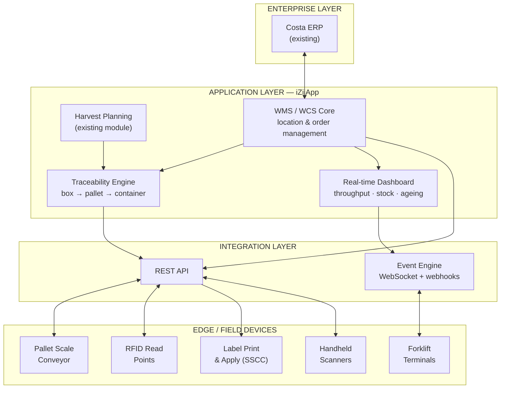
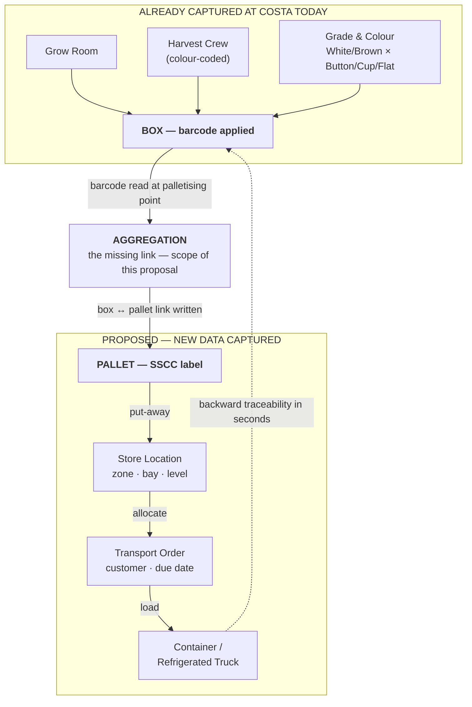
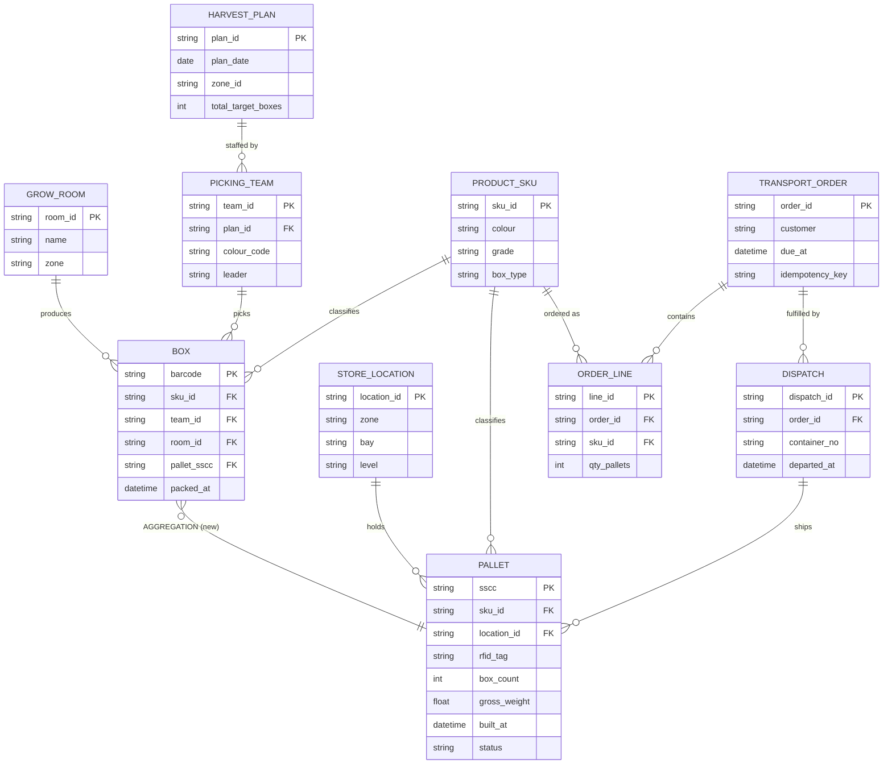
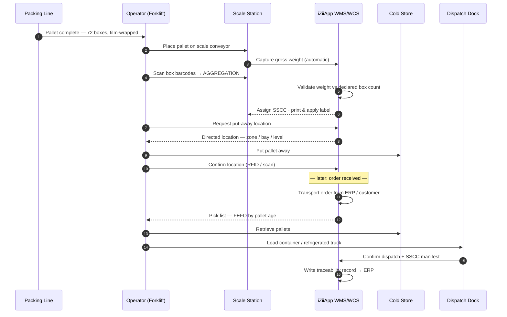

# SOLUTION PROPOSAL
## Finished Goods Cold Store — Management & Automation System
### Costa Mushroom — Plant M1 & M2

---

| Item | Detail |
|------|--------|
| **Client** | Costa Mushroom — Plant M1, M2 |
| **Scope** | Finished goods cold store: from completed pallet to container dispatch |
| **Design capacity** | 60 tonnes/day peak (M1 + M2 combined) |
| **Issue date** | 20 August 2026 |
| **Validity** | 60 days from issue date |
| **Status** | Preliminary proposal — subject to site survey confirmation |

---

## 1. EXECUTIVE SUMMARY

We propose upgrading Costa Mushroom's finished goods cold store through a
**three-phase roadmap**, beginning with a software layer that can be deployed
quickly with negligible production disruption, then progressively extending into
mechanical automation once the business case has been evidenced.

**Three options compared:**

| Criterion | Option A | Option B | Option C |
|-----------|----------|----------|----------|
| | **Digitalisation & WMS** | **Semi-automated** | **Full AS/RS** |
| Scope | Scale station + pallet identification, WMS/WCS, forklift terminals | Adds **robotic palletising** + through-wall conveyor + shuttle racking | Adds AS/RS stacker crane in cold store |
| Automated palletising | — | Yes — 2 robot cells | Yes — 2 robot cells |
| Cold store floor area | Unchanged | ~87 m² (from ~296 m²) | ~48 m² |
| Implementation time | **3–5 months** | 12–18 months | 24–30 months |
| Production disruption | **Negligible** | Moderate | High |
| Indicative budget | **AUD 250–500 k** | AUD 2.2–4.0 M | AUD 4.5–8.0 M |
| Delivery risk | **Low** | Moderate | High |

> **Our recommendation: commence with Option A.**
>
> Not because it is the cheapest, but because **Costa currently lacks the operating
> data required to make a sound decision on Option B or C**. After six months of
> running Option A, Costa will hold measured data on hourly throughput, actual dwell
> time, error rates and forklift hours spent inside the cold store — precisely the
> figures that determine whether an AUD 2.2 M or AUD 8.0 M investment will return.
>
> Option A is architected so that **no element is discarded** when upgrading to
> Option B or C.

**Our differentiator:** Costa's iZiiApp platform already manages harvest planning by
zone (**M1/M2**), by **picking crew**, and by **grade** (Button, Cup, Flat), with
output counted in **boxes**. Critically, **box-level barcoding is already deployed** —
carrying crew, grade and grow room. The upstream data therefore already speaks the
language of this problem. The one missing link is the **box → pallet → container**
aggregation, and that is precisely the scope of this proposal. See Sections 5 and 9.

---

## 2. DESIGN BASIS

### 2.1 Input data

| Parameter | Value | Source |
|-----------|-------|--------|
| Peak output | 60 tonnes/day (M1 + M2) | Costa |
| Weight per box | 4 kg | Costa |
| Box types | 2 types, differing dimensions | Costa |
| Box construction | **Open-top vented tray** | Costa |
| Box dimensions | ~400 × 300 × 130 mm | **ASSUMED — both types to be measured** |
| Palletising rule | The two box types are **never mixed** on one pallet | Costa |
| SKU matrix | 2 colours × 3 grades × 2 box types = **12 SKUs** | Costa |
| Concurrent SKUs | 4 – 6 SKUs per shift | Costa |
| Palletising area temperature | **20 – 25 °C** | Costa |
| Pallet standard | Australian Standard Pallet 1165 × 1165 mm (AS 4068) | National standard |

### 2.2 Calculated pallet pattern

For a 400 × 300 mm box on the Australian Standard Pallet, with the **20 mm clearance**
required by a mechanical gripper (mandatory, since an open-top vented tray cannot be
handled by vacuum):

| Layers | Boxes/pallet | kg/pallet | Pallet height | Pallets/day |
|--------|--------------|-----------|---------------|-------------|
| 8 layers | 64 | 256 | 1.19 m | 234 |
| **9 layers** | **72** | **288** | **1.32 m** | **208** |
| 10 layers | 80 | 320 | 1.45 m | 188 |
| 11 layers | 88 | 352 | 1.58 m | 170 |

**8 boxes per layer.** Notably, the 20 mm gripper clearance does **not** reduce the
boxes per layer compared with a tight pattern; only beyond 25 mm does it fall to 7
boxes per layer. This is a favourable finding for gripper selection.

### 2.3 Derived figures

| Metric | Value |
|--------|-------|
| **Total boxes per peak day** | **15,000 boxes** |
| **Total pallets per peak day** | **~208 pallets** (9 layers × 8 boxes) |
| Split evenly across two plants | ~104 pallets/plant/day |
| Equivalent 40 ft containers | ~10 containers/day |

> **Note on rounding:** the capacity and floor-area tables below use **200 pallets/day**
> as a round planning figure. The 4% difference against 208 sits comfortably within the
> 20% design margin applied to storage capacity. Once both box types are physically
> measured, we will confirm exact figures per product line.

### 2.4 Required throughput

| Operating hours | Pallets/h (avg) | Seconds/pallet | Peak (×1.5) | Boxes/min |
|-----------------|-----------------|----------------|-------------|-----------|
| 8 hours | 25.0 | 144 | 37.5 | 31.2 |
| 10 hours | 20.0 | 180 | 30.0 | 25.0 |
| **12 hours** | **16.7** | **216** | **25.0** | **20.8** |
| 16 hours | 12.5 | 288 | 18.8 | 15.6 |
| 20 hours | 10.0 | 360 | 15.0 | 12.5 |

> **Engineering observation:** at 12 operating hours, the peak rate of 25 pallets/h
> equates to **one pallet every 2.4 minutes**. A single scale conveyor station handles
> this comfortably, and it also sits within the duty of a single AS/RS stacker crane
> (typically 25–35 dual cycles/h). In other words, **Costa's problem is not throughput-
> limited** — it is limited by **storage density and data accuracy**. This observation
> drives every recommendation that follows.

### 2.5 Cold store capacity vs dwell time

| Dwell time | Pallets on hand | +20% contingency | Scenario |
|------------|-----------------|------------------|----------|
| 8 hours | 67 | 80 | Dispatched within shift |
| 12 hours | 100 | 120 | Dispatched same day |
| 18 hours | 150 | 180 | Overnight |
| **24 hours** | **200** | **240** | **Proposed design basis** |
| 36 hours | 300 | 360 | 1.5 days |
| 48 hours | 400 | 480 | Weekend buffer |
| 72 hours | 600 | 720 | Public holiday / transport disruption |

**This is the single parameter Costa should confirm first.** Actual dwell time drives
capital cost directly — the difference between 12 hours and 48 hours is a **fourfold
change in required capacity**.

### 2.6 Floor area by storage technology (240-pallet capacity)

| Technology | Levels | Utilisation | Floor m² | Refrigerated m³ |
|------------|--------|-------------|----------|-----------------|
| Block stacking | 2 | 55% | 296 | 1,184 |
| Selective racking | 3 | 40% | 271 | 1,900 |
| Double-deep racking | 3 | 50% | 217 | 1,520 |
| Drive-in racking | 4 | 65% | 125 | 1,128 |
| **Pallet shuttle racking** | 5 | 75% | **87** | **955** |
| Mobile racking | 3 | 65% | 167 | 1,169 |
| **AS/RS stacker crane** | 8 | 85% | **48** | **862** |

> The final column matters more than floor area: **refrigerated volume drives energy
> cost across the whole asset life**. Moving from block stacking to shuttle racking cuts
> refrigerated volume by ~19%; AS/RS cuts it by ~27%. For a store running 24/7 year-round,
> this compounds materially.

### 2.7 Dispatch doors

| Scenario | Movements/day | Pallets/movement |
|----------|---------------|------------------|
| 40 ft interstate containers (70%) | 7.0 | 20 |
| Refrigerated supermarket trucks, intrastate (30%) | 7.5 | 8 |
| **Total** | **~14.5 movements/day** | — |

Over a 10-hour dispatch window this is 1.45 vehicles/h. Applying a 1.5 peak factor,
**a minimum of three dispatch doors** is required to avoid vehicle queuing.

---

## 3. CURRENT STATE & CHALLENGES

### 3.1 Current process

```
Box packing → Palletising (two box types kept separate) → Stretch wrapping
    → Forklift places pallet on scale conveyor → Into cold store
    → Container / truck collects against order
```

### 3.2 Five challenges identified

**(1) Brownfield constraint — upgrading a live facility.**
Costa has an existing cold store requiring upgrade, not a greenfield build. This
constrains available clear height, column positions, floor loading and installed
refrigeration capacity. Every option must be installed **while the store continues to
operate** — the heaviest constraint of all, and the principal reason we recommend
starting with software.

**(2) Relative humidity above 95% — a harder problem than temperature.**
Mushrooms store best at **0–2 °C with relative humidity above 95%**. Under these
conditions:

- Barcode readers and cameras **fog over**, and misread rates rise sharply
- Enclosures and sensors require **IP65 or better with anti-condensation heating**
- Metal corrosion proceeds far faster than in ambient warehousing
- Paper pallet labels **delaminate and smear**

This is why we specify **RFID rather than barcode** for pallet identification inside
the chilled envelope — see Section 8.3.

**(3) Box-level data already exists — only the aggregation step is missing.**

Costa **already operates box-level barcoding**, carrying picking crew, grade and grow
room. This is an excellent foundation and materially changes the problem in Costa's
favour: **traceability does not need to be built from scratch — only one link needs
closing.**

```
ALREADY IN PLACE                          MISSING
────────────────────────────────         ──────────────────────────────
Grow Room · Crew · Grade                  Which boxes are on which pallet?
        ↓ (barcode on every box)          Which pallets went on which container?
      BOX  [in place]         --X--            PALLET → CONTAINER
```

Consequences of the broken link:

- No means of tracing a **pallet** back to its grow rooms
- Reconciling harvested output against dispatched output is a manual exercise
- When a supermarket raises a quality claim, isolating the affected lot requires
  working back through paperwork

> **The key point:** because barcodes already exist on every box, the box → pallet
> aggregation can be captured **fully automatically with no additional labour**, by
> placing a reader immediately upstream of the palletiser pick point. Put differently,
> **the palletising system and the traceability requirement solve one another** — see
> Section 6.5.

**(4) A 12-SKU matrix — automated palletising required.**

The real product matrix has three dimensions:

| Dimension | Values | Count |
|-----------|--------|-------|
| Colour | White, Brown | 2 |
| Grade | Button, Cup, Flat | 3 |
| Box type | Box A, Box B (different dimensions) | 2 |
| **Total combinations** | | **12 SKUs** |

At 208 pallets/day across 12 SKUs, the average is only **17 pallets/day per SKU**.
Many SKUs **will not fill a single pallet in a day** if demand splits evenly.

> **This — not throughput — is the real challenge.** Pallets must be built **to order**,
> not to SKU, which means several different pallets must be open simultaneously. With
> 4–6 SKUs running concurrently in a shift, manual palletising leads to mis-selected
> pallets, part-built pallets occupying floor space, and no reliable means of recording
> which box went onto which pallet.

This is why Costa requires an **automated palletising system** — design detail in
Section 6.

**(5) Personnel hours inside the chilled envelope.**
Forklift operation at 0–2 °C attracts allowances, limits shift duration, and carries
occupational health obligations under WHS legislation. This is a hidden cost that is
routinely under-counted when options are compared.

---

## 4. THREE OPTIONS

### 4.1 Option A — Digitalisation & WMS *(recommended starting point)*

**Scope of supply:**

| Item | Description |
|------|-------------|
| Intelligent scale station | Integration with existing scale conveyor; automatic weight capture, no manual entry |
| Pallet identification | Humidity-rated RFID tags; read portals at scale station and dispatch doors |
| Print & apply labelling | Humidity-resistant labels, printed automatically post-weighing, carrying GS1 SSCC |
| WMS/WCS on the iZiiApp platform | Location management, dispatch orders, output reconciliation, traceability |
| Forklift-mounted terminals | Cold-rated displays providing directed put-away and retrieval |
| Real-time dashboard | Throughput, stock on hand, open orders, stock-ageing alerts |
| Integration | Connection to the existing harvest module; ERP-ready interfaces |

**Advantages:**

- Deployed in **3–5 months** with negligible production disruption
- No structural works, no shutdown required
- **Generates the data needed to decide between B and C** — the greatest single value
  of this option
- Every element is retained on upgrade

**Limitations — stated plainly:**

- Does not increase storage density
- Does not reduce personnel hours inside the cold store
- Does not add capacity should output exceed 60 tonnes/day

**Indicative budget: AUD 250,000 – 500,000**

---

### 4.2 Option B — Semi-automated

**Added to Option A:**

| Item | Description |
|------|-------------|
| **Automated palletising system** | **2 robot cells (one per plant), 4 build positions + roller conveyor — Section 6** |
| **Barcode reader upstream of pick point** | **Creates the box → pallet link automatically, with no additional labour** |
| Automatic stretch wrapper | In-line, immediately downstream of the palletiser |
| Through-wall pallet conveyor | Moves pallets from packing hall into the cold store without forklift door transits |
| High-speed doors | Reduce cold loss and condensation |
| Pallet shuttle racking | 5 levels, high density — floor area from ~296 m² down to **~87 m²** |
| Shuttle carriers | 2–3 units operating within lanes; forklifts load/unload at lane face only |
| Extended WCS | Coordination of palletiser, conveyor and shuttle carriers |
| Category 3 safety system | Perimeter guarding, interlocks and E-stop for the robot cell — Section 6.8 |

**Advantages:**

- **Eliminates box-type mixing errors entirely** — the system refuses an incorrect SKU placement
- **Automatic box → pallet traceability** at near-zero marginal cost (Section 6.5)
- Releases **~70% of floor area** compared with block stacking
- Cuts refrigerated volume by ~19% — sustained energy saving
- Materially reduces forklift hours inside the cold store
- **Shortens time at ambient temperature** — continuous conveying replaces forklift
  waiting steps, partially mitigating the issue raised in Section 6.7
- Retains forklift flexibility for exception handling

**Limitations:**

- Structural works required — a phased changeover plan is essential
- Implementation 12–18 months (extended by the palletising scope)
- Floor loading and clear height must be verified
- Floor space required for a robot cell at **both plants**
- The robot cell requires a full safety dossier to AS/NZS 4024

**Indicative budget: AUD 2.2 – 4.0 M**
*(of which the two palletising cells represent approximately AUD 1.0 – 1.6 M)*

---

### 4.3 Option C — Full AS/RS

**Added to Option B:**

| Item | Description |
|------|-------------|
| AS/RS stacker crane | 1–2 rail-guided cranes within the cold store, 8 levels |
| High-bay racking | Designed to available clear height |
| Full infeed/outfeed conveyor | Fully automated from packing through to dispatch door |
| Category 3 safety system | Per AS/NZS 4024 — perimeter guarding and interlocks |

**Advantages:**

- Highest density: **~48 m² floor**, refrigerated volume reduced ~27%
- **Effectively no personnel required inside the cold store** during normal operation —
  the single largest benefit, in both cost and WHS-obligation terms
- Near-absolute inventory accuracy

**Limitations — stated plainly:**

- Major capital outlay, 24–30 month programme
- **Existing clear height may render this option unfeasible** on a brownfield site —
  must be surveyed before any commitment
- System-down risk: if the crane fails there is no manual fallback unless designed in
- Installation within a live cold store is highly complex

**Indicative budget: AUD 4.5 – 8.0 M** *(inclusive of all Option B scope)*

> **Regarding the budget figures:** these are **order-of-magnitude ranges for planning
> purposes**, not quotations. The two most volatile items — and the two that **cannot be
> estimated without a site survey** — are (a) refrigeration plant upgrade and (b)
> structural/floor strengthening. Firm pricing follows the survey described in Section 15.

---

## 5. SYSTEM ARCHITECTURE — OPTION A

This section defines the technical design of Option A. Four views are presented:
system architecture, data flow, data model, and process sequence.

### 5.1 Architecture overview

The solution is structured in four layers. Green elements already exist at Costa and
are reused, not replaced.



**Figure 1 — Option A system architecture.**

Key architectural decisions:

| Decision | Rationale |
|----------|-----------|
| Reuse the existing harvest module rather than replace it | Crew, grade and grow-room data already exist and are trusted by operations |
| WMS/WCS deployed on the existing iZiiApp platform | Avoids a second platform, second login and second support contract |
| Integration layer isolated from the application layer | Field devices can be added or changed without altering application logic |
| **No safety function implemented in software** | All machinery safety resides in independent certified hardware — see Section 10 |
| ERP interface is bidirectional but non-blocking | Loss of the ERP link must not stop the floor |

### 5.2 Data flow — closing the aggregation link



**Figure 2 — Data flow showing the aggregation event.**

The dashed return path is the commercial value of this proposal: given a container
number, the system resolves the full set of contributing grow rooms, crews and harvest
dates in seconds rather than hours.

### 5.3 Data model (ERD)



**Figure 3 — Entity relationship diagram.**

The critical addition is the single foreign key **`BOX.pallet_sscc`**. Everything else
either already exists or is conventional warehouse data. This is worth emphasising in
commercial terms: the traceability capability Costa gains rests on **one new relationship**,
not on a new system.

Two design notes:

- **`TRANSPORT_ORDER.idempotency_key`** — orders received more than once must never
  create duplicate movements. This mirrors the pattern already proven in Costa's
  existing synchronisation layer.
- **`PALLET.status`** follows a controlled state model: `building → wrapped → weighed →
  stored → allocated → picked → dispatched`. Status transitions are the audit trail.

### 5.4 Pallet lifecycle sequence



**Figure 4 — Pallet lifecycle sequence, Option A.**

Step 4 is the aggregation event. In **Option A** it is a handheld scan performed by the
operator; in **Option B** the identical data is captured automatically at the palletising
cell with no operator action. The data model does not change between options — only the
capture mechanism — which is why Option A is not discarded on upgrade.

**FEFO note:** pick lists are sequenced *first-expired-first-out* by pallet build
timestamp, not by location convenience. Given a 14–20 day shelf life at 1 °C, this is the
single most effective software control over product wastage.

### 5.5 Technology stack and interfaces

| Layer | Technology | Notes |
|-------|-----------|-------|
| Application | iZiiApp platform (existing) | No new platform introduced |
| API | REST/JSON over HTTPS | Idempotent order endpoints |
| Real-time | WebSocket + outbound webhooks | Dashboard and terminal updates |
| Pallet identification | UHF RFID (AS/NZS-compliant band) | See Section 8.3 |
| Labelling | GS1 SSCC, print & apply | Supermarket-compatible |
| Box identification | Existing barcode symbology | Reused unchanged |
| Device connectivity | Industrial Wi-Fi / wired Ethernet | Wireless never in a control or safety path |
| ERP integration | REST or file-based, to suit Costa's ERP | Confirmed at survey |

> **Architectural constraint retained throughout:** the WMS/WCS performs **no safety
> function**. All machinery safety is delivered by independent certified hardware to
> AS/NZS 4024. This boundary is maintained in every phase — for engineering reasons, and
> because it keeps responsibility under the WHS Act unambiguous.

---

## 6. AUTOMATED PALLETISING SYSTEM DESIGN

### 6.1 Design requirements

| Requirement | Value |
|-------------|-------|
| Output | 15,000 boxes/day (M1 + M2) |
| Box | ~400 × 300 × 130 mm, **open-top vented tray**, 4 kg |
| SKUs | 12 combinations; **4–6 running concurrently** per shift |
| Rule | The two box types **must never be mixed** on one pallet |
| Pallet | Australian Standard 1165 × 1165 mm, 8 boxes/layer × 9 layers = 72 boxes |
| Environment | 20 – 25 °C |
| Traceability | Record **every box** against its pallet |

### 6.2 Throughput — and why robotic rather than layer palletising

| Configuration | Boxes/min per machine | Cycles/min (single pick) | Cycles/min (double pick) |
|---------------|----------------------|--------------------------|--------------------------|
| 1 machine serving M1+M2, 12 h | 20.8 | 20.8 | 10.4 |
| **2 machines (one per plant), 12 h** | **10.4** | **10.4** | **5.2** |
| 2 machines, 8 h | 15.6 | 15.6 | 7.8 |

Reference capacities:

| Machine type | Capacity | Suitable? |
|--------------|----------|-----------|
| Layer palletiser | 60–120 cases/min | **No** — very fast but **slow to change SKU**; unsuitable for 12 SKUs |
| **Industrial 4-axis robot** | **20–30 cycles/min** | **Yes — correct selection** |
| Collaborative robot | 5–9 cycles/min | Marginal — only viable at 2 machines × 20 hours |

> **Conclusion: two robot cells (one per plant) operate at 10.4 cycles/min — roughly
> 42% of rated robot capacity, a design margin of 2.4×.** Practically, this means that
> if Costa increases output beyond 60 tonnes/day, or compresses operating hours, the
> equipment still meets demand without further capital investment.

### 6.3 Gripper design for open-top vented trays — the critical technical point

The boxes are **open-top vented trays**. This immediately eliminates the most common
end-of-arm tooling:

| Gripper type | Viable? | Comment |
|--------------|---------|---------|
| Vacuum | **No** | Open top provides no sealing surface |
| Side clamp | Yes | Requires clearance between boxes |
| Fork / blade | Limited | Requires clearance beneath the tray base |
| **Side clamp + bottom support plate** | **Recommended** | Most secure for open trays; prevents drop-through |

**A favourable finding from the pattern calculation:** the 20 mm clearance required by a
clamp gripper does **not** reduce boxes per layer — still 8, identical to a tight pattern.
Only beyond 25 mm does it fall to 7 per layer (a 12.5% capacity loss). Therefore:

> **Design constraint: the gripper must operate within a clearance of ≤ 20 mm.**
> This figure must appear in the equipment specification at tender. It is not negotiable.

**Three constraints observed from the product itself:**

- Carton walls are thin and flexible — clamping force must be distributed across a
  broad contact area to avoid crushing the tray
- **Mushrooms frequently sit proud of the tray rim** — the gripper must approach from
  the sides only, with no component passing over the product
- Handhold cut-outs in the tray sides can be exploited as location features for gripper
  fingers, improving positional repeatability

**Consequence for pallet stability.** A 20 mm gap between boxes produces a less
interlocked load than a tight pattern. This is compensated by:

- Stretch wrapping with calibrated film tension (already in Costa's process)
- Interlayer pads — to be evaluated during sample trials
- Alternating layer orientation to improve interlock

### 6.4 Cell layout

With 4–6 concurrent SKUs, the number of pallet build positions governs the layout:

| Build positions | Span required | Robot reach required | Feasible? |
|-----------------|---------------|----------------------|-----------|
| 4 positions | 5.3 m | ~3.2 m | **Yes** — one standard robot (3.1–3.2 m reach) |
| 6 positions | 8.0 m | ~4.6 m | **No** — exceeds standard palletising robot reach |

**Recommended solution — 4 active positions served by roller conveyor:**

```
              [ Box infeed conveyor ]
                        |
              +---------v---------+
              |  Barcode reader   |   <- traceability capture point
              +---------+---------+
                        |
             +----------v----------+
             |  4-AXIS ROBOT       |
             +--+-----+-----+---+--+
                |     |     |   |
              [P1]  [P2]  [P3] [P4]      <- 4 active build positions
                |     |     |   |
            ====+=====+=====+===+====    <- powered roller conveyor
                ^                   |
          empty pallets in     full pallets out -> stretch wrap
                                     -> weigh -> SSCC label -> cold store
```

The roller conveyor allows **completed pallets to exit and empty pallets to enter
automatically**, so four positions within robot reach can serve six SKUs in rotation.
This is substantially cheaper than deploying two robots, and simpler than specifying an
extended-reach machine.

### 6.5 Barcode integration — where two problems solve one another

This is what distinguishes this proposal from the purchase of a standard palletiser.

Because **every box already carries a barcode** encoding crew, grade and grow room, a
reader array placed immediately upstream of the pick point achieves three things at once:

```
Box on infeed conveyor  ->  Barcode read  ->  System resolves SKU
                                 |
                                 +--> Routing: select correct build position (P1..P4)
                                 |
                                 +--> Interlock: reject wrong-SKU placement
                                 |
                                 +--> Traceability: write box -> pallet SSCC link
```

All three occur **with no additional operator time whatsoever**:

1. **Automatic sortation** — the robot places each box on the correct pallet
2. **Mixing prevention** — the system refuses to place Box A onto a Box B pallet
3. **Traceability capture** — the box → pallet link is created at the moment of placement

When a pallet is complete, the system prints a **GS1 SSCC label** carrying the full
manifest of boxes it contains. This is the resolution of Challenge (3) in Section 3.

> **In short: the palletiser is not merely materials handling equipment — it is also the
> traceability data capture device.** The marginal cost of the traceability capability is
> close to zero because the barcode infrastructure already exists.

**Technical caveat:** a **consistent barcode position on the box** must be agreed. If
label placement is arbitrary, a multi-angle reader array or vision system is required —
significantly more expensive and slower. This must be verified during the site survey.

### 6.6 Complete line configuration

```
Box packing -> Accumulation conveyor -> BARCODE READ -> ROBOT PALLETISER (4 positions)
   -> Full-pallet conveyor -> Automatic stretch wrapper -> CHECK-WEIGH
   -> SSCC print & apply -> Cold store
```

Two notable changes against the current process:

- **The forklift transfer of pallets onto the scale conveyor is eliminated** — pallets
  travel directly on conveyor
- **Weighing becomes in-line**, rather than a discrete stop

### 6.7 Ambient palletising temperature — a significant finding

Costa has confirmed the palletising area operates at **20–25 °C**. We wish to draw
particular attention to this, because it carries financial consequences that are commonly
overlooked.

**Consequence 1: refrigeration load increases 44%**

| Product temperature entering store | Product cooling load @ 12 h |
|------------------------------------|------------------------------|
| 18 °C | 87 kW |
| 20 °C | 98 kW |
| 22 °C | 108 kW |
| **25 °C** | **125 kW** |

From 18 °C to 25 °C, product cooling load rises **44%**. Where the existing cold store has
limited installed refrigeration capacity, **this may prove to be the genuine bottleneck —
not storage capacity**.

**Consequence 2: respiration heat and shelf life**

Mushrooms are living tissue and continue to respire after harvest, generating heat. The
respiration rate rises steeply with temperature:

| Temperature | Respiration heat, 60 t | Relative to 2 °C |
|-------------|------------------------|------------------|
| 2 °C | ~1.2 kW | 1.0× |
| 10 °C | ~4.2 kW | 3.5× |
| 20 °C | ~12 kW | 10× |
| **25 °C** | **~18 kW** | **15×** |

*Respiration coefficients are indicative figures drawn from post-harvest literature and
require confirmation for Costa's specific cultivars.*

In practical terms: **every minute spent at 25 °C consumes shelf life roughly 15 times
faster than at 2 °C.** The interval between packing and entry to the cold store is the
most expensive period in the entire chain.

**Consequence 3: condensation at dispatch**

The reverse direction also presents a problem. Pallets at 0–2 °C moved into a 25 °C
dispatch area will **condense moisture onto the cartons** — wet cartons, label failure,
and mould risk in transit.

**Three mitigations, in our order of preference:**

| # | Approach | Assessment |
|---|----------|------------|
| 1 | **Minimise time at ambient** | Cheapest. The automated conveying in Section 6.6 already helps materially by removing forklift waiting steps |
| 2 | **Chill the palletising hall to 8–12 °C** | Industry standard for produce packing. Industrial robots operate normally in this range; condensation control on equipment required |
| 3 | **Add pre-cooling downstream of palletising** | Most effective for product quality, but adds plant and a process step |

Dispatch doors require **dock seals** and a staging area to limit condensation.

**We propose including product temperature measurement at four points — leaving the grow
room, after packing, before entering the store, and after four hours in store — within
the survey scope.** This is inexpensive to measure but may materially reorder investment
priorities.

### 6.8 Robot cell safety

A palletising robot cell is high-hazard plant and must comply with **AS/NZS 4024:2019**:

| Item | Requirement |
|------|-------------|
| Perimeter guarding | Fixed guarding to standard height |
| Maintenance access door | Monitored interlock |
| Conveyor entry/exit apertures | Safety light curtain or guarded tunnel |
| Emergency stop | **Category 3** circuit — dual channel with cross-monitoring |
| Maintenance mode | Safely-limited speed plus three-position enabling device |
| Safety devices | **Certified** commercial products (Pilz / SICK / Siemens or equivalent) |

Performance Level (PL) calculations and validation records will be delivered with the
equipment, in accordance with the designer and supplier duties under Sections 22–25 of
the WHS Act.

---

## 7. RECOMMENDATION: THREE-PHASE ROADMAP

*Phase 1 (months 0–5): Option A → Six months of operation gathering measured data →
Decision on evidence: proceed to B, proceed to C (if clear height permits), or remain at
Phase 1 (a legitimate outcome).*

### Why we recommend this sequence rather than proposing the largest option

After six months running Option A, Costa will hold measured answers to questions that
**nobody can currently answer with confidence**:

| Question | Bearing on the decision |
|----------|-------------------------|
| What is the actual dwell time? | Determines capacity — a fourfold range between 12 h and 48 h |
| What is the true hourly peak rate? | Determines crane count / shuttle count |
| How many person-hours per day are spent inside the cold store? | The basis of the payback calculation for B and C |
| What is the current mis-pick rate? | Quantifies the benefit of automation |
| Is output trending beyond 60 tonnes/day? | Determines design capacity |

**We do not believe it serves Costa's interests to propose a multi-million dollar
investment while these five questions remain unanswered by data.**

---

## 8. TECHNICAL DESIGN

### 8.1 Mushroom storage conditions

| Parameter | Recommended value | Note |
|-----------|-------------------|------|
| Temperature | **0 – 2 °C** | Below 0 °C introduces chilling-injury risk |
| Relative humidity | **> 95%** | Lower causes moisture loss and loss of gloss |
| Shelf life at 1 °C | 14–20 days | Against 2–3 days at 20 °C |
| Pre-cooling | **Strongly recommended** | Removes field heat before storage |

*Note: excessive humidity causes surface condensation on the product, accelerating
microbial growth and discolouration. The optimum operating window is narrow and requires
active control, not merely a setpoint.*

### 8.2 Refrigeration load

Costa has confirmed the palletising area runs at **20–25 °C**, so product enters the store
warmer than a conventional assumption. Heat to be removed to reach 2 °C:

| Distribution | Entering at 18 °C | **Entering at 25 °C** |
|--------------|-------------------|------------------------|
| Spread over 8 hours | 130 kW | **187 kW** |
| Spread over 12 hours | 87 kW | **125 kW** |
| Spread over 16 hours | 65 kW | **93 kW** |
| Spread over 24 hours | 43 kW | **62 kW** |

**This 44% differential may well be the true constraint on the existing cold store** —
rather than storage capacity. Full analysis and three mitigations at **Section 6.7**.

These figures exclude envelope heat gain, lighting, fan power, personnel, forklifts, door
losses and respiration heat. Actual plant load is typically **1.6–2.2×** the product load
alone.

### 8.3 Pallet identification — why RFID rather than barcode

| Criterion | Barcode | **RFID** |
|-----------|---------|----------|
| Performance when fogged | Poor | **Unaffected** |
| Line of sight required | Yes | No |
| Reads through stretch film | Difficult | **Yes** |
| Multiple pallets read simultaneously | No | **Yes** (dispatch portal) |
| Tag cost | Very low | Higher |
| Durability at 95% RH | Paper labels delaminate and smear | **Robust polymer tag** |

**Recommended combination:** reusable RFID tags on pallets **plus** printed barcode/QR
labels for carriers and customers — Australian supermarkets generally require a GS1 SSCC
label readable by conventional scanners.

### 8.4 Scale station — the critical data capture point

The scale station is the **one control point through which every pallet passes**, making it
the natural location to:

- Record actual net weight (for reconciliation against harvested output)
- Apply and commission the RFID tag
- Print and apply the label
- Photograph the pallet as condition evidence at handover
- Automatically verify that measured weight matches the declared box count

The final check is more valuable than it appears: if a pallet declares 72 boxes × 4 kg but
weighs 268 kg, the system raises an exception **at the point of packing** rather than after
the consignment has crossed a state border.

**To be confirmed:** where boxes carry a declared retail net weight, weighing may fall
under Australian trade measurement requirements administered by the National Measurement
Institute. Scope to be clarified at survey.

---

## 9. TRACEABILITY & INTEGRATION — OUR DIFFERENTIATOR

### 9.1 What already exists in Costa's systems

| Data | Existing field |
|------|----------------|
| Harvest plan by zone | `MushroomHarvestPlans.zoneId` — **already distinguishes M1 and M2** |
| Target output | `MushroomHarvestPlans.totalTargetBoxes` — **already counted in boxes** |
| Picking crews | `MushroomPickerTeams` — colour code, team leader, member list |
| Grade and grow room | `MushroomYieldSurveys` — strain (Button/Cup/Flat), cycle, room |
| Personnel, shifts, attendance | Complete |
| **Box-level barcoding** | **Already deployed** — carries crew, grade, grow room |

> The final row is the most significant. Because barcoding already operates at **box
> level**, the hardest part of traceability — capturing data at source — **Costa has
> already completed.**

### 9.2 The missing link — and the scope of this proposal

```
ALREADY IN PLACE (barcode per box)        PROPOSED ADDITION
──────────────────────────────────       ──────────────────────────────
Grow Room -> Crew -> Grade                Pallet -> Store Location -> Container
        -> BOX  [in place]   --X--                -> Transport Order
                              ^
                    only the AGGREGATION step missing
```

**This aggregation step is performed automatically by the palletising system**
(Section 6.5): a barcode reader immediately upstream of the pick point records which box
goes onto which pallet, with no additional labour. The completed pallet receives a **GS1
SSCC label** carrying the manifest of its contents.

Under Option A (before the palletiser is installed), the same aggregation is performed by
**handheld scanning at the palletising point** — slower, but producing an identical data
structure, so nothing is rebuilt on upgrade to Option B.

Once complete, Costa can answer in **seconds** rather than hours:

- Which pallets were loaded onto container XYZ?
- Which grow rooms, crews and dates contributed to that pallet?
- If a supermarket raises a claim on one lot, which other pallets share its origin and
  must be considered for recall?
- Does declared harvested output reconcile against dispatched weight?

> **A conventional WMS vendor cannot deliver this**, because they begin from zero on the
> farm side. We begin from a system that already holds the data.

### 9.3 Architectural principle

The WMS/WCS software performs **no safety function**. All machinery safety resides in
independent certified hardware to AS/NZS 4024. This principle is maintained without
exception across all phases — for engineering reasons, and because it keeps the boundary
of responsibility under the WHS Act unambiguous.

---

## 10. SAFETY & COMPLIANCE

| Domain | Standard / regulation | Application |
|--------|----------------------|-------------|
| Machinery safety | **AS/NZS 4024:2019 series** | All mechanical equipment, Options B and C |
| Electrical equipment of machines | **AS/NZS 60204.1** | All phases involving electrical plant |
| Wiring rules | **AS/NZS 3000** | Electrical installation by a licensed Australian contractor |
| AGV / AMR (if later added) | **AS 5144.4:2021** | Not applicable within this scope |
| EMC / radio equipment | **RCM** (ACMA) | RFID equipment and wireless terminals |
| Work in chilled environments | State WHS Regulations | Shift duration limits, protective clothing |
| Food safety | HACCP; Costa's certification scheme | Traceability, temperature records |
| Trade measurement | National Measurement Institute | To be clarified — Section 8.4 |

**Duties under the WHS Act:** we understand the obligations imposed on designers,
manufacturers and suppliers of plant under Sections 22–25. All safety devices within scope
will be **certified commercial products** (Pilz, SICK, Siemens or equivalent), supplied
with Performance Level calculations and validation records to AS/NZS 4024.

---

## 11. IMPLEMENTATION PLAN — OPTION A

| Stage | Activity | Duration | Deliverable |
|-------|----------|----------|-------------|
| 0 | Site survey and requirements confirmation | Weeks 1–3 | Survey report, confirmed design basis, firm quotation |
| 1 | Detailed design | Weeks 4–7 | System design, interface specifications, test plan |
| 2 | Software configuration and integration | Weeks 8–14 | WMS/WCS operating in test environment |
| 3 | Field hardware installation | Weeks 13–16 | Scale station, RFID portals, terminals — **installed outside production hours** |
| 4 | Integration testing and parallel run | Weeks 17–19 | Running alongside the existing process, at no risk |
| 5 | Training and cutover | Weeks 20–21 | Operating documentation, shift-by-shift training |
| 6 | Acceptance and warranty commencement | Week 22 | Acceptance certificate, 12-month warranty begins |

**Governing principle:** the parallel run at Stage 4 means the current process **continues
to operate normally** until the new system has been proven. Costa is never placed in a
position without a fallback.

---

## 12. COMMERCIAL STRUCTURE

### 12.1 Proposed payment schedule — Option A

| Milestone | Share | Condition |
|-----------|-------|-----------|
| Contract execution | 20% | — |
| Detailed design approval | 20% | Costa approves the design documentation |
| Equipment delivered to site | 25% | — |
| Parallel run completed | 25% | Acceptance criteria in Section 13 met |
| End of 12-month warranty | 10% | Retention |

### 12.2 Recurring charges

| Item | Basis |
|------|-------|
| Software subscription and support | Annual, by site and named user count |
| Technical support | Business hours included; 24/7 available as an option |
| Updates and upgrades | Included in subscription |

**Phase 2 option:** survey and design costs incurred in Phase 1 will be **credited against
Phase 2** should Costa elect to proceed within 12 months.

---

## 13. PERFORMANCE GUARANTEES

Guaranteed for Option A, measured over 30 consecutive days following cutover:

| Metric | Guarantee |
|--------|-----------|
| Scale station processing rate | ≥ 30 pallets/h (exceeds the 25 pallets/h peak requirement) |
| RFID first-read success rate | ≥ 99.5% |
| Inventory data accuracy | ≥ 99.9% on reconciliation stocktake |
| System availability (production hours) | ≥ 99.5% |
| Time to trace a single pallet | ≤ 10 seconds |
| Response time, critical incident | ≤ 4 hours within business hours |

Should a guarantee not be met following the agreed rectification period, we bear the cost
of remediation and Costa may withhold the corresponding payment milestone.

---

## 14. ASSUMPTIONS, EXCLUSIONS AND RISKS

### 14.1 Assumptions requiring Costa's confirmation

| # | Assumption | Consequence if incorrect |
|---|------------|--------------------------|
| 1 | **Box dimensions ~400 × 300 × 130 mm for both types** | Governs pallet pattern, boxes/pallet and gripper design. **Both types must be measured** |
| 1b | 72 boxes/pallet (8 per layer × 9 layers), 288 kg | Derived from (1). If incorrect, the entire scaling changes |
| 1c | Barcodes applied at a **consistent position** on the box | If arbitrary, a multi-angle reader array or vision system is required — more costly and slower |
| 2 | **Dwell time of 24 hours** | Fourfold capacity difference between 12 h and 48 h |
| 3 | Australian Standard Pallet 1165 × 1165 mm | Affects racking and conveyor design |
| 4 | 12 packing hours per day | Determines required throughput |
| 5 | Existing refrigeration capacity is adequate | If not, a significant additional work package arises |
| 6 | 70% container / 30% truck dispatch split | Affects dispatch door count |
| 7 | Existing IT infrastructure is adequate | Network upgrade may otherwise be required |

### 14.2 Exclusions from scope

- Refrigeration plant upgrade (compressors, evaporators) — quoted separately post-survey
- Structural works, floor strengthening, building approvals
- Electrical installation — to be performed by a licensed Australian contractor
- Supply of forklifts
- Permit and regulatory authority fees
- Modifications to Costa's existing ERP

### 14.3 Principal risks

| Risk | Rating | Mitigation |
|------|--------|------------|
| Clear height insufficient for Option C | **High** | Measured at Stage 0 survey before any commitment |
| Existing refrigeration capacity inadequate | Moderate | Cooling load assessment during survey |
| Humidity damage to electronic equipment | Moderate | IP65+ equipment with heated enclosures; separate warranty terms for chilled zone |
| Output growth beyond 60 tonnes/day | Moderate | 20% design margin applied; growth plan to be confirmed with Costa |
| Operator resistance to change | Moderate | Parallel running, shift-by-shift training, key users engaged from the outset |
| Floor loading inadequate for high-bay racking | Moderate | Structural assessment during survey |

---

## 15. NEXT STEPS

We propose commencing with a two to three day site survey (nominal cost, credited in full
should the engagement proceed), covering:

**Cold store and structure**

- Measure available clear height, column positions and floor loading at M1 and M2
- Assess installed refrigeration capacity and plant condition
- Record actual dwell time over the preceding two weeks
- Measure forklift hours spent inside the cold store

**Product and packaging** *(governs palletising system design)*

- **Measure actual dimensions of both box types** (L × W × H) and assess rigidity
- Obtain **10–20 sample boxes of each type** for gripper trials
- Confirm whether barcode placement is **consistent or arbitrary**
- Confirm the existing barcode data structure (crew, grade, grow room)
- Record boxes per pallet currently applied to each type

**Temperature** *(may reorder investment priorities — Section 6.7)*

- Measure product temperature at **four points**: leaving the grow room · after packing ·
  before entering the store · after four hours in store
- Record average elapsed time between packing and entry to the cold store
- Inspect for condensation at the dispatch doors

**Operations and systems**

- Observe hourly throughput profile across one genuine peak day
- Record the actual number of concurrent SKUs over one week
- Measure available floor area for a robot cell at both plants
- Review existing IT infrastructure and ERP
- Clarify trade measurement obligations applying to weighing

**Deliverables following the survey:** a current-state report, a confirmed design basis,
and a **firm quotation** for Option A together with revised estimates for Options B and C.

---

*This proposal is based on information provided by Costa Mushroom as at 20 August 2026.
The engineering figures in Section 2 have been independently verified by calculation.
Budget ranges are indicative for planning purposes and will be replaced by firm pricing
following the site survey.*
