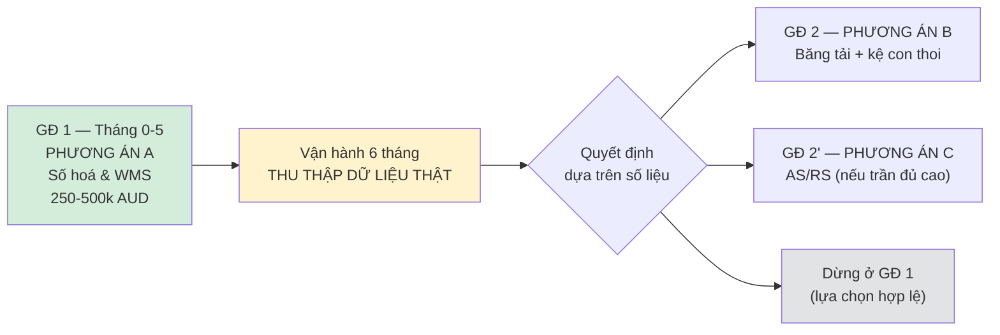

# ĐỀ XUẤT GIẢI PHÁP
## Hệ thống quản lý & tự động hoá kho lạnh thành phẩm
### Costa Mushroom — Plant M1 & M2

---

| | |
|---|---|
| **Khách hàng** | Costa Mushroom — Plant M1, M2 |
| **Phạm vi** | Kho lạnh thành phẩm: từ pallet hoàn thiện đến xuất container |
| **Công suất thiết kế** | 60 tấn/ngày cao điểm (M1 + M2) |
| **Ngày lập** | 20/08/2026 |
| **Hiệu lực báo giá** | 60 ngày kể từ ngày lập |
| **Trạng thái** | Đề xuất sơ bộ — chờ khảo sát hiện trường để chốt |

---

## 1. TÓM TẮT ĐIỀU HÀNH

Chúng tôi đề xuất nâng cấp kho lạnh thành phẩm của Costa Mushroom theo **lộ trình
ba giai đoạn**, bắt đầu bằng lớp phần mềm có thể triển khai nhanh và không gián
đoạn sản xuất, mở rộng dần sang tự động hoá cơ khí khi đã chứng minh được hiệu quả.

**Ba phương án được so sánh:**

| | Phương án A | Phương án B | Phương án C |
|---|---|---|---|
| | **Số hoá & WMS** | **Bán tự động** | **AS/RS đầy đủ** |
| Nội dung | Trạm cân + nhận diện pallet, WMS/WCS, thiết bị đầu cuối trên xe nâng | Thêm **máy xếp pallet tự động** + băng tải xuyên tường + kệ con thoi | Thêm cần trục AS/RS trong kho lạnh |
| Máy xếp pallet tự động | — | ✅ 2 cell robot | ✅ 2 cell robot |
| Diện tích sàn kho lạnh | Giữ nguyên | ~87 m² (từ ~296 m²) | ~48 m² |
| Thời gian triển khai | **3–5 tháng** | 12–18 tháng | 24–30 tháng |
| Gián đoạn sản xuất | **Gần như không** | Trung bình | Cao |
| Ngân sách sơ bộ | **250–500 nghìn AUD** | 2,2–4,0 triệu AUD | 4,5–8,0 triệu AUD |
| Rủi ro triển khai | **Thấp** | Trung bình | Cao |

> **Khuyến nghị của chúng tôi: bắt đầu bằng Phương án A.**
>
> Lý do không phải vì nó rẻ nhất, mà vì **hiện tại Costa đang thiếu dữ liệu để
> quyết định đúng về B hoặc C**. Sau 6 tháng vận hành Phương án A, Costa sẽ có số
> liệu thật về nhịp độ theo giờ, thời gian lưu kho thực tế, tỉ lệ sai sót, và thời
> gian xe nâng nằm trong kho lạnh — đó chính là những con số quyết định việc đầu
> tư 1,2 triệu hay 7 triệu AUD có hoàn vốn hay không.
>
> Phương án A được thiết kế để **không phải bỏ đi** khi nâng cấp lên B hoặc C.

**Lợi thế khác biệt của chúng tôi:** hệ thống iZiiApp hiện đã quản lý kế hoạch thu
hoạch của Costa theo zone **M1/M2**, theo **đội hái** (picker team) và theo **chủng
loại nấm** (Button, Cup, Flat), đếm sản lượng bằng **số box**. Nghĩa là phía thượng
nguồn đã nói đúng ngôn ngữ của bài toán này. Mắt xích còn thiếu là **box → pallet →
container** — và đó chính xác là phạm vi đề xuất này. Xem Mục 5 và Mục 8.

---

## 2. CƠ SỞ THIẾT KẾ

### 2.1 Số liệu đầu vào

| Thông số | Giá trị | Nguồn |
|---|---|---|
| Sản lượng cao điểm | 60 tấn/ngày (M1 + M2) | Costa cung cấp |
| Khối lượng mỗi box | 4 kg | Costa cung cấp |
| Số loại box | 2 loại, kích thước khác nhau | Costa cung cấp |
| Kiểu thùng | **Khay hở / có lỗ thoáng** | Costa cung cấp |
| Kích thước box | ~400 × 300 × 130 mm | ⚠️ **Giả định — cần đo thực tế cả 2 loại** |
| Quy tắc đóng pallet | Hai loại box **đóng pallet tách biệt** theo đơn hàng | Costa cung cấp |
| Ma trận SKU | 2 màu × 3 loại × 2 box = **12 SKU** | Costa cung cấp |
| SKU chạy đồng thời | 4 – 6 SKU mỗi ca | Costa cung cấp |
| Nhiệt độ khu đóng pallet | **20 – 25 °C** | Costa cung cấp |
| Chuẩn pallet | Pallet Úc 1165 × 1165 mm (AS 4068) | Giả định theo chuẩn quốc gia |

### 2.2 Sơ đồ xếp pallet đã tính

Với box 400 × 300 mm trên pallet Úc 1165 × 1165 mm, và **khe hở 20 mm** cần thiết
cho tay kẹp (bắt buộc vì thùng là khay hở, không dùng được tay gắp chân không):

| Số lớp | Box/pallet | kg/pallet | Cao pallet | Pallet/ngày |
|---|---|---|---|---|
| 8 lớp | 64 | 256 | 1,19 m | 234 |
| **9 lớp** | **72** | **288** | **1,32 m** | **208** |
| 10 lớp | 80 | 320 | 1,45 m | 188 |
| 11 lớp | 88 | 352 | 1,58 m | 170 |

**8 box/lớp** — đáng chú ý là khe hở 20 mm cho tay kẹp **không làm giảm** số box mỗi
lớp so với xếp khít; chỉ khi khe vượt 25 mm mới rơi xuống 7 box/lớp. Đây là điểm
thuận lợi cho việc chọn tay kẹp.

### 2.3 Số liệu suy ra

| Chỉ tiêu | Giá trị |
|---|---|
| **Tổng box / ngày cao điểm** | **15.000 box** |
| **Tổng pallet / ngày cao điểm** | **~208 pallet** (9 lớp × 8 box) |
| Chia đều 2 plant | ~104 pallet/plant/ngày |
| Tương đương container 40ft | ~10 container/ngày |

> **Ghi chú về con số làm tròn:** các bảng tính sức chứa và diện tích bên dưới dùng
> **200 pallet/ngày** làm số quy tròn. Chênh lệch 4% so với 208 nằm gọn trong biên
> dự phòng 20% đã cộng vào sức chứa thiết kế. Sau khi đo kích thước thật của **cả
> hai loại box**, chúng tôi sẽ chốt lại con số chính xác cho từng dòng sản phẩm.

### 2.4 Nhịp độ yêu cầu theo giờ vận hành

| Giờ vận hành | Pallet/giờ TB | Giây/pallet | Đỉnh (×1,5) | Box/phút |
|---|---|---|---|---|
| 8 giờ | 25,0 | 144 | 37,5 | 31,2 |
| 10 giờ | 20,0 | 180 | 30,0 | 25,0 |
| **12 giờ** | **16,7** | **216** | **25,0** | **20,8** |
| 16 giờ | 12,5 | 288 | 18,8 | 15,6 |
| 20 giờ | 10,0 | 360 | 15,0 | 12,5 |

> **Nhận xét kỹ thuật:** ở 12 giờ vận hành, nhịp độ đỉnh 25 pallet/giờ tương đương
> **một pallet mỗi 2,4 phút**. Đây là mức mà **một trạm cân băng tải đơn xử lý được
> thoải mái**, và cũng nằm trong khả năng của một cần trục AS/RS đơn (thường 25–35
> lượt kép/giờ). Nói cách khác, bài toán của Costa **không bị giới hạn bởi nhịp độ**
> mà bởi **mật độ lưu trữ và độ chính xác dữ liệu** — điều này định hướng toàn bộ
> khuyến nghị bên dưới.

### 2.5 Sức chứa kho lạnh theo thời gian lưu

| Thời gian lưu | Pallet tồn | +20% dự phòng | Tình huống |
|---|---|---|---|
| 8 giờ | 67 | 80 | Xuất trong ca |
| 12 giờ | 100 | 120 | Xuất trong ngày |
| 18 giờ | 150 | 180 | Qua đêm |
| **24 giờ** | **200** | **240** | **Cơ sở thiết kế đề xuất** |
| 36 giờ | 300 | 360 | 1,5 ngày |
| 48 giờ | 400 | 480 | Đệm cuối tuần |
| 72 giờ | 600 | 720 | Lễ / gián đoạn vận chuyển |

⚠️ **Đây là thông số cần Costa xác nhận sớm nhất.** Thời gian lưu kho thực tế
quyết định trực tiếp quy mô và chi phí đầu tư — chênh lệch giữa 12 giờ và 48 giờ
là **gấp bốn lần sức chứa**.

### 2.6 Diện tích sàn theo công nghệ lưu trữ (sức chứa 240 pallet)

| Công nghệ | Số tầng | Hệ số dùng | m² sàn | m³ cần làm lạnh |
|---|---|---|---|---|
| Xếp chồng sàn (block stack) | 2 | 55% | 296 | 1.184 |
| Kệ selective | 3 | 40% | 271 | 1.900 |
| Kệ double-deep | 3 | 50% | 217 | 1.520 |
| Kệ drive-in | 4 | 65% | 125 | 1.128 |
| **Kệ con thoi (pallet shuttle)** | 5 | 75% | **87** | **955** |
| Kệ di động (mobile racking) | 3 | 65% | 167 | 1.169 |
| **AS/RS crane** | 8 | 85% | **48** | **862** |

> Cột cuối quan trọng hơn cột diện tích: **thể tích phải làm lạnh quyết định chi phí
> điện suốt vòng đời**. Chuyển từ xếp chồng sàn sang kệ con thoi giảm ~19% thể tích
> lạnh; lên AS/RS giảm ~27%. Với kho chạy 24/7 quanh năm, khoản này tích luỹ đáng kể.

### 2.7 Cửa xuất hàng

| Kịch bản | Số chuyến/ngày | Pallet/chuyến |
|---|---|---|
| Container 40ft liên bang (70%) | 7,0 | 20 |
| Xe tải lạnh siêu thị trong bang (30%) | 7,5 | 8 |
| **Tổng** | **~14,5 chuyến/ngày** | |

Ở 10 giờ làm việc của cửa xuất: 1,45 xe/giờ. Với hệ số đỉnh 1,5 → **cần tối thiểu
3 cửa xuất** để không tạo hàng chờ xe.

---

## 3. HIỂU BIẾT VỀ HIỆN TRẠNG & CÁC THÁCH THỨC

### 3.1 Quy trình hiện tại (theo mô tả của Costa)

```
Đóng gói box  →  Đóng pallet (2 loại box tách biệt)  →  Quấn màng
      →  Forklift đưa lên băng tải cân  →  Vào kho lạnh
      →  Container/xe tải lấy hàng theo đơn
```

### 3.2 Năm thách thức chúng tôi nhận diện

**① Ràng buộc cải tạo trên kho đang vận hành.** Costa đã có kho lạnh và cần nâng
cấp, không phải xây mới. Điều này giới hạn: chiều cao trần hiện hữu, vị trí cột,
tải trọng sàn, và công suất lạnh hiện có. Mọi phương án phải thi công **trong khi
kho vẫn chạy** — đây là ràng buộc nặng nhất, và là lý do chính chúng tôi khuyến
nghị bắt đầu từ phần mềm.

**② Độ ẩm trên 95% — thách thức lớn hơn nhiệt độ.** Nấm bảo quản tốt nhất ở
**0–2 °C với độ ẩm tương đối trên 95%**. Ở điều kiện này:

- Đầu đọc mã vạch và camera **bị mờ sương**, tỉ lệ đọc sai tăng vọt
- Tủ điện và cảm biến cần **IP65 trở lên, có sưởi chống đọng sương**
- Ăn mòn kim loại nhanh hơn nhiều so với kho thường
- Nhãn giấy dán pallet **bong và nhoè**

Đây là lý do chúng tôi đề xuất **RFID thay vì mã vạch** cho nhận diện pallet trong
vùng lạnh — chi tiết ở Mục 7.3.

**③ Dữ liệu box đã có — mắt xích còn thiếu chỉ là bước gom (aggregation).**

Costa **đã có hệ thống mã vạch cho từng box**, mang theo đội hái, chủng loại và
phòng trồng (Grow Room). Đây là nền tảng rất tốt và làm thay đổi bản chất bài toán
theo hướng có lợi: **không phải xây truy xuất nguồn gốc từ đầu, chỉ cần nối một mắt
xích duy nhất.**

```
ĐÃ CÓ                                          CÒN THIẾU
──────────────────────────────────────        ─────────────────────────────
Grow Room · Đội hái · Chủng loại               Box nào nằm trên pallet nào?
        ↓ (mã vạch từng box)                   Pallet nào lên container nào?
      BOX  ✅                          ✂           PALLET → CONTAINER
```

Hệ quả của mắt xích đứt này:

- Không truy ngược được **pallet** nào chứa nấm từ phòng trồng nào
- Đối chiếu sản lượng hái với sản lượng xuất phải làm thủ công
- Khi siêu thị khiếu nại một lô, việc khoanh vùng phải lần theo giấy tờ

> **Điểm mấu chốt:** vì mã vạch đã có sẵn trên từng box, việc gom box → pallet có
> thể thực hiện **hoàn toàn tự động, không tốn thêm một giây công nhân nào**, nếu
> đặt đầu đọc ngay trước điểm gắp của máy xếp pallet. Nói cách khác, **máy xếp
> pallet và bài toán truy xuất nguồn gốc giải quyết lẫn nhau** — xem Mục 5.

**④ Ma trận 12 SKU — cần máy xếp pallet tự động.**

Thực tế sản phẩm gồm ba chiều phân loại:

| Chiều | Giá trị | Số |
|---|---|---|
| Màu | White, Brown | 2 |
| Loại | Button, Cup, Flat | 3 |
| Loại box | Box A, Box B (kích thước khác nhau) | 2 |
| **Tổng tổ hợp** | | **12 SKU** |

Với 208 pallet/ngày chia cho 12 SKU, trung bình mỗi SKU chỉ **17 pallet/ngày**.
Nhiều SKU **không đủ đầy một pallet trong ngày** nếu chia đều.

> **Đây mới là thách thức thật, không phải tốc độ.** Pallet phải được xếp **theo
> đơn hàng**, không theo SKU — nghĩa là nhiều pallet khác nhau phải mở đồng thời.
> Với 4–6 SKU chạy cùng lúc trong một ca, việc xếp tay dẫn đến: chọn nhầm pallet,
> pallet dở dang chiếm chỗ, và không có cách nào ghi nhận chính xác box nào đã lên
> pallet nào.

Đây là lý do Costa cần **máy xếp pallet tự động (Automation Palletizer)** — chi
tiết thiết kế ở Mục 5.

**⑤ Thời gian người ở trong kho lạnh.** Forklift vận hành trong môi trường 0–2 °C
kéo theo phụ cấp, giới hạn thời gian ca, và rủi ro sức khoẻ nghề nghiệp theo quy
định WHS. Đây là khoản chi phí ẩn thường không được tính đủ khi so sánh phương án.

---

## 4. BA PHƯƠNG ÁN

### 4.1 Phương án A — Số hoá & WMS *(khuyến nghị bắt đầu)*

**Nội dung cung cấp:**

| Hạng mục | Mô tả |
|---|---|
| Trạm cân thông minh | Tích hợp cân băng tải hiện có; thu thập khối lượng tự động, không nhập tay |
| Nhận diện pallet | Gắn thẻ RFID chịu ẩm; cổng đọc tại trạm cân và cửa xuất |
| In & dán nhãn | Nhãn chịu ẩm, in tự động sau khi cân, kèm mã pallet (SSCC) |
| WMS/WCS trên nền iZiiApp | Quản lý vị trí, đơn xuất, đối chiếu sản lượng, truy xuất nguồn gốc |
| Thiết bị đầu cuối trên xe nâng | Màn hình chịu lạnh, chỉ dẫn cất/lấy hàng |
| Bảng theo dõi thời gian thực | Nhịp độ, tồn kho, đơn chờ, cảnh báo tuổi hàng |
| Tích hợp | Kết nối module thu hoạch sẵn có của Costa; sẵn sàng nối ERP |

**Ưu điểm:**

- Triển khai **3–5 tháng**, gần như không gián đoạn sản xuất
- Không cần thi công kết cấu, không cần dừng kho
- **Tạo ra dữ liệu để quyết định B hay C** — giá trị lớn nhất của phương án này
- Toàn bộ đầu tư được giữ lại khi nâng cấp

**Hạn chế thẳng thắn:**

- Không tăng mật độ lưu trữ
- Không giảm thời gian người ở trong kho lạnh
- Không tăng công suất nếu sản lượng vượt 60 tấn/ngày

**Ngân sách sơ bộ: 250.000 – 500.000 AUD**

---

### 4.2 Phương án B — Bán tự động

**Bổ sung trên nền Phương án A:**

| Hạng mục | Mô tả |
|---|---|
| **Máy xếp pallet tự động** | **2 cell robot (mỗi plant 1), 4 vị trí xếp + băng tải con lăn — Mục 5** |
| **Đầu đọc mã vạch trước điểm gắp** | **Tự động tạo liên kết box → pallet, không tốn công nhân** |
| Máy quấn màng tự động | Nối tiếp sau máy xếp pallet |
| Băng tải xuyên tường | Đưa pallet từ khu đóng gói vào kho lạnh, không cần forklift qua cửa |
| Cửa tốc độ cao | Giảm thất thoát lạnh, giảm đọng sương |
| Kệ con thoi (pallet shuttle) | 5 tầng, mật độ cao — giảm diện tích từ ~296 m² xuống **~87 m²** |
| Xe con thoi | 2–3 xe, vận hành trong lane, forklift chỉ nạp/lấy ở đầu lane |
| Mở rộng WCS | Điều phối máy xếp pallet, băng tải và xe con thoi |
| Hệ an toàn Category 3 | Rào chắn, khoá liên động, E-Stop cho cell robot — Mục 5.8 |

**Ưu điểm:**

- **Xoá hoàn toàn lỗi trộn nhầm loại box** — hệ thống từ chối đặt sai SKU
- **Truy xuất box → pallet tự động**, chi phí biên gần bằng không (Mục 5.5)
- Giải phóng **~70% diện tích sàn** so với xếp chồng — có thể tăng sức chứa hoặc
  thu nhỏ vùng lạnh

- Giảm ~19% thể tích cần làm lạnh → tiết kiệm điện lâu dài
- Giảm đáng kể thời gian forklift trong kho lạnh
- **Rút ngắn thời gian nấm ở nhiệt độ môi trường** — băng tải liên tục thay cho các
  bước chờ forklift, giảm phần nào vấn đề nêu ở Mục 5.7

- Vẫn giữ tính linh hoạt của forklift khi có tình huống bất thường

**Hạn chế:**

- Cần thi công kết cấu — phải có kế hoạch chuyển đổi theo phân kỳ
- Thời gian triển khai **12–18 tháng** (dài hơn do bổ sung máy xếp pallet)
- Cần kiểm tra tải trọng sàn và chiều cao trần hiện hữu
- Cần diện tích cho cell robot tại **cả hai plant**
- Cell robot đòi hỏi hồ sơ an toàn đầy đủ theo AS/NZS 4024

**Ngân sách sơ bộ: 2,2 – 4,0 triệu AUD**
*(trong đó máy xếp pallet 2 cell chiếm khoảng 1,0 – 1,6 triệu)*

---

### 4.3 Phương án C — AS/RS đầy đủ

**Bổ sung trên nền Phương án B:**

| Hạng mục | Mô tả |
|---|---|
| Cần trục AS/RS | 1–2 cần trục chạy ray trong kho lạnh, 8 tầng |
| Kệ cao tầng | Thiết kế theo chiều cao trần khả dụng |
| Băng tải vào/ra đầy đủ | Tự động hoàn toàn từ đóng gói đến cửa xuất |
| Hệ an toàn Category 3 | Theo AS/NZS 4024, rào chắn + khoá liên động |

**Ưu điểm:**

- Mật độ cao nhất: **~48 m² sàn**, giảm ~27% thể tích lạnh
- **Gần như không cần người vào kho lạnh** trong vận hành bình thường — đây là lợi
  ích lớn nhất, cả về chi phí lẫn nghĩa vụ WHS

- Độ chính xác tồn kho gần tuyệt đối

**Hạn chế thẳng thắn:**

- Đầu tư lớn, thời gian 18–24 tháng
- **Ràng buộc chiều cao trần hiện hữu có thể khiến phương án này không khả thi**
  trên kho cải tạo — cần khảo sát trước khi cam kết

- Rủi ro dừng hệ thống: khi cần trục hỏng, không có phương án dự phòng thủ công
  nếu thiết kế không tính trước

- Thi công trên kho đang vận hành rất phức tạp

**Ngân sách sơ bộ: 4,5 – 8,0 triệu AUD** *(đã gồm toàn bộ Phương án B)*

> ⚠️ **Về các con số ngân sách:** đây là **khoảng ước lượng để định hướng**, chưa
> phải báo giá. Hai hạng mục biến động mạnh nhất và **không thể ước lượng nếu chưa
> khảo sát hiện trường** là (a) nâng cấp hệ thống lạnh và (b) gia cố kết cấu/sàn.
> Báo giá chắc chắn sẽ được cung cấp sau bước khảo sát ở Mục 13.

---

## 5. THIẾT KẾ MÁY XẾP PALLET TỰ ĐỘNG (AUTOMATION PALLETIZER)

### 5.1 Yêu cầu thiết kế

| Yêu cầu | Giá trị |
|---|---|
| Sản lượng | 15.000 box/ngày (M1 + M2) |
| Box | ~400 × 300 × 130 mm, **khay hở có lỗ thoáng**, 4 kg |
| SKU | 12 tổ hợp; **4–6 SKU chạy đồng thời** mỗi ca |
| Quy tắc | Hai loại box **không được trộn** trên cùng pallet |
| Pallet | Úc 1165 × 1165 mm, 8 box/lớp × 9 lớp = 72 box |
| Môi trường | 20 – 25 °C |
| Truy xuất | Ghi nhận **từng box** lên pallet nào |

### 5.2 Nhịp độ — và vì sao chọn robot thay vì máy xếp lớp

| Cấu hình | Box/phút mỗi máy | Chu kỳ/phút (gắp 1) | Chu kỳ/phút (gắp 2) |
|---|---|---|---|
| 1 máy chung M1+M2, 12 giờ | 20,8 | 20,8 | 10,4 |
| **2 máy (mỗi plant 1), 12 giờ** | **10,4** | **10,4** | **5,2** |
| 2 máy, 8 giờ | 15,6 | 15,6 | 7,8 |

Năng lực tham chiếu:

| Loại máy | Năng lực | Phù hợp? |
|---|---|---|
| Máy xếp lớp (layer palletizer) | 60–120 thùng/phút | ❌ Rất nhanh nhưng **đổi SKU chậm** — không hợp với 12 SKU |
| **Robot 4 trục công nghiệp** | **20–30 chu kỳ/phút** | ✅ **Đúng lựa chọn** |
| Cobot palletizer | 5–9 chu kỳ/phút | ⚠️ Chỉ đủ nếu chạy 2 máy × 20 giờ |

> **Kết luận: hai cell robot (mỗi plant một cell) chạy ở 10,4 chu kỳ/phút — chỉ
> bằng ~42% năng lực robot.** Hệ số dự tải **2,4 lần**. Điều này có nghĩa: khi Costa
> tăng sản lượng vượt 60 tấn/ngày, hoặc rút ngắn giờ vận hành, máy vẫn đáp ứng mà
> không phải đầu tư thêm.

### 5.3 Tay gắp cho khay hở — điểm kỹ thuật then chốt

Thùng là **khay hở có lỗ thoáng**. Điều này loại bỏ ngay lựa chọn phổ biến nhất:

| Loại tay gắp | Dùng được? | Ghi chú |
|---|---|---|
| Chân không (vacuum) | ❌ **Không** | Mặt trên hở, không tạo được chân không |
| Kẹp hai bên (side clamp) | ✅ Được | Cần khe hở giữa các thùng |
| Nĩa luồn đáy (fork/blade) | ⚠️ Hạn chế | Cần khoảng trống dưới đáy thùng |
| **Kẹp hai bên + đỡ đáy** | ✅ **Khuyến nghị** | Chắc chắn nhất cho khay hở, chống rơi |

**Phát hiện thuận lợi từ tính toán:** khe hở 20 mm cần cho tay kẹp **không làm giảm**
số box mỗi lớp — vẫn 8 box/lớp, bằng đúng xếp khít. Chỉ khi khe vượt 25 mm mới rơi
xuống 7 box/lớp (mất 12,5% sức chứa). Vì vậy:

> **Ràng buộc thiết kế: tay kẹp phải hoạt động trong khe hở ≤ 20 mm.** Đây là con
> số phải đưa vào đặc tả kỹ thuật khi đặt hàng, không thương lượng.

**Hệ quả về độ ổn định pallet.** Khe hở 20 mm giữa các thùng làm khối hàng kém liên
kết hơn so với xếp khít. Cần bù bằng:

- Quấn màng co với lực căng đã hiệu chỉnh (đã có trong quy trình Costa)
- Tấm lót giữa lớp (layer pad) — cân nhắc, sẽ thử nghiệm khi chạy mẫu
- Kiểu xếp so le giữa các lớp để tăng liên kết

### 5.4 Bố trí cell

Với 4–6 SKU đồng thời, số vị trí xếp pallet là yếu tố quyết định bố trí:

| Số vị trí | Bề rộng cần | Bán kính robot cần | Khả thi? |
|---|---|---|---|
| 4 vị trí | 5,3 m | ~3,2 m | ✅ Một robot tiêu chuẩn (tầm với 3,1–3,2 m) |
| 6 vị trí | 8,0 m | ~4,6 m | ❌ Vượt tầm với robot tiêu chuẩn |

**Giải pháp đề xuất — 4 vị trí hoạt động + băng tải con lăn:**

```
          [ Băng tải box vào ]
                  │
        ┌─────────▼─────────┐
        │   Đầu đọc mã vạch │   ← điểm tạo liên kết truy xuất
        └─────────┬─────────┘
                  │
      ╭───────────▼───────────╮
      │      ROBOT 4 TRỤC     │
      ╰──┬────┬────┬────┬─────╯
         │    │    │    │
        [P1] [P2] [P3] [P4]      ← 4 vị trí xếp đang hoạt động
         │    │    │    │
      ═══╧════╧════╧════╧═══     ← băng tải con lăn
         ↑                ↓
   pallet rỗng vào    pallet đầy ra → quấn màng → cân → dán nhãn → kho lạnh
```

Băng tải con lăn cho phép **pallet đầy tự động thoát ra và pallet rỗng tự động vào**,
nên 4 vị trí trong tầm với phục vụ được 6 SKU luân phiên. Cách này rẻ hơn nhiều so
với dùng hai robot, và đơn giản hơn robot tầm với đặc biệt lớn.

### 5.5 Tích hợp mã vạch — nơi hai bài toán giải quyết lẫn nhau

Đây là điểm khiến đề xuất này khác biệt so với việc mua một máy xếp pallet thông thường.

Vì **mỗi box đã có mã vạch** mang đội hái, chủng loại và Grow Room, chỉ cần đặt một
cụm đầu đọc ngay trước điểm gắp:

```
Box trên băng tải  →  Đọc mã vạch  →  Hệ thống biết SKU
                          │
                          ├─→ Quyết định: đặt lên pallet nào (P1..P4)
                          │
                          └─→ Ghi nhận: box #ABC123 → pallet #SSCC789
                                        (liên kết truy xuất, tự động)
```

Ba việc xảy ra cùng lúc, **không tốn thêm một giây công nhân nào**:

1. **Phân loại tự động** — robot biết box thuộc SKU nào và đặt đúng pallet
2. **Chống trộn sai** — hệ thống từ chối đặt Box A lên pallet đang xếp Box B
3. **Liên kết truy xuất** — mắt xích box → pallet được tạo ngay tại thời điểm xếp

Khi pallet đầy, hệ thống in nhãn **SSCC (GS1)** chứa toàn bộ danh sách box bên trong.
Đây chính là lời giải cho thách thức ③ ở Mục 3.

> **Nói cách khác: máy xếp pallet không chỉ xếp hàng, nó còn là thiết bị thu thập
> dữ liệu truy xuất nguồn gốc.** Chi phí biên của phần truy xuất gần bằng không vì
> hạ tầng mã vạch đã có sẵn.

**Lưu ý kỹ thuật:** cần thống nhất **vị trí dán mã vạch cố định trên box**. Nếu nhãn
đặt tuỳ ý, phải dùng cụm nhiều đầu đọc nhiều góc hoặc hệ thị giác — đắt hơn và chậm
hơn. Đây là hạng mục cần kiểm tra ngay trong khảo sát.

### 5.6 Dây chuyền hoàn chỉnh

```
Đóng gói box → Băng tải gom → ĐỌC MÃ VẠCH → ROBOT XẾP PALLET (4 vị trí)
   → Băng tải pallet đầy → Quấn màng tự động → CÂN → In & dán nhãn SSCC
   → Vào kho lạnh
```

So với quy trình hiện tại, hai thay đổi đáng chú ý:

- **Bỏ được bước forklift đưa pallet lên băng tải cân** — pallet đi thẳng trên băng tải
- **Cân trở thành inline**, không phải một điểm dừng riêng

### 5.7 Vấn đề nhiệt độ khu đóng pallet — phát hiện quan trọng

Costa cho biết khu đóng pallet ở **20–25 °C**. Đây là điểm chúng tôi muốn nêu rõ vì
nó có hệ quả tài chính đáng kể mà thường bị bỏ qua.

**Hệ quả ①: tải lạnh tăng 44%**

| Nhiệt độ nấm khi vào kho | Tải lạnh sản phẩm @12 giờ |
|---|---|
| 18 °C | 87 kW |
| 20 °C | 98 kW |
| 22 °C | 108 kW |
| **25 °C** | **125 kW** |

Từ 18 °C lên 25 °C, tải lạnh sản phẩm **tăng 44%**. Với kho lạnh hiện hữu có công
suất giới hạn, đây có thể chính là nút thắt thật sự — chứ không phải sức chứa.

**Hệ quả ②: nhiệt hô hấp và hạn sử dụng**

Nấm là sinh vật sống, tiếp tục hô hấp sau thu hoạch và sinh nhiệt. Tốc độ hô hấp
tăng rất nhanh theo nhiệt độ:

| Nhiệt độ | Nhiệt hô hấp cho 60 tấn | So với 2 °C |
|---|---|---|
| 2 °C | ~1,2 kW | 1,0× |
| 10 °C | ~4,2 kW | 3,5× |
| 20 °C | ~12 kW | 10× |
| **25 °C** | **~18 kW** | **15×** |

⚠️ *Các hệ số hô hấp là giá trị tham khảo từ tài liệu bảo quản sau thu hoạch, cần
xác nhận cho chủng loại cụ thể của Costa.*

Ý nghĩa thực tế: **mỗi phút nấm nằm ở 25 °C tiêu tốn hạn sử dụng nhanh gấp khoảng
15 lần so với ở 2 °C.** Thời gian từ lúc đóng thùng đến lúc vào kho lạnh là khoảng
thời gian đắt nhất trong toàn bộ chuỗi.

**Hệ quả ③: đọng sương ở đầu xuất hàng**

Chiều ngược lại cũng có vấn đề: pallet ở 0–2 °C đưa ra khu xuất hàng 25 °C sẽ **đọng
sương trên thùng carton** — thùng ẩm, nhãn bong, nguy cơ nấm mốc trong vận chuyển.

**Ba hướng xử lý, theo thứ tự chúng tôi khuyến nghị:**

| # | Hướng | Đánh giá |
|---|---|---|
| 1 | **Rút ngắn thời gian ở nhiệt độ môi trường** | Rẻ nhất. Băng tải tự động (Mục 5.6) đã giúp đáng kể vì bỏ được các bước chờ forklift |
| 2 | **Làm mát khu đóng pallet xuống 8–12 °C** | Chuẩn ngành cho đóng gói rau quả. Robot công nghiệp chạy bình thường ở dải này; cần lưu ý đọng sương trên thiết bị |
| 3 | **Thêm làm lạnh sơ bộ (pre-cooling) sau đóng pallet** | Hiệu quả nhất cho chất lượng, nhưng thêm thiết bị và một bước quy trình |

Cửa xuất hàng cần **gioăng chắn (dock seal)** và khu vực đệm để giảm đọng sương.

**Chúng tôi đề nghị đưa việc đo nhiệt độ nấm tại 4 điểm — ra khỏi phòng trồng, sau
đóng thùng, trước khi vào kho, sau 4 giờ trong kho — vào phạm vi khảo sát.** Đây là
phép đo rẻ tiền nhưng có thể thay đổi hẳn thứ tự ưu tiên đầu tư.

### 5.8 An toàn cell robot

Cell robot xếp pallet là thiết bị có nguy cơ cao, phải tuân thủ **AS/NZS 4024:2019**:

| Hạng mục | Yêu cầu |
|---|---|
| Rào chắn chu vi | Rào cứng, cao theo tiêu chuẩn |
| Cửa vào bảo trì | Khoá liên động (interlock) có giám sát |
| Đầu vào/ra băng tải | Rèm sáng an toàn hoặc đường hầm che chắn |
| Dừng khẩn cấp | Mạch **Category 3** — hai kênh, có giám sát chéo |
| Chế độ bảo trì | Tốc độ giới hạn an toàn + thiết bị cho phép ba vị trí |
| Thiết bị an toàn | Sản phẩm thương mại **có chứng nhận** (Pilz / SICK / Siemens) |

Hồ sơ tính toán mức hiệu năng (PL) và biên bản kiểm chứng sẽ được bàn giao cùng
thiết bị, theo đúng nghĩa vụ của bên thiết kế và cung cấp quy định tại Mục 22–25
WHS Act.

---

## 6. KHUYẾN NGHỊ: LỘ TRÌNH BA GIAI ĐOẠN



**Vì sao chúng tôi đề xuất cách này thay vì bán ngay phương án lớn nhất:**

Sau 6 tháng chạy Phương án A, Costa sẽ có số liệu thật cho những câu hỏi mà **hiện
tại chưa ai trả lời chắc chắn được**:

| Câu hỏi | Ảnh hưởng đến quyết định |
|---|---|
| Thời gian lưu kho thực tế là bao nhiêu? | Quyết định sức chứa — chênh 4 lần giữa 12h và 48h |
| Nhịp độ đỉnh theo giờ thật sự ra sao? | Quyết định số cần trục / số xe con thoi |
| Bao nhiêu giờ-người nằm trong kho lạnh mỗi ngày? | Cơ sở tính hoàn vốn của B và C |
| Tỉ lệ sai sót chọn nhầm pallet hiện là bao nhiêu? | Định lượng lợi ích của tự động hoá |
| Sản lượng có xu hướng tăng quá 60 tấn không? | Quyết định quy mô thiết kế |

Chúng tôi cho rằng đề xuất một khoản đầu tư nhiều triệu đô khi năm câu hỏi trên
chưa có số liệu là không phục vụ lợi ích của Costa.

---

## 7. THIẾT KẾ KỸ THUẬT

### 7.1 Điều kiện bảo quản nấm

| Thông số | Giá trị khuyến nghị | Ghi chú |
|---|---|---|
| Nhiệt độ | **0 – 2 °C** | Dưới 0 °C có nguy cơ tổn thương lạnh |
| Độ ẩm tương đối | **> 95%** | Thấp hơn gây mất nước, mất độ bóng |
| Hạn sử dụng ở 1 °C | 14–20 ngày | So với 2–3 ngày ở 20 °C |
| Làm lạnh sơ bộ | **Rất khuyến nghị** | Rút nhiệt đồng ruộng trước khi vào lưu trữ |

⚠️ **Lưu ý:** độ ẩm quá cao gây **đọng nước trên bề mặt nấm**, đẩy nhanh phát triển
vi sinh và biến màu. Điểm vận hành tối ưu là dải hẹp — cần kiểm soát chủ động, không
chỉ đặt điểm cài đặt.

### 7.2 Tải lạnh sơ bộ

Costa xác nhận khu đóng pallet ở **20–25 °C**, nên nấm vào kho ở nhiệt độ cao hơn
giả định thông thường. Nhiệt cần rút để hạ xuống 2 °C:

| Phân bổ | Vào kho ở 18 °C | **Vào kho ở 25 °C** |
|---|---|---|
| Rải đều 8 giờ | 130 kW | **187 kW** |
| Rải đều 12 giờ | 87 kW | **125 kW** |
| Rải đều 16 giờ | 65 kW | **93 kW** |
| Rải đều 24 giờ | 43 kW | **62 kW** |

⚠️ **Chênh lệch 44% này có thể chính là nút thắt thật của kho lạnh hiện hữu** — chứ
không phải sức chứa. Xem phân tích đầy đủ và ba hướng xử lý ở **Mục 5.7**.

⚠️ Con số trên **chưa bao gồm**: thẩm nhiệt qua vỏ kho, đèn, quạt dàn lạnh, người,
xe nâng, thất thoát khi mở cửa, và **nhiệt hô hấp của nấm** (nấm còn sống, tiếp tục
sinh nhiệt). Tải lạnh thực tế thường **gấp 1,6–2,2 lần**.

**Câu hỏi quan trọng cho Costa:** hiện đã có **làm lạnh sơ bộ (pre-cooling)** sau
thu hoạch chưa? Nếu chưa, đây có thể là hạng mục **hoàn vốn nhanh nhất trong toàn
bộ đề xuất** — nó vừa giảm tải đỉnh cho kho chính, vừa kéo dài hạn sử dụng, vừa rẻ
hơn nhiều so với mở rộng công suất lạnh của kho lưu trữ.

### 7.3 Nhận diện pallet: vì sao chọn RFID thay vì mã vạch

| Tiêu chí | Mã vạch | **RFID** |
|---|---|---|
| Hoạt động khi mờ sương | ❌ Kém | ✅ Không ảnh hưởng |
| Cần hướng nhìn thẳng | Có | Không |
| Đọc qua màng quấn nilon | Khó | ✅ Được |
| Đọc nhiều pallet cùng lúc | Không | ✅ Được (cổng xuất) |
| Chi phí thẻ | Rất thấp | Cao hơn |
| Độ bền trong ẩm 95% | Nhãn giấy bong, nhoè | ✅ Thẻ nhựa bền |

**Đề xuất kết hợp:** thẻ RFID gắn pallet (tái sử dụng) **cộng** nhãn in mã vạch/QR
cho đối tác vận chuyển và khách hàng — vì siêu thị Úc thường yêu cầu nhãn SSCC theo
chuẩn GS1 đọc được bằng máy quét thông thường.

### 7.4 Trạm cân — điểm thu thập dữ liệu then chốt

Trạm cân không chỉ để biết khối lượng. Đây là **điểm kiểm soát duy nhất mà mọi
pallet đều đi qua**, nên nó là nơi tự nhiên để:

- Ghi nhận khối lượng tịnh thực tế (đối chiếu với sản lượng hái)
- Gắn và ghi thẻ RFID
- In và dán nhãn
- Chụp ảnh pallet làm bằng chứng tình trạng khi giao nhận
- Kiểm tra tự động: khối lượng có khớp với số box khai báo không

Kiểm tra cuối cùng đáng giá hơn vẻ ngoài: nếu pallet khai 75 box × 4 kg nhưng cân
được 268 kg, hệ thống cảnh báo ngay tại chỗ thay vì phát hiện khi hàng đã sang bang khác.

⚠️ **Cần xác nhận:** nếu box được dán nhãn khối lượng tịnh bán lẻ, việc cân phải
tuân thủ quy định đo lường thương mại của Úc (National Measurement Institute). Cần
làm rõ phạm vi này trong bước khảo sát.

---

## 8. TRUY XUẤT NGUỒN GỐC & TÍCH HỢP — LỢI THẾ KHÁC BIỆT

### 8.1 Những gì đã có sẵn trong hệ thống của Costa

Module quản lý trồng nấm hiện tại đã có:

| Dữ liệu | Trường sẵn có |
|---|---|
| Kế hoạch thu hoạch theo zone | `MushroomHarvestPlans.zoneId` — **đã phân biệt M1, M2** |
| Sản lượng mục tiêu | `MushroomHarvestPlans.totalTargetBoxes` — **đã đếm bằng box** |
| Đội hái | `MushroomPickerTeams` — theo mã màu, có trưởng nhóm, danh sách thành viên |
| Chủng loại & phòng trồng | `MushroomYieldSurveys` — strain (Button/Cup/Flat), chu kỳ, phòng |
| Nhân sự, ca kíp, chấm công | Đầy đủ |
| **Mã vạch từng box** | **Đã triển khai** — mang đội hái, chủng loại, Grow Room |

> Hàng cuối là điều quan trọng nhất. Vì mã vạch đã có ở **cấp box**, phần khó nhất
> của truy xuất nguồn gốc — thu thập dữ liệu tại nguồn — **Costa đã làm xong**.

### 8.2 Mắt xích còn thiếu — chính là phạm vi đề xuất này

```
ĐÃ CÓ (mã vạch từng box)                 ĐỀ XUẤT BỔ SUNG
──────────────────────────────────      ──────────────────────────────
Grow Room → Đội hái → Chủng loại         Pallet → Vị trí kho → Container
        → BOX  ✅          ────✂️────           → Đơn hàng
                            ↑
                   chỉ thiếu bước GOM
```

**Bước gom này được thực hiện tự động bởi máy xếp pallet** (Mục 5.5): đầu đọc mã
vạch đặt ngay trước điểm gắp ghi nhận box nào lên pallet nào, không tốn thêm công
nhân. Pallet hoàn thiện nhận nhãn **SSCC theo chuẩn GS1** chứa danh sách box bên trong.

Ở Phương án A (chưa có máy xếp pallet), bước gom được thực hiện bằng **máy quét cầm
tay tại điểm đóng pallet** — chậm hơn nhưng vẫn tạo được liên kết đầy đủ, và toàn bộ
cấu trúc dữ liệu giữ nguyên khi nâng cấp lên Phương án B.

Sau khi hoàn thành, Costa truy ngược được **trong vài giây** thay vì vài giờ:

- Container XYZ chở những pallet nào?
- Pallet đó gồm box từ phòng trồng nào, đội hái nào, ngày nào?
- Nếu siêu thị khiếu nại lô hàng, những pallet nào khác cùng nguồn gốc cần thu hồi?
- Sản lượng hái khai báo có khớp khối lượng xuất thực tế không?

**Đây là điều mà một nhà cung cấp WMS thông thường không làm được**, vì họ bắt đầu
từ con số không ở phía nông trại. Chúng tôi bắt đầu từ hệ thống đã có dữ liệu đó.

### 8.3 Nguyên tắc kiến trúc

Phần mềm WMS/WCS **không thực hiện chức năng an toàn**. Toàn bộ an toàn máy nằm ở
mạch phần cứng độc lập theo AS/NZS 4024. Nguyên tắc này được giữ tuyệt đối trong
mọi giai đoạn — vừa vì lý do kỹ thuật, vừa vì nó giữ ranh giới trách nhiệm rõ ràng
theo WHS Act.

---

## 9. AN TOÀN & TUÂN THỦ

| Lĩnh vực | Tiêu chuẩn / quy định | Áp dụng |
|---|---|---|
| An toàn máy | **AS/NZS 4024:2019 series** | Toàn bộ thiết bị cơ khí, giai đoạn B và C |
| Tủ điện máy | **AS/NZS 60204.1** | Tất cả giai đoạn có thiết bị điện |
| Đi dây | **AS/NZS 3000** | Thi công điện — do nhà thầu có giấy phép Úc thực hiện |
| AGV/AMR (nếu bổ sung sau) | **AS 5144.4:2021** | Chưa áp dụng trong phạm vi này |
| EMC / thiết bị RF | **RCM** (ACMA) | Thiết bị RFID, thiết bị đầu cuối không dây |
| Làm việc trong lạnh | WHS Regulations của bang | Giới hạn thời gian ca, trang bị bảo hộ |
| An toàn thực phẩm | HACCP; chứng nhận của Costa | Truy xuất nguồn gốc, hồ sơ nhiệt độ |
| Đo lường thương mại | National Measurement Institute | ⚠️ Cần làm rõ phạm vi — Mục 7.4 |

**Trách nhiệm theo WHS Act:** chúng tôi hiểu rõ nghĩa vụ của bên thiết kế và cung
cấp thiết bị theo Mục 22–25 WHS Act. Mọi thiết bị an toàn trong phạm vi đề xuất sẽ
là **sản phẩm thương mại có chứng nhận** (Pilz, SICK, Siemens hoặc tương đương), kèm
hồ sơ tính toán mức hiệu năng (PL) và biên bản kiểm chứng theo AS/NZS 4024.

---

## 10. KẾ HOẠCH TRIỂN KHAI — PHƯƠNG ÁN A

| GĐ | Nội dung | Thời gian | Kết quả bàn giao |
|---|---|---|---|
| 0 | Khảo sát hiện trường & chốt yêu cầu | Tuần 1–3 | Báo cáo khảo sát, cơ sở thiết kế đã xác nhận, báo giá chắc chắn |
| 1 | Thiết kế chi tiết | Tuần 4–7 | Thiết kế hệ thống, giao diện tích hợp, kế hoạch kiểm thử |
| 2 | Cấu hình phần mềm & tích hợp | Tuần 8–14 | WMS/WCS chạy trên môi trường thử |
| 3 | Lắp đặt phần cứng tại hiện trường | Tuần 13–16 | Trạm cân, cổng RFID, thiết bị đầu cuối — **lắp ngoài giờ sản xuất** |
| 4 | Kiểm thử tích hợp & chạy song song | Tuần 17–19 | Chạy song song với quy trình cũ, không rủi ro |
| 5 | Đào tạo & chuyển đổi | Tuần 20–21 | Tài liệu vận hành, đào tạo theo ca |
| 6 | Nghiệm thu & bảo hành | Tuần 22 | Biên bản nghiệm thu, bắt đầu bảo hành 12 tháng |

**Nguyên tắc xuyên suốt:** chạy song song ở Giai đoạn 4 nghĩa là quy trình hiện tại
**vẫn hoạt động bình thường** cho đến khi hệ thống mới được chứng minh. Costa không
bao giờ ở tình thế không có đường lui.

---

## 11. CẤU TRÚC THƯƠNG MẠI

### 11.1 Đề xuất thanh toán — Phương án A

| Mốc | Tỉ lệ | Điều kiện |
|---|---|---|
| Ký hợp đồng | 20% | |
| Duyệt thiết kế chi tiết | 20% | Costa duyệt hồ sơ thiết kế |
| Giao hàng thiết bị đến hiện trường | 25% | |
| Hoàn tất chạy song song | 25% | Đạt tiêu chí nghiệm thu Mục 12 |
| Kết thúc bảo hành 12 tháng | 10% | Giữ lại đảm bảo |

### 11.2 Phí định kỳ

| Hạng mục | Cơ sở tính |
|---|---|
| Thuê bao phần mềm & hỗ trợ | Theo năm, tính theo số vị trí/người dùng |
| Hỗ trợ kỹ thuật | Giờ hành chính đã bao gồm; hỗ trợ 24/7 là tuỳ chọn |
| Cập nhật & nâng cấp | Bao gồm trong thuê bao |

### 11.3 Tuỳ chọn cho Giai đoạn 2

Chi phí khảo sát và thiết kế của Giai đoạn 1 sẽ được **khấu trừ vào Giai đoạn 2**
nếu Costa quyết định tiếp tục trong vòng 12 tháng.

---

## 12. CAM KẾT HIỆU NĂNG

Cam kết cho Phương án A, đo trong 30 ngày liên tục sau chuyển đổi:

| Chỉ tiêu | Cam kết |
|---|---|
| Nhịp độ xử lý tại trạm cân | ≥ 30 pallet/giờ (vượt yêu cầu đỉnh 25) |
| Tỉ lệ đọc RFID thành công | ≥ 99,5% ở lượt đọc đầu |
| Độ chính xác dữ liệu tồn kho | ≥ 99,9% khi kiểm kê đối chiếu |
| Sẵn sàng hệ thống (giờ sản xuất) | ≥ 99,5% |
| Thời gian truy xuất nguồn gốc một pallet | ≤ 10 giây |
| Thời gian phản hồi sự cố nghiêm trọng | ≤ 4 giờ trong giờ hành chính |

Nếu không đạt sau thời gian khắc phục đã thoả thuận, chúng tôi chịu chi phí sửa
chữa và Costa được quyền giữ lại phần thanh toán tương ứng.

---

## 13. GIẢ ĐỊNH, LOẠI TRỪ VÀ RỦI RO

### 13.1 Giả định cần Costa xác nhận

| # | Giả định | Ảnh hưởng nếu sai |
|---|---|---|
| 1 | **Kích thước box ~400×300×130 mm** cho cả hai loại | Quyết định sơ đồ xếp pallet, số box/pallet, và thiết kế tay kẹp. **Cần đo thật cả hai loại** |
| 1b | 72 box/pallet (8/lớp × 9 lớp), 288 kg | Suy ra từ (1). Sai thì toàn bộ quy mô thay đổi |
| 1c | Mã vạch dán ở **vị trí cố định** trên box | Nếu tuỳ ý, cần cụm đọc nhiều góc hoặc hệ thị giác — đắt và chậm hơn |
| 2 | **Thời gian lưu kho 24 giờ** | Chênh 4 lần sức chứa giữa 12h và 48h |
| 3 | Pallet chuẩn Úc 1165 × 1165 mm | Ảnh hưởng thiết kế kệ và băng tải |
| 4 | 12 giờ vận hành đóng gói/ngày | Quyết định nhịp độ yêu cầu |
| 5 | Kho lạnh hiện tại có đủ công suất lạnh | Nếu không, phát sinh hạng mục lớn |
| 6 | Tỉ lệ 70% container / 30% xe tải | Ảnh hưởng số cửa xuất |
| 7 | Mạng LAN và hạ tầng CNTT hiện có đáp ứng | Có thể phát sinh nâng cấp mạng |

### 13.2 Loại trừ khỏi phạm vi

- Nâng cấp hệ thống lạnh (máy nén, dàn lạnh) — sẽ báo giá riêng sau khảo sát
- Công tác kết cấu, gia cố sàn, xin phép xây dựng
- Thi công điện lực — do nhà thầu có giấy phép hành nghề tại Úc thực hiện
- Cung cấp forklift
- Chi phí giấy phép và phí cơ quan quản lý
- Thay đổi hệ thống ERP hiện có của Costa

### 13.3 Rủi ro chính

| Rủi ro | Mức | Biện pháp |
|---|---|---|
| Chiều cao trần không đủ cho Phương án C | Cao | Đo trong khảo sát GĐ 0 trước khi cam kết |
| Công suất lạnh hiện hữu thiếu | Trung bình | Đánh giá tải lạnh trong khảo sát |
| Độ ẩm gây hỏng thiết bị điện tử | Trung bình | Chỉ dùng thiết bị IP65+, tủ có sưởi; bảo hành riêng cho vùng lạnh |
| Sản lượng vượt 60 tấn trong tương lai | Trung bình | Thiết kế có dư địa 20%; xác nhận kế hoạch tăng trưởng của Costa |
| Chống đối thay đổi từ người vận hành | Trung bình | Chạy song song, đào tạo theo ca, có người dùng chủ chốt tham gia từ đầu |
| Tải trọng sàn không đủ cho kệ cao | Trung bình | Kiểm tra kết cấu trong khảo sát |

---

## 14. BƯỚC TIẾP THEO

**Chúng tôi đề xuất bắt đầu bằng một buổi khảo sát hiện trường có tính phí thấp
(hoặc miễn phí nếu tiến tới hợp đồng), trong 2–3 ngày, để:**

**Kho lạnh & kết cấu**

- [ ] Đo chiều cao trần khả dụng, vị trí cột, tải trọng sàn tại M1 và M2
- [ ] Đánh giá công suất lạnh hiện hữu và tình trạng thiết bị
- [ ] Ghi nhận thời gian lưu kho thực tế trong 2 tuần gần nhất
- [ ] Đo thời gian forklift nằm trong kho lạnh

**Sản phẩm & bao bì** *(quyết định thiết kế máy xếp pallet)*

- [ ] **Đo kích thước thật cả hai loại box** (D × R × C) và kiểm tra độ cứng vững
- [ ] Lấy mẫu **10–20 box thật của mỗi loại** để thử nghiệm tay kẹp
- [ ] Xác nhận **vị trí dán mã vạch** — cố định hay tuỳ ý
- [ ] Xác nhận cấu trúc mã vạch hiện có (đội hái, chủng loại, Grow Room)
- [ ] Đếm số box/pallet thực tế đang áp dụng cho từng loại

**Nhiệt độ** *(có thể thay đổi thứ tự ưu tiên đầu tư — Mục 5.7)*

- [ ] Đo nhiệt độ nấm tại **4 điểm**: ra khỏi phòng trồng · sau đóng thùng ·
      trước khi vào kho · sau 4 giờ trong kho

- [ ] Ghi nhận thời gian trung bình từ đóng thùng đến vào kho lạnh
- [ ] Kiểm tra hiện tượng đọng sương tại cửa xuất hàng

**Vận hành & hệ thống**

- [ ] Quan sát nhịp độ theo giờ trong một ngày cao điểm thật
- [ ] Ghi nhận số SKU chạy đồng thời thực tế trong 1 tuần
- [ ] Đo diện tích khả dụng cho cell robot tại cả hai plant
- [ ] Rà soát hạ tầng CNTT và hệ thống ERP hiện có
- [ ] Làm rõ yêu cầu đo lường thương mại đối với khâu cân

**Kết quả bàn giao sau khảo sát:** báo cáo hiện trạng, cơ sở thiết kế đã xác nhận,
và **báo giá chắc chắn** cho Phương án A cùng ước lượng đã hiệu chỉnh cho B và C.

---

*Đề xuất này được lập trên cơ sở thông tin do Costa Mushroom cung cấp tính đến ngày
20/08/2026. Các số liệu kỹ thuật trong Mục 2 đã được kiểm chứng bằng tính toán độc
lập. Các khoảng ngân sách là ước lượng định hướng và sẽ được thay bằng báo giá chắc
chắn sau bước khảo sát hiện trường.*
