# Kế hoạch Mô phỏng (Simulation) & Chiến lược Phát triển Thị trường Australia
## Hệ thống Kho Tự Động (AS/RS Crane + AGV / AMR) — iZiiApp Ecosystem

> **Tài liệu tham chiếu:** `integrate/iZiiApp_Thiet_Ke_He_Dieu_Khien_RealTime.md`  
> **Mục tiêu:**  
> 1. Xây dựng lộ trình mô phỏng toàn diện (Digital Twin / SIL / HIL) từ mức chuyển động vi mô (mast anti-sway, PackML) đến lưu lượng vĩ mô (WMS/WCS).  
> 2. Đề xuất chiến lược thâm nhập và phát triển sản phẩm cho thị trường kho vận & tự động hóa tại Úc (Australia).

---

## PHẦN 1: LỘ TRÌNH VÀ KIẾN TRÚC MÔ PHỎNG (SIMULATION & DIGITAL TWIN)

Hệ thống điều khiển kho tự động bao gồm 4 tầng phân cấp cùng hệ an toàn vật lý độc lập. Để kiểm thử đầy đủ trước khi chế tạo thực tế, quy trình mô phỏng được phân bổ theo 4 cấp độ:

```mermaid
graph TD
    subgraph L4_Sim["Cấp 4: Mô phỏng Dòng chảy & Công suất (Discrete Event)"]
        DES["FlexSim / AnyLogic / Demo3D"]
    end

    subgraph L3_Sim["Cấp 3: Mô phỏng 3D Nhà máy & Trạng thái logic (SIL/HIL)"]
        FIO["Factory I/O (3D Scene + Sensors + Stacker Crane)"]
    end

    subgraph L2_Sim["Cấp 2: Mô phỏng Động lực học & Điều khiển (Physics & Controls)"]
        MAT["MATLAB / Simulink (Flexible Mast, ZVD Input Shaping, Cascaded PID)"]
        ROS["ROS 2 + Gazebo / NVIDIA Isaac Sim (AGV Kinematics, Pure Pursuit, Laser Safety)"]
    end

    subgraph L1_Code["Code Điều Khiển Thật (SUT - System Under Test)"]
        FIRM["STM32 Firmware / FreeRTOS (Chạy trên board thật - HIL hoặc QEMU/PC - SIL)"]
        WCS_SRV["iZiiApp + WCS / Fleet Manager"]
    end

    DES <-->|Throughput / Orders| WCS_SRV
    WCS_SRV <-->|Transport Orders / Webhook / REST| FIRM
    FIRM <-->|Modbus TCP / OPC UA / EtherCAT (SOEM)| FIO
    FIRM <-->|C-Code Co-simulation / S-Function| MAT
    WCS_SRV <-->|ROS2 Bridge / VDA 5050| ROS
```

---

### 1.1 Chi tiết Triển khai với Factory I/O (Mô phỏng 3D Tầng Thiết bị & Logic)

**Factory I/O** đóng vai trò là môi trường 3D trực quan để kiểm thử logic vận hành, luồng I/O tín hiệu cảm biến, máy trạng thái **PackML** và tích hợp đơn hàng WCS.

#### A. Các cụm thành phần dựng trên Factory I/O:
1. **Stacker Crane 3 trục (AS/RS):**
   * Trục X (Horizontal Travel), trục Y (Hoist/Nâng hạ), trục Z (Telescopic Fork/Nĩa gắp pallet).
   * Cảm biến giới hạn hành trình (Limit Switches), tín hiệu phản hồi vị trí (Analog/Digital Position Feedback).
2. **Hệ thống băng tải Infeed/Outfeed:**
   * Băng tải con lăn (Roller Conveyors), cụm chuyển hướng xích (Chain Transfer / Turntable).
   * Cảm biến quang phát hiện pallet, barcode scanner giả lập trạm nạp hàng.
3. **Mô phỏng an toàn & Tiêm lỗi:**
   * Nút E-Stop, hàng rào an toàn quang (Light Curtains), tiêm lỗi kẹt pallet, chệch tải.

#### B. Cấu hình kết nối phần mềm (SIL) và phần cứng (HIL):

| Thành phần | Phương thức kết nối Factory I/O | Mục đích kiểm thử |
|---|---|---|
| **iZiiApp & WCS (L3/L2)** | **Modbus TCP / OPC UA** | Test điều phối đơn hàng (`transport_orders`), kiểm thử tính lặp lại an toàn (`idempotency_key`), xử lý sự cố lỗi mạng. |
| **STM32F7 Controller (L1)** | **Ethernet (Modbus TCP)** hoặc **USB-Serial (Modbus RTU)** / SDK DLL | Test máy trạng thái **PackML (Idle/Starting/Execute/Holding/Aborting)**, logic liên động 3 trục X/Y/Z, giám sát timeout cảm biến. |
| **Safety Logic mô phỏng** | **CoDeSys SoftPLC / Siemens S7-PLCSIM** | Xác minh nguyên tắc an toàn: E-Stop/Hàng rào kích hoạt sẽ ngắt tín hiệu chạy ngay lập tức, độc lập với firmware STM32. |

---

### 1.2 Mô phỏng Chống Rung (Anti-Sway Mast) & Quỹ Đạo S-Curve (Cấp độ 2)

*Hạn chế của Factory I/O:* Không mô phỏng được dao động uốn đàn hồi của cột mast AS/RS cao 10–20m.  
*Giải pháp chuyên sâu:*

1. **MATLAB / Simulink (Simscape Multibody):**
   * Xây dựng mô hình dầm công-xôn có khối lượng di động $m(h)$ thay đổi theo chiều cao $Y$.
   * Lập trình khối **S-curve 7 đoạn** (giới hạn Jerk $j_{max}$) và bộ lọc **ZVD Input Shaping** (3 xung).
   * Lập bảng tra $\omega_n(h)$ theo chiều cao để nạp trực tiếp vào firmware C/C++ của STM32 (`gain scheduling`).
2. **SIL Co-Simulation:** Biên dịch thuật toán C vào PC hoặc chạy trên QEMU ARM Cortex-M7 để xác minh tính ổn định trước khi nạp vào phần cứng thật.

---

### 1.3 Mô phỏng Đội xe AGV/AMR (Cấp độ 2 & 4)

* **ROS 2 (Humble/Iron) + Gazebo / NVIDIA Isaac Sim:**
  * Mô phỏng động học vi sai (Differential Drive), giải thuật bám quỹ đạo **Pure Pursuit**.
  * Mô phỏng **Safety Laser Scanner** (Ray-casting mô phỏng SICK microScan3):
    * *Warning Zone:* Tự động giảm tốc (SLS - Safely-Limited Speed).
    * *Protection Zone ($d_{stop} \ge 0.975\text{ m}$):* Kích hoạt dừng khẩn cấp STO.
  * Tích hợp chuẩn **VDA 5050** giữa Fleet Manager (WCS) và đội xe AGV/AMR.

---

## PHẦN 2: CHIẾN LƯỢC PHÁT TRIỂN THỊ TRƯỜNG AUSTRALIA (ÚC)

Thị trường Australia đặc trưng bởi chi phí nhân công cao, diện tích kho đắt đỏ tại các đô thị lớn, và hệ thống pháp lý an toàn lao động (**WHS**) nghiêm ngặt bậc nhất thế giới.

```mermaid
graph LR
    subgraph WHS["1. KHUNG PHÁP LÝ & AN TOÀN ÚC"]
        AS4024["AS/NZS 4024 (Safety of Machinery)"]
        AS3691["AS ISO 3691.4 (AGV/AMR Standards)"]
        WHS_Law["WHS Act & Industrial Manslaughter"]
    end

    subgraph PROD["2. ĐỊNH VỊ SẢN PHẨM & GIẢI PHÁP"]
        COLD["Cold Storage / Freezer (-25°C)"]
        HIGH_ASRS["High-Bay Micro-Fulfillment (MFC)"]
        OPEN_WCS["VDA 5050 Multi-Fleet WCS"]
    end

    subgraph GTM["3. MÔ HÌNH THƯƠNG MẠI (GTM)"]
        RaaS["RaaS (Robotics-as-a-Service) / OpEx"]
        SI_PARTNER["Hợp tác System Integrators địa phương"]
        REMOTE["Giám sát từ xa IoT / LoRaWAN"]
    end

    WHS --> PROD --> GTM
```



---

### 2.1 Khung Tiêu Chuẩn & Pháp Lý Bắt Buộc (WHS Compliance)

1. **Luật An toàn Lao động Úc (Work Health and Safety - WHS Act):**
   * Quy định chế tài hình sự nghiêm khắc (*Industrial Manslaughter*) nếu xảy ra sự cố nghiêm trọng do máy móc không đạt chuẩn.
2. **Bộ Tiêu Chuẩn Thiết Kế:**
   * **AS/NZS 4024 Series (Safety of Machinery):** Tương đương ISO 13849-1 / ISO 12100. Hệ thống an toàn bắt buộc dùng thiết bị có chứng chỉ TÜV (Safety PLC Pilz/SICK/Siemens, Laser Scanner Category 3 / PL d).
   * **AS ISO 3691.4:** Tiêu chuẩn quốc gia Úc cho AGV/AMR.
   * **AS/NZS 3000 (Wiring Rules) & AS/NZS 60204.1:** Quy chuẩn tủ điện và nối đất công nghiệp.
   * **RCM (Regulatory Compliance Mark):** Mọi board mạch điện tử/RF (LoRaWAN, Wi-Fi, Controller) phân phối tại Úc phải đạt chứng nhận EMC/ACMA.
3. **Chiến lược định vị phần cứng:**
   * Không bán board mạch tự chế dạng "trần".
   * Đóng gói bộ điều khiển STM32 thành mô-đun công nghiệp tiêu chuẩn (CE/RCM certified), kết hợp với Safety PLC thương mại có sẵn chứng nhận.

---

### 2.2 Các Phân Khúc Thị Trường Trọng Điểm tại Úc

| Phân khúc | Đặc thù tại thị trường Úc | Giải pháp công nghệ tương ứng |
|---|---|---|
| **Kho lạnh & Đông sâu (Cold Storage -25°C)** | Chi phí nhân công kho lạnh cực cao (phụ cấp độc hại, hạn chế giờ làm). Chuỗi cung ứng lớn (Woolworths, Coles, Metcash) cần tự động hóa cao. | AS/RS và AGV thiết kế chịu dải nhiệt -25°C, pin Lithium có sưởi nhiệt tự động, mỡ bôi trơn chuyên dụng. |
| **Micro-Fulfillment Centers (MFC)** | Giá thuê mặt bằng kho gần trung tâm Sydney/Melbourne rất đắt. Nhu cầu giao hàng nhanh trong ngày. | AS/RS Miniload mật độ cao (15–25m), áp dụng ZVD Input Shaping để tối ưu tốc độ xuất nhập hàng hóa. |
| **Kho 3PL & Bán lẻ chuẩn Pallet Úc** | Chuẩn Pallet Úc kích thước **1165 × 1165 mm** (AS 4068), khác với Euro Pallet (1200 × 800 mm). | Thiết kế kích thước ray, khung xe AGV và nĩa gắp tương thích hoàn hảo chuẩn 1165x1165 mm. |

---

### 2.3 Chiến Lược Phần Mềm iZiiApp / WCS

1. **Hỗ trợ Chuẩn Mở VDA 5050:**
   * Cho phép WCS của iZiiApp điều phối các dòng AGV/AMR thương mại phổ biến (Geek+, Hai Robotics, OTTO Motors) mà không bắt buộc khách hàng phải dùng xe tự chế.
2. **Khả năng Tích hợp ERP Phổ biến tại Úc:**
   * Xây dựng connector sẵn sàng cho: **SAP S/4HANA**, **Microsoft Dynamics 365 Business Central**, **NetSuite**, **Odoo**, **Pronto Xi**.
3. **Giám sát & Bảo trì Dự đoán Từ xa (LoRaWAN / IoT):**
   * Do khoảng cách giữa các bang ở Úc rất lớn (Perth, Adelaide, Sydney, Melbourne, Brisbane), việc cử kỹ sư on-site tốn kém.
   * Tận dụng tầng cảm biến LoRaWAN để theo dõi độ rung cột mast, nhiệt độ bạc đạn, tình trạng phanh, hỗ trợ chẩn đoán từ xa 24/7.

---

### 2.4 Kế Hoạch Thương Mại Hóa (Go-To-Market)

1. **Hợp tác với System Integrators (SI) địa phương:**
   * Bắt tay với các nhà thầu cơ điện và tích hợp kho vận tại Úc (Dexion, Dematic, Swisslog, Körber, SI nội địa) để cung cấp giải pháp phần mềm WMS/WCS và bộ điều khiển.
2. **Mô hình Robotics-as-a-Service (RaaS):**
   * Giảm rào cản đầu tư ban đầu (CapEx $\rightarrow$ OpEx) cho các doanh nghiệp vừa và nhỏ (SME) tại Úc thông qua gói thuê dịch vụ phần mềm + bảo trì định kỳ.

---

## 📌 Lộ Trình Hành Động Đề Xuất (Next Steps)

1. **Bước 1 (Mô phỏng Logic):** Dựng Scene AS/RS Crane và băng tải trên **Factory I/O**, kết nối Modbus TCP với iZiiApp WCS và firmware STM32 (PackML State Machine).
2. **Bước 2 (Mô phỏng Chuyển động):** Dựng mô hình Simulink dầm mast, tính toán bộ lọc ZVD theo độ cao $Y$ và kiểm thử chống rung.
3. **Bước 3 (Thương mại hóa Úc):** Rà soát hồ sơ thiết kế theo tiêu chuẩn **AS/NZS 4024** và kích thước pallet **1165 × 1165 mm**.
