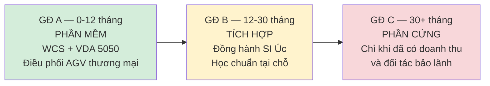

# Thị trường Úc — Bản hiệu chỉnh & chiến lược thâm nhập
## AS/RS + AGV/AMR · iZiiApp Ecosystem

> **Hiệu chỉnh cho:** `plan/Ke_Hoach_Mo_Phong_Va_Phat_Trien_Thi_Truong_Uc_ASRS_AGV.md`
>
> **Tài liệu nền:**
> - `integrate/iZiiApp_Thiet_Ke_He_Dieu_Khien_RealTime.md`
> - `integrate/iZiiApp_GiaiDoan1_MachAnToan_Cat3.md`
> - `integrate/iZiiApp_Ke_Hoach_Tich_Hop_LoRaWAN.md`
>
> **Toàn bộ số hiệu tiêu chuẩn trong tài liệu này đã được xác minh** — xem Phụ lục A.

---

## 0. Tóm tắt hiệu chỉnh

Kế hoạch gốc có **một ý tưởng chiến lược rất tốt** (VDA 5050 — mục 5) và ba vấn đề
cần sửa trước khi mang ra bàn với đối tác Úc:

| # | Vấn đề | Mức độ |
|---|---|---|
| 1 | Sai số hiệu tiêu chuẩn AGV: **"AS ISO 3691.4" không tồn tại**. Đúng là **AS 5144.4:2021** | 🔴 Sửa ngay |
| 2 | **Thiếu hoàn toàn nghĩa vụ thượng nguồn WHS ss.22–26** — đây mới là điều luật áp lên *chính bạn* | 🔴 Rủi ro pháp lý lớn nhất |
| 3 | Phân khúc kho lạnh có **rào cản kỹ thuật chưa nhận diện**: laser scanner an toàn không hoạt động ở −25 °C | 🟠 Đổi kiến trúc, không phải đổi linh kiện |
| 4 | Chiến lược "đóng gói STM32 thành mô-đun có chứng nhận" đánh giá thấp chi phí và thời gian | 🟠 Đề xuất đảo thứ tự — mục 2 |
| 5 | LoRaWAN Úc dùng **AU915**, khác AS923 của Việt Nam — không tái sử dụng phần cứng được | 🟡 Ghi nhận sớm |

---

## 1. Khung pháp lý Úc — phần kế hoạch gốc bỏ sót nhiều nhất

### 1.1 Số hiệu tiêu chuẩn đã xác minh

| Lĩnh vực | Kế hoạch gốc ghi | **Đúng phải là** |
|---|---|---|
| AGV / AMR | ~~AS ISO 3691.4~~ | **AS 5144.4:2021** — *Industrial trucks — Safety requirements and verification, Part 4: Driverless industrial trucks and their systems (ISO 3691-4:2020, MOD)* |
| An toàn máy | AS/NZS 4024 ✅ | **AS/NZS 4024:2019 series** — 26 phần, dựa trên EN/ISO có sửa đổi cho Úc |
| Tủ điện máy | AS/NZS 60204.1 ✅ | Đúng |
| Đi dây | AS/NZS 3000 ✅ | Đúng (*Wiring Rules*) |
| Pallet | AS 4068, 1165×1165 mm ✅ | Đúng — kích thước tải trong 865 mm, khối lượng pallet không tải 30–40 kg |
| EMC/RF | RCM ✅ | Đúng — do ACMA quản lý |

> **Chi tiết quan trọng về AS 5144.4:** bản Úc năm 2021 chấp nhận **ISO 3691-4:2020**
> (có sửa đổi), trong khi ISO đã ra bản **2023**. Nghĩa là tiêu chuẩn Úc đang *đi
> sau* một phiên bản.
>
> **Cách xử lý đúng:** thiết kế theo ISO 3691-4:**2023** (mức cao hơn), nhưng **lập
> hồ sơ tuân thủ viện dẫn AS 5144.4:2021**. Vượt chuẩn thì không ai phản đối; viện
> dẫn sai số hiệu thì hồ sơ bị trả lại.

### 1.2 Nghĩa vụ thượng nguồn — điều luật áp lên chính bạn

Đây là khoảng trống nghiêm trọng nhất của kế hoạch gốc. Kế hoạch nhấn mạnh
*industrial manslaughter*, nhưng tội danh đó chủ yếu áp lên **bên vận hành**
(PCBU sở hữu kho). Điều áp lên **bạn** — với tư cách người thiết kế và cung cấp —
là **Mục 22–26 của WHS Act**:

| Mục | Áp cho ai | Nghĩa vụ |
|---|---|---|
| **s.22** | **Người thiết kế** (designer) | Bảo đảm thiết kế không có rủi ro, *so far as is reasonably practicable*. Phải **tiến hành thử nghiệm/phân tích** và **cung cấp kết quả** cho bên nhận thiết kế |
| **s.23** | Người chế tạo | Tương tự, cho khâu chế tạo |
| **s.24** | **Người nhập khẩu** (importer) | Áp cho bên đưa thiết bị vào Úc — **kể cả khi nhà thiết kế ở nước ngoài** |
| **s.25** | Người cung cấp | Áp cho bên bán/cho thuê |
| **s.26** | Người lắp đặt, chạy thử | Áp cho khâu installation/commissioning |

**Vì sao điều này quyết định chiến lược:**

Nếu bạn thiết kế bộ điều khiển AS/RS tại Việt Nam và nó được đưa vào Úc, **s.22 áp
trực tiếp lên bạn** với tư cách designer, và **s.24 áp lên bên nhập khẩu**. Nghĩa
vụ này **không thể chuyển giao bằng hợp đồng** — đó là điểm cốt lõi của mô hình
WHS Úc. Bạn không thể ghi trong hợp đồng "khách hàng chịu trách nhiệm an toàn" và
coi như xong.

s.22(4)–(5) còn yêu cầu người thiết kế **chủ động cung cấp** thông tin: mục đích
thiết kế, kết quả thử nghiệm và phân tích, và các điều kiện cần thiết để bảo đảm
an toàn trong suốt vòng đời. Nói cách khác: **hồ sơ kỹ thuật không phải tuỳ chọn,
nó là nghĩa vụ luật định.**

### 1.3 Industrial manslaughter — hiện đã phủ toàn quốc

Kế hoạch gốc nói tội danh này "nghiêm khắc" nhưng không nêu quy mô. Số liệu đã
xác minh:

| Bang / Vùng | Năm ban hành | Mức phạt tối đa |
|---|---|---|
| ACT | 2004 | — |
| Queensland | 2017 | — |
| NT | 2020 | **Tù chung thân** cá nhân; ~11,44 triệu AUD pháp nhân |
| Victoria | 2020 | — |
| WA | 2022 | — |
| SA + Liên bang | 2023 | Liên bang: 25 năm tù; 18 triệu AUD |
| Tasmania | 10/2024 | 21 năm tù; 18 triệu AUD |
| **NSW** | 2024 | **25 năm tù; 20 triệu AUD** — cao nhất nước Úc |

**Hiện đã có ở tất cả các bang và vùng lãnh thổ.** NSW và Victoria là hai bang tập
trung kho vận lớn nhất — cũng là nơi bạn sẽ bán hàng đầu tiên.

### 1.4 Đăng ký thiết kế thiết bị (Plant Design Registration)

Phụ lục 5 (Schedule 5) của WHS Regulations liệt kê các loại thiết bị phải **đăng
ký thiết kế** trước khi được chế tạo hoặc cung cấp. Nguyên tắc:

> Nhà chế tạo **chỉ được** chế tạo từ một thiết kế **đã đăng ký**.
> Nhà cung cấp **chỉ được** cung cấp thiết bị có thiết kế **đã đăng ký**.

⚠️ **Cần xác nhận trực tiếp với cơ quan quản lý bang** (SafeWork NSW, WorkSafe VIC,
WorkSafe QLD) xem **stacker crane AS/RS có thuộc diện phải đăng ký** hay không.
Tôi không xác định được điều này từ nguồn công khai với độ chắc chắn đủ để bạn ra
quyết định — và đây là câu hỏi có thể làm thay đổi cả lộ trình.

**Hỏi trước, đừng thiết kế trước.** Nếu thuộc diện đăng ký, quy trình mất hàng
tháng và cần hồ sơ do kỹ sư có chứng chỉ tại Úc ký.

---

## 2. Hệ quả chiến lược: đảo thứ tự — phần mềm trước, phần cứng sau

Kế hoạch gốc (mục 2.1.3) đề xuất "đóng gói bộ điều khiển STM32 thành mô-đun công
nghiệp tiêu chuẩn (CE/RCM certified)". Hướng đi đúng, nhưng đánh giá thấp đáng kể
chi phí và thời gian.

### 2.1 Chi phí thật của con đường phần cứng

| Hạng mục | Thời gian | Ghi chú |
|---|---|---|
| Chứng nhận EMC + RCM | 3–6 tháng | Cần phòng thử nghiệm được công nhận |
| Hồ sơ ISO 13849 / AS/NZS 4024 đầy đủ | 3–6 tháng | Tính PFHd, CCF, kiểm chứng theo 13849-2 |
| Đăng ký thiết kế thiết bị (nếu áp dụng) | 2–6 tháng | Cần kỹ sư có chứng chỉ tại Úc ký |
| Bảo hiểm trách nhiệm sản phẩm | — | Phí cao khi là thiết bị tự thiết kế, chưa có lịch sử |
| Pháp nhân + đại diện tại Úc | 1–3 tháng | Cần cho nghĩa vụ nhập khẩu s.24 |
| **Tổng thực tế** | **12–24 tháng** | Trước khi bán được đơn vị đầu tiên |

Và sau tất cả, bạn vẫn cạnh tranh với Dematic, Dexion, Swisslog — những bên đã có
sẵn toàn bộ hạ tầng đó.

### 2.2 Con đường phần mềm

| Hạng mục | Áp dụng? |
|---|---|
| Chứng nhận RCM / EMC | ❌ Không — phần mềm không phát sóng |
| Đăng ký thiết kế thiết bị | ❌ Không |
| WHS ss.22–26 nghĩa vụ *plant* | ❌ Không, **miễn là phần mềm không thực hiện chức năng an toàn** |
| ISO 13849 phần mềm an toàn | ❌ Không, nếu giữ đúng ranh giới đã thiết kế |
| Rào cản gia nhập | **Thấp** |

Điều kiện đi kèm — và nó chính là kiến trúc bạn **đã** thiết kế trong
`iZiiApp_Thiet_Ke_He_Dieu_Khien_RealTime.md` mục 3.1:

> **iZiiApp không bao giờ nằm trong một vòng điều khiển, và không bao giờ thực
> hiện chức năng an toàn.**

Nguyên tắc kiến trúc đó, vốn đặt ra vì lý do kỹ thuật, hoá ra cũng chính là **lá
chắn pháp lý** khi vào thị trường Úc. Giữ nó tuyệt đối sạch.

### 2.3 Đề xuất ba giai đoạn



**Giai đoạn A — bán phần mềm điều phối.** Khách hàng đã có AGV thương mại (Geek+,
Hai Robotics, OTTO). Bạn bán lớp điều phối + WMS + tích hợp ERP. Không đụng phần
cứng, không đụng an toàn. **Đây là nơi iZiiApp thực sự khác biệt.**

**Giai đoạn B — đồng hành với SI Úc.** Bạn làm phần mềm, SI chịu trách nhiệm thiết
bị và tuân thủ. Học được chuẩn thực tế, xây được hồ sơ năng lực, có người tham
chiếu tại Úc.

**Giai đoạn C — phần cứng, nếu vẫn muốn.** Sau khi đã có doanh thu, quan hệ, và
hiểu biết thực tế. Bộ điều khiển STM32 mà chúng ta đã thiết kế vẫn giữ nguyên giá
trị — **cho thị trường Việt Nam và cho việc học**, chỉ là chưa nên là mũi nhọn
thâm nhập Úc.

> Đây không phải lời khuyên từ bỏ phần cứng. Toàn bộ công sức ở `phase1/` và tài
> liệu mạch an toàn Cat 3 vẫn đúng và vẫn dùng được. Vấn đề chỉ là **thứ tự**:
> phần cứng tự thiết kế là con đường 12–24 tháng và rủi ro pháp lý cao **để bắt
> đầu**; phần mềm là con đường vài tháng và rủi ro thấp.

---

## 3. Lộ trình mô phỏng — hiệu chỉnh

Kiến trúc 4 cấp của kế hoạch gốc hợp lý. Ba điều cần làm rõ:

### 3.1 Factory I/O kiểm thử được gì và KHÔNG kiểm thử được gì

| Kiểm thử được ✅ | KHÔNG kiểm thử được ❌ |
|---|---|
| Trình tự logic, máy trạng thái PackML | **Thời gian đáp ứng vòng điều khiển** |
| Luồng I/O, ánh xạ tín hiệu cảm biến | **Jitter, WCET, khả năng lập lịch** |
| Điều phối đơn hàng, `idempotency_key` | **Động lực học cột mast** |
| Kịch bản kẹt pallet, chệch tải | **Bất kỳ chức năng an toàn nào** |

Factory I/O nối qua **Modbus TCP** — giao thức **không tất định**. Nó rất tốt để
xác minh *máy trạng thái đúng trình tự*, nhưng không thể xác minh *deadline 1 ms*.
Đừng để sơ đồ kết nối tạo cảm giác nó thay thế được phân tích lịch biểu ở mục 4.3
tài liệu thiết kế.

### 3.2 An toàn KHÔNG kiểm chứng được bằng mô phỏng

Điều này cần nói thẳng vì kế hoạch gốc có mục "Mô phỏng an toàn & Tiêm lỗi":

> Mô phỏng giúp **thiết kế** chức năng an toàn. Nó **không** kiểm chứng được.

ISO 13849-2 (và AS/NZS 4024 tương ứng) yêu cầu **tiêm lỗi vật lý trên phần cứng
thật**: rút từng kênh, chập chéo, hàn dính tiếp điểm. Xem mục 7 tài liệu
`iZiiApp_GiaiDoan1_MachAnToan_Cat3.md` — 10 phép thử ở đó **không có phép nào làm
được trong Factory I/O**.

Mô phỏng CoDeSys SoftPLC như kế hoạch đề xuất là hữu ích để *thiết kế logic an
toàn*, nhưng hồ sơ kiểm chứng phải dựa trên thiết bị thật, có chứng nhận.

### 3.3 Bổ sung: mô phỏng đã có sẵn một phần

`phase1/common/control_core.c` đã chạy được trên host và có bộ test 58/58. Đó
chính là **SIL cấp thấp nhất** và nó đã hoạt động. Bước tiếp theo hợp lý:

```
control_core.c (đã có, 58/58 đạt)
        │
        ├──► Ghép mô hình dầm mast bằng Python/Simulink  ← GĐ tiếp theo
        │    Kiểm chứng ZVD với ω_n(h) thay đổi
        │
        └──► Ghép Factory I/O qua Modbus TCP
             Kiểm chứng PackML + luồng đơn hàng
```

Đừng bắt đầu bằng Factory I/O. Bắt đầu bằng mô hình dầm mast, vì đó là thứ quyết
định liệu thuật toán chống lắc có hoạt động hay không — và nó rẻ hơn nhiều.

---

## 4. Phân khúc thị trường — hiệu chỉnh kỹ thuật

### 4.1 Kho lạnh −25 °C: rào cản chưa được nhận diện

Kế hoạch gốc viết *"AS/RS và AGV thiết kế chịu dải nhiệt −25 °C"* như thể đó chỉ
là lựa chọn vật liệu. Có một vấn đề cứng hơn nhiều:

> **Laser scanner an toàn không hoạt động ở −25 °C.**
>
> SICK microScan3 — chính model kế hoạch gốc nêu tên:
> - Nhiệt độ **hoạt động**: **−10 °C … +50 °C**
> - Nhiệt độ **lưu kho**: −25 °C … +70 °C
>
> Con số −25 °C là điều kiện *cất giữ khi không dùng*, không phải điều kiện vận hành.

Đây là thiết bị mà AS 5144.4 yêu cầu để phát hiện người. Không có nó, kiến trúc an
toàn dựa trên "phát hiện người trong vùng" **sụp đổ**.

**Ba hướng xử lý, theo thứ tự tôi khuyến nghị:**

| Hướng | Đánh giá |
|---|---|
| **1. Loại trừ người khỏi vùng tự động** ✅ | Rào cứng + khoá liên động cửa. Không cần phát hiện người vì không có người. **Đây là cách ngành kho lạnh thực sự làm.** Rẻ hơn, chắc chắn hơn, dễ chứng minh tuân thủ hơn |
| 2. Vỏ gia nhiệt cho scanner | ⚠️ Cửa sổ quang phải không đọng sương/đóng băng. **Sửa đổi đường quang của thiết bị an toàn có thể làm mất hiệu lực chứng nhận** — phải có xác nhận bằng văn bản của nhà sản xuất |
| 3. Tìm model chuyên dụng nhiệt độ thấp | Hỏi trực tiếp SICK/Pilz/Omron. Có thể có, nhưng đắt và ít lựa chọn |

Hướng 1 cũng đơn giản hoá toàn bộ bài toán: trong vùng loại trừ người, bạn có thể
chạy nhanh hơn (không cần SLS), không cần tính quãng đường dừng theo ISO 13855 cho
người, và hồ sơ an toàn gọn hơn nhiều.

**Điểm kỹ thuật thứ hai về kho lạnh** mà kế hoạch chưa nêu: **đọng sương khi
chuyển vùng nhiệt**. Thiết bị đi từ −25 °C ra khu vực +25 °C sẽ đọng nước và đóng
băng ở chu kỳ sau. Đây là nguyên nhân hỏng điện tử phổ biến nhất trong kho lạnh
tự động, và nó ảnh hưởng đến thiết kế vỏ, sưởi, và quy trình bảo trì.

### 4.2 Pallet Úc — kế hoạch gốc đúng, bổ sung chi tiết

1165 × 1165 mm theo AS 4068 là đúng. Bổ sung số liệu thiết kế:

| Thông số | Giá trị |
|---|---|
| Kích thước | 1165 × 1165 mm (vuông) |
| Chiều cao pallet | ~150 mm |
| Khối lượng pallet không tải | 30–40 kg |
| Tải trọng | tới ~2 000 kg tuỳ kết cấu |
| Kích thước tải trong | 865 mm |

Pallet **vuông** là khác biệt lớn so với Euro pallet chữ nhật: nĩa gắp có thể tiếp
cận cả bốn phía, nhưng ô kho và ray phải thiết kế lại hoàn toàn. Nguồn gốc thiết
kế vuông là để vừa hệ container đường sắt RACE của Úc.

⚠️ Lưu ý thực tế: nhiều kho 3PL tại Úc dùng **cả** pallet Úc lẫn Euro pallet. Đừng
thiết kế chỉ cho một loại — hỏi khách hàng tỉ lệ thực tế.

### 4.3 Micro-Fulfillment — phân khúc hợp lý nhất để bắt đầu

Trong ba phân khúc kế hoạch nêu, MFC là lựa chọn tốt nhất cho giai đoạn A vì:

- Quy mô nhỏ hơn ⇒ rủi ro dự án thấp hơn
- Miniload nhẹ hơn ⇒ hậu quả sự cố nhỏ hơn AS/RS pallet nặng
- Không có bài toán −25 °C
- Nhiệt độ phòng ⇒ không giới hạn thiết bị an toàn

---

## 5. VDA 5050 — phần mạnh nhất của kế hoạch, nên làm trọng tâm

Đây là ý tưởng sắc nhất trong kế hoạch gốc và tôi khuyên **nâng nó lên thành chiến
lược chính**, không phải một mục phụ.

### 5.1 Thông tin đã xác minh

- Phiên bản hiện hành: **VDA 5050 v2.1.0**, công bố **tháng 1/2025** bởi VDA và VDMA
- Truyền tải qua **MQTT**, dữ liệu **JSON**
- Định nghĩa rõ cấu trúc bản tin và MQTT topic giữa *master control* và xe
- Mục tiêu: cho phép **trộn nhiều hãng AGV/AMR** dưới một hệ điều phối duy nhất

### 5.2 Vì sao đây là đòn bẩy đúng cho bạn

| Lý do | Giải thích |
|---|---|
| **Không cần tự làm xe** | Khách hàng mua AGV có chứng nhận sẵn; bạn bán lớp điều phối |
| **Không chạm an toàn** | An toàn nằm trên xe, thuộc trách nhiệm hãng xe |
| **Rào cản gia nhập thấp** | MQTT + JSON — đúng thứ iZiiApp đã làm tốt |
| **Chống bị khoá nhà cung cấp** | Lập luận bán hàng mạnh với khách Úc vốn ngại phụ thuộc một hãng |
| **Hợp với hạ tầng sẵn có** | `server/event_engine.py` đã có cơ chế MQTT-like; `routers/webhooks.py` đã chạy |

### 5.3 Ranh giới cần giữ

VDA 5050 là giao diện **điều phối nhiệm vụ**, không phải giao diện điều khiển. Vẫn
đúng nguyên tắc ở mục 3.1 tài liệu thiết kế:

```
iZiiApp/WCS  ──VDA 5050 (MQTT/JSON)──►  AGV
             "đi tới điểm A, lấy pallet"

AGV tự lo:  điều hướng · tránh va chạm · dừng bảo vệ · SLS
            ↑ Toàn bộ phần an toàn nằm ở đây, không phải ở bạn
```

---

## 6. LoRaWAN tại Úc — không tái sử dụng phần cứng Việt Nam

Kế hoạch gốc đề xuất dùng LoRaWAN cho giám sát từ xa (mục 2.3.3) — hợp lý, đặc
biệt với khoảng cách giữa các bang. Nhưng có một điểm phần cứng phải biết trước:

| | Việt Nam | **Úc** |
|---|---|---|
| Băng tần | AS923 (920–925 MHz) | **AU915 (915–928 MHz)** |
| Khung pháp lý | Cục Tần số Vô tuyến điện | **ACMA — LIPD Class Licence** |
| Công suất tối đa | Theo quy định VN | **1 W EIRP** (nhảy tần hoặc điều chế số) |
| Kênh uplink | — | 64 kênh 125 kHz + 8 kênh 500 kHz |
| Điều kiện | — | Nhảy tần cần **tối thiểu 20 tần số** |

**Hệ quả:** thiết bị mua cho dự án Việt Nam **không dùng được** tại Úc. Phải mua
bản AU915 riêng. Đây là điều cần đưa vào dự toán ngay từ đầu, không phải phát hiện
lúc hàng đã về.

Điểm cộng: LoRaWAN không cần giấy phép riêng ở Úc — nó nằm trong **LIPD Class
Licence** của ACMA, tức là dùng được ngay nếu thiết bị tuân thủ. Nhưng thiết bị
vẫn cần **RCM** để được cung cấp hợp pháp tại Úc.

---

## 7. Go-To-Market — hiệu chỉnh

### 7.1 Về danh sách "đối tác" trong kế hoạch gốc

Kế hoạch liệt kê Dexion, Dematic, Swisslog, Körber là đối tác tiềm năng. Cần phân
biệt rõ hơn:

| Bên | Thực tế tại Úc | Vai trò khả dĩ |
|---|---|---|
| **Dematic** | Hiện diện lớn tại Úc, tự làm AS/RS | **Đối thủ** ở phần cứng; khó là đối tác |
| **Dexion** | Thương hiệu gốc Úc, mạnh về giá kệ | Đối thủ/đối tác tuỳ phạm vi |
| **Swisslog, Körber** | Có mặt tại Úc | Tương tự |
| **SI cơ điện nội địa vừa và nhỏ** | Nhiều, ít năng lực phần mềm | ✅ **Đối tác thật sự** |

Nhóm cuối mới là nơi bạn có giá trị bổ sung: họ giỏi lắp đặt cơ điện và hiểu chuẩn
Úc, nhưng thường yếu về WCS/WMS. Đó đúng là chỗ trống của bạn.

### 7.2 Về mô hình RaaS

Kế hoạch đề xuất RaaS để chuyển CapEx sang OpEx. Ý tưởng đúng với thị trường SME
Úc, nhưng có hai điều kiện ít được nói tới:

1. **RaaS đòi hỏi vốn lưu động lớn.** Bạn bỏ tiền mua thiết bị trước, thu lại dần
   trong 3–5 năm. Với doanh nghiệp mới vào thị trường, đây là gánh nặng dòng tiền
   nghiêm trọng.
2. **RaaS làm bạn thành chủ sở hữu thiết bị** — và do đó kéo theo nghĩa vụ WHS ở
   vai trò cung cấp (s.25) và có thể cả bảo trì. Ngược với mục tiêu giảm rủi ro
   pháp lý ở mục 2.

**Đề xuất:** giai đoạn A dùng mô hình **SaaS thuần phần mềm** (thuê bao WCS/WMS),
không phải RaaS. Nhẹ vốn, không sở hữu thiết bị, không gánh nghĩa vụ plant.

---

## 8. Lộ trình hành động đã hiệu chỉnh

Thay cho 3 bước trong kế hoạch gốc:

### Trước tiên — xác minh pháp lý (2–4 tuần, gần như không tốn tiền)

- [ ] Hỏi SafeWork NSW / WorkSafe VIC: **stacker crane AS/RS có thuộc diện đăng ký
      thiết kế theo Schedule 5 không?**
- [ ] Mua và đọc **AS 5144.4:2021** và các phần liên quan của **AS/NZS 4024:2019**
- [ ] Tư vấn luật sư WHS Úc về phạm vi ss.22–26 khi **chỉ cung cấp phần mềm**
- [ ] Xác nhận: phần mềm WCS không thực hiện chức năng an toàn thì có nằm ngoài
      định nghĩa *plant* không

Bước này quyết định mọi thứ phía sau. Làm trước khi viết dòng code nào cho Úc.

### Song song — kiểm chứng kỹ thuật (4–8 tuần)

- [ ] Mô hình dầm mast (Python hoặc Simulink), ghép với `control_core.c` đã có
- [ ] Kiểm chứng ZVD với ω_n(h) thay đổi theo chiều cao
- [ ] Dựng Factory I/O + Modbus TCP để kiểm thử PackML và luồng đơn hàng
- [ ] Nguyên mẫu VDA 5050 v2.1.0: publisher/subscriber MQTT trên nền
      `server/event_engine.py`

### Giai đoạn A — vào thị trường bằng phần mềm (6–12 tháng)

- [ ] Hoàn thiện WCS hỗ trợ VDA 5050 v2.1.0
- [ ] Connector ERP: ưu tiên **Pronto Xi** (rất phổ biến ở Úc, ít đối thủ quốc tế
      hỗ trợ) và **MYOB Advanced**, trước SAP/NetSuite
- [ ] Tìm 2–3 SI cơ điện nội địa để làm dự án tham chiếu
- [ ] Mục tiêu: một khách hàng MFC quy mô nhỏ, dùng AGV thương mại sẵn có

---

## Phụ lục A — Kiểm chứng

### A.1 Đã xác minh từ nguồn chính thức

| Nội dung | Kết quả | Nguồn |
|---|---|---|
| Tiêu chuẩn AGV Úc | **AS 5144.4:2021** (ISO 3691-4:2020, MOD) | Standards Australia Store |
| An toàn máy | AS/NZS 4024:2019 series, 26 phần | Standards Australia |
| Pallet Úc | AS 4068, 1165×1165 mm, tải trong 865 mm | Nhiều nguồn ngành |
| WHS ss.22–26 | Nghĩa vụ designer/manufacturer/importer/supplier/installer | Safe Work Australia, Comcare |
| Industrial manslaughter | Đã có ở **toàn bộ** bang/vùng; NSW 25 năm/20 triệu AUD; NT chung thân | Nhiều nguồn pháp lý |
| LoRaWAN Úc | AU915, 915–928 MHz, LIPD Class Licence, 1 W EIRP | ACMA |
| VDA 5050 | **v2.1.0, tháng 1/2025**, MQTT + JSON | VDA/VDMA |
| SICK microScan3 | Hoạt động **−10 … +50 °C**; lưu kho −25 … +70 °C | Datasheet SICK |

### A.2 Chưa xác minh được — cần bạn hỏi trực tiếp

- **Stacker crane AS/RS có thuộc Schedule 5 (đăng ký thiết kế) không.** Nguồn công
  khai nêu "cranes" nhưng không rõ có bao gồm S/R machine hay không. Đây là câu
  hỏi có thể thay đổi lộ trình — hỏi cơ quan quản lý bang, bằng văn bản.
- **Phần mềm WCS có bị coi là một phần của *plant* theo WHS không**, khi nó phát
  lệnh vận hành nhưng không thực hiện chức năng an toàn. Cần ý kiến luật sư WHS Úc.
- Có model laser scanner an toàn nào hoạt động được ở −25 °C không — hỏi trực tiếp
  SICK/Pilz/Omron Australia.
- Chi phí và thời gian RCM thực tế cho một mô-đun điều khiển — hỏi phòng thử
  nghiệm được ACMA công nhận.

### A.3 Giới hạn của tài liệu này

Tôi không phải luật sư và không phải kỹ sư an toàn được chứng nhận tại Úc. Tài
liệu này là **phân tích kỹ thuật và chiến lược**, không phải ý kiến pháp lý. Các
mục 1.2, 1.3, 1.4 và 2 có hệ quả pháp lý trực tiếp và **cần được luật sư WHS Úc
xác nhận trước khi ra quyết định đầu tư**.

Chi phí một buổi tư vấn luật sư WHS rẻ hơn rất nhiều so với việc phát hiện sai
lầm sau khi đã bỏ 18 tháng vào chứng nhận sai hướng.
