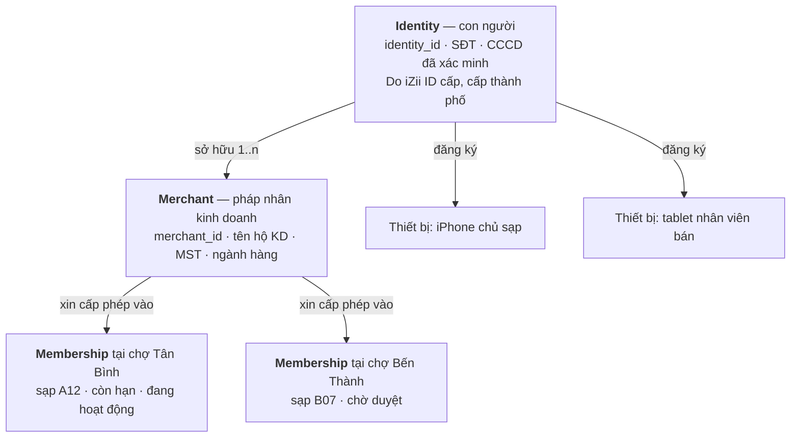
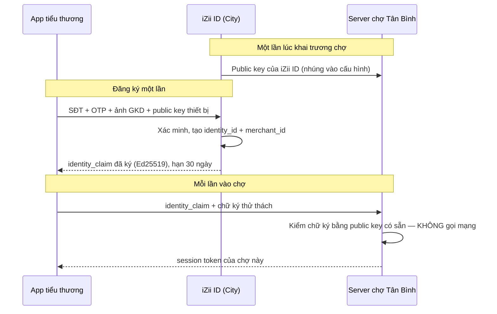
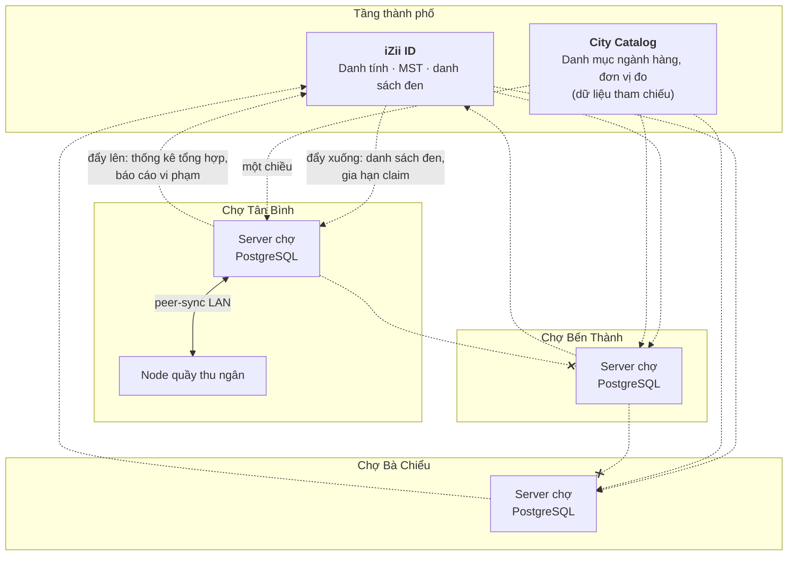

# iZiiMarket — Thiết kế hệ thống

> Module mới: nhiều chợ ở nhiều vùng của thành phố, hộ kinh doanh / cá nhân tự
> đăng ký. Tài liệu này bàn **kiến trúc**, chưa phải kế hoạch thi công chi tiết.
>
> Ba lựa chọn đã chốt:
> - Phạm vi: **cả 3 (sổ đăng ký → B2C → B2B), làm dần**
> - Danh tính: **một tài khoản, nhiều chợ**
> - Sản phẩm bước này: tài liệu thiết kế

---

## 0. Kết luận trước, lý lẽ sau

Tái sử dụng được nhiều hơn bạn nghĩ ở **tầng vận chuyển** (mesh, mutation log,
delta sync, device keypair, NFC/QR), nhưng **mô hình tin cậy phải viết lại từ
đầu**. Đây là điểm quan trọng nhất của cả tài liệu:

> **iZii hiện tại là hệ ĐÓNG** — một công ty, mọi thiết bị enrolled đều đáng tin,
> một secret dùng chung cho cả hệ thống.
> **iZiiMarket là hệ MỞ** — người lạ tự đăng ký, các tiểu thương **cạnh tranh
> nhau**, và có tiền chạy qua.

Nếu bê nguyên `IZIIAPP_SERVER_SECRET` + `/sync/pull` sang Market thì bất kỳ tiểu
thương nào cũng kéo được toàn bộ đơn hàng của người bên cạnh. Đó không phải lỗi
cấu hình — đó là hệ quả tất yếu của thiết kế hiện tại, vốn được xây cho hoàn cảnh
khác.

Ba quyết định kiến trúc lớn:

1. **Danh tính tách khỏi chợ** — một cơ quan cấp danh tính cấp thành phố (iZii
   ID), mỗi chợ tự xác minh chữ ký **offline**. Không gọi về trung tâm để kiểm
   từng request.
2. **Chợ KHÔNG peer-sync với nhau** — hình sao (City ↔ Market), không phải lưới
   như M1/M2/CR hiện nay.
3. **Mọi bản ghi có `tenant_id` + `visibility`; `/sync/pull` lọc theo quyền** —
   cách ly dữ liệu là mặc định, không phải tính năng thêm sau.

---

## 1. Khác biệt cốt lõi so với iZii nội bộ

| | **iZii hiện tại** (Costa Mushroom) | **iZiiMarket** |
|---|---|---|
| Ai vào hệ thống | Nhân viên công ty | Người lạ tự đăng ký |
| Ai duyệt | Admin cấp vé mời từng máy | Tự phục vụ + xác minh giấy tờ/OTP |
| Quan hệ giữa người dùng | Đồng nghiệp, hợp tác | **Đối thủ cạnh tranh** |
| Dữ liệu thấy được | Ai enrolled cũng thấy gần hết | Chỉ thấy phần của mình + phần công khai |
| Secret | Một secret chung cả hệ thống | Không thể có secret chung |
| Số node | 3 zone cố định (M1/M2/CR) | Hàng chục chợ, thêm/bớt liên tục |
| Quan hệ giữa node | Lưới đầy đủ, sao chép hết | Hình sao, sao chép có chọn lọc |
| Hậu quả khi sai | Dữ liệu sản xuất sai | **Mất tiền, kiện tụng, lộ thông tin KH** |
| Tải | ~50 thiết bị, mạng LAN | Hàng ngàn, có lưu lượng công khai từ Internet |
| Database | SQLite đủ dùng | **PostgreSQL ngay từ đầu** |

Bảng này không phải để chê thiết kế hiện tại. Thiết kế hiện tại **đúng** cho bài
toán của nó — một trại nấm mất mạng vẫn phải ghi được nhiệt độ phòng. Vấn đề là
những giả định làm nó đúng lại không còn đúng ở Market.

---

## 2. Mô hình danh tính ba tầng

Đây là câu trả lời cho "một tài khoản, nhiều chợ".



**Vì sao phải tách ba tầng thay vì một bảng `users`:**

- Một người có thể có 2 hộ kinh doanh (rau và thịt) — quy định phí, thuế, đánh
  giá phải tách riêng.
- Một hộ kinh doanh bán ở 3 chợ — mỗi chợ có mã sạp, hạn hợp đồng, trạng thái
  đình chỉ **riêng**. Ban quản lý chợ Tân Bình đình chỉ không được phép làm sập
  gian hàng ở Bến Thành.
- Thiết bị gắn với **con người**, không gắn với hộ kinh doanh — chủ sạp mất điện
  thoại thì thu hồi thiết bị, không mất luôn gian hàng.

Đây chính là mô hình `profile: shared | personal` bạn vừa làm, mở rộng ra: máy
của chủ sạp = `personal` (danh tính cố định), tablet dùng chung ở sạp =
`shared` (phải điểm danh xem nhân viên nào đang bán). **Toàn bộ code điểm danh
tái sử dụng gần như nguyên vẹn.**

### 2.1 iZii ID hoạt động thế nào — và vì sao không cần gọi về trung tâm

Vấn đề kinh điển: nếu mỗi lần tiểu thương mở app mà chợ phải hỏi trung tâm "người
này có thật không", thì đứt cáp là cả chợ đứng.

Giải pháp là mô hình **chứng chỉ**, không phải mô hình **tra cứu**:



Ba tính chất quan trọng:

- **Chợ xác minh offline.** Chữ ký bất đối xứng — chợ chỉ cần public key, giữ
  sẵn từ trước. Đứt Internet, chợ vẫn hoạt động bình thường.
- **Chợ không giữ được bí mật của ai.** Server chợ bị chiếm cũng không giả mạo
  được tiểu thương ở chợ khác, vì nó không có private key của iZii ID.
- **Claim ngắn hạn.** 30 ngày. Thu hồi bằng cách không gia hạn, cộng thêm danh
  sách đen đẩy xuống theo chu kỳ. Không cần thu hồi tức thời — nếu cần tức thời
  thì đó là dấu hiệu thiết kế sai.

Hạ tầng cho việc này **đã có sẵn**: `device_identity_service.dart` đang sinh
cặp Ed25519 và lưu vào secure storage của OS. Chỉ cần thêm phần server ký claim.

---

## 3. Topology — hình sao, không phải lưới

Đây là chỗ dễ sai nhất khi mở rộng từ code hiện tại.



**Chợ không nối trực tiếp với chợ** (đường gạch chéo). Ba lý do:

1. **Pháp lý.** Ban quản lý chợ A không có quyền xem dữ liệu bán hàng ở chợ B.
   Nối trực tiếp là tạo ra con đường để chuyện đó xảy ra.
2. **Vận hành.** Lưới đầy đủ với N chợ cần N×(N−1)/2 kết nối. 20 chợ = 190 cặp.
   Thêm một chợ mới phải cấu hình lại 20 server.
3. **Thực tế thì không cần.** Thứ duy nhất cần đi xuyên chợ là danh tính và
   danh sách đen — cả hai đều đi qua trung tâm.

**Trong một chợ vẫn dùng lưới** như M1/M2/CR hiện nay: server chính + node quầy
thu ngân + node cổng cân, đồng bộ qua LAN, mDNS tự tìm nhau. Toàn bộ
`peer_sync.py` và `discovery` tái sử dụng nguyên vẹn ở tầng này.

**Tiểu thương bán nhiều chợ xem báo cáo tổng thế nào?** App tự gọi từng chợ rồi
cộng lại ở client. Đừng bắt các chợ đồng bộ với nhau chỉ để phục vụ một màn hình
báo cáo — client làm được thì để client làm.

---

## 4. Phân vùng dữ liệu và sync có lọc

### 4.1 Ba lớp dữ liệu

| Lớp | Ví dụ | Ghi ở đâu | Chảy đi đâu |
|---|---|---|---|
| **City** | identity, merchant, ngành hàng, danh sách đen | Chỉ iZii ID | Một chiều xuống mọi chợ |
| **Market** | sạp, hợp đồng thuê, phí, kiểm tra ATTP, đơn hàng | Server chợ | Chỉ trong chợ đó |
| **Tenant** | tồn kho, giá, khách hàng của một tiểu thương | Server chợ, gắn `tenant_id` | Chỉ thiết bị của tenant đó |

### 4.2 Sync có lọc — thay đổi bắt buộc với `/sync/pull`

Hiện tại `/sync/pull` trả **mọi mutation** sau `cursor`. Ở Market đó là rò rỉ dữ
liệu. Cần ba thay đổi:

```sql
-- Mỗi mutation mang theo chủ sở hữu và mức hiển thị
ALTER TABLE sync_mutations ADD COLUMN tenant_id  TEXT;
ALTER TABLE sync_mutations ADD COLUMN market_id  TEXT NOT NULL;
ALTER TABLE sync_mutations ADD COLUMN visibility TEXT NOT NULL DEFAULT 'tenant';
-- visibility: 'tenant' | 'market' | 'public'
CREATE INDEX idx_mut_scope ON sync_mutations (market_id, visibility, seq);
CREATE INDEX idx_mut_tenant ON sync_mutations (tenant_id, seq);
```

```python
# Ý tưởng truy vấn — KHÔNG bao giờ trả về mutation ngoài phạm vi
WHERE market_id = :market
  AND seq > :cursor
  AND (
        visibility = 'public'
     OR (visibility = 'market'  AND :caller_is_market_staff)
     OR (visibility = 'tenant'  AND tenant_id = ANY(:caller_tenant_ids))
  )
```

**Hệ quả phải lường trước: con trỏ `seq` không còn dùng chung được.**

Nếu tiểu thương A lọc bỏ mutation của B, thì `seq` mà A nhận được sẽ có lỗ hổng.
A lưu `cursor = 900` nhưng thực tế chỉ có 12 bản ghi thuộc về A. Chuyện này
**không sai** — `seq` vẫn đơn điệu, `has_more` vẫn đúng — nhưng nó phá vỡ giả
định "cursor phản ánh số bản ghi". Mọi chỗ đang suy ra tiến độ từ `seq` phải rà
lại. Đây là loại lỗi chỉ lộ ra khi đã có dữ liệu thật.

Khuyến nghị: giữ nguyên cơ chế `seq` toàn cục (đơn giản, self-heal đã có), nhưng
**bỏ mọi UI hiển thị "còn N bản ghi" dựa trên hiệu số seq**.

### 4.3 Cách ly ở tầng database

Ba mức, chọn theo giai đoạn:

| Mức | Cách làm | Khi nào dùng |
|---|---|---|
| **Cột `tenant_id` + lọc ở app** | Như trên | Giai đoạn 0–1. Rẻ, nhanh, nhưng một câu WHERE viết thiếu là rò dữ liệu |
| **PostgreSQL Row-Level Security** | `CREATE POLICY ... USING (tenant_id = current_setting('app.tenant'))` | Giai đoạn 2 trở đi. Database chặn hộ, quên WHERE cũng không rò |
| **Schema riêng mỗi chợ** | `SET search_path` | Khi một server host nhiều chợ |

**Khuyến nghị mạnh: bật RLS từ giai đoạn 2**, ngay khi có đơn hàng thật. Lý do
đơn giản — số lượng câu truy vấn chỉ tăng, và xác suất một câu nào đó quên
`WHERE tenant_id` tiến tới 1 theo thời gian. RLS biến lỗi lập trình thành trả về
0 dòng thay vì rò dữ liệu người khác.

---

## 5. Schema đề xuất (rút gọn)

```sql
-- ══ TẦNG CITY (chỉ iZii ID ghi, các chợ nhận bản sao chỉ đọc) ══════════════
CREATE TABLE identities (
    identity_id     TEXT PRIMARY KEY,      -- ULID
    phone           TEXT UNIQUE NOT NULL,  -- đã xác minh OTP
    full_name       TEXT,
    id_doc_status   TEXT DEFAULT 'none',   -- none|pending|verified|rejected
    created_at      TIMESTAMPTZ NOT NULL,
    suspended_at    TIMESTAMPTZ
);

CREATE TABLE merchants (
    merchant_id     TEXT PRIMARY KEY,
    owner_identity  TEXT NOT NULL REFERENCES identities(identity_id),
    trade_name      TEXT NOT NULL,
    business_no     TEXT,                  -- số GCN hộ kinh doanh
    tax_code        TEXT,
    category        TEXT,                  -- tham chiếu City Catalog
    verify_status   TEXT DEFAULT 'unverified',
    created_at      TIMESTAMPTZ NOT NULL
);

-- ══ TẦNG MARKET (mỗi chợ một bản, không đồng bộ sang chợ khác) ═════════════
CREATE TABLE markets (
    market_id       TEXT PRIMARY KEY,      -- 'tanbinh'
    display_name    TEXT NOT NULL,
    district        TEXT,
    server_id       TEXT,                  -- nối với known_servers hiện có
    opens_at        TEXT,  closes_at  TEXT
);

CREATE TABLE stalls (                      -- sạp vật lý
    stall_id        TEXT PRIMARY KEY,
    market_id       TEXT NOT NULL,
    stall_code      TEXT NOT NULL,         -- 'A12'
    area_sqm        NUMERIC,
    zone            TEXT,                  -- khu rau / khu thịt
    UNIQUE (market_id, stall_code)
);

-- Bảng TRUNG TÂM của mô hình "một tài khoản, nhiều chợ"
CREATE TABLE market_memberships (
    membership_id   TEXT PRIMARY KEY,
    market_id       TEXT NOT NULL,
    merchant_id     TEXT NOT NULL,
    stall_id        TEXT REFERENCES stalls(stall_id),
    status          TEXT NOT NULL DEFAULT 'pending',
                    -- pending|approved|suspended|terminated
    lease_from      DATE,  lease_to    DATE,
    monthly_fee     NUMERIC(12,2),
    approved_by     TEXT,  approved_at TIMESTAMPTZ,
    UNIQUE (market_id, merchant_id)
);

-- ══ TẦNG TENANT (gắn tenant_id = merchant_id) ═════════════════════════════
CREATE TABLE listings (                    -- mặt hàng rao bán
    listing_id      TEXT PRIMARY KEY,
    tenant_id       TEXT NOT NULL,         -- merchant_id
    market_id       TEXT NOT NULL,
    name            TEXT NOT NULL,
    unit            TEXT NOT NULL,         -- kg | bó | con
    price           NUMERIC(12,2),
    price_type      TEXT DEFAULT 'fixed',  -- fixed | negotiable | wholesale
    stock_qty       NUMERIC(12,3),
    visibility      TEXT DEFAULT 'public',
    updated_at      TIMESTAMPTZ NOT NULL
);

CREATE TABLE market_orders (
    order_id        TEXT PRIMARY KEY,
    market_id       TEXT NOT NULL,
    seller_tenant   TEXT NOT NULL,
    buyer_identity  TEXT,                  -- NULL nếu khách vãng lai
    channel         TEXT DEFAULT 'b2c',    -- b2c | b2b
    status          TEXT NOT NULL,         -- draft|placed|accepted|ready|done|cancelled
    total           NUMERIC(12,2),
    placed_at       TIMESTAMPTZ,
    -- Bất biến bằng append-only: mọi chuyển trạng thái ghi sang bảng riêng
    CHECK (status IN ('draft','placed','accepted','ready','done','cancelled'))
);

CREATE TABLE order_events (                -- lịch sử KHÔNG ĐƯỢC SỬA
    event_id        BIGSERIAL PRIMARY KEY,
    order_id        TEXT NOT NULL,
    from_status     TEXT,  to_status TEXT NOT NULL,
    actor_identity  TEXT,  actor_device_id TEXT,
    reason          TEXT,
    occurred_at     TIMESTAMPTZ NOT NULL
);
```

`order_events` append-only là bắt buộc, không phải tuỳ chọn. Khi có tranh chấp
"tôi đã huỷ rồi mà vẫn bị tính tiền", thứ duy nhất giải quyết được là nhật ký
không sửa được — với `actor_device_id` mà hệ thống enrollment hiện tại đã cung
cấp sẵn.

---

## 6. Endpoint đề xuất

| Nhóm | Endpoint | Ai gọi | Ghi chú |
|---|---|---|---|
| **Danh tính** | `POST /id/register` | Công khai | SĐT + OTP |
| | `POST /id/verify-otp` | Công khai | Rate-limit chặt |
| | `POST /id/merchants` | Đã có identity | Tạo hộ kinh doanh |
| | `POST /id/claim/refresh` | Thiết bị | Gia hạn claim 30 ngày |
| **Vào chợ** | `POST /market/{id}/apply` | Merchant | Xin vào chợ → `pending` |
| | `GET /market/{id}/memberships` | BQL chợ | Hàng chờ duyệt |
| | `POST /market/{id}/memberships/{m}/approve` | BQL chợ | Gán sạp |
| | `POST /market/{id}/memberships/{m}/suspend` | BQL chợ | Đình chỉ có lý do |
| **Phiên** | `POST /market/{id}/session` | Thiết bị | Đổi claim lấy token chợ |
| **Gian hàng** | `GET /market/{id}/listings` | **Công khai** | Duyệt không cần đăng nhập |
| | `POST /market/{id}/listings` | Merchant | Chỉ sửa được của mình |
| **Đơn** | `POST /market/{id}/orders` | Người mua | |
| | `POST /orders/{id}/transition` | Bên liên quan | Ghi `order_events` |
| **Sync** | `GET /sync/pull` | Thiết bị | **Đã lọc theo quyền** |
| | `POST /sync/push` | Thiết bị | Từ chối mutation ngoài tenant |

`GET /market/{id}/listings` là endpoint **công khai từ Internet** — thứ chưa từng
tồn tại trong iZii hiện tại. Nó cần đường đi riêng: reverse proxy, cache, rate
limit theo IP, và **tuyệt đối không dùng chung code path với `/sync`**.

---

## 7. Bảo mật — cái gì phải bỏ

| Cơ chế hiện tại | Ở Market | Thay bằng |
|---|---|---|
| `IZIIAPP_SERVER_SECRET` dùng chung | ❌ **Bỏ hẳn cho client** | Claim ký + token phiên theo chợ |
| | ✅ Giữ cho peer-sync trong LAN một chợ | Không đổi |
| `IZIIAPP_ADMIN_SECRET` một cấp | ⚠️ Không đủ | RBAC: `city_admin` / `market_admin` / `market_staff` / `merchant_owner` / `merchant_staff` |
| Rate-limit dict trong RAM | ❌ Hỏng khi nhiều worker | Redis |
| SQLite | ❌ Không chịu nổi tải công khai | PostgreSQL + PgBouncer |
| Vé mời enrollment | ✅ Đổi ý nghĩa | Chủ sạp cấp vé cho **nhân viên của mình**, không phải admin cấp cho cả chợ |
| `profile: shared/personal` | ✅ Dùng nguyên | Máy chủ sạp = personal; tablet quầy = shared, phải điểm danh |
| mTLS peer-sync | ✅ Dùng nguyên | Trong LAN chợ |

Ba điểm cần nói thêm:

**Tiền.** Đừng tự xử lý thanh toán. Tích hợp cổng có sẵn (VNPay, MoMo, ZaloPay).
Lý do không phải kỹ thuật — là tuân thủ. Giữ tiền hộ người khác kéo theo nghĩa vụ
pháp lý ở tầng hoàn toàn khác.

**Đánh giá / review.** Sẽ bị lạm dụng ngay tuần đầu. Chỉ cho đánh giá khi có
`order_id` đã `done`, và không cho sửa sau 7 ngày.

**Pháp lý.** Vận hành sàn giao dịch TMĐT ở Việt Nam có nghĩa vụ đăng ký/thông báo
với cơ quan quản lý, cộng với nghĩa vụ về dữ liệu cá nhân. Tôi không phải luật
sư và quy định thay đổi — cần kiểm tra với tư vấn pháp lý **trước** khi mở đơn
hàng thật, không phải sau.

---

## 8. Lộ trình bốn giai đoạn

Thứ tự này chọn theo nguyên tắc: **giai đoạn sau chỉ bắt đầu khi giai đoạn trước
có người dùng thật**. Xây hết rồi mới cho dùng là cách chắc chắn nhất để xây sai.

### Giai đoạn 0 — Sổ đăng ký tiểu thương *(nền móng)*

Người dùng: **ban quản lý chợ**. Tiểu thương chưa cần cài app.

- iZii ID: đăng ký, OTP, ký claim
- `markets`, `stalls`, `market_memberships`
- Màn hình BQL: duyệt hồ sơ, gán sạp, theo dõi hạn hợp đồng, thu phí
- Một chợ thí điểm duy nhất

**Vì sao bắt đầu ở đây:** không có giao dịch nên sai cũng không mất tiền, mà lại
xây xong toàn bộ phần danh tính — thứ khó nhất và không sửa lại được về sau. Đồng
thời BQL chợ là khách hàng trả tiền dễ thuyết phục nhất: họ đang quản lý sổ sách
bằng Excel.

**Coi là xong khi:** một chợ thật dùng thay sổ giấy được một tháng.

### Giai đoạn 1 — Gian hàng và catalog *(tiểu thương lên app)*

- App tiểu thương: đăng mặt hàng, giá, ảnh, còn/hết
- Trang duyệt công khai theo chợ (chưa đặt hàng được)
- Enrollment thiết bị cho nhân viên sạp — **tái sử dụng nguyên code hiện tại**
- Mở thêm 2–3 chợ để kiểm chứng mô hình nhiều chợ

**Rủi ro chính:** tiểu thương không cập nhật giá. Giá cũ còn tệ hơn không có giá.
Đối phó: giá quá 24 giờ tự hiện "cần xác nhận", không tự ẩn.

### Giai đoạn 2 — Đơn hàng B2C

- Giỏ hàng, đặt hàng, `order_events`
- Thông báo đẩy — tái sử dụng `notifications.py`
- **Bật PostgreSQL RLS ở giai đoạn này**
- Tích hợp cổng thanh toán, hoặc bắt đầu bằng COD cho đơn giản
- Đánh giá gắn với đơn đã hoàn thành

### Giai đoạn 3 — B2B chợ đầu mối

- Giá theo lô/bậc số lượng, đơn đặt trước
- Hợp đồng cung ứng định kỳ
- Điều phối giao nhận
- **Nối với module `supply_chain` và `purchase` đã có** — nhà hàng dùng iZii mua
  hàng từ chợ dùng iZii là vòng khép kín, đây mới là chỗ Market có lợi thế mà
  sàn TMĐT thường không có

---

## 9. Tái sử dụng được bao nhiêu

| Thành phần hiện có | Mức tái sử dụng | Ghi chú |
|---|---|---|
| `peer_sync.py` + mDNS discovery | 🟢 ~95% | Dùng trong LAN một chợ |
| Mutation log + `seq` + phân trang | 🟢 ~85% | Thêm `tenant_id`, `visibility` |
| `repository/` (SQLite ↔ PG) | 🟢 ~90% | Market chỉ chạy nhánh PG |
| `device_identity_service.dart` (Ed25519) | 🟢 ~90% | Thành nền của claim |
| Enrollment QR/NFC | 🟡 ~60% | Đổi ai cấp vé cho ai |
| `sessions.py` điểm danh | 🟢 ~85% | Nhân viên sạp thay công nhân |
| `profile: shared/personal` | 🟢 100% | Vừa làm xong, dùng thẳng |
| `notifications.py`, `messages.py`, `call.py` | 🟢 ~80% | Chat người mua ↔ người bán |
| `attachments.py` | 🟡 ~50% | Ảnh công khai cần CDN, không phục vụ từ server chợ |
| `security_auth.py` ba scope | 🔴 ~25% | Phải viết lại thành RBAC |
| `admin.py` sửa `.env` từ app | 🔴 0% | Nguy hiểm khi hệ mở — bỏ |
| Mesh đầy đủ giữa các zone | 🔴 0% | Thay bằng hình sao |

Trung bình khoảng **60–65%** hạ tầng dùng lại được. Phần phải viết mới tập trung
gần hết vào **danh tính và phân quyền** — đúng như dự đoán, vì đó chính là chỗ
hai bài toán khác nhau về bản chất.

---

## 10. Rủi ro đã thấy trước

| Rủi ro | Mức | Đối phó |
|---|---|---|
| Rò dữ liệu giữa tiểu thương qua `/sync/pull` | 🔴 Cao | RLS + test tự động: tenant A pull phải KHÔNG thấy dữ liệu B |
| Chợ không có IT, server tự dừng | 🔴 Cao | Thiết bị công nghiệp cài sẵn, tự khởi động lại, giám sát từ xa |
| Tiểu thương lớn tuổi không dùng nổi app | 🔴 Cao | Giai đoạn 0 không bắt họ dùng gì cả — đó là chủ ý |
| Endpoint công khai bị quét/DDoS | 🟠 TB | Reverse proxy + cache + rate-limit theo IP |
| SĐT đổi chủ → mất tài khoản | 🟠 TB | Đổi SĐT phải xác minh lại giấy tờ |
| Đánh giá giả | 🟠 TB | Chỉ đánh giá khi có đơn `done` |
| `seq` không liên tục sau khi lọc | 🟡 Thấp | Đã nêu ở 4.2 — bỏ UI đếm theo hiệu số seq |
| Chi phí OTP | 🟡 Thấp | Ưu tiên Zalo ZNS, SMS là dự phòng |

---

## 11. Những gì cần chốt trước khi viết dòng code đầu tiên

1. **iZii ID chạy ở đâu?** Cloud (dễ vận hành, phụ thuộc Internet) hay một máy
   chủ tại văn phòng công ty? Ảnh hưởng trực tiếp tới độ sẵn sàng của toàn hệ.
2. **Ai là khách hàng trả tiền?** BQL chợ trả phí phần mềm, hay tiểu thương trả,
   hay ăn hoa hồng đơn hàng? Câu này quyết định giai đoạn 0 xây cho ai — và tôi
   đang giả định là BQL chợ.
3. **Một server đặt tại chợ, hay nhiều chợ chung một server cloud?** Đặt tại chợ
   thì hoạt động khi đứt mạng nhưng khó bảo trì; cloud thì ngược lại. Chợ ở
   thành phố có Internet ổn định hơn trại nấm nhiều — **cân nhắc cloud, khác với
   quyết định đã chọn cho Costa Mushroom.**
4. **Mức xác minh danh tính tối thiểu?** Chỉ SĐT hay bắt buộc giấy chứng nhận hộ
   kinh doanh? Càng chặt càng ít gian lận nhưng càng ít người đăng ký.

Riêng câu 3 đáng suy nghĩ kỹ: kiến trúc edge-first hiện tại sinh ra từ một ràng
buộc rất cụ thể — trại nấm ở vùng ven, mạng chập chờn, và mất dữ liệu nhiệt độ là
mất cả vụ. Chợ trong thành phố không có ràng buộc đó. Bê nguyên kiến trúc sang
mà không hỏi lại giả định ban đầu là cách dễ nhất để gánh chi phí vận hành mà
không đổi lại được gì.

---

## 12. Bước kế tiếp đề xuất

Nếu thấy hướng này ổn, việc tiếp theo nên là **thiết kế chi tiết riêng giai đoạn
0**: schema đầy đủ, endpoint kèm payload, wireframe màn hình BQL chợ, và một
server khung chạy được để mang đi demo với một chợ. Phạm vi đủ nhỏ để làm xong
trong vài tuần và đủ thật để biết mô hình có đứng được không.

Đừng thiết kế chi tiết giai đoạn 2–3 lúc này. Những gì học được từ chợ thí điểm
đầu tiên sẽ làm phần lớn thiết kế đó thành vô ích.
