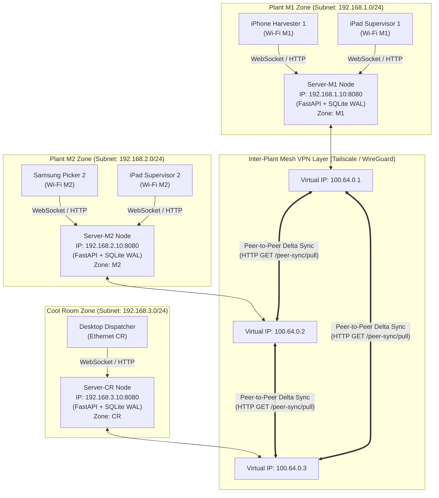
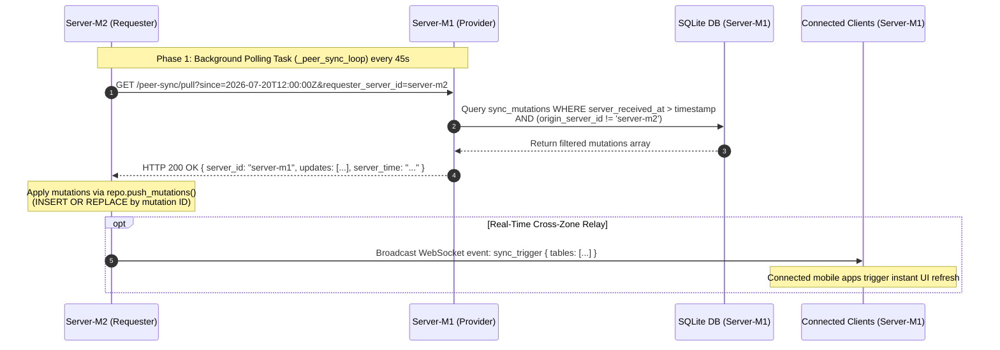
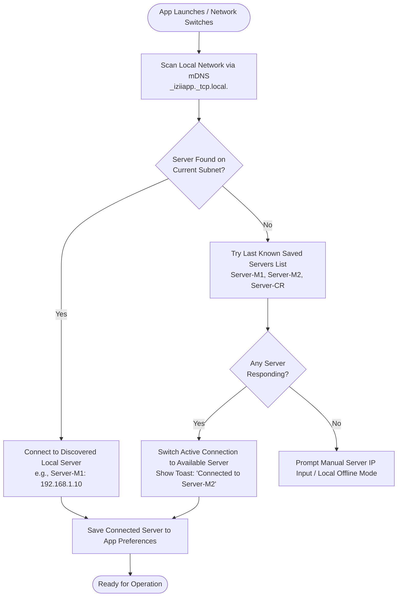
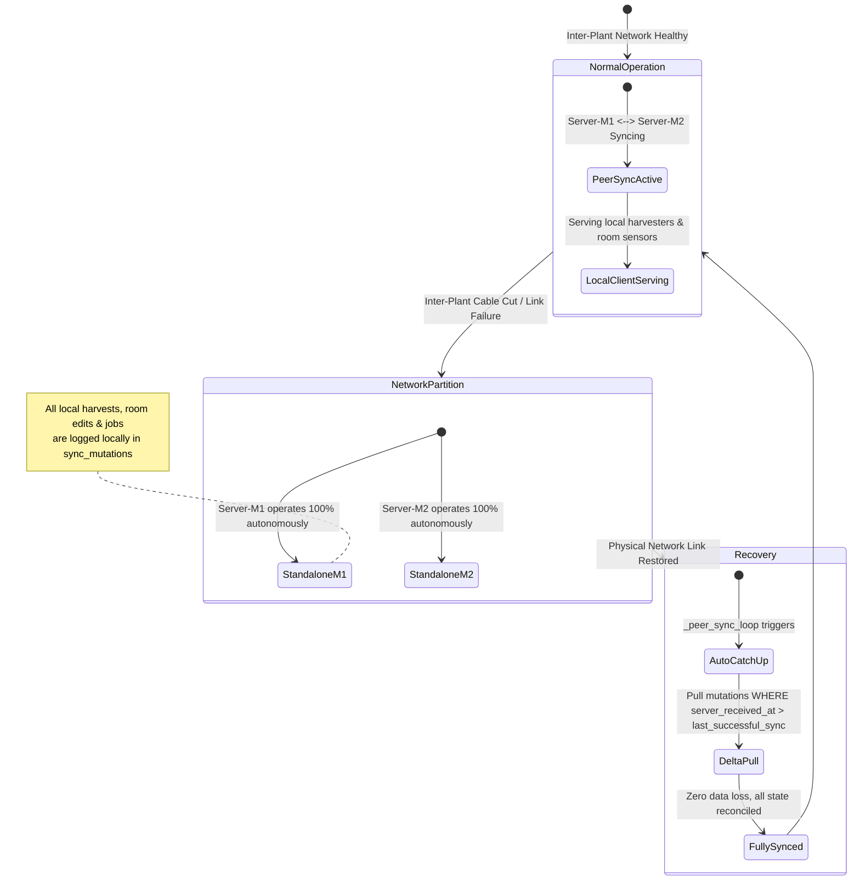

# Multi-Server Deployment & Multi-Subnet Network Architecture
**System:** iZiiApp / Costa Mushroom Enterprise Farm Platform  
**Target Environment:** Multi-Plant Farm Network Infrastructure (Multi-Subnet / Multi-Router Environment)  
**Document Version:** 1.0.0  
**Date:** July 20, 2026  

---

## 1. Executive Summary & Architectural Context

The iZiiApp enterprise platform operates in a physical farm environment spanning multiple isolated operational units (e.g., **Plant M1**, **Plant M2**, and **Cool Room Storage**). 

To ensure continuous, zero-downtime operation, high availability (HA), and low latency for field workers (harvesters, supervisors, and growing leads), the platform transitions from a single-server architecture to a **Zone-Based Peer-to-Peer Mesh Multi-Server Architecture**.

### Key System Characteristics:
- **Zone Autonomy**: Each physical plant operates its own dedicated server node (PC/Laptop running FastAPI + SQLite WAL).
- **Subnet Independence**: Server nodes reside on separate physical routers/subnets (`192.168.1.x`, `192.168.2.x`, `192.168.3.x`).
- **Mesh Peer-to-Peer Sync**: Servers continuously synchronize mutation logs (`sync_mutations`) chao-to-chao using delta polling and real-time WebSocket relays.
- **Client Roaming & Auto-Discovery**: Mobile (iOS/Android) and Desktop (Windows) clients dynamically discover and connect to the nearest active server, with automatic fallback when moving across Wi-Fi networks.

---

## 2. Multi-Plant Infrastructure & Network Topology

### 2.1 Overall System Architecture Diagram



---

## 3. Network Interconnection & Routing Strategies

When deploying servers across different physical routers or subnets, multicast packets used by default mDNS (Zeroconf) broadcasts cannot cross router boundaries without explicit configuration. To resolve this, two complementary strategies are employed:

### 3.1 Inter-Server Overlay Mesh VPN (Recommended Primary Strategy)
* **Technology**: **Tailscale** or **WireGuard** point-to-point mesh.
* **Mechanism**: Each server node runs a lightweight daemon creating an encrypted virtual network interface (`100.64.x.x`).
* **Advantages**:
  - Completely bypasses local physical router restrictions, NAT firewalls, and subnet isolation.
  - Zero router reconfiguration required.
  - End-to-end encrypted (E2EE) inter-server communications.

### 3.2 Static IP & Inter-VLAN Routing (Alternative Strategy)
* **Mechanism**: Assign fixed DHCP reservations for all server PCs (`192.168.1.10`, `192.168.2.10`, `192.168.3.10`).
* **Configuration**: Declare static peer endpoints in each server's `.env` configuration file:
  ```env
  # Server-M1 Configuration (.env)
  IZIIAPP_SERVER_ID=server-m1
  IZIIAPP_ZONE=M1
  IZIIAPP_PEERS=http://192.168.2.10:8080,http://192.168.3.10:8080
  IZIIAPP_SYNC_INTERVAL_SECONDS=45
  ```

---

## 4. Inter-Server Synchronization Protocol (`peer_sync.py`)

The Server-to-Server synchronization engine utilizes an idempotent, delta-based mutation relay mechanism designed to prevent echo loops and bandwidth exhaustion.



### Key Protocol Safety Principles:

1. **Anti-Echo Loop Protection (`exclude_origin_server_id`)**:
   When `Server-M2` pulls updates from `Server-M1`, `Server-M1` excludes any mutations that originated on `Server-M2`. This prevents infinite back-and-forth relay loops.
2. **Idempotency (`INSERT OR REPLACE`)**:
   Mutations are applied by unique deterministic ID (`UUID`). Receiving the same mutation multiple times due to network retries causes no side effects or state corruption.
3. **Preservation of Origin Metadata**:
   When relaying mutations between peer servers, the original `origin_server_id` is preserved intact.

---

## 5. Client Auto-Discovery & Roaming Logic

Mobile and Desktop clients support automatic network discovery combined with fallback server switching when workers move between plant Wi-Fi zones.



---

## 6. Fault Tolerance & Outage Resilience



---

## 7. Implementation & Migration Phases

| Phase | Target Scope | Key Tasks | Impact / Risk |
| :--- | :--- | :--- | :--- |
| **Phase 0** | Core Server Prep | Integrate `server_config.py`, `server_discovery.py`, and `routers/peer_sync.py`. Add `origin_server_id` column to `sync_mutations` table. | Low — Server runs in standalone mode initially. |
| **Phase 1** | Inter-Server Polling | Deploy Server-M1 and Server-M2. Enable `_peer_sync_loop` background polling task (45s interval) over Tailscale Mesh or Static IP. | Low — Background server sync; client connections remain unchanged. |
| **Phase 2** | Client mDNS & Roaming | Enable mDNS advertising on servers and auto-discovery/fallback switching on Mobile and Windows apps. | Medium — Managed rollout; client keeps manual IP fallback. |
| **Phase 3** | Cross-Server Backup | Implement automated cross-server database snapshot replication across all 3 plant servers. | Low — Background periodic compressed DB dumps. |
| **Phase 4** | WebSocket Real-Time Relay | Upgrade polling sync to immediate WebSocket event push (`POST /peer-sync/push`) for urgent events (Safety Alarms, Chat). | Low — Retains polling sync as secondary fallback safety net. |

---

## 8. Conclusion

By adopting this **Zone-Based Peer-to-Peer Mesh Architecture**, the Costa Mushroom iZiiApp platform achieves:
1. **Uninterrupted Autonomy**: Each physical plant functions independently even during total network isolates.
2. **Infinite Horizontal Scale**: Easily add new plant servers (e.g., Plant M3) without modifying existing server configs.
3. **Zero Single Point of Failure**: Eliminates central server dependency and preserves all operational data securely across cross-server peer backups.
