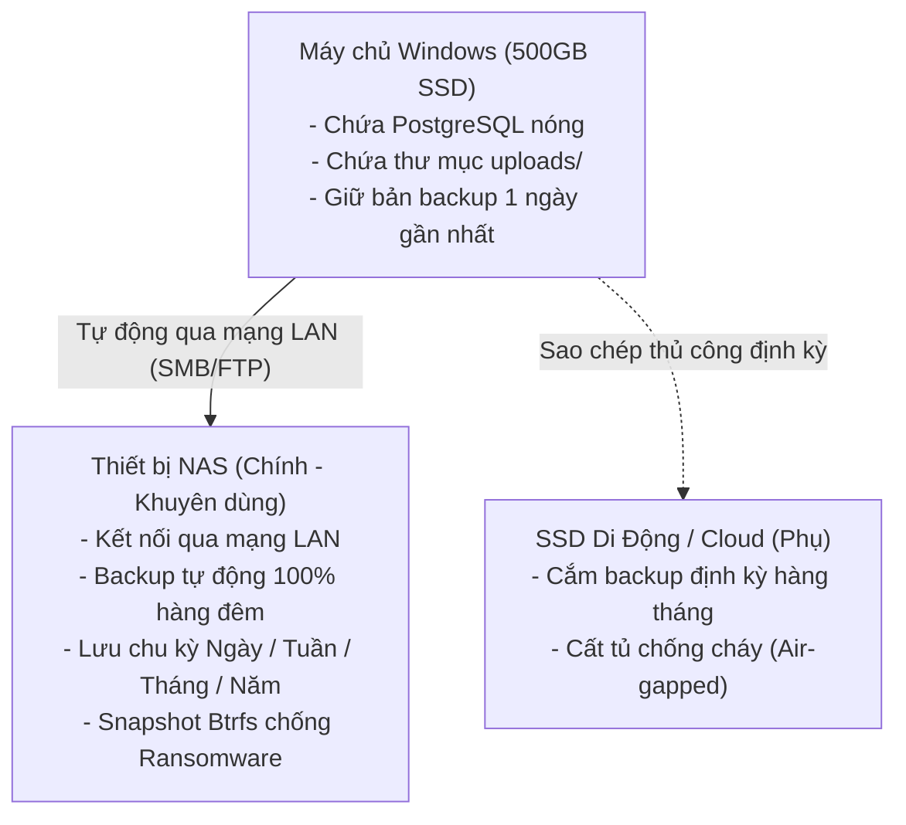
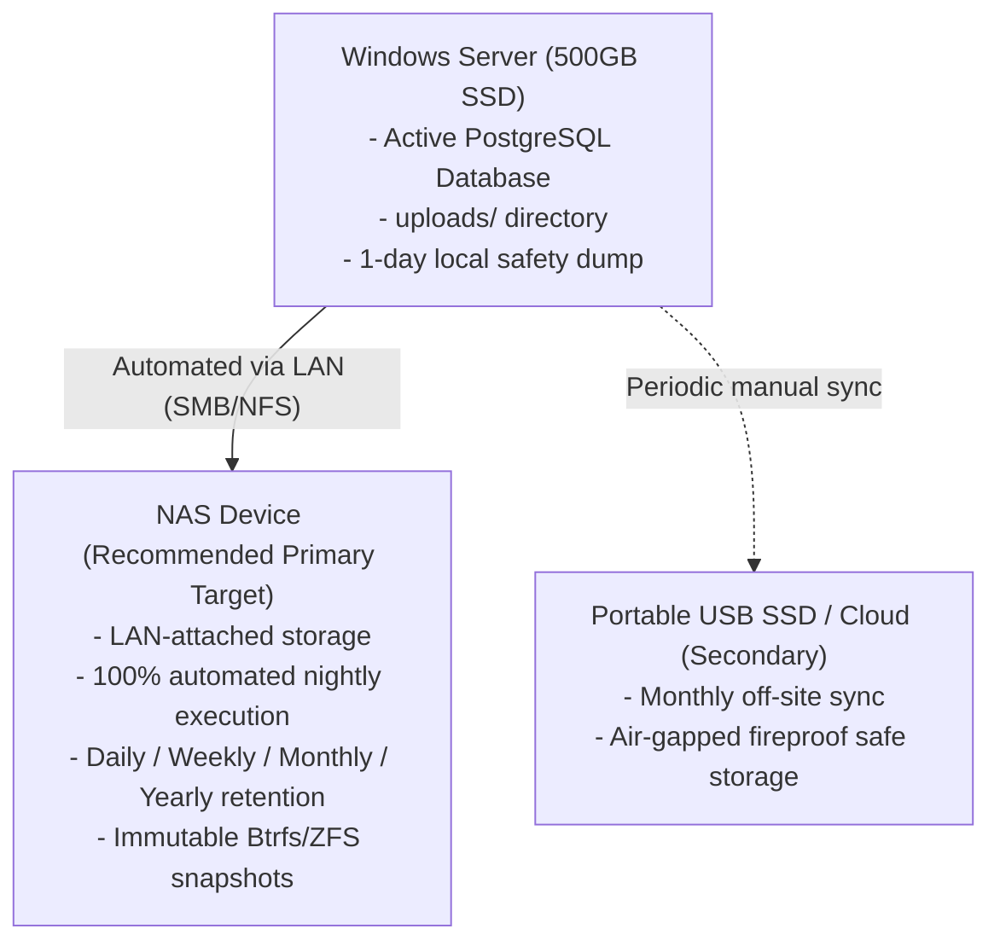

# Database & System Backup Plan for iZiiServer (PostgreSQL)
# Kế hoạch Sao lưu Cơ sở Dữ liệu & Hệ thống iZiiServer (PostgreSQL)

**Date / Ngày lập:** 25/08/2026  
**Target System / Hệ thống áp dụng:** iZiiApp Server (FastAPI + PostgreSQL on Windows)  
**Document Location / Vị trí file:** `server/plan/plan_backup_DB.md`  

---

## 📑 TABLE OF CONTENTS / MỤC LỤC

1. [PHẦN 1: PHIÊN BẢN TIẾNG VIỆT (VIETNAMESE VERSION)](#phần-1-phiên-bản-tiếng-việt)
   - [1. Tổng quan & Mục tiêu](#1-tổng-quan--mục-tiêu)
   - [2. Đánh giá phần cứng: NAS vs SSD Di Động (Server 500GB)](#2-đánh-giá-phần-cứng-nas-vs-ssd-di-động-server-500gb)
   - [3. Phạm vi sao lưu (Toàn diện)](#3-phạm-vi-sao-lưu-toàn-diện)
   - [4. Chính sách lưu giữ: Ngày / Tuần / Tháng / Năm (GFS)](#4-chính-sách-lưu-giữ-ngày--tuần--tháng--năm-gfs)
   - [5. Kịch bản thực thi tự động hóa (PowerShell Scripts)](#5-kịch-bản-thực-thi-tự-động-hóa-powershell-scripts)
   - [6. Hướng dẫn thiết lập Windows Task Scheduler](#6-hướng-dẫn-thiết-lập-windows-task-scheduler)
   - [7. Quy trình khôi phục dữ liệu (Disaster Recovery Runbook)](#7-quy-trình-khôi-phục-dữ-liệu-disaster-recovery-runbook)
   - [8. Lịch diễn tập định kỳ](#8-lịch-diễn-tập-định-kỳ)
2. [PART 2: ENGLISH VERSION (PHIÊN BẢN TIẾNG ANH)](#part-2-english-version)
   - [1. Overview & Objectives](#1-overview--objectives)
   - [2. Hardware Evaluation: NAS vs Portable SSD (500GB Server)](#2-hardware-evaluation-nas-vs-portable-ssd-500gb-server)
   - [3. Backup Scope](#3-backup-scope)
   - [4. Retention Policy: Daily / Weekly / Monthly / Yearly (GFS)](#4-retention-policy-daily--weekly--monthly--yearly-gfs)
   - [5. Automated Implementation Scripts (PowerShell)](#5-automated-implementation-scripts-powershell)
   - [6. Windows Task Scheduler Setup Guide](#6-windows-task-scheduler-setup-guide)
   - [7. Disaster Recovery Runbook](#7-disaster-recovery-runbook)
   - [8. Routine Audit & Verification Checklist](#8-routine-audit--verification-checklist)

---

# PHẦN 1: PHIÊN BẢN TIẾNG VIỆT

## 1. Tổng quan & Mục tiêu

Hệ thống iZiiServer chạy trên hệ điều hành Windows phục vụ các thiết bị di động (iPhone, iPad, Samsung/Android) tại các xưởng sản xuất và kho. Khi chuyển đổi database máy chủ từ SQLite sang PostgreSQL, dữ liệu trung tâm cần được bảo vệ tuyệt đối trước các sự cố phần cứng, virus/ransomware, hoặc lỗi thao tác.

### Chỉ số mục tiêu (SLAs):
* **RPO (Recovery Point Objective):** $\le$ 24 giờ đối với backup snapshot định kỳ hàng ngày (hoặc $\le$ 5 phút nếu bật PostgreSQL WAL archiving).
* **RTO (Recovery Time Objective):** $\le$ 30 phút để khôi phục toàn bộ server về trạng thái hoạt động bình thường.
* **Quy tắc an toàn 3-2-1:**
  * **3** bản sao dữ liệu (Bản chính trên Server, Bản phụ trên NAS nội bộ, Bản lưu trữ ngoại tuyến/Cloud).
  * **2** loại thiết bị lưu trữ khác nhau (SSD máy chủ + Ổ cứng mạng HDD NAS / Cloud).
  * **1** bản sao lưu ngoại tuyến tách biệt (Air-gapped / Off-site) chống cháy nổ, ngập lụt, mã độc tống tiền.

---

## 2. Đánh giá phần cứng: NAS vs SSD Di Động (Server 500GB)

Máy chủ hiện tại có dung lượng ổ cứng **500GB SSD**. Đây là không gian đủ cho hệ điều hành, PostgreSQL và dữ liệu hoạt động trong 2-3 năm, nhưng **tuyệt đối không được lưu toàn bộ các bản backup lâu dài trên chính ổ đĩa của máy chủ**.



### So sánh chi tiết:

| Tiêu chí | 🌐 Thiết bị NAS (Synology / QNAP / TrueNAS) | 💾 Ổ cứng SSD di động (USB) |
|---|---|---|
| **Khuyến nghị** | ⭐ **NÊN DÙNG LÀM NƠI BACKUP CHÍNH** | 🟡 **Dùng làm bản lưu trữ ngoại tuyến bổ trợ** |
| **Mức độ tự động** | **100% tự động.** Windows Task Scheduler tự động chạy script và đẩy file sang NAS qua mạng LAN. | **Phụ thuộc con người.** Phải nhớ cắm/rút và kiểm tra thường xuyên. |
| **Khả năng chống Ransomware** | **Rất cao** nếu cấu hình user backup riêng và bật tính năng Snapshot (Immutable Snapshot). | **Kém nếu cắm 24/7** (máy chủ bị nhiễm virus thì ổ USB cũng bị mã hoá theo). |
| **Độ bền phần cứng** | **Rất cao** nhờ cơ chế RAID (RAID 1 / RAID 5), hỏng 1 ổ cứng dữ liệu vẫn an toàn. | **Trung bình**, ổ SSD di động có nguy cơ sốc điện, hỏng chip nhớ đột tử. |
| **Hỗ trợ đa server** | Tất cả các server node trong xưởng đều có thể backup chung về 1 NAS. | Mỗi server phải cắm riêng 1 ổ. |

---

## 3. Phạm vi sao lưu (Toàn diện)

Một bản backup hoàn chỉnh của iZiiServer **bắt buộc gồm 3 thành phần**:

1. **Cơ sở dữ liệu PostgreSQL:**
   - Dùng lệnh chuẩn `pg_dump -Fc` (PostgreSQL Custom Compressed Format).
   - Nén zlib tự động, bảo toàn đầy đủ Schema, Bảng, Dữ liệu, Chỉ mục (Indexes), và Bộ đếm (`BIGSERIAL sequence`).
2. **Thư mục tệp tin đính kèm (`uploads/`):**
   - Chứa hình ảnh, tài liệu do người dùng tải lên từ app.
   - Vị trí: `%LOCALAPPDATA%\iZiiApp\server\uploads\` (hoặc đường dẫn cấu hình trong `server_config.py`).
   - Sử dụng lệnh đồng bộ vi sai `robocopy` để chỉ sao chép các tệp mới/thay đổi.
3. **Cấu hình & Chứng chỉ bảo mật:**
   - File cấu hình môi trường: `.env` (chứa secret token, cổng, thông tin kết nối).
   - Thư mục chứng chỉ TLS/mTLS (nếu có kích hoạt mã hoá mạng).

---

## 4. Chính sách lưu giữ: Ngày / Tuần / Tháng / Năm (GFS)

Áp dụng mô hình chuẩn doanh nghiệp **Grandfather-Father-Son (GFS)** để giữ lịch sử phục hồi dài hạn mà không gây tràn ổ đĩa:

```
[Mỗi đêm 01:00 AM] ──► Tạo bản Snapshot đầy đủ (Daily)
                           │
                           ├──► Giữ 7 ngày gần nhất (Thứ 2 ──► Chủ nhật)
                           ├──► Bản đêm Chủ nhật ──────────► Giữ làm bản Weekly (4 tuần)
                           ├──► Bản ngày cuối tháng ────────► Giữ làm bản Monthly (12 tháng)
                           └──► Bản ngày 31/12 ─────────────► Giữ làm bản Yearly (3-5 năm)
```

### Bảng dự toán dung lượng lưu trữ:

*Giả định dung lượng Database sau nén là **2 GB / bản**, thư mục `uploads/` tích lũy khoảng **30 GB**.*

| Cấp độ sao lưu | Quy tắc lưu giữ | Số lượng bản lưu | Dung lượng Database ước tính | Dung lượng Uploads |
|---|---|:---:|:---:|:---:|
| **Daily (Hàng ngày)** | Giữ 7 ngày gần nhất | 7 bản | ~14 GB | Đồng bộ vi sai |
| **Weekly (Hàng tuần)** | Giữ 4 tuần trong tháng | 4 bản | ~8 GB | - |
| **Monthly (Hàng tháng)** | Giữ 12 tháng gần nhất | 12 bản | ~24 GB | - |
| **Yearly (Hàng năm)** | Giữ 3 năm gần nhất | 3 bản | ~6 GB | - |
| **Thư mục Uploads** | Bản sao vi sai đầy đủ | 1 bản mirror | - | ~30 GB |
| **TỔNG CỘNG** | | **26 file backup** | **~52 GB** | **~30 GB** |

> 📌 **Kết luận:** Tổng dung lượng backup sau 3 năm hoạt động chỉ chiếm khoảng **~82 GB**. Mức này hoàn toàn nhẹ nhàng cho cả máy chủ 500GB lẫn thiết bị lưu trữ NAS.

---

## 5. Kịch bản thực thi tự động hóa (PowerShell Scripts)

Tạo thư mục `C:\iZiiServer_Scripts\` trên máy chủ và lưu các file sau:

### File 1: `C:\iZiiServer_Scripts\backup_daily.ps1`
*(Script tự động chạy hàng ngày qua Task Scheduler)*

```powershell
<#
.SYNOPSIS
    Script tự động backup Database PostgreSQL và thư mục Uploads cho iZiiServer.
    Áp dụng chính sách lưu giữ GFS (Ngày / Tuần / Tháng / Năm).
#>

[CmdletBinding()]
param (
    [string]$BackupRoot = "\\192.168.1.100\Backups\iZiiServer", # Hoặc "D:\Backups\iZiiServer"
    [string]$PgDumpPath = "C:\Program Files\PostgreSQL\15\bin\pg_dump.exe",
    [string]$DbHost = "127.0.0.1",
    [int]$DbPort = 5432,
    [string]$DbUser = "izii",
    [string]$DbName = "iziiapp",
    [string]$PgPassword = "mat_khau_postgres_cua_ban",
    [string]$UploadsSource = "$env:LOCALAPPDATA\iZiiApp\server\uploads",
    [string]$EnvFilePath = "C:\Users\CHANH\OneDrive\Documents\Downloads\Compressed\izii_app\server\.env"
)

$ErrorActionPreference = "Stop"
$DateStr = Get-Date -Format "yyyy-MM-dd_HHmm"
$Today = Get-Date

# 1. Tạo cấu trúc thư mục GFS
$DailyDir   = Join-Path $BackupRoot "daily"
$WeeklyDir  = Join-Path $BackupRoot "weekly"
$MonthlyDir = Join-Path $BackupRoot "monthly"
$YearlyDir  = Join-Path $BackupRoot "yearly"
$UploadsDir = Join-Path $BackupRoot "uploads"
$ConfigDir  = Join-Path $BackupRoot "config"
$LogDir     = Join-Path $BackupRoot "logs"

foreach ($dir in @($DailyDir, $WeeklyDir, $MonthlyDir, $YearlyDir, $UploadsDir, $ConfigDir, $LogDir)) {
    if (-not (Test-Path $dir)) {
        New-Item -ItemType Directory -Path $dir -Force | Out-Null
    }
}

$LogFile = Join-Path $LogDir "backup_$($Today.ToString('yyyy-MM')).log"
function Log-Message([string]$msg) {
    $line = "[$(Get-Date -Format 'yyyy-MM-dd HH:mm:ss')] $msg"
    Write-Host $line
    Add-Content -Path $LogFile -Value $line
}

Log-Message "=== BẮT ĐẦU QUÁ TRÌNH SAO LƯU iZiiServer ==="

try {
    # 2. Backup PostgreSQL (Custom Format .dump, nén zlib tối đa)
    $DumpFileName = "db_${DbName}_${DateStr}.dump"
    $DailyDumpPath = Join-Path $DailyDir $DumpFileName
    
    Log-Message "Đang trích xuất PostgreSQL Database: $DbName..."
    $env:PGPASSWORD = $PgPassword
    & $PgDumpPath -h $DbHost -p $DbPort -U $DbUser -d $DbName -Fc -f $DailyDumpPath
    
    if (-not (Test-Path $DailyDumpPath)) {
        throw "Không tìm thấy file dump sau khi thực thi pg_dump."
    }
    $fileSizeMB = [math]::Round(((Get-Item $DailyDumpPath).Length / 1MB), 2)
    Log-Message "✅ Xuất DB thành công: $DumpFileName (Kích thước: $fileSizeMB MB)"

    # 3. Phân loại GFS (Weekly, Monthly, Yearly)
    # 3.1 Weekly (Chủ Nhật)
    if ($Today.DayOfWeek -eq [DayOfWeek]::Sunday) {
        $WeeklyPath = Join-Path $WeeklyDir $DumpFileName
        Copy-Item -Path $DailyDumpPath -Destination $WeeklyPath -Force
        Log-Message "📌 Đã lưu bản sao Weekly (Chủ Nhật): $DumpFileName"
    }

    # 3.2 Monthly (Ngày cuối cùng của tháng)
    $DaysInMonth = [DateTime]::DaysInMonth($Today.Year, $Today.Month)
    if ($Today.Day -eq $DaysInMonth) {
        $MonthlyPath = Join-Path $MonthlyDir $DumpFileName
        Copy-Item -Path $DailyDumpPath -Destination $MonthlyPath -Force
        Log-Message "📌 Đã lưu bản sao Monthly (Cuối tháng): $DumpFileName"
    }

    # 3.3 Yearly (Ngày 31/12)
    if ($Today.Month -eq 12 -and $Today.Day -eq 31) {
        $YearlyPath = Join-Path $YearlyDir $DumpFileName
        Copy-Item -Path $DailyDumpPath -Destination $YearlyPath -Force
        Log-Message "📌 Đã lưu bản sao Yearly (Cuối năm): $DumpFileName"
    }

    # 4. Sao lưu tệp tĩnh (uploads/) bằng Robocopy (Mirror vi sai)
    if (Test-Path $UploadsSource) {
        Log-Message "Đang đồng bộ thư mục uploads..."
        robocopy $UploadsSource $UploadsDir /MIR /R:2 /W:3 /NP /NDL | Out-Null
        Log-Message "✅ Đồng bộ uploads hoàn tất."
    } else {
        Log-Message "⚠️ Thư mục uploads nguồn không tồn tại: $UploadsSource"
    }

    # 5. Sao lưu file cấu hình .env
    if (Test-Path $EnvFilePath) {
        Copy-Item -Path $EnvFilePath -Destination (Join-Path $ConfigDir ".env_$DateStr") -Force
        Log-Message "✅ Đã sao lưu file cấu hình .env"
    }

    # 6. Dọn dẹp bản backup cũ (Retention Cleanup)
    Log-Message "Đang dọn dẹp các bản backup quá hạn..."
    
    # Xoá Daily cũ hơn 7 ngày
    Get-ChildItem -Path $DailyDir -Filter "*.dump" |
        Where-Object { $_.LastWriteTime -lt $Today.AddDays(-7) } |
        ForEach-Object {
            Remove-Item $_.FullName -Force
            Log-Message "🧹 Đã xoá Daily cũ: $($_.Name)"
        }

    # Xoá Weekly cũ hơn 28 ngày (4 tuần)
    Get-ChildItem -Path $WeeklyDir -Filter "*.dump" |
        Where-Object { $_.LastWriteTime -lt $Today.AddDays(-28) } |
        ForEach-Object {
            Remove-Item $_.FullName -Force
            Log-Message "🧹 Đã xoá Weekly cũ: $($_.Name)"
        }

    # Xoá Monthly cũ hơn 365 ngày (12 tháng)
    Get-ChildItem -Path $MonthlyDir -Filter "*.dump" |
        Where-Object { $_.LastWriteTime -lt $Today.AddDays(-365) } |
        ForEach-Object {
            Remove-Item $_.FullName -Force
            Log-Message "🧹 Đã xoá Monthly cũ: $($_.Name)"
        }

    # Xoá Config .env cũ hơn 30 ngày
    Get-ChildItem -Path $ConfigDir -Filter ".env_*" |
        Where-Object { $_.LastWriteTime -lt $Today.AddDays(-30) } |
        ForEach-Object { Remove-Item $_.FullName -Force }

    Log-Message "=== HOÀN TẤT SAO LƯU THÀNH CÔNG ==="
}
catch {
    Log-Message "❌ LỖI SAO LƯU: $($_.Exception.Message)"
    exit 1
}
finally {
    $env:PGPASSWORD = $null
}
```

---

## 6. Hướng dẫn thiết lập Windows Task Scheduler

Để script trên tự động chạy vào lúc **01:00 AM hàng ngày**:

1. Mở **Task Scheduler** trên Windows (`taskschd.msc`).
2. Chọn **Create Task...** (Tạo tác vụ mới):
   * **General:** Đặt tên `iZiiServer_Daily_Backup`. Chọn *"Run whether user is logged on or not"* và tích chọn *"Run with highest privileges"*.
   * **Triggers:** Chọn `New...` $\rightarrow$ `Daily` $\rightarrow$ Bắt đầu lúc `01:00:00 AM` $\rightarrow$ Lặp lại mỗi 1 ngày.
   * **Actions:** Chọn `New...` $\rightarrow$ Action: `Start a program`:
     * **Program/script:** `powershell.exe`
     * **Add arguments:** `-ExecutionPolicy Bypass -File "C:\iZiiServer_Scripts\backup_daily.ps1"`
   * **Settings:** Tích chọn *"If the task fails, restart every 10 minutes (up to 3 times)"*.
3. Nhấn **OK**, nhập mật khẩu tài khoản Windows Administrator để lưu tác vụ.

---

## 7. Quy trình khôi phục dữ liệu (Disaster Recovery Runbook)

Khi xảy ra sự cố hỏng máy chủ hoặc mất dữ liệu, thực hiện khôi phục theo các bước sau:

### Bước 1: Dừng ứng dụng Server
```powershell
# Dừng service server (nếu dùng NSSM)
nssm stop izii_server
# Hoặc tắt tiến trình python nếu chạy thủ công
Stop-Process -Name "python" -Force
```

### Bước 2: Khôi phục Cơ sở dữ liệu PostgreSQL
Chọn bản backup `.dump` gần nhất từ NAS hoặc ổ backup:

```powershell
# Đặt mật khẩu PostgreSQL
$env:PGPASSWORD = "mat_khau_postgres_cua_ban"

# Khôi phục database (Cờ --clean: xoá sạch bảng cũ trước khi nạp lại)
& "C:\Program Files\PostgreSQL\15\bin\pg_restore.exe" `
    -h 127.0.0.1 -p 5432 -U izii -d iziiapp `
    --clean --if-exists -v `
    "\\192.168.1.100\Backups\iZiiServer\daily\db_iziiapp_2026-08-25_0100.dump"

$env:PGPASSWORD = $null
```

### Bước 3: Khôi phục thư mục tệp tin `uploads/`
```powershell
robocopy "\\192.168.1.100\Backups\iZiiServer\uploads" "$env:LOCALAPPDATA\iZiiApp\server\uploads" /MIR /R:2 /W:3
```

### Bước 4: Khởi động lại Server & Kiểm tra
1. Khởi động lại service: `nssm start izii_server`
2. Mở trình duyệt kiểm tra API Health: `http://127.0.0.1:8080/health`
3. Kiểm tra log khởi động xem sequence và các kết nối có lỗi hay không.

---

## 8. Lịch diễn tập định kỳ

* **Hàng tuần:** Quản trị viên kiểm tra file log `backup_yyyy-MM.log` trên NAS để đảm bảo script chạy thành công mỗi đêm.
* **Hàng tháng:** Diễn tập khôi phục thử bản backup lên một database PostgreSQL thử nghiệm (`iziiapp_test`) để đảm bảo tệp backup không bị lỗi tệp (corrupted).

---
---

# PART 2: ENGLISH VERSION

## 1. Overview & Objectives

The iZiiServer system operates on Windows Server to support mobile devices (iPhone, iPad, Samsung/Android) deployed in manufacturing plants and warehouses. Following the transition of the central database from SQLite to PostgreSQL, an enterprise-grade backup solution is required to safeguard against hardware failure, ransomware attacks, and operator error.

### Service Level Objectives (SLOs):
* **RPO (Recovery Point Objective):** $\le$ 24 hours for automated daily snapshot backups ($\le$ 5 minutes if continuous WAL archiving is enabled).
* **RTO (Recovery Time Objective):** $\le$ 30 minutes for total system restoration.
* **3-2-1 Backup Rule:**
  * **3** copies of critical data (Production database on server, Local secondary copy on NAS, Air-gapped/Offsite copy).
  * **2** distinct storage media types (Server SSD + Network HDD / Cloud Storage).
  * **1** offsite/air-gapped copy isolated from the primary network to mitigate ransomware and site disasters.

---

## 2. Hardware Evaluation: NAS vs Portable SSD (500GB Server)

The production server is equipped with a **500GB SSD**. While this capacity is ample for the OS, PostgreSQL engine, and active working data for 2–3 years, **long-term historical backups must never be stored exclusively on the host server's local disk**.



### Comparison Matrix:

| Feature | 🌐 Dedicated NAS (Synology / QNAP / TrueNAS) | 💾 Portable External SSD (USB) |
|---|---|---|
| **Role** | ⭐ **PRIMARY AUTOMATED TARGET (RECOMMENDED)** | 🟡 **SECONDARY AIR-GAPPED ARCHIVE** |
| **Automation** | **100% Automated.** Windows Task Scheduler executes scripts and transfers files via LAN. | **Manual Dependency.** Requires human intervention to attach, verify, and store. |
| **Ransomware Defense** | **Very High** when paired with dedicated backup credentials and immutable snapshots. | **Vulnerable if kept connected 24/7** (ransomware will encrypt USB volumes). |
| **Hardware Resilience** | **Very High** via RAID arrays (RAID 1 / RAID 5); single-drive failures cause zero data loss. | **Moderate**, vulnerable to electrical surges and NAND flash controller failure. |
| **Multi-node Scalability**| Multiple plant servers can target the same central NAS repository. | Requires individual drives per physical machine. |

---

## 3. Backup Scope

A complete, production-grade backup of iZiiServer consists of **three essential components**:

1. **PostgreSQL Database:**
   - Generated via `pg_dump -Fc` (PostgreSQL Custom Compressed Format).
   - Utilizes zlib compression, fully preserving schemas, tables, indices, data, and primary key sequences (`BIGSERIAL`).
2. **Static Attachments (`uploads/`):**
   - User-uploaded images, inspection media, and audit files.
   - Path: `%LOCALAPPDATA%\iZiiApp\server\uploads\` (or as configured in `server_config.py`).
   - Synchronized incrementally using Windows `robocopy`.
3. **Environment & Security Configurations:**
   - Server environment file `.env` (containing secret keys, server IDs, mesh secrets).
   - TLS/mTLS private keys and certificates.

---

## 4. Retention Policy: Daily / Weekly / Monthly / Yearly (GFS)

The Grandfather-Father-Son (GFS) rotation scheme provides extensive historical recovery coverage while maintaining a strict, predictable storage footprint:

```
[Nightly at 01:00 AM] ──► Full Database Snapshot (Daily)
                              │
                              ├──► Retain 7 latest days (Mon ──► Sun)
                              ├──► Sunday Night Snapshot ─────► Retain as Weekly (4 weeks)
                              ├──► Month-End Snapshot ────────► Retain as Monthly (12 months)
                              └──► Dec 31st Snapshot ─────────► Retain as Yearly (3–5 years)
```

### Capacity Forecasting (3-Year Horizon):

*Estimates based on an average compressed database size of **2 GB / dump** and an accumulating **30 GB** `uploads/` directory.*

| Tier | Retention Rule | File Count | Estimated DB Footprint | Uploads Footprint |
|---|---|:---:|:---:|:---:|
| **Daily** | Retain last 7 days | 7 dumps | ~14 GB | Incremental Mirror |
| **Weekly** | Retain 4 weeks per month | 4 dumps | ~8 GB | - |
| **Monthly** | Retain 12 calendar months | 12 dumps | ~24 GB | - |
| **Yearly** | Retain 3 calendar years | 3 dumps | ~6 GB | - |
| **Uploads Mirror** | Differential sync copy | 1 active mirror | - | ~30 GB |
| **TOTAL** | | **26 dump files** | **~52 GB** | **~30 GB** |

> 📌 **Summary:** Total backup consumption across 3 years remains well below **~85 GB**, easily accommodated by both the 500GB host server and the secondary storage target.

---

## 5. Automated Implementation Scripts (PowerShell)

Deploy the scripts in `C:\iZiiServer_Scripts\` on the Windows host machine:

### Script 1: `C:\iZiiServer_Scripts\backup_daily.ps1`

```powershell
<#
.SYNOPSIS
    Automated PostgreSQL and Uploads Backup Script for iZiiServer.
    Enforces Grandfather-Father-Son (GFS) retention rotation.
#>

[CmdletBinding()]
param (
    [string]$BackupRoot = "\\192.168.1.100\Backups\iZiiServer", # Or local mount "D:\Backups\iZiiServer"
    [string]$PgDumpPath = "C:\Program Files\PostgreSQL\15\bin\pg_dump.exe",
    [string]$DbHost = "127.0.0.1",
    [int]$DbPort = 5432,
    [string]$DbUser = "izii",
    [string]$DbName = "iziiapp",
    [string]$PgPassword = "your_secure_postgres_password",
    [string]$UploadsSource = "$env:LOCALAPPDATA\iZiiApp\server\uploads",
    [string]$EnvFilePath = "C:\Users\CHANH\OneDrive\Documents\Downloads\Compressed\izii_app\server\.env"
)

$ErrorActionPreference = "Stop"
$DateStr = Get-Date -Format "yyyy-MM-dd_HHmm"
$Today = Get-Date

# 1. Initialize GFS Folder Hierarchy
$DailyDir   = Join-Path $BackupRoot "daily"
$WeeklyDir  = Join-Path $BackupRoot "weekly"
$MonthlyDir = Join-Path $BackupRoot "monthly"
$YearlyDir  = Join-Path $BackupRoot "yearly"
$UploadsDir = Join-Path $BackupRoot "uploads"
$ConfigDir  = Join-Path $BackupRoot "config"
$LogDir     = Join-Path $BackupRoot "logs"

foreach ($dir in @($DailyDir, $WeeklyDir, $MonthlyDir, $YearlyDir, $UploadsDir, $ConfigDir, $LogDir)) {
    if (-not (Test-Path $dir)) {
        New-Item -ItemType Directory -Path $dir -Force | Out-Null
    }
}

$LogFile = Join-Path $LogDir "backup_$($Today.ToString('yyyy-MM')).log"
function Log-Message([string]$msg) {
    $line = "[$(Get-Date -Format 'yyyy-MM-dd HH:mm:ss')] $msg"
    Write-Host $line
    Add-Content -Path $LogFile -Value $line
}

Log-Message "=== STARTING iZiiServer BACKUP JOB ==="

try {
    # 2. Extract PostgreSQL Database (Custom Compressed Format)
    $DumpFileName = "db_${DbName}_${DateStr}.dump"
    $DailyDumpPath = Join-Path $DailyDir $DumpFileName
    
    Log-Message "Dumping PostgreSQL database: $DbName..."
    $env:PGPASSWORD = $PgPassword
    & $PgDumpPath -h $DbHost -p $DbPort -U $DbUser -d $DbName -Fc -f $DailyDumpPath
    
    if (-not (Test-Path $DailyDumpPath)) {
        throw "pg_dump failed to produce output archive."
    }
    $fileSizeMB = [math]::Round(((Get-Item $DailyDumpPath).Length / 1MB), 2)
    Log-Message "✅ DB Dump created successfully: $DumpFileName ($fileSizeMB MB)"

    # 3. GFS Classification
    # 3.1 Weekly Tier (Sunday execution)
    if ($Today.DayOfWeek -eq [DayOfWeek]::Sunday) {
        $WeeklyPath = Join-Path $WeeklyDir $DumpFileName
        Copy-Item -Path $DailyDumpPath -Destination $WeeklyPath -Force
        Log-Message "📌 Promoted to Weekly Archive (Sunday): $DumpFileName"
    }

    # 3.2 Monthly Tier (Last day of the month)
    $DaysInMonth = [DateTime]::DaysInMonth($Today.Year, $Today.Month)
    if ($Today.Day -eq $DaysInMonth) {
        $MonthlyPath = Join-Path $MonthlyDir $DumpFileName
        Copy-Item -Path $DailyDumpPath -Destination $MonthlyPath -Force
        Log-Message "📌 Promoted to Monthly Archive (Month-end): $DumpFileName"
    }

    # 3.3 Yearly Tier (December 31st)
    if ($Today.Month -eq 12 -and $Today.Day -eq 31) {
        $YearlyPath = Join-Path $YearlyDir $DumpFileName
        Copy-Item -Path $DailyDumpPath -Destination $YearlyPath -Force
        Log-Message "📌 Promoted to Yearly Archive (Year-end): $DumpFileName"
    }

    # 4. Incremental Static File Mirroring (uploads/)
    if (Test-Path $UploadsSource) {
        Log-Message "Synchronizing uploads directory via robocopy..."
        robocopy $UploadsSource $UploadsDir /MIR /R:2 /W:3 /NP /NDL | Out-Null
        Log-Message "✅ uploads synchronization finished."
    } else {
        Log-Message "⚠️ Source uploads directory not found: $UploadsSource"
    }

    # 5. Backup Environment Settings (.env)
    if (Test-Path $EnvFilePath) {
        Copy-Item -Path $EnvFilePath -Destination (Join-Path $ConfigDir ".env_$DateStr") -Force
        Log-Message "✅ Environment configuration backed up."
    }

    # 6. GFS Retention Pruning
    Log-Message "Pruning expired backup archives..."
    
    # Purge Daily dumps older than 7 days
    Get-ChildItem -Path $DailyDir -Filter "*.dump" |
        Where-Object { $_.LastWriteTime -lt $Today.AddDays(-7) } |
        ForEach-Object {
            Remove-Item $_.FullName -Force
            Log-Message "🧹 Purged expired daily dump: $($_.Name)"
        }

    # Purge Weekly dumps older than 28 days (4 weeks)
    Get-ChildItem -Path $WeeklyDir -Filter "*.dump" |
        Where-Object { $_.LastWriteTime -lt $Today.AddDays(-28) } |
        ForEach-Object {
            Remove-Item $_.FullName -Force
            Log-Message "🧹 Purged expired weekly dump: $($_.Name)"
        }

    # Purge Monthly dumps older than 365 days (12 months)
    Get-ChildItem -Path $MonthlyDir -Filter "*.dump" |
        Where-Object { $_.LastWriteTime -lt $Today.AddDays(-365) } |
        ForEach-Object {
            Remove-Item $_.FullName -Force
            Log-Message "🧹 Purged expired monthly dump: $($_.Name)"
        }

    # Purge config copies older than 30 days
    Get-ChildItem -Path $ConfigDir -Filter ".env_*" |
        Where-Object { $_.LastWriteTime -lt $Today.AddDays(-30) } |
        ForEach-Object { Remove-Item $_.FullName -Force }

    Log-Message "=== BACKUP PROCESS COMPLETED SUCCESSFULLY ==="
}
catch {
    Log-Message "❌ BACKUP CRITICAL ERROR: $($_.Exception.Message)"
    exit 1
}
finally {
    $env:PGPASSWORD = $null
}
```

---

## 6. Windows Task Scheduler Setup Guide

To automate execution at **01:00 AM every night**:

1. Open **Task Scheduler** on Windows (`taskschd.msc`).
2. Click **Create Task...**:
   * **General Tab:** Name: `iZiiServer_Daily_Backup`. Select *"Run whether user is logged on or not"* and check *"Run with highest privileges"*.
   * **Triggers Tab:** `New...` $\rightarrow$ `Daily` $\rightarrow$ Start at `01:00:00 AM` $\rightarrow$ Recur every 1 days.
   * **Actions Tab:** `New...` $\rightarrow$ Action: `Start a program`:
     * **Program/script:** `powershell.exe`
     * **Add arguments:** `-ExecutionPolicy Bypass -File "C:\iZiiServer_Scripts\backup_daily.ps1"`
   * **Settings Tab:** Check *"If the task fails, restart every 10 minutes (up to 3 times)"*.
3. Click **OK** and authenticate with the Windows Administrator account.

---

## 7. Disaster Recovery Runbook

In the event of hardware failure, database corruption, or ransomware infection:

### Step 1: Halt Server Service
```powershell
# Stop Windows NSSM service
nssm stop izii_server
# Or terminate active python server process
Stop-Process -Name "python" -Force
```

### Step 2: Restore PostgreSQL Database
Select the appropriate `.dump` archive from the backup repository:

```powershell
# Set credentials
$env:PGPASSWORD = "your_secure_postgres_password"

# Restore database (--clean drops existing objects before recreating)
& "C:\Program Files\PostgreSQL\15\bin\pg_restore.exe" `
    -h 127.0.0.1 -p 5432 -U izii -d iziiapp `
    --clean --if-exists -v `
    "\\192.168.1.100\Backups\iZiiServer\daily\db_iziiapp_2026-08-25_0100.dump"

$env:PGPASSWORD = $null
```

### Step 3: Restore Static Files (`uploads/`)
```powershell
robocopy "\\192.168.1.100\Backups\iZiiServer\uploads" "$env:LOCALAPPDATA\iZiiApp\server\uploads" /MIR /R:2 /W:3
```

### Step 4: Restart Service and Perform Sanity Checks
1. Start service: `nssm start izii_server`
2. Verify API health endpoint: `http://127.0.0.1:8080/health`
3. Check application logs for sequence integrity and active client connections.

---

## 8. Routine Audit & Verification Checklist

* **Weekly Audit:** Review `backup_yyyy-MM.log` on the NAS share to verify uninterrupted nightly execution.
* **Monthly Drill:** Perform a dry-run restoration into an isolated staging database (`iziiapp_dr_test`) to ensure archive integrity and sequence consistency.
