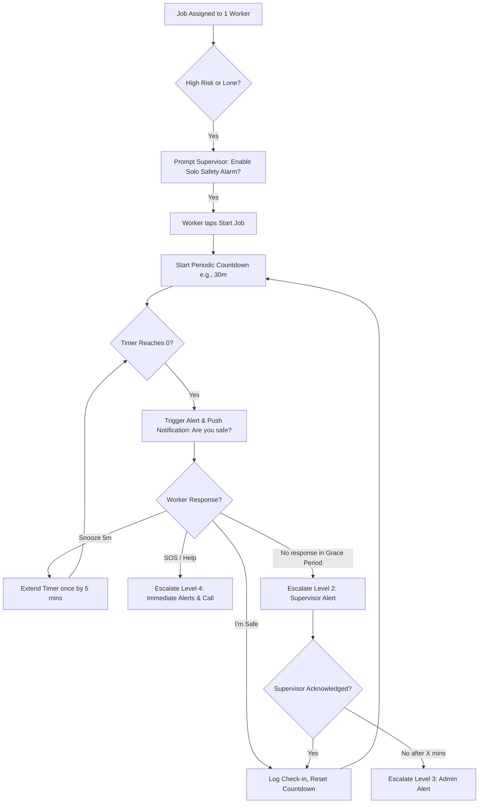
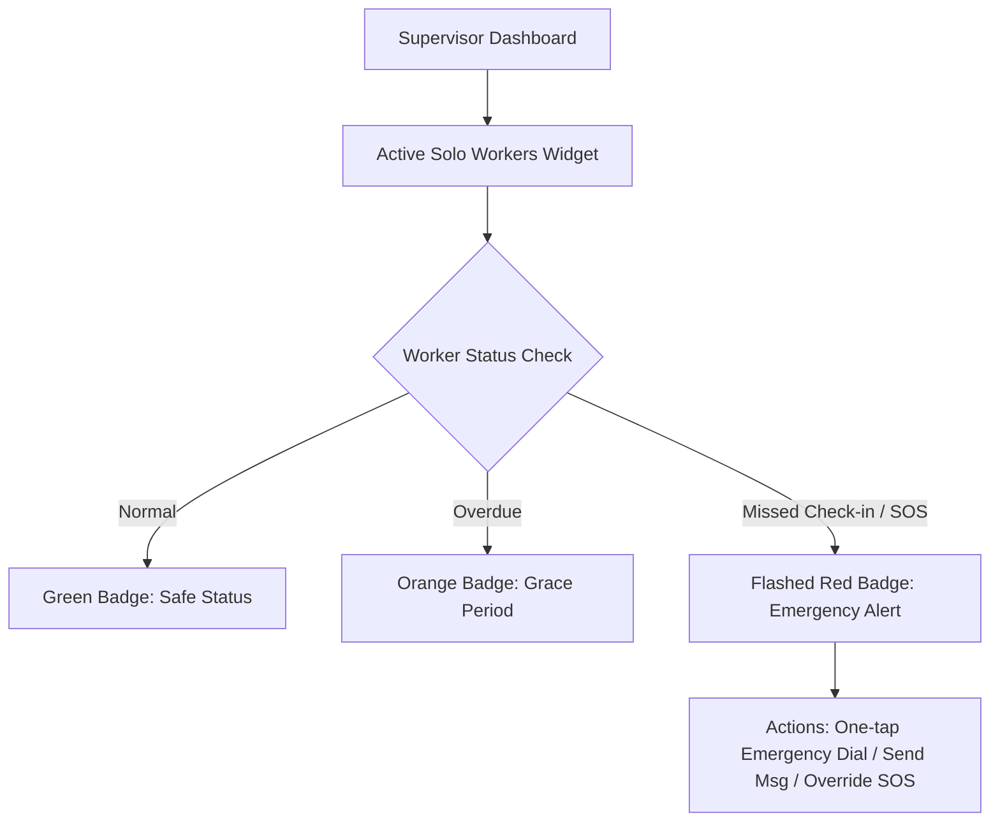

# Solo Safety Alarm: Safe Work Australia & WHS Compliance Specification

This document details the functional specifications, database architecture, UI/UX mockups, escalation protocols, and compliance checklists for the **Solo Job Safety Alarm** feature.

---

## 1. Solo Safety Alarm Flow Diagrams

### Worker Workflow (Mobile)


### Supervisor Dashboard Workflow


---

## 2. Database Schema (SQLite / Drift Compatible)

### Table: `job_safety_config`
This table defines the interval, grace period, and configuration rules for safety check-ins.

```sql
CREATE TABLE job_safety_config (
    id TEXT PRIMARY KEY NOT NULL,
    job_id TEXT UNIQUE REFERENCES mushroom_jobs(id) ON DELETE CASCADE,
    check_in_interval_minutes INTEGER NOT NULL DEFAULT 30, -- 15, 30, 60, 90
    grace_period_minutes INTEGER NOT NULL DEFAULT 5,        -- 2, 5, 10
    escalation_target TEXT NOT NULL DEFAULT 'supervisor',  -- supervisor, admin, emergency
    auto_start_on_job_begin INTEGER NOT NULL DEFAULT 1,     -- Boolean (0=No, 1=Yes)
    alarm_type TEXT NOT NULL DEFAULT 'push_inapp',          -- push, sms, push_inapp
    created_at TIMESTAMP NOT NULL DEFAULT CURRENT_TIMESTAMP
);
```

### Table: `safety_checkin_log`
Tracks check-in events immutably to satisfy Safe Work Australia auditing requirements.

```sql
CREATE TABLE safety_checkin_log (
    id TEXT PRIMARY KEY NOT NULL,
    job_id TEXT NOT NULL REFERENCES mushroom_jobs(id) ON DELETE CASCADE,
    worker_id TEXT NOT NULL,
    event_type TEXT NOT NULL,                -- 'safe', 'snooze', 'sos', 'missed', 'complete'
    timestamp TIMESTAMP NOT NULL DEFAULT CURRENT_TIMESTAMP,
    gps_latitude REAL,                       -- Encrypted or plain decimal coordinate
    gps_longitude REAL,                      
    response_time_seconds INTEGER,           -- Time taken from reminder trigger to tap
    notes TEXT
);
```

---

## 3. Push Notification & Escalation Service Specification

The escalation chain ensures zero-fail alerts using multiple delivery channels.

| Level | Trigger | Action Channel | Target Recipient |
| :--- | :--- | :--- | :--- |
| **Level 1** | Countdown Timer reaches `0` | High-Priority Local Push + Foreground Sound / Vibration | Assigned Worker |
| **Level 2** | Grace Period expires (e.g., +5m) | In-App Red Banner + SMS Alert | Direct Supervisor |
| **Level 3** | Supervisor fails to acknowledge within `X` mins | Escalation SMS + Web Dashboard Modal Popup | Plant Admin |
| **Level 4** | Worker triggers **SOS** manually | Broadcast Push + SMS + Automatic Phone Call | All Managers & Contacts |

---

## 4. UI/UX Specifications

### Worker Check-In View (Mobile-First)
A thumb-friendly, high-contrast interface designed for quick access under hazardous or low-light situations.

```
+--------------------------------------------------+
| 🚨 LONE WORKER SAFETY MONITOR                    |
+--------------------------------------------------+
| Active Job: Confined Space Entry - Grow Room 52A |
| Started: 12:00 PM | Duration Active: 1h 15m      |
+--------------------------------------------------+
|             NEXT SAFETY CHECK-IN IN              |
|                                                  |
|                    12:45                         |
|                   MINUTES                        |
+--------------------------------------------------+
|                                                  |
|        +--------------------------------+        |
|        |           (✓) I'M SAFE         |        |
|        |     (Big Emerald Green Button) |        |
|        +--------------------------------+        |
|                                                  |
|        +---------------+---------------+        |
|        |  (⏱) SNOOZE   |   (🆘) SOS    |        |
|        |   (5 Mins)    |  (Emergency)  |        |
|        +---------------+---------------+        |
|                                                  |
+--------------------------------------------------+
```

### Supervisor Active Workers Widget
A live-updating, premium status dashboard showing all solo operator telemetry.

```
+------------------------------------------------------------------------+
| 👥 ACTIVE SOLO WORKERS (3 ACTIVE)                                      |
+------------------------------------------------------------------------+
| [Worker]         [Job / Room]       [Last Check-in]  [Status Badge]    |
|------------------------------------------------------------------------|
| John Doe         Room 52A Entry     8 mins ago       [✓ SAFE]          |
| Alex Smith       Roof Inspection    28 mins ago      [⚠️ OVERDUE]       |
| Jane Vance       Electrical Wet     --               [🚨 EMERGENCY]    |
+------------------------------------------------------------------------+
| Quick Actions:  [📞 Call Alert]  [✉ Message]  [🔴 Trigger Manual SOS]  |
+------------------------------------------------------------------------+
```

---

## 5. WHS Compliance Checklist (Australian Market)

To satisfy **Safe Work Australia Code of Practice for Managing the Work Environment and Facilities (Lone Workers)**:

- [ ] **Dynamic Communication Check**: Provide system-backed verification that communication channels work before starting solo jobs.
- [ ] **Escalation Protocol Audit**: Documented escalation policy matching Safe Work standards for remote risk areas.
- [ ] **Immutable Logs**: Storage of all check-in timestamps, missed prompts, and actions taken during alerts.
- [ ] **GPS Asset Location**: Automatic logging of coordinates when an SOS or missed check-in event triggers.
- [ ] **WHS Safe PDF Reports**: Generated end-of-job summaries detailing response efficiency and emergency events.
